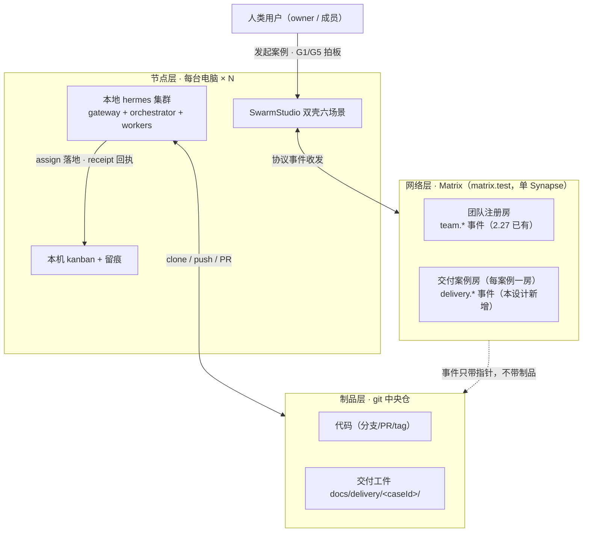

# 多机多用户分布式交付网络设计

日期：2026-09-18
状态：待用户批准（§3 四项裁决为代拟，逐项可推翻）
受众：overlay 实施者与评审者、hermes 集群维护者
上游依据：《软件交付标准》v1.3.0（`~/.hermes/delivery/`）、《Hermes Agent 集群设计文档》（hermes-complete-design-doc.md）

## 0. 三句话主旨

多个 Matrix 用户在各自电脑上部署本地 hermes agent 集群 + SwarmStudio，经 Matrix 房间事件彼此协作，按六阶段 G1-G6 交付标准把一个软件需求从冻结走到复盘，全程证据可追溯。本设计不新建中央服务：复用 matrix-teams 2.27 已交付的房间事件骨架做协作单一事实源，复用 ncwk-sim 已验证的多实例拓扑做验证环境，把单机 delivery-flow 工作流扩成跨机版。读毕应能回答三个问题：跨机的状态放在哪、六阶段由谁推进、新电脑怎么入网。

## 1. 目标与非目标

目标：

1. N 节点联邦协作：每台电脑 = SwarmStudio + 本地集群，本机机制（dispatch、kanban、门禁、留痕）全部保留不动，跨机只走协议事件。
2. 交付案例全程可追溯：案例的阶段推进、门禁裁决、证据指针以 Matrix 房间事件为单一事实源，G1 到 G6 每一步可回溯到「谁、什么命令、什么退出码、哪个 commit」。
3. 制品走 git：代码与交付工件（PRD、设计、评审记录、发布计划、复盘、gate 运行记录）落中央仓 `docs/delivery/<caseId>/`，Matrix 只传协调消息与指针，不传大制品。
4. 跨机独立性强制：P4 验证必须由非实现机的 tester 执行——「作者不评审自己的产出」从单机岗位分离升级为跨机结构性分离。
5. SwarmStudio 六场景承接：交付案例视图挂协作场景，新节点入网有可脚本化的 runbook。

非目标（本可做但不做）：

- E2EE、联邦、多 homeserver。沿用 matrix-teams 09-17 裁定，单 Synapse（matrix.test）满足当前规模。
- agent 自动值守应答、常驻流程 bot、租约竞争认领。登记为 P4 演进方向，不在本轮。
- 新建中央 delivery server。否决理由见 §3-D2。
- 本轮不写实施代码。D1 裁定设计 + 实施计划先行。
- 不改 upstream 产品代码。MVP 沿用 matrix-teams 约束：纯 A 类 + i18n B 类 patch。

## 2. 现状基线与差距

已有资产四件，全部可直接踩在地基上：

| 资产 | 锚点 | 对本设计的意义 |
|---|---|---|
| matrix-teams P1-P3（SwarmStudio 2.27 收口） | `2026-09-17-matrix-teams-management-design.md`；overlay main febe452 | 房间事件协议模式（protocol.ts 单源 + PL 硬约束 + 守门测试）、账号树、值守、任务投递 assign→本机 kanban→回执 receipt |
| ncwk-sim 三用户模拟 | `2026-09-17-multiuser-matrix-collab-sim-design.md`；验收 35/35 ×2 轮 | HERMES_HOME 隔离、端口段、真实 Synapse + 真实 git 中央仓 + 真实 LLM 的全流程已跑通；导演脚本可扩展六阶段 |
| 交付标准 v1.3.0 | `~/.hermes/delivery/`（58 件，71 项 ALL PASS） | 六阶段 G1-G6 判据、模板、M1-M8 度量、delivery-flow.yaml（provisional，单机语义） |
| 统一导航双壳六场景 | `2026-09-18-unified-navigation-design.md`；feat/unified-navigation 在途 | UI 底座：总览/协作/工程/运行/工作项/沟通六场景即本设计的视图挂点 |

差距四条，即本设计要补的全部内容：

1. 协议缺「交付案例」级事件：现有 team.* 事件管到单任务投递，管不到阶段推进与门禁裁决。
2. delivery-flow 是单机 orchestrator 扇出：六阶段的 assignee 全是本机 profile，没有跨机派工与跨用户 HumanGate。
3. SwarmStudio 没有交付案例视图：看不到全局阶段条、门禁灯、跨机证据链。
4. 入网无 runbook：新电脑从装软件到接第一单没有成文路径。

## 3. 决策记录

前四项为代拟裁决（AskUserQuestion 未获回复，按推荐项推进，逐项可推翻）：

| # | 分叉 | 裁定 | 备选与否决理由 |
|---|---|---|---|
| D1 | 本轮范围 | 设计 + 实施计划，不写代码 | 「设计+M1 同步开工」被否：unified-navigation 正在 feat 分支实施中，避免互相踩；「仅概念蓝图」被否：后续实施还得补设计，重复劳动 |
| D2 | 协作单一事实源 | Matrix 房间事件（扩展 matrix-teams 协议） | 「中央自建服务」被否：新增部署单点与最大开发量，且 homeserver 本身就是现成的同步通道；「git 单一事实源」被否：实时性差、HumanGate 审批体验弱。延续用户 09-17 已拍板的「房间 state 同步」路线 |
| D3 | 六阶段驱动方 | 发起方（owner）集群驱动 | 「常驻 delivery-master bot」被否（MVP 阶段）：新增组件与故障面；「去中心租约竞争」被否：完整设计文档 §3.1 预留的演进方向，复杂度最高。owner 离线则流程暂停，作为已知代价登记（§11） |
| D4 | 首个验证目标 | sim 第 4 轮（六阶段）→ 双真机 | sim 成本低可重复取证，真机联调留用户配合；「直接 2 真机」排障成本高；「3+ 真机」协调成本最大 |

沿用既有裁决：单 homeserver、无 E2EE/联邦（matrix-teams 非目标）；MVP 纯 A 类 + i18n patch；feat 分支合 main 流程（workspace 规则）。

## 4. 总体架构：三层分工

一句话：**Matrix 传协调，git 传制品，本机管执行**。三层各自是唯一事实源，互不越界。

三条边界规则：

1. 节点自治：本机调度、执行、验收、留痕机制一字不改（完整设计文档 S1-S7 全部保留）。跨机协作只是给本机 orchestrator 增加一种「外派」与「承接外派」的能力。
2. 事件带指针不带制品：gate 事件里的证据 = git commit + 路径 + 命令 + 退出码摘要，制品本体在中央仓。这样绕开 Matrix 事件 65KB 上限，也让证据天然进 git 审计链。
3. 案例房与注册房分工：注册房管组织（账号树、值守、领导权），案例房管个案（阶段、门禁、阻塞）。人 + 各机 agent bot 都进案例房，bot 只应答 mention。

## 5. 协作协议扩展：delivery.* 事件

新增事件类型三件，收敛在 `overlay/custom/client/matrix-teams/delivery-protocol.ts`（与既有 protocol.ts 同模式：常量 + schema + 容错解析器 + grep 守门测试，content 带 schemaVersion）。

| 事件类型 | kind | key | content 要点 |
|---|---|---|---|
| `com.swarmstudio.delivery.case` | state | caseId | 案例头：title、repoUrl、tier（lite/standard/compliance）、stage（P1..P6）、ownerAccount、createdAt/updatedAt。阶段推进 = 覆盖写，last-write-wins 由 homeserver 定序 |
| `com.swarmstudio.delivery.stage` | message | — | 阶段回执：caseId、stage、worker（account/agentTeam/profile 三级）、outcome（started/done/failed）、artifactRef（gitRef + 路径） |
| `com.swarmstudio.delivery.gate` | message | — | 门禁裁决：caseId、gate（G1..G6）、verdict（pass/conditional/reject）、evidence（kind=command-exit/artifact/human + 摘要）、decidedBy、at。G1/G5 的 HumanGate 事件 sender 必须是人类账号（应用层校验：bot 账号命名约定 `@<user>-agent`） |

约束与先例对齐：

- PL：case 事件 PL=50（owner 或 leader）；stage/gate 为普通消息，角色校验在应用层（读端忽略 sender 与 worker 声明不符的 stage 事件）。
- 幂等：同 (caseId, gate) 取最新 at 的 verdict；同 (caseId, stage) 取最新 outcome——与 receipt 的幂等覆盖语义一致。
- 案例房发现：案例创建时 owner 在案例房发首条 `delivery.case` 事件，并在注册房发 `com.swarmstudio.delivery.index`（account data，content 为案例房列表）供全员发现；兜底同 matrix-teams §4.3（列出含 delivery.* 事件的已加入房间）。

## 6. 六阶段跨机编排

编排引擎 = owner 机 orchestrator 消费 `delivery-flow-distributed.yaml`（由 `~/.hermes/delivery/workflows/delivery-flow.yaml` 扩展：assignee 从本机 profile 扩为三级目标 account/agentTeam/profile，跨机阶段经 task.assign 派工）。每个阶段的执行者、判定者、跨机点固定如下：

| 阶段 | 执行 | 门禁判定 | 跨机点与证据 |
|---|---|---|---|
| P1 需求 | owner 机 product-manager | G1：owner 人在 SwarmStudio 拍板（HumanGate） | PRD 落中央仓 `docs/delivery/<caseId>/prd.md`；gate 事件带 commit 锚点 |
| P2 设计 | owner 机或指派机 researcher | G2：对抗评审，≥1 评审者来自非执行机 | design.md commit 锚点 + 评审记录 |
| P3 实现 | 1..N 机并行 worker-coder（各机独立分支） | G3：各机本地门禁退出码 0，豁免逐条留痕 | 分支命名 `feat/<caseId>-<stage>-<node>`；各机回执附命令退出码摘要 |
| P4 验证 | 强制非实现机 tester | G4：退出码判定 + 证据强度 exercised | 协议层拒绝同机自验：owner 机编排时 target 不允许填 P3 执行机 |
| P5 发布 | owner 机 ops-devops | G5：owner 人拍板（HumanGate） | release-plan/release-notes 落仓 + tag |
| P6 复盘 | owner 机 ops-eval | G6：三段式完整 + 行动项有主有期 | retrospective + metrics-log.csv 追加行 |

三条编排纪律：

1. 需求冻结即锁验收边界：G1 pass 后，验收标准改动 = 新案例（交付标准第一章），case 事件的 frozenAcceptance 字段携带冻结快照摘要。
2. 打回必附方向：gate verdict=reject 必带 reason 与重验判据，沿用 kanban `[REJECT:<失败模式>]` 前缀约定。
3. 度量汇聚：各机 gate 运行记录（gate-runs.jsonl，本地）在 P6 阶段由 owner 机汇总为中央仓 metrics-log.csv 一行——M1-M8 指标的数据源从单机扩展为全网。

owner 离线的语义：案例停在该阶段等待，不做自动接管（D3 已知代价）。紧急通道：leader 可在注册房发 `delivery.case` 覆盖写改 owner（留 updatedBy 追溯）。

## 7. SwarmStudio UI 落点（六场景映射）

全部挂接已获批的 unified-navigation 六场景，不新增一级入口：

| 场景 | 本设计新增 |
|---|---|
| 协作 `/app/collab` | 交付案例面板：案例列表 → 阶段条（P1-P6）→ 门禁灯（G1-G6 红黄绿）→ 证据抽屉（点 gate 事件看 commit 锚点与退出码）。既有外派视图并入同一面板的 tab |
| 工程 `/app/eng` | 发起向导：选中央仓、tier、参与方（从账号树选）→ 建 case 事件 + 案例房。Teams 管理已有 |
| 运行 `/app/ops` | 跨机回执值守：在途案例的阶段超时告警、receipt 断流告警 |
| 工作项 `/app/tasks` | 无新增。外派卡已有 `[外派-<taskId 前 6 位>]` 前缀约定 |
| 沟通 `/app/comms` | 无新增。案例房消息流走既有 matrix-chat（bot mention 交互） |
| 总览 `/app` | 网络读数：节点在线数、在途案例数、待审 HumanGate 数 |

实施约束：M1/M2 排在 unified-navigation 合 main 之后开工，避免 feat 分支冲突（§12）。

## 8. 节点入网引导（runbook）

新电脑从零到接第一单，五步，可脚本化进 `overlay/scripts/join/`：

1. 装 SwarmStudio（发布流水线产物 dmg/zip）+ hermes-agent v0.21.x。
2. 集群 bootstrap：profiles 从 owner 侧导出的编组模板初始化（沿用 sim-setup.sh 生成 config.yaml/.env/active_profile 的模式）。
3. 登 Matrix（matrix.test）→ leader 邀请入注册房 → Teams 面板声明本机 agent teams。
4. clone 中央仓 + `bash .delivery/install-into-repo.sh`——标准包八条规则注入本机 AGENTS.md，全节点同一标准。
5. 自检冒烟：gateway health、bot presence online、leader 指派一单轻量任务，跑通 assign→kanban→receipt 全流程。

## 9. 安全与信任

- 交互面收敛：agent bot 只应答 mention（MATRIX_REQUIRE_MENTION 默认 true），跨机协作只走协议事件。禁止自由的 agent-to-agent 会话——完整设计文档事实二：n 个自由对话节点 = O(n²) 条交互路径，路由不可回溯。
- 权限：PL 硬约束沿用 matrix-teams（leaders/duty/assign/case 均 PL=50）；HumanGate 事件 sender 必须人类账号，bot 冒人拍板在应用层被忽略并告警。
- 凭据不跨机：各机 profile `.env` 的 MATRIX 五件套只在本地（sim 设计 §2.3 已验证该布局）。
- 涉敏需求：tier=compliance 时 G1 前强制并行 ISO 27001 风险评估（交付标准第八章），评估工件同样落 `docs/delivery/<caseId>/iso27001/`。

## 10. 里程碑与验收门

| 里程碑 | 内容 | 验收门 |
|---|---|---|
| M0 基线（已完成） | matrix-teams P1-P3（2.27）、ncwk-sim 3 用户 35/35×2、交付标准 v1.3.0 | 已验收入库 |
| M1 协议扩展 | delivery-protocol.ts + 三事件 + 发现机制 + 协议/守门测试 | 纯 A 类；protocol 测试含 schema 容错、幂等覆盖、HumanGate sender 校验负例 |
| M2 编排与 UI | delivery-flow-distributed.yaml + 协作场景案例面板 + 工程场景发起向导 + 总览网络读数 | `npm test` 全绿 + inject 重放 + i18n 门禁；双 Studio（sim 双成员）手动走查 |
| M3 sim 第 4 轮 | sim-scenario 扩为六阶段全流程（含 G1/G5 双 HumanGate、P4 强制跨机、打回重试路径） | sim-evidence 断言扩展：六阶段 stage 事件齐、六 gate verdict 齐、PRD/retro 工件在中央仓、metrics-log 追加行存在 |
| M4 双真机 + 发布 | 本机 + 第二台 mac 跑一个真实小需求 G1-G6；SwarmStudio 版本收口（matrix-teams + delivery） | 真机全程证据导出（房间消息 + git 图谱 + 工件）；发布走既有流水线 |

每里程碑独立 feat 分支 → 测试全绿 → 合 overlay main（workspace 规则），一个里程碑一个收口。

## 11. 风险与对策

| 风险 | 对策 |
|---|---|
| owner 离线致流程暂停 | D3 已知代价，登记在案；leader 紧急接管通道（§6）；P4 演进常驻 bot |
| 协议版本漂移（新旧节点并存） | content.schemaVersion + 容错解析（未知版本降级只读）；protocol 单文件 + grep 守门（既有模式） |
| 回执证据造假（自报 done 无实证） | 沿用集群 [UNVERIFIED] 纪律与证据五档；gate 事件必带命令退出码摘要，owner 机编排侧对 complete 做独立机械复核 |
| 与 unified-navigation 在途冲突 | M1/M2 排其合 main 后；协作/工程场景挂点已按六场景设计预留 |
| Synapse 单点故障 | synapse-data 每日备份 + evidence 导出脚本（sim 已有先例）可离线取证；联邦为演进非目标 |
| sim 与真机环境差异 | sim 已用真实 Synapse + 真实进程 + 真实 git；差异集中在网络可达性（matrix.test 域名/TLS），M4 首项即验证 |
| 案例房消息量膨胀 | 阶段回执限编排器发送；人聊与案例协调分流（沟通场景 vs 案例房） |

## 12. 与在途工作的衔接

- unified-navigation（feat 分支实施中）：本设计 UI 全部挂其六场景；其合 main 前不开 M2。若六场景命名或路由调整，本设计 §7 按新名映射，协议与编排层不受影响。
- loop-graph / LoopCockpitView：随 unified-navigation 删除计划走，无依赖。
- matrix-teams P4（agent 自动值守应答）：与本设计正交，仍按其登记推进。
- 交付标准升级：delivery-flow-distributed.yaml 随标准包版本走（`.delivery/` 内），协议事件不绑定标准版本——标准变严只影响编排 YAML 与模板，不改事件 schema。
