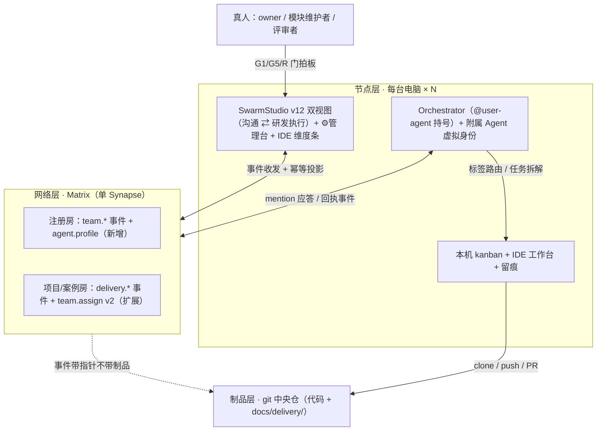

# Swarm Studio 智能研发驾驶舱——架构需求设计

日期：2026-09-19
状态：已批 v1.1——§3 三项裁决与 §12 次级四项于 2026-09-19 批复（前三项按推荐；会签/甘特/催办经用户调整纳入 v1）
受众：overlay 实施者与评审者、hermes 集群维护者
上游依据：需求整理稿（2026-09-19 会话版，含其 §19 八问裁决）、`2026-09-18-distributed-delivery-network-design.md`（已批 D1-D4）、《软件交付标准》v1.3.0（`~/.hermes/delivery/`）

## 0. 三句话主旨

需求稿按绿地 PRD 写，实际系统已建成大半：账号与多用户沟通随 2.30 发布，交付案例事件协议已合 main，本设计把剩余五处增量（Agent 身份、消息与任务联动、评审中心、IDE 任务接线、测试执行）归位到 09-18 spec 已批的三层架构上，不新建中央服务、不动 upstream。全部增量曾卡在三个裁决上：任务状态以谁为准、Agent 集群归属怎么定、Agent 在 Matrix 上是什么身份——三项已批复（§3），本文为批复落款版，下一步是 MVP 拆解轮。读毕应能回答：跨机状态放在哪、谁拆解谁调度、人和 Agent 的身份怎么分。

## 1. 结论（第一屏）

1. 需求稿 §16 的七个 MVP 切片中：MVP1（账号与沟通）建成，经三用户模拟验收 35/35 × 2 轮（`2026-09-17-multiuser-matrix-collab-sim-report.md`）；MVP3 的协议底座合 main（`delivery-protocol.ts` 三事件 + 幂等投影，31/31 测试）；MVP2 协议层有、UI 层无；MVP4/5 对应交付网络 M2-M4 未开工；MVP6 有界面、缺任务接线；MVP7 未动。
2. 三项架构裁决（§3，已批）：A 任务状态以案例房事件流为准，Swarm Studio 是投影；B 集群按用户（机器）组织，kanban 声明能力标签；C 附属 Agent 是 `@<user>-agent` 账号内的虚拟身份，不开独立账号。
3. 三个前置风险：bot 账号注册策略未实测（原 M4 验证项，须提前到首个实施里程碑）；v12.1 壳层重排在 `fix/ide-light-theme-blocks` 在途未合，UI 挂点以其合 main 为准；协议升级 v2 走 schemaVersion + 旧端降级只读，先例已有。

## 2. 现状对账

锚点引自仓库 main fb3651f 与既往验收记录，本轮未复跑（纯文档变更）。

| 需求稿条目 | 现状锚点 | 增量 |
|---|---|---|
| MVP1 登录/联系人/单聊群聊 | matrix-login 换 JWT（patches 005/009/012、`custom/server/matrix/session-store.ts`）；三用户 Fleet（`overlay/scripts/fleet/`）与 sim（`overlay/scripts/sim/`） | 无 |
| 统一沟通界面 | v12 双视图随 2.30 发布（main fb3651f，CDP 六动线全过） | Agent 徽章、任务卡片 |
| 任务协议 | `custom/client/matrix-teams/delivery-protocol.ts`（M1 合 main 6db7d4e，31/31） | 项目维度、任务树、R 系列评审门 |
| 任务投递 | matrix-teams assign → 本机 kanban → receipt（2.27 收口 febe452，见 09-18 spec §2） | parentId / capability 字段 |
| 评审 | G1/G5 HumanGate sender 校验已落地（delivery-protocol.ts:25、230-239） | 任务级评审门 + 评审中心 UI |
| IDE 工作台 | /ide 主页面 + ACP 调 codex 端到端已实测（2.30 随发） | 任务上下文进 /ide、结果回写 |
| Agent 调度 | hermes 集群本机机制完整（dispatch、kanban、留痕） | agent.profile 能力注册 + 标签路由 |
| 测试与统计（MVP7） | ⚙管理台五区覆盖层（9570654） | 测试执行、缺陷流、项目维度统计 |

## 3. 架构裁决（2026-09-19 批复，均按推荐项）

| # | 分叉 | 裁定 | 备选与否决理由 |
|---|---|---|---|
| A | 任务与案例状态的事实源 | 案例房事件流为准，Swarm Studio 各端做投影与缓存；一切写路径 = 向房间发事件 | 「某个 Swarm Studio 实例为权威」被否：每用户本机各部署一份，谁是权威无解，且该机离线即全网锁死；「新建中央任务服务」被否：09-18 spec D2 已否决（新增部署单点 + 最大开发量），homeserver 是现成同步通道 |
| B | Agent 集群归属 | 集群按用户（机器）组织：一机一集群、一个 Orchestrator；kanban 与项目声明所需能力标签，Orchestrator 路由按标签匹配。指派默认落本账号，跨机调度为显式增强（v1 默认关闭） | 「每个 kanban 一独立集群」（需求稿 §1 原文）被否：一人参与五板需五套 Agent，与 Fleet v2 单份运行时收敛（9.1G → 1.9G）方向相反；板要的是能力不是集群。路由粒度沿用协议已有的 worker 三级 account/agentTeam/profile（delivery-protocol.ts:122） |
| C | Agent 的 Matrix 身份 | 沿用单 bot 账号约定：每用户一个 `@<user>-agent` 集群账号由 Orchestrator 持号；附属 Agent（需求分析/架构/编码/测试等）是账号内虚拟身份，消息与事件 content 携带 agentId + agentType，UI 渲染两层徽章 | 「每 Agent 一独立账号」被否：N 用户 × M Agent 的账号与 token 管理面爆炸；且 isHumanAccount / samePrincipal 已按 `-agent` 后缀实现并有测试（delivery-protocol.ts:211-228），这是 HumanGate 人机判定的地基，推倒重来等于拆已验收协议 |

三项裁决对需求稿 §19 的衔接说明：

- 问题 1（Swarm Studio 是任务中枢）：在投影层成立——各端看板、统计、任务详情都从事件流投影；权威层在房间。「Agent 向 Swarm Studio 回报」落实为「Agent 向任务所在房间发回执事件」，本机与其他端同步可见。
- 问题 2（Orchestrator 独立账号、其余附属）：即裁决 C，联系人树为「真人账号 → 其 @user-agent → 附属 Agent（虚拟）」三级。
- 问题 5（开发账号 = 系统职责集群入口）：入口是维护者真人账号，其本机集群携带模块能力标签（如 `module:payment`），产品侧按标签分发，不必感知具体是谁的机器。
- 问题 7（编码 Agent 操作边界）：见 §8，由 agent.profile 的权限列表决定，高风险操作默认 HumanGate。
- 问题 8（多项目）：案例事件增加 projectId 维度，项目索引走 account data（§5.1）。

## 4. 总体架构：三层不变，补三个薄层

三层分工沿用 09-18 spec §4 原文：Matrix 传协调，git 传制品，本机管执行。本设计在其上补三个薄层：注册房的 agent.profile（能力注册）、案例房的任务树字段（拆解 fan-out）、节点层的 IDE 任务接线。

边界规则四条，前三条原文沿用 09-18 spec §4（节点自治；事件带指针不带制品；注册房管组织、案例房管个案），新增：

4. 任务树在协议、执行在本机：跨机只传 team.assign（带 parentId 与 capability）与回执事件，子任务拆解与执行留在本机 kanban，本机机制一字不改。

## 5. 协议扩展：task / agent 事件（schemaVersion 升 2）

沿既有纪律：事件类型字符串收敛在协议单文件、容错解析（非法输入返回 null）、未知版本降级只读、grep 守门测试。旧端读到 v2 事件按既有降级语义忽略，升级窗口内新旧并存可接受。

### 5.1 项目维度与任务树

- `delivery.case` 事件 content 增加 `projectId`；新增 account data `com.swarmstudio.project`（结构同 `com.swarmstudio.delivery.index`，delivery-protocol.ts:14、56-61）：项目清单 → 案例房列表两级索引。现索引上限 MAX_ROOMS = 50（delivery-protocol.ts:82），多项目后需分级或分页，风险登记 §10。
- team.assign（matrix-teams protocol.ts，2.27 已有）content 扩展五字段：`parentId`（任务树根指到案例或父任务）、`capability`（标签数组，裁决 B 路由依据）、`phase`（P1..P6 归属，供统计与看板聚合）、`dueDate`（截止时间，催办与逾期统计的判据）、`dependsOn[]`（前置任务引用，甘特与关键路径的数据源）。

### 5.2 Agent 身份与能力注册

- 注册房新增 state 事件 `com.swarmstudio.agent.profile`：content 含 `agents[]`，每项为 `{agentId, agentType, capabilities[], maxParallel, needsHumanConfirm[], permissions[], lastReportAt}`。PL = 50，本机 bot 只写自己的条目；在线与否由 presence 判断，条目不随离线删除。
- 消息徽章：新增消息类型 `com.swarmstudio.agent.message`，content 为 `{agentId, agentType, text}`，普通 Matrix 客户端回落显示 text。UI 按裁决 C 的两层身份渲染（需求稿 §6.1.4 的身份识别清单）。

### 5.3 状态双轴（收敛需求稿 §15 的 26 个状态）

一个状态机塞 26 态是反模式，拆成两条正交轴：

- 看板轴（任务对人的状态）：待处理、已指派、处理中、待评审、已完成、已阻塞、已取消、已归档。
- 执行轴（回执对 Agent 的状态）：received、started、progress、waiting-human、done、failed。前三个沿用 stage outcome 语义（delivery-protocol.ts:123），waiting-human 对应 HumanGate 挂起。

两轴关系：看板态由门禁与评审事件投影得出，执行态是回执事件的属性；「待评审」= 执行轴停在 waiting-human 或 done 待裁。

### 5.4 评审门：G 系列之外增 R 系列

- gate 事件的 gate 枚举从 G1-G6 扩为 G1-G6 + R1 需求评审、R2 设计评审、R3 代码评审、R4 验收回归。R 门复用 GateContent schema（verdict / evidence / reason / decidedBy）。
- 人机纪律：R 门任何 verdict 的 sender 必须是人类账号，与 G1/G5 同一校验函数（delivery-protocol.ts:230-239 的 validateGateSender 扩枚举）；Agent 只能以 stage 事件提交评审证据，不能替人裁决。这落实需求稿问题 6 的「关键事项必须由人确认，必要时 team leader」。
- 会签（多人评审）纳入 v1（2026-09-19 用户调整）：gate 事件 content 增 `signoffs[]`（每项为 `{decidedBy, verdict, at}`），投影规则「全员 pass 才 pass，任一 reject 即 reject」，单判定人退化为 signoffs 长度 1；R 门每条 signoff 的 sender 仍必须是人类账号。leader 复核沿用注册房紧急通道（09-18 spec §6 owner 覆盖写语义）。
- 评审中心 UI：R/G 门事件在沟通视图渲染为评审卡片，在 ⚙管理台聚合成待审清单；需求稿 §6.1.5 的「评审请求消息」即 gate 事件的 UI 形态，不另造消息类型。

## 6. Orchestrator 调度语义（需求稿 §7 逐条归位）

| 需求稿职责 | 机制落点 | 状态 |
|---|---|---|
| 监听消息/任务事件 | bot 进注册房与案例房，只应答 mention（MATRIX_REQUIRE_MENTION 纪律沿用） | 已有 |
| 判断是否任务化、识别类型 | task 的 phase / capability 字段路由 | 扩展 |
| 查找本机能力 | agent.profile 投影 + 标签匹配 | 新增 |
| 动态拆分 | 本机 orchestrator 拆解，子任务以 team.assign（parentId）fan-out | 扩展 |
| 跟踪执行状态 | stage / receipt 回执幂等投影 | 已有 |
| 汇总结果、反馈发起方 | 案例房回执事件；发起方 Studio 投影可见 | 已有 |
| 必要时请求人工确认 | HumanGate（G1/G5）+ R 门 + §8 权限清单 | 扩展 |

需求稿 §7.3 的 Agent 执行反馈状态（已接收/开始/进度/需人工确认/成功/失败/原因/建议/产物）映射为：回执事件（执行轴）+ stage 事件的 artifactRef 指针 + 本机留痕；四处展示面（聊天窗、看板、调度台、管理台）全部消费同一事件流投影，不各自维护状态。

## 7. UI 映射：需求稿 §13 十类页面 → v12 双视图

09-18 spec §7 的六场景挂点已被 v12 取代（六场景随 2.30 退役），本节按 v12 重映射，后续以 v12.1（`fix/ide-light-theme-blocks` 在途）合 main 后的壳层为准。规则：不新增一级路由。

| 需求稿页面 | v12 落点 | 增量 |
|---|---|---|
| 登录页 | 既有 LoginView（patches 005/009/012） | 无 |
| 联系人页 | 沟通协作视图侧栏，账号树扩到三级（裁决 C） | 徽章渲染 |
| 消息中心 | 沟通协作视图（v12.1 顶区常驻双视图） | agent.message、任务卡片 |
| 任务看板 | 研发执行视图：任务决策栏 + 对象画布 | 聚合视图（项目/阶段/阻塞）、甘特视图（dueDate/dependsOn 投影） |
| Agent 调度台 | ⚙管理台新增分区 | 本机 agent 列表、执行日志、人工接管 |
| 需求工作台 | 对象画布文档对象 + R1 评审卡片 | 新增 |
| 架构设计工作台 | 对象画布文档对象 + R2 评审卡片 | 新增 |
| IDE 工作台 | IDE 维度条（feb77bf）+ /ide 既有页面 | 任务上下文接线（§5.1 字段消费） |
| 测试工作台 | ⚙管理台 + 任务决策栏 | 测试执行与缺陷流 |
| 管理者驾驶舱 | ⚙管理台统计区 | 项目维度、人员/Agent 负载 |

需求稿问题 4 的「两个主要模式」与 v12 双视图语义重合（沟通协作 ⇄ 研发执行），不是巧合：2.30 发布轮已按此收敛壳层，本设计只往两个视图里填协议消费面。

## 8. 权限与代理边界（需求稿 §10、问题 7）

三层各管一段，不重复建模：

1. Matrix 层：房间 power level 硬约束（case/profile 写权 PL = 50，stage/gate 普通消息 + 应用层主体校验），先例全档沿用。
2. Swarm Studio 层：matrix-login 换 JWT 后的路由权限面（patches 005/009/012 已有骨架）。
3. Agent 代理层：agent.profile 的 `permissions[]` 与所属用户权限取交集；默认拒绝清单（必须 HumanGate）= 提交、推送、合并、删除、发版、关单；默认允许 = 读仓库、跑测试、发回执。

在案未修的 always-allow 粒度问题（2026-09-12 评审在档）与本条同源，随 M-A 轮一并收口。

## 9. 非目标（本可做但不做）

- 不做 E2EE、联邦、多 homeserver（沿用 matrix-teams 与 09-18 spec 裁定）。
- 不做每 Agent 独立 Matrix 账号（裁决 C 否决）。
- 不做中央任务服务（裁决 A 否决，即 09-18 D2）。
- 不做跨机 Agent 自由会话（09-18 spec §9 交互面收敛纪律：O(n²) 路径不可回溯）。
- 本轮不写实施代码，不改 upstream。

## 10. 风险与对策

| 风险 | 对策 |
|---|---|
| bot 账号注册策略未实测（Synapse 注册开关/共享密钥） | 原 M4 验证项提前到 M-A：fleet 环境先验注册通道再写 profile 事件 |
| 索引上限：MAX_ROOMS = 50，多项目后案例房超限 | project → case 两级索引（§5.1），超出再分页；协议侧只认指针 |
| v12.1 壳层在途未合，UI 挂点漂移 | 协议轮（M-A/M-B）不依赖壳层；UI 轮排在其合 main 后 |
| 协议 v2 新旧节点并存 | schemaVersion + 未知版本降级只读（既有纪律，delivery-protocol.ts:5 注释即此语义） |
| getStateEvents 无参恒空等 SDK 坑 | matrix-teams P1-P3 已踩平并记录（2026-09-17 设计），实现轮照坑单施工 |
| owner 离线致流程暂停 | 沿用 09-18 D3 已知代价 + leader 紧急通道，不新增机制 |
| 多项目并发后统计口径漂移 | 统计全部从事件投影计算，不落第二份聚合状态；口径定义随 M-F 出对照表 |
| 会签/甘特/催办入 v1 扩大协议与工期面 | 会签走 signoffs 字段投影，不新增事件类型；甘特与催办只依赖 §5.1 时间字段，先字段后视图；任一项受阻单独降级登记，不阻塞主链 |

## 11. 实施顺序建议（供 MVP 拆解轮取材）

| 轮 | 内容 | 依赖 |
|---|---|---|
| M-A 协议 v2 | projectId / parentId / capability / dueDate / dependsOn 字段、agent.profile、agent.message、R 门枚举 + signoffs + 守门测试；纯 A 类 | 无（首个里程碑，含注册策略前置验证） |
| M-B 路由与拆分 | Orchestrator 标签匹配、子任务 fan-out、执行轴回执 | M-A |
| M-C 评审中心 | R/G 门卡片渲染 + 管理台待审清单 + 会签 signoffs 投影 | M-A；UI 轮排 v12.1 合 main 后 |
| M-D 消息任务联动 | 消息转任务、任务卡片操作（指派/完成/阻塞/重开）、甘特视图（dueDate/dependsOn 投影） | M-A |
| M-E IDE 接线 | 任务上下文进 /ide、diff 确认回写任务、ACP 会话挂任务 | M-D |
| M-F 测试、统计与催办 | 测试 Agent 执行、缺陷任务流、项目/人员/Agent 维度统计、逾期催办（dueDate 判据 + 通知） | M-B |

每轮独立 feat 分支 → 测试全绿 → 合 overlay main（workspace 规则），与 09-18 spec §10 里程碑制式一致。

## 12. 批复记录（2026-09-19）

四项经用户逐项确认：

1. 裁决 A / B / C（§3）按推荐项通过。
2. 评审门扩至 R1-R4，任何 verdict 的 sender 必须人类账号。
3. 跨机调度 v1 默认关闭，做成显式开关。
4. 会签、甘特视图、自动化催办纳入 v1——用户调整，推翻本文暂缓代拟；修订落点：§5.1（dueDate/dependsOn）、§5.4（signoffs）、§7（甘特视图）、§10（风险）、§11（M-C/M-D/M-F 扩容）。

后续推翻任一项时回本文修订并升版本号。第一个验收画面：需求分析 Agent 拆出的一张子任务卡片，以带 parentId 与 capability 的 team.assign 事件落到 kanban 上（跨机开闸后即另一台机器），产品人员在沟通视图里看到它戴上 Agent 徽章进入「待评审」——这条事件流走通，本设计的地基就算验完了。
