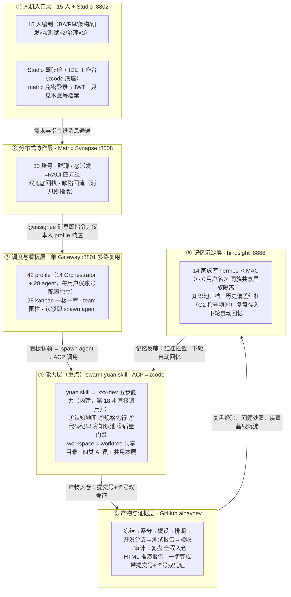

# Swarm Studio 全流程推演方案（V3 完整版）

> **版本状态（2026-09-29）**：本文全部内容（背景/目标/编制/架构/26 步主链/治理总则/交付物）已原文并入 V5 整合版 `2026-09-29-mux-v5-fullflow-plan.md`，V5 为唯一正本；本文自即日起存档，不再更新。

## 背景

本机已部署 matrix 分布式消息服务（docker matrix-synapse 服务）、hermes agent、swarm studio 应用（本项目）。具体使用时，每个人的电脑上都会独立部署一套 hermes agent、swarm studio 应用，共用 matrix 后台服务。模型通道支持备用切换（MX_MODEL_BASE_URL/KEY/NAME 整编制改道 + MX_FALLBACK_MODELS 多通道声明）。本机以「一个 hermes gateway 多路复用 + 每用户独立 profile（账号与配置独立、技能模板完全一致）+ 每用户独立 kanban（各挂自己的研发专职 agent 团队）+ 每用户独立记忆库（hindsight，按"用户名+MAC 地址"分仓，同一用户全部看板与 agent 共享）」模拟"每人一套"的部署形态，需要创建多个必要的 matrix 账户，在本机模拟完整的多人的产品研发测试团队及其工作流程，完成如下目标推演。

## 目标

基于真实需求（基于财付通/支付宝的公开技术手册，为收单商户开发一个兼容多端的小程序版本的支付收银台），模拟完整的多人的产品研发测试团队及其真实工作流程，对"驾驶舱"及其"协作沟通"和"IDE 工作台"功能进行全流程推演，并根据推演中暴露的问题进行完善，重构设计及实现，全量回归测试，直至彻底完成（推演过程的 git 仓库，统一使用 https://github.com/issac-new/aipaydev），最终形成一步一步的 html 格式的一份推演报告（可以截屏或 playwright / chrome dev tools / computer use 等方式操作内置浏览器，包括"IDE 工作台"介入具体开发任务、查看任务简报、完成交互式的编码开发、git 图谱查看、模型设置等），以便演示给别人看完整的端到端全流程（产品路演）。

全流程每一步都写明**把关**（开始前要满足什么、做完拿什么交差、到什么程度算合格）；把关由脚本自动检查，不靠自觉。质量与闭环治理总则见文末。

## AI 员工编制（对标行业实践）

行业机构（银行卡清算领域）已落地的《AI 增强的研发运维模式建设》实践材料把研发职能收拢为三类 AI 员工，并直面两大共性挑战。本方案将其全量吸收，AI 员工与 26 步、技能体系的对应关系如下：

| AI 员工 | 一句话职责（材料原命题） | 对应步骤 | 用的技能（拆解+评审双层智能体） | 人必须确认的节点 |
|---|---|---|---|---|
| 需求设计 AI 员工 | 把模糊业务诉求转成可开发的设计包 | 7-16 | requirements-analyst（金融支付领域知识 + OCR 双路提取）+ 架构设计技能 | G1 上锁、G2 评审、定稿 |
| 应用研发 AI 员工 | 在流水线中自动完成编码与自评审 | 17-18 | xxx-dev（swarm yuan 为仓库生成的定制研发技能） | 分诊确认、提测 |
| 质量测试 AI 员工 | 用例生成、智能回归与缺陷归因 | 19-21 | defect-loop（报→修→验闭环）+ 测试 agent | UAT 逐条核对、发版人工批准 |
| 研发治理 AI 员工（本方案延伸） | 台账、审计、复盘与度量 | 22-24 | pm-planning、capability-report | 复盘确认、行动项认领 |

两大挑战的应对（材料命题 → 本方案落地机制）：

1. **大模型输出的随机性与准确性**（幻觉虚构、配置错误、依赖版本不适配）：
   - 结构化输出强制规范：RACI 结构化字段、验收标准必须可判定（G1 四项），空话不上锁；
   - 一切"完成"带证据反向核验（提交号+卡号，查不到打回）——治幻觉的硬手段；
   - 历史偏差红杠：设计期自动关联家族记忆库与问题单台账中的历史偏差及复盘记录，命中必回应（第 15 步 G2 检查项⑤）；
   - 审计结论抽检：每轮抽 AI 结论反向核验，幻觉率入治理报告（第 23 步）；
   - 复现留痕：每轮记录模型通道与版本、关键回合原始输入输出存档（治理总则第 6 条）。
2. **组织协同与信任**：
   - 人工始终在回路：上表"人必须确认的节点"之外全部 AI 主理，全链只有这几处人卡点；
   - 全程留痕可追溯：每道锁的冻结凭证、问题单台账、双兜底回执、家族记忆库。

编码五步是 swarm yuan skill 的内建能力，不是方案另立的流程：行业材料的"五步质量管理流程"（认知地图→规格先行→代码纪律→知识池→质量门禁）与 swarm yuan skill 为仓库生成的 xxx-dev 技能中的资产梳理与开发流程方法同构，第 18 步直接调用该能力执行。

## 架构与链路（六层逻辑）

整个系统按"一次任务的完整旅程"分六层，自上而下即执行逻辑；A4 演示版见 `2026-09-25-mux-v3-fig.html`（同目录，PPT 单页直用）。六层与 26 步的对应：层①②承载步骤 1-13（环境、登录、建群、派发），层③承载看板与调度（步骤 10-18），层④承载五步研发（步骤 13、18），层⑤承载全部产物入仓（贯穿），层⑥承载记忆沉淀（步骤 24 存、下轮取）。

图读法（PPT 讲解口径）：

| 看哪里 | 逻辑 |
|---|---|
| 六层自上而下 | 一次任务的完整旅程：人发指令 → 消息协作 → 调度看板 → yuan 五步能力 → 产物凭证 → 记忆沉淀 |
| 层间箭头 | 上一层交给下一层的"接口"：消息即指令、认领即执行、双凭证入仓、复盘沉淀 |
| 虚线反哺 | 记忆不是终点：知识池归档与历史偏差红杠回流能力层，同族越干越熟 |
| 能力共享 | gateway 进程、matrix 通道、yuan 技能模板、模型通道、中央仓、hindsight 服务——全编制同构 |
| 档案隔离 | profile 配置、kanban 一板一库、记忆 bank（用户名+MAC）、Studio ACL、board 围栏、state.db——按账号独立 |
| 治理横切 | 四道硬闸压在 26 步主链上：不上锁不分析、不评审不排期、不测试不发布、不检查不上线；凭证核验、问题台账、回灌重报、治理报告贯穿全程 |

## 具体流程

1、管理员为所有用户分配 matrix 账号，账号信息包括：matrix 地址、账号、access token、登录密码等信息。本期编制 15 名成员（主管 admin、BA、产品经理A、4 名研发、2 名测试、架构治理、安全 secops、运维 ops、合规审计 audit），各配人类账号与 AI 助理账号，共 30 个 matrix 账号。
（把关：开始前 synapse 服务在线；做完的凭据=30 账号逐一登录验证通过、账号清单入档 roster；合格线=账号与人员编制表一一对应。）

2、每个用户配置初始化：hermes agent gateway 配置 Orchestrator agent channel：matrix 地址、账号、access token 等信息（本机为单 gateway 多路复用，等价于每台电脑独立的 gateway；每用户仅账号与配置不同）。同时为其装配协作 kanban（每人 2 块独立看板，每块看板挂自己的研发专职 agent 团队，看板认领白名单锁定——别人的 agent 认领不了你的任务）与独立记忆库。
（把关：开始前账号就绪；做完的凭据=每用户"账号+配置+看板+团队+记忆库"装配清单可逐项列出；合格线=四件套齐全且互不可见。）

3、每个用户打开 swarm studio，进行用户登录，默认使用 matrix 账号自动登录（免密，凭 gateway 已配置的 Orchestrator agent channel），用户也可以在登录页使用 matrix 地址、账号、密码登录。
（把关：做完的凭据=全部账号登录通过、登录后只能看到自己的档案与看板（抽查跨账号不可见）；合格线=自动登录与密码登录两种方式都通。）

4、至此，用户可以使用系统所有功能（驾驶舱、协作沟通、IDE 工作台）。环境冒烟通过，推演正式开始。
（把关：凭据=冒烟清单全绿（账号/服务/登录/看板/团队围栏/记忆库）；合格线=零红灯，环境问题如实记问题单不算产品缺陷。）

5、应用初始化：hermes agent 安装后已默认存在一批智能体（hermes profiles）；对本项目研发的 4 个应用模块（csw-pay-core 支付核心、csw-channel-wechat 微信渠道、csw-channel-alipay 支付宝渠道、csw-cashier-mp 小程序收银台）逐一登记资产表（应用、负责人、专属看板、技术栈、SLA 级别、测试骨架在位核对）。新应用立项、应用退役，同表管理。
（把关：凭据=应用资产表 app-registry.md 入仓库；合格线=每应用有负责人/专属看板/测试骨架，缺件记问题单不得静默。）

6、研发人员管理：生成组织与权限矩阵（人员×角色×汇报线×看板×团队×matrix 账号 + 权限规则 + 入职/转岗/离职流程 + 能力清单），与实际账号/看板/智能体逐项对账。角色要求全覆盖：需求分析师、系统分析师、项目管理、系统架构、安全管理、运维管理、合规及审计。
（把关：凭据=组织表 org.md 入仓库、对账输出留档；合格线=15 人×看板×智能体三方零差异；离职流程含任务移交+账号停用+审计留痕。）

7、BA（bella）给出客户需求文档（本期邮件通道禁用，以 matrix 私信送达产品团队，记问题单口径），由产品团队内部进行分工，将需求文档发给产品团队的产品经理A用户（fanfan）。需求文档先过"需求上锁"检查（G1）才许开工：①逐条验收标准可机械化判定（如"重复下单返回同一支付单号且测试全绿"，禁止"性能良好"类空话）②写明本次不做什么（范围外清单）③影响哪些系统（模块/接口/数据）④涉不涉敏（涉敏按 ISO27001 出风险评估摘要）。四项齐→生成冻结标记入库（锁定的验收清单是最终验收的唯一依据）；缺项打回 BA 补齐，两轮不齐不得开工。
（把关：准出=冻结文件 docs/requirements/<RFD>.freeze.md 入仓库；合格线=验收标准≥3 条且全部可判定；锁后不许改，改则重新走锁。）

8、产品团队产品经理用户A（fanfan），根据拿到的客户需求文档，创建群聊，邀请自己本机的 hermes Orchestrator agent（显示名称为"matrix 账户名"的 AI 助理），将群聊命名为"XX需求分析讨论群"，并**自动邀请全部关联人**（chen/hu/lin/xiao/wei/mei/qi/fei）进群后再开始分析。
（把关：准出=群 ID 落档；合格线=命名规范、助理在群。）

9、产品经理A（fanfan）在群聊中@Orchestrator agent，输入指令，并将客户需求文档（或对应的 git 仓库地址）发送到群聊中。指令明确：结论必须带证据（代码提交号+任务卡号），空喊"完成"不算数，被截断丢弃的动作就是没做完。
（把关：准出=派发消息落档；合格线=指令含需求信息一行+材料地址+证据要求。）

10、Orchestrator agent 通过本机 hermes agent gateway 配置的 matrix channel，接收到用户A在群聊里输入的需求文档及@自己的指令任务（包含一行需求基本信息），登记协作 kanban 任务（带结构化 RACI 分工字段：主责/授权/咨询/通知。**assignee 填短名**如 chen——不要填 @chen-agent:matrix.test，profile 系统按短名过滤、格式不匹配=全部不可见。**子任务必须建在责任人的看板上**（不是建在自己板上），建完后必须在群内**逐条发 matrix 消息 @责任人-agent**（不发消息=没人知道有这个任务）。），自动触发任务分解，寻找本机合适的 agent（系统分析智能体）进行需求任务处理。
（把关：准出=主任务卡出现在产品经理A的账号看板（超时打回重报，两轮不过记问题单中止）；合格线=卡 ID 为建卡工具返回的真实 ID（拿需求编号冒充即判虚报）。）

11、系统分析智能体（Systems Analyst）接收到需求文档和指令后，在当前任务的 workspace 创建 git 仓库存档文档，然后调用需求分析相关技能（Requirements Analyst skill，应包含本机 hermes agent 金融支付（银行卡及网络支付）转接清算领域的背景知识及技能及通用的技术架构设计技能，可以整合形成一个全新的技能）进行需求分析，具体开展如下工作：
* 对需求文档进行切分转换、文本提取（图片转 OCR，双路提取交叉核对防字符错认）等操作，提取出需求文档中的需求内容，转为便于工作的 markdown 格式（务必确保不能有信息偏差），进行初步的格式及要素评估（参考需求模版文档）；
* 根据人员清单（从 matrix 服务端账号清单获取）和系统应用模块清单（通过向所有 matrix 账号发送查询指令，要求其上报各自本机 hermes agent 的 kanban 及 teams 和 teams 下的 agent 及 agent 能力——每个应用有自己的专用研发 agent，负责 csw 开头的应用 agent 即应用模块清单）、组织清单（各应用的归属主责人员、团队、团队 leader 及组织协作模式；人员/组织以流程 6 已入库的 org.md、应用以流程 5 的 app-registry.md 为准），根据三个清单进行需求文档的需求分析，完成系统分析 kanban 任务登记及拆分；
* 具体拆分规则为：先按应用模块的职责进行任务的初步划分及模块匹配，然后进行架构上（参考最新的整体架构及设计文档）的统筹调整（最小改动、减少重构、同类事项合并），完成任务的拆分和实现建议，形成满足 SMART 原则的任务清单，具体到责任人。登记该任务清单文件到自身当前的 kanban 任务上；
* 然后自动邀请所有关联人员的 matrix 账号进群，依据 RACI 原则（主责、授权、咨询、通知），在群内按任务逐条通过 matrix 消息发送给对应责任人的账号及其团队负责人的账号（@2 个对应账号，附带完整任务文档（或 git 仓库地址）及需其负责的任务明细，包含需求分析及架构设计任务的初稿信息确认及深入分析反馈的指令要求），并创建逐条的关联的跟踪任务（该任务仅追踪后续对应 matrix 账号反馈的任务进展并进行即时的确认及更新），与自身当前的 kanban 任务形成父子依赖关系（最终所有任务完成后更新关闭该需求分析 kanban 任务）。
（把关：准出=任务清单文件入仓库（超时硬失败，不得空着往下跑）+ 完成凭证双向核验（提交真在仓库且含分析稿、卡真在账号板）+ 四组 RACI 派发消息齐全 + 关联人全部进群（未邀导演补邀并记问题单）；合格线=SMART 清单具体到人、三清单齐、分工走结构化字段。）

12、具体负责员工及团队负责人的账号收到 matrix 消息的逐条任务的具体信息后，其本机的 hermes Orchestrator agent（显示名称为"matrix 账户名"的 AI 助理），将登记代办 kanban 任务。团队负责人手动进行任务的初步确认及任务负责人的调整（分诊台 triage→todo），然后将任务通过 matrix 发送给具体负责员工进行后续处理；如具体负责员工直接领用确认了该任务（协作 kanban 分诊台的任务手工确认了继续推进），进行了后继处理（见第 13 条具体内容），则在该任务完成后，务必发送 matrix 消息给其团队负责人及发起人或转派人的 matrix 账号，要求其对收到的该任务进行更新（双兜底，避免遗漏），后续如重复收到团队负责人派发的该任务，则 Orchestrator agent 自动进行合并去重。
（把关：准出=四主责账号看板出现任务卡 + lead 确认完成；合格线=分诊记录留痕、去重生效。）

13、具体负责员工，在收到任务后，由本机的 hermes Orchestrator agent 寻找合适的 agent（调研设计 agent 及测试 agent、具体应用的专职研发 agent），由其开始进行精准的需求分析及跨模块层级的交互接口及数据模型设计，完成任务复杂度及工作量评估（结合历史数据并参考现有评估标准进行个性化精准分析评估），具体过程（必须固定为标准流程严格执行）如下：
* 在该看板任务的 workspace 下创建 worktree，将相关任务的材料及要求、代码仓库地址、环境及环境链接信息、历史存在项目下的需求及设计文档，统一存放，作为该任务的 workspace（由本机与此任务相关的 agent 共享该 workspace 目录，使用 worktree 进行并行工作，完成后合入该任务的 feature 或其它 fix 分支）；
* 使用 swarm yuan skill 为该 workspace 下的代码仓库生成的定制化研发技能（xxx-dev skill）中的梳理的研发资产及开发流程方法，进行深入分析，完成需求分析、跨模块交互设计、内部设计实现方案（聚焦功能接口及逻辑复杂度等工作量评估所需的模块），最终输出初步的需求分析的初步确认结论、需澄清内容、概设方案、前置依赖条件、风险点及必须补充确认的要素信息、工作量评估等结论信息，完成本任务的需求评估及系分工作；
* 在工作过程中，为达成目标，所有 agent 可以通过 matrix 发送消息给必要的应用外协作方账号，去确认有关架构及协作层面的工作内容（派发任务），完成当前任务工作；
* 将上述任务完成后的结果自动通过 matrix 消息反馈给自身的团队负责人以及该任务的发起方（如为同一人则去重反馈，依据 RACI 原则完成协作）。
（把关：准出=四份系分稿入仓库（各限时）+ 完成回执双兜底齐全（超时记问题单）；合格线=概设含接口签名/数据模型/错误码/幂等键、工作量评估有人日。）

14、产品经理A收到主责研发人员（及其团队负责人确认后）的任务完成消息后，逐步更新前序 kanban 任务的进度，在本任务的关联派发任务都完成后汇总形成总稿（系统分析及工作量评估方案），调用全局的需求分析及架构设计技能进行复核（消除歧义、冲突、整理结构层次等，按规范形成系统概设方案），然后发起评审 kanban 任务（虚拟架构小组，可线下人工组织，或派发给架构治理小组成员账号进行评审，本次先以线下人工评审结论由产品经理A手工更新任务进度），最终完成本次需求分析任务，定稿后形成需求规格及架构设计方案。
（把关：准出=概设方案入仓库 + 评审任务卡登记；合格线=金额统一"分"（int64）、字段命名统一 snake_case、结构层次成规范文档。）

15、（G2 架构治理评审）概设定稿后派发给架构治理小组成员账号（arch）评审：①设计五要素齐备（背景/方案/接口/数据/风险）②爆炸半径排查（变更影响模块对照三清单）③验证计划前移（测试要点在设计期已列）④备选方案≥2 且有取舍理由⑤历史偏差红杠（自动检索家族记忆库与问题单台账中的历史偏差及复盘记录，命中项设计稿未显式回应规避即打回）；结论 PASS/FAIL 入群，FAIL 打回修订复评一轮。不过，不得进入排期。
（把关：准出=评审结论行 + 架构评审卡关闭；合格线=五项检查逐条留痕（评审记录结构）、历史偏差检索结论附设计稿。）

16、产品经理A基于定稿的需求规格及架构设计方案、工作量评估的系统分析结果，修正此前最初的需求系统分析 kanban 任务（登记所有关联的子任务及工作过程档案汇总，便于后续回溯追踪审计），然后标记该任务为完成（测试工作量按 0.3 的系数进行直接叠加的评估）。
（把关：准出=主任务卡置完成（限时）；合格线=档案汇总可回溯、0.3 系数口径写入。）

17、产品经理A按上述定稿的需求规格及架构设计方案、工作量评估的系统分析结果及开发人员当前负载情况、业务交付时间、测试人力资源等，编排生成详细开发计划测试任务（调用项目管理及研发治理 PM 相关技能），启动开发任务排期计划，生成带时间窗口的 kanban 任务，登记本机代办任务，并通过 matrix 消息发送任务计划明细给具体主责研发/测试人员及其团队负责人，并将明细登记为 kanban 的子任务进行追踪。
（把关：准出=排期文档入仓库（限时）+ 父子任务卡齐 + 逐条派发消息落档；合格线=测试量=开发×0.3 独立成项、整体+15% 缓冲、每任务有时间窗口与依赖。）

18、研发/测试人员及其团队负责人接收到 matrix 账号具体开发及测试任务消息后，由其本机的 hermes Orchestrator agent 登记协作 kanban 的分诊台。人工确认后进行开发及测试任务的分诊工作，并推进后续实施过程，具体过程（必须固定为标准流程严格执行）如下：
* 寻找合适的 agent（调研设计 agent 及测试 agent、具体应用的专职研发 agent）；
* 在该看板任务的 workspace 下创建 worktree（同第 13 条 workspace 约定），使用 swarm yuan skill 生成的 xxx-dev skill——它把仓库资产梳理与开发流程方法内建为五步能力，开发过程直接调用：①认知地图：先读 xxx-dev 的资产梳理，认识本仓库结构与依赖；②规格先行：无设计不编码，实现严格对照定稿概设；③代码纪律：需求、代码、测试一一对应可跟踪（每条验收标准落到用例）；④知识池：测试用例、缺陷与失败打回数据归档入家族记忆库（下轮同类任务自动回忆）；⑤质量门禁：白盒安全扫描、单元测试、接口测试、回归测试全绿并通过自评审才算完成，发现的缺陷就地闭环修复——聚焦接口、数据模型、逻辑功能的实现或测试用例编写与执行；
* 在工作过程中，为达成目标，所有 agent 可以通过 matrix 发送消息给必要的应用外协作方账号，去确认有关架构及协作层面的工作内容细节（派发任务）；
* 将上述任务完成后的结果自动通过 matrix 消息反馈给自身的团队负责人以及该任务的发起方、测试团队负责人及主责测试人员（测试人员每应用为固定人员）（如为同一人则去重反馈，依据 RACI 原则完成协作），各方更新对应 kanban 任务的进展。
（把关【G3 编码门禁】：准出=四条开发分支入 origin（各限时）+ 本地测试运行输出证据落档（docs/evidence/<任务>-testlog.txt 随分支提交，脚本逐分支真查，缺件记问题单）；合格线=无设计不编码、pay-core 单测≥8 用例/其余≥6 且全绿、金额分 int64、渠道请求一律本地 mock。）

19、如测试人员识别存在缺陷，则通过 matrix 消息反馈给对应应用的研发人员（测试系统 bug 的信息），研发人员的 matrix 账号收到消息后，由其本机的测试智能体复现确认后，派给具体应用的研发智能体进行问题的自动修复及自测，然后由开发人员人工处理 kanban 任务，发起提测流程。最终测试通过后，由测试人员的测试 agent 更新 kanban 任务，登记测试通过的 git commit id 到所有关联的开发、测试及需求 kanban 任务中，并出具测试报告（提供 git 仓库地址）。缺陷须归因分类（需求缺陷/编码缺陷/环境缺陷），随测试报告入仓，按根因分布计入治理报告度量。
（把关【G4 独立验证】：测试的人不能是写代码的人；缺陷闭环=报→修→验全关才算过，且只认本轮派发之后产生的记录（防旧账充数）；准出=测试报告入仓库（含范围/用例数/通过数/缺陷清单/结论/通过 commit id）+ commit id 回填关联卡；合格线=证据证明测试真跑过（附执行输出摘要），"有测试代码"不算。）

20、（G5 发布准出）产品经理A发起后续的变更发版及交付动作前，先过发布检查（套发布计划/发布说明模版）：①测试证据已挂关联卡 ②构建产物同 commit 可复现 ③依赖无新增 ④回滚方案具体化——数字阈值触发（如"崩溃率>0.5% 回滚"）+ 命令级步骤 + 72 小时观察窗口与盯梢项 ⑤灰度计划 5%→25%→100% 及各档观察期 ⑥发布说明面向用户收益（不贴提交罗列）⑦对外发布须人工批准（HumanGate，批准记录留痕）；同时套用交付标准模版库（DELIVERY-STANDARD-COMPLETE 及关联模版，模版不满足实际需要直接完善修改），并对所有任务自动进行分类、优先级排序、依赖关系分析等完备性检查，避免"多漏错重"。七项全过才许发布。
（把关：准出=七项结论入群 + 准出卡关闭 + 完备性检查报告入仓库；合格线=缺项打回一轮，两轮不过不得上线。）

21、产品经理A发起后续的变更发版及交付动作（先线下处理，但同样登记具体应用主责人员的关联任务以便追踪）。随后业务验收（UAT）：BA 拿第 7 步锁定的验收标准逐条对账——@产品经理A的助理逐条给出证据锚点（分支/测试报告/提交号），BA 逐条核对，全过出验收报告入仓库（含上线后 SLA 登记：可用性 99.5%、下单接口 P95≤800ms、P2 事件 4 小时响应），任一条不过即缺陷回流（回到第 19 条语义）。
（把关：准出=验收报告入仓库且锁定标准全过（限时）；合格线=助理结论行逐条列出每个 AC 编号与证据锚点（脚本逐条覆盖核验，缺条即验收不通过）、每条标准的证据可反向核验——开头定的标准，结尾拿它对账，需求到验收闭环。）

22、研发工作管理（全程可出，独立管理步）：随时生成工作台账——每人各类状态任务分布（待办/进行中/评审/完成）、同时在手（进行中）不得超过 2 件、卡 72 小时不动的任务清点、未完结任务由产品经理A决定挂起或移交下轮。
（把关：准出=工作台账 work-report.md 落档（每人状态分布、WIP、卡壳 72h 清单均真查数据）；合格线=超负载记问题单、卡壳任务 100% 有处置意见。）

23、合规及审计管理（audit 账号独立签名线）：审计门禁留痕完整性（每道锁的冻结凭证都在仓库）、问题单台账格式、取证目录在位；出具合规审计意见书入仓库；对可疑凭证抽检，另抽 AI 结论（每轮抽 3 条"完成"结论反向核验凭证真实性，幻觉率计入治理报告）。审计与开发/测试线独立。
（把关：准出=合规意见书入仓库；合格线=发现 100% 记问题单、意见书带签名线。）

24、复盘（G6）：三段式——现象（只写事实）/规律（机制归因，对事不对人，写"某人失误"不合格）/下轮验证（行动项四要素：事项/负责人/期限/验收判据）；自动产出治理报告（各道锁一次通过率、证据一次通过率、缺陷统计、打回次数，对齐度量模板口径）；复盘中对模版文档的改进项直接落实（资产回写）；本轮经验存入每人家族记忆库（hindsight），下轮同需求自动回忆。全程问题单台账在此 100% 清点（处置结论三态：已修/观察/延后）。
（把关：准出=复盘文档+治理报告入仓库；合格线=问题单 100% 有处置记账——每条一行 DISP（已修/观察/延后），复盘文档自动列全表、未处置如实标「待处置」并计数入问题单、行动项四要素齐。）

25、"IDE 工作台"全程介入（产品路演重点）：kanban 任务由具体 agent 在对应 workspace 启动后，是由 hermes agent ACP 调用 claude code、codex、zcode 等编程工具加载 yuan skill 及其生成的 xxx-dev skill 完成的；"IDE 工作台"的编程工具的目的是取代上述编程工具，由 ACP 调用其完成——它是基于 zcode 为底座、充分调研吸收了其他各种主流 code/work 工具形成的。要在协作中可以随时跳转直接接入其开展工作，且在 IDE 工作台要能够看到该任务的全局概览及每一环节的具体信息（由任务跳转接入时，主动为用户生成该任务的简报，以便用户快速开展具体的分析、设计、研发及测试调试等工作），含交互式编码开发、git 图谱查看、模型设置。
（把关：准出=IDE 核验记录落档（任务跳转/简报生成/界面组件在位）；合格线=可从任务一键跳进工作台并出简报。）

26、生成 HTML 推演报告（产品路演交付物）：一步一步的 html 格式推演报告——用内置浏览器（截屏或 playwright / chrome dev tools / computer use 等方式操作）真实走查并捕获截图：驾驶舱（看板/任务/简报）、协作沟通（建群/派发/RACI/缺陷闭环对话）、IDE 工作台（任务跳转/任务简报/交互编码/git 图谱/模型设置），配合各步执行状态、问题单台账、闭环治理报告，形成完整的端到端全流程演示文稿。
（把关：准出=simulation-report.html 生成；合格线=26 步状态真实（执行过的✅、没执行的⬜，不作假）、截图三界面齐、问题单与治理报告挂接。）

## 质量与闭环治理总则（贯穿全程）

1. 四道锁系统直接拦：需求未上锁不分析（G1，第 7 条）、设计未评审不排期（G2，第 15 条）、测试未过不发布（G4，第 19 条）、发布检查未过不上线（G5，第 20 条）——锁不过，后续步骤脚本直接拒绝执行。
2. 说话给证据：一切"完成"结论必须带代码提交号+任务卡号，系统反向核验（提交真在仓库且含产物、卡真在账号板），查不到打回重报，两轮不过记问题单中止。
3. 问题全记账：全过程问题单台账（类型|主体|描述），复盘逐条清点，100% 有处置结论。
4. 打回不静默：任何超时/拒收都把原因回灌给对应 agent 限期重报，不许默默失败。
5. 度量看治理报告：各道锁一次通过率、证据一次通过率、缺陷密度、打回次数——下次推演目标即上次基线+1。
6. 可复现与 AI 贡献度量：每轮记录模型通道与版本，关键回合原始输入输出留档备查；治理报告增加 AI 贡献口径（AI 主理回合数与占比、人工介入次数）；同一需求可下轮双跑对比输出一致性，验证随机性应对是否有效。

## 交付物清单

1. 架构与全流程链路图（docs/superpowers/specs/2026-09-25-mux-v3-fig.html，A4 横版 PPT 单页直用：六层逻辑流自上而下 + 记忆反哺通道 + 右栏共享/隔离/治理 + 26 步流程条；文档内 mermaid 版见"架构与链路"章节）；
2. 推演过程仓库（https://github.com/issac-new/aipaydev）；
3. HTML 推演报告（simulation-report.html，含驾驶舱/协作沟通/IDE 工作台截图，产品路演用）；
4. 问题单台账、治理报告、验收报告、复盘文档、合规意见书（随轮次入仓库与 evidence）。

工程实现细节（推演脚本执行方式、M3 事件化接线、实测记录、正文移除的实测注记）见同目录附录 2026-09-25-mux-v3-lifecycle-plan-appendix.md。

## 实测记录补遗：run14 终局（2026-09-27 13:05）

**26 步全流程 + MX_DELIVERY=1 协议事件单发马拉松完成（exit 0，3h44m）**：六 stage 6/6、六 gate pass 无缺、case 终态 P6；断言报告 `evidence/delivery-events/report.md`；案例房 dlv-run-092528 地面真值（case×6+gate×6+stage×6，frozenAcceptance 在位）；UAT AC=7 全过；HTML 报告 48KB（生命周期旅程版+灯箱截图）。关键突破=推演本体以 run_in_background 任务载体跑（前 13 轮死于会话回合结束的进程组清理）。八层根因链修复全程见分布式设计文档补记。
