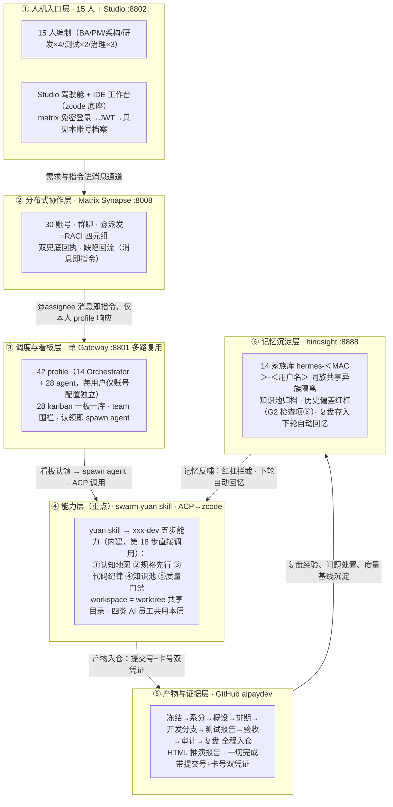

# Swarm Studio 全流程推演方案（V5 整合版）

> **文档定位**：本文合并 V3 操作主链（`2026-09-25-mux-v3-lifecycle-plan.md`，背景/目标/编制/架构/26 步逐步把关原文/治理总则，全文并入第二至五章）与 V4.1 整合终版（`2026-09-28-aipaydev-v4-roadshow-refactor-v4.1-final.md`，七问题域治理框架、实现清单、路演层与执行态，并入第六至九章），是全流程推演的唯一正本。V3 与 V4.1 自本文起转为历史版本，仅存档不更新。此后变更走本文增量补遗，不再另立平行版本。
> **补遗记档**：2026-09-29 补遗①——第八章细化为路演报告规范（8.1 形式与生成／8.2 内容结构／8.3 硬性要求 R1-R9，依据 run1/run2 两轮报告内容级审计）；第九章 run2 行按独立审计改判修正；第七、十章同步（x20 v2 合入、报告生成器补课记档）。
> **补遗记档**：2026-09-29 补遗②——第五章新增总则 8-14（判词真值化/落键完整/审计双线/基线受控/判回滚冻结/处置回灌/留痕受控，均带 run2 先例锚点）；新增 4.3 步骤修订批（第 15/18/19/20/21/23/24/26 步把关增补，4.2 原文一字不动）；8.3 增 R10 工件新鲜度并在 8.4 增采集快门守门；run1 问题单 12 键 DISP 补账回灌台账本体（对齐 R-A5 先例）；UI 视觉审计 19 缺陷+15 图证不一致入第十章台账（详单 `2026-09-29-ui-visual-audit-run1-run2.md`）。报告生成器四修已落 fix/report-generator-four @ 2f6d8a8d（元信息参数化/R3-R9 断言，待合）。
> **补遗记档**：2026-09-29 补遗③——修复"各环节符合准入准出标准的交付物无效果图"缺位（用户指认）：新增 8.6 交付物效果图规范（26 步交付物→模版→呈现要求全矩阵，呈现=交付物真容渲染+模版逐节核对，非截图非转述）；8.2 步骤块四件套升五件套；8.3 增 R11 交付物真容；锚点实证=中央仓 RFD-001.freeze.md（四要素+AC-7 条实存）。
> **基准**：overlay main @ a34e15aa（补遗①基底；首版基底 f185efc5）；补遗②③先行落根 docs 树，overlay 入库提交号待 shell 恢复后回填；推演环境 ncwk-sim-mux（gateway :8801 / studio :8802 / synapse :8008 / hindsight :8888）；中央仓 github.com/issac-new/aipaydev。

---

## 一、方案总览

以真实支付需求（基于财付通/支付宝公开技术手册，为收单商户开发多端小程序支付收银台）驱动，15 人编制（人+AI 助理 30 个 matrix 账号、42 profile）在"每人一套 hermes agent + swarm studio、共用 matrix 后台"的部署形态下，完整跑通"需求冻结→系统分析→架构评审→排期→编码→独立测试→发布准出→UAT→治理复盘"的产品研发全流程。人的角色是**意图持有者、仲裁者和最终验证者**——AI 员工（需求设计/应用研发/质量测试/研发治理四类）主理执行，六道硬闸守住意图对齐与不可逆决策，一切"完成"必须带代码提交号+任务卡号双凭证并经系统反向核验。

**关键数字**：26 步标准流程｜6 道硬闸（G1-G6）｜4 类 AI 员工｜5 个产品面（驾驶舱/协作沟通/IDE 工作台/审批收件箱/治理中心）｜双 loop（skill 内循环 × swarm 外循环）。

## 二、AI 员工编制（对标行业实践）

行业机构（银行卡清算领域）已落地的《AI 增强的研发运维模式建设》实践材料把研发职能收拢为三类 AI 员工，并直面两大共性挑战。本方案将其全量吸收，AI 员工与 26 步、技能体系的对应关系如下：

| AI 员工 | 一句话职责（材料原命题） | 对应步骤 | 用的技能（拆解+评审双层智能体） | 人必须确认的节点 |
|---|---|---|---|---|
| 需求设计 AI 员工 | 把模糊业务诉求转成可开发的设计包 | 7-16 | requirements-analyst（金融支付领域知识 + OCR 双路提取）+ 架构设计技能 | G1 上锁、G2 评审、定稿 |
| 应用研发 AI 员工 | 在流水线中自动完成编码与自评审 | 17-18 | xxx-dev（swarm yuan 为仓库生成的定制研发技能） | 分诊确认、提测 |
| 质量测试 AI 员工 | 用例生成、智能回归与缺陷归因 | 19-21 | defect-loop（报→修→验闭环）+ 测试 agent | UAT 逐条核对、发版人工批准 |
| 研发治理 AI 员工（本方案延伸） | 台账、审计、复盘与度量 | 22-24 | pm-planning、capability-report | 复盘确认、行动项认领 |

两大挑战的应对（材料命题 → 本方案落地机制）：

1. **大模型输出的随机性与准确性**（幻觉虚构、配置错误、依赖版本不适配）：
   - 结构化输出强制规范：RACI 结构化字段、验收标准必须可判定（G1 四项），空话不上锁；
   - 一切"完成"带证据反向核验（提交号+卡号，查不到打回）——治幻觉的硬手段；
   - 历史偏差红杠：设计期自动关联家族记忆库与问题单台账中的历史偏差及复盘记录，命中必回应（第 15 步 G2 检查项⑤）；
   - 审计结论抽检：每轮抽 AI 结论反向核验，幻觉率入治理报告（第 23 步）；
   - 复现留痕：每轮记录模型通道与版本、关键回合原始输入输出存档（治理总则第 6 条）。
2. **组织协同与信任**：
   - 人工始终在回路：上表"人必须确认的节点"之外全部 AI 主理，全链只有这几处人卡点；
   - 全程留痕可追溯：每道锁的冻结凭证、问题单台账、双兜底回执、家族记忆库。

编码五步是 swarm yuan skill 的内建能力，不是方案另立的流程：行业材料的"五步质量管理流程"（认知地图→规格先行→代码纪律→知识池→质量门禁）与 swarm yuan skill 为仓库生成的 xxx-dev 技能中的资产梳理与开发流程方法同构，第 18 步直接调用该能力执行。

## 三、架构与链路（六层逻辑）

整个系统按"一次任务的完整旅程"分六层，自上而下即执行逻辑；A4 演示版见 `2026-09-25-mux-v3-fig.html`（同目录，PPT 单页直用）。六层与 26 步的对应：层①②承载步骤 1-13（环境、登录、建群、派发），层③承载看板与调度（步骤 10-18），层④承载五步研发（步骤 13、18），层⑤承载全部产物入仓（贯穿），层⑥承载记忆沉淀（步骤 24 存、下轮取）。



图读法（PPT 讲解口径）：

| 看哪里 | 逻辑 |
|---|---|
| 六层自上而下 | 一次任务的完整旅程：人发指令 → 消息协作 → 调度看板 → yuan 五步能力 → 产物凭证 → 记忆沉淀 |
| 层间箭头 | 上一层交给下一层的"接口"：消息即指令、认领即执行、双凭证入仓、复盘沉淀 |
| 虚线反哺 | 记忆不是终点：知识池归档与历史偏差红杠回流能力层，同族越干越熟 |
| 能力共享 | gateway 进程、matrix 通道、yuan 技能模板、模型通道、中央仓、hindsight 服务——全编制同构 |
| 档案隔离 | profile 配置、kanban 一板一库、记忆 bank（用户名+MAC）、Studio ACL、board 围栏、state.db——按账号独立 |
| 治理横切 | 四道硬闸压在 26 步主链上：不上锁不分析、不评审不排期、不测试不发布、不检查不上线；凭证核验、问题台账、回灌重报、治理报告贯穿全程 |

## 四、26 步主链与六道硬闸

### 4.1 紧凑索引

每步把关（开始前要满足什么/做完拿什么交差/到什么程度算合格）的完整原文见 4.2；此表为导航索引。

| 阶段 | 步 | 要点 | 闸 |
|---|---|---|---|
| 环境准备 | 1-4 | 账号分配→gateway 配置→双模式登录→功能冒烟 | — |
| 需求管理 | 5-7 | 应用资产表→组织权限矩阵→**G1 需求上锁**（验收可判定/范围外清单/影响面/涉敏评估，四项齐才准开工） | G1 |
| 需求分析 | 8-14 | 建群全量预邀→@派发（证据要求）→kanban 登记→系分（OCR 双路提取/三清单/SMART 拆分/RACI 逐条派发+跟踪任务）→分诊+双兜底→四路系分（worktree+xxx-dev skill+工作量评估）→汇总复核定稿 | — |
| 设计评审与排期 | 15-17 | **G2 架构治理评审**（五要素/爆炸半径/验证前移/备选方案/历史偏差红杠，不过不排期）→系分收官（0.3 测试系数）→排期（负载/交付窗/测试资源） | G2 |
| 编码 | 18 | **G3 编码门禁**：worktree 并行+五步能力（认知地图/规格先行/代码纪律/知识池/质量门禁），无设计不编码，测试 log 随分支提交脚本真查 | G3 |
| 测试与交付 | 19-21 | **G4 独立验证**（测试≠写码人，缺陷报→修→验全关）→**G5 发布准出**（七项检查+HumanGate）→UAT 逐条对账锁定标准 | G4 G5 |
| 治理与复盘 | 22-26 | 工作台账→**G6 复盘**（治理报告实算一次通过率/缺陷密度/AI 贡献口径；问题单 100% 处置三态）→IDE 工作台全程介入→HTML 推演报告 | G6 |

### 4.2 逐步把关原文（26 步）

**背景**　本机已部署 matrix 分布式消息服务（docker matrix-synapse 服务）、hermes agent、swarm studio 应用（本项目）。具体使用时，每个人的电脑上都会独立部署一套 hermes agent、swarm studio 应用，共用 matrix 后台服务。模型通道支持备用切换（MX_MODEL_BASE_URL/KEY/NAME 整编制改道 + MX_FALLBACK_MODELS 多通道声明）。本机以「一个 hermes gateway 多路复用 + 每用户独立 profile（账号与配置独立、技能模板完全一致）+ 每用户独立 kanban（各挂自己的研发专职 agent 团队）+ 每用户独立记忆库（hindsight，按"用户名+MAC 地址"分仓，同一用户全部看板与 agent 共享）」模拟"每人一套"的部署形态，需要创建多个必要的 matrix 账户，在本机模拟完整的多人的产品研发测试团队及其工作流程，完成如下目标推演。

**目标**　基于真实需求（基于财付通/支付宝的公开技术手册，为收单商户开发一个兼容多端的小程序版本的支付收银台），模拟完整的多人的产品研发测试团队及其真实工作流程，对"驾驶舱"及其"协作沟通"和"IDE 工作台"功能进行全流程推演，并根据推演中暴露的问题进行完善，重构设计及实现，全量回归测试，直至彻底完成（推演过程的 git 仓库，统一使用 https://github.com/issac-new/aipaydev），最终形成一步一步的 html 格式的一份推演报告（可以截屏或 playwright / chrome dev tools / computer use 等方式操作内置浏览器，包括"IDE 工作台"介入具体开发任务、查看任务简报、完成交互式的编码开发、git 图谱查看、模型设置等），以便演示给别人看完整的端到端全流程（产品路演）。

全流程每一步都写明**把关**（开始前要满足什么、做完拿什么交差、到什么程度算合格）；把关由脚本自动检查，不靠自觉。质量与闭环治理总则见第五章。

1、管理员为所有用户分配 matrix 账号，账号信息包括：matrix 地址、账号、access token、登录密码等信息。本期编制 15 名成员（主管 admin、BA、产品经理A、4 名研发、2 名测试、架构治理、安全 secops、运维 ops、合规审计 audit），各配人类账号与 AI 助理账号，共 30 个 matrix 账号。
（把关：开始前 synapse 服务在线；做完的凭据=30 账号逐一登录验证通过、账号清单入档 roster；合格线=账号与人员编制表一一对应。）

2、每个用户配置初始化：hermes agent gateway 配置 Orchestrator agent channel：matrix 地址、账号、access token 等信息（本机为单 gateway 多路复用，等价于每台电脑独立的 gateway；每用户仅账号与配置不同）。同时为其装配协作 kanban（每人 2 块独立看板，每块看板挂自己的研发专职 agent 团队，看板认领白名单锁定——别人的 agent 认领不了你的任务）与独立记忆库。
（把关：开始前账号就绪；做完的凭据=每用户"账号+配置+看板+团队+记忆库"装配清单可逐项列出；合格线=四件套齐全且互不可见。）

3、每个用户打开 swarm studio，进行用户登录，默认使用 matrix 账号自动登录（免密，凭 gateway 已配置的 Orchestrator agent channel），用户也可以在登录页使用 matrix 地址、账号、密码登录。
（把关：做完的凭据=全部账号登录通过、登录后只能看到自己的档案与看板（抽查跨账号不可见）；合格线=自动登录与密码登录两种方式都通。）

4、至此，用户可以使用系统所有功能（驾驶舱、协作沟通、IDE 工作台）。环境冒烟通过，推演正式开始。
（把关：凭据=冒烟清单全绿（账号/服务/登录/看板/团队围栏/记忆库）；合格线=零红灯，环境问题如实记问题单不算产品缺陷。）

5、应用初始化：hermes agent 安装后已默认存在一批智能体（hermes profiles）；对本项目研发的 4 个应用模块（csw-pay-core 支付核心、csw-channel-wechat 微信渠道、csw-channel-alipay 支付宝渠道、csw-cashier-mp 小程序收银台）逐一登记资产表（应用、负责人、专属看板、技术栈、SLA 级别、测试骨架在位核对）。新应用立项、应用退役，同表管理。
（把关：凭据=应用资产表 app-registry.md 入仓库；合格线=每应用有负责人/专属看板/测试骨架，缺件记问题单不得静默。）

6、研发人员管理：生成组织与权限矩阵（人员×角色×汇报线×看板×团队×matrix 账号 + 权限规则 + 入职/转岗/离职流程 + 能力清单），与实际账号/看板/智能体逐项对账。角色要求全覆盖：需求分析师、系统分析师、项目管理、系统架构、安全管理、运维管理、合规及审计。
（把关：凭据=组织表 org.md 入仓库、对账输出留档；合格线=15 人×看板×智能体三方零差异；离职流程含任务移交+账号停用+审计留痕。）

7、BA（bella）给出客户需求文档（本期邮件通道禁用，以 matrix 私信送达产品团队，记问题单口径），由产品团队内部进行分工，将需求文档发给产品团队的产品经理A用户（fanfan）。需求文档先过"需求上锁"检查（G1）才许开工：①逐条验收标准可机械化判定（如"重复下单返回同一支付单号且测试全绿"，禁止"性能良好"类空话）②写明本次不做什么（范围外清单）③影响哪些系统（模块/接口/数据）④涉不涉敏（涉敏按 ISO27001 出风险评估摘要）。四项齐→生成冻结标记入库（锁定的验收清单是最终验收的唯一依据）；缺项打回 BA 补齐，两轮不齐不得开工。
（把关：准出=冻结文件 docs/requirements/<RFD>.freeze.md 入仓库；合格线=验收标准≥3 条且全部可判定；锁后不许改，改则重新走锁。）

8、产品团队产品经理用户A（fanfan），根据拿到的客户需求文档，创建群聊，邀请自己本机的 hermes Orchestrator agent（显示名称为"matrix 账户名"的 AI 助理），将群聊命名为"XX需求分析讨论群"，并**自动邀请全部关联人**（chen/hu/lin/xiao/wei/mei/qi/fei）进群后再开始分析。
（把关：准出=群 ID 落档；合格线=命名规范、助理在群。）

9、产品经理A（fanfan）在群聊中@Orchestrator agent，输入指令，并将客户需求文档（或对应的 git 仓库地址）发送到群聊中。指令明确：结论必须带证据（代码提交号+任务卡号），空喊"完成"不算数，被截断丢弃的动作就是没做完。
（把关：准出=派发消息落档；合格线=指令含需求信息一行+材料地址+证据要求。）

10、Orchestrator agent 通过本机 hermes agent gateway 配置的 matrix channel，接收到用户A在群聊里输入的需求文档及@自己的指令任务（包含一行需求基本信息），登记协作 kanban 任务（带结构化 RACI 分工字段：主责/授权/咨询/通知。**assignee 填短名**如 chen——不要填 @chen-agent:matrix.test，profile 系统按短名过滤、格式不匹配=全部不可见。**子任务必须建在责任人的看板上**（不是建在自己板上），建完后必须在群内**逐条发 matrix 消息 @责任人-agent**（不发消息=没人知道有这个任务）。），自动触发任务分解，寻找本机合适的 agent（系统分析智能体）进行需求任务处理。
（把关：准出=主任务卡出现在产品经理A的账号看板（超时打回重报，两轮不过记问题单中止）；合格线=卡 ID 为建卡工具返回的真实 ID（拿需求编号冒充即判虚报）。）

11、系统分析智能体（Systems Analyst）接收到需求文档和指令后，在当前任务的 workspace 创建 git 仓库存档文档，然后调用需求分析相关技能（Requirements Analyst skill，应包含本机 hermes agent 金融支付（银行卡及网络支付）转接清算领域的背景知识及技能及通用的技术架构设计技能，可以整合形成一个全新的技能）进行需求分析，具体开展如下工作：
* 对需求文档进行切分转换、文本提取（图片转 OCR，双路提取交叉核对防字符错认）等操作，提取出需求文档中的需求内容，转为便于工作的 markdown 格式（务必确保不能有信息偏差），进行初步的格式及要素评估（参考需求模版文档）；
* 根据人员清单（从 matrix 服务端账号清单获取）和系统应用模块清单（通过向所有 matrix 账号发送查询指令，要求其上报各自本机 hermes agent 的 kanban 及 teams 和 teams 下的 agent 及 agent 能力——每个应用有自己的专用研发 agent，负责 csw 开头的应用 agent 即应用模块清单）、组织清单（各应用的归属主责人员、团队、团队 leader 及组织协作模式；人员/组织以流程 6 已入库的 org.md、应用以流程 5 的 app-registry.md 为准），根据三个清单进行需求文档的需求分析，完成系统分析 kanban 任务登记及拆分；
* 具体拆分规则为：先按应用模块的职责进行任务的初步划分及模块匹配，然后进行架构上（参考最新的整体架构及设计文档）的统筹调整（最小改动、减少重构、同类事项合并），完成任务的拆分和实现建议，形成满足 SMART 原则的任务清单，具体到责任人。登记该任务清单文件到自身当前的 kanban 任务上；
* 然后自动邀请所有关联人员的 matrix 账号进群，依据 RACI 原则（主责、授权、咨询、通知），在群内按任务逐条通过 matrix 消息发送给对应责任人的账号及其团队负责人的账号（@2 个对应账号，附带完整任务文档（或 git 仓库地址）及需其负责的任务明细，包含需求分析及架构设计任务的初稿信息确认及深入分析反馈的指令要求），并创建逐条的关联的跟踪任务（该任务仅追踪后续对应 matrix 账号反馈的任务进展并进行即时的确认及更新），与自身当前的 kanban 任务形成父子依赖关系（最终所有任务完成后更新关闭该需求分析 kanban 任务）。
（把关：准出=任务清单文件入仓库（超时硬失败，不得空着往下跑）+ 完成凭证双向核验（提交真在仓库且含分析稿、卡真在账号板）+ 四组 RACI 派发消息齐全 + 关联人全部进群（未邀导演补邀并记问题单）；合格线=SMART 清单具体到人、三清单齐、分工走结构化字段。）

12、具体负责员工及团队负责人的账号收到 matrix 消息的逐条任务的具体信息后，其本机的 hermes Orchestrator agent（显示名称为"matrix 账户名"的 AI 助理），将登记代办 kanban 任务。团队负责人手动进行任务的初步确认及任务负责人的调整（分诊台 triage→todo），然后将任务通过 matrix 发送给具体负责员工进行后续处理；如具体负责员工直接领用确认了该任务（协作 kanban 分诊台的任务手工确认了继续推进），进行了后继处理（见第 13 条具体内容），则在该任务完成后，务必发送 matrix 消息给其团队负责人及发起人或转派人的 matrix 账号，要求其对收到的该任务进行更新（双兜底，避免遗漏），后续如重复收到团队负责人派发的该任务，则 Orchestrator agent 自动进行合并去重。
（把关：准出=四主责账号看板出现任务卡 + lead 确认完成；合格线=分诊记录留痕、去重生效。）

13、具体负责员工，在收到任务后，由本机的 hermes Orchestrator agent 寻找合适的 agent（调研设计 agent 及测试 agent、具体应用的专职研发 agent），由其开始进行精准的需求分析及跨模块层级的交互接口及数据模型设计，完成任务复杂度及工作量评估（结合历史数据并参考现有评估标准进行个性化精准分析评估），具体过程（必须固定为标准流程严格执行）如下：
* 在该看板任务的 workspace 下创建 worktree，将相关任务的材料及要求、代码仓库地址、环境及环境链接信息、历史存在项目下的需求及设计文档，统一存放，作为该任务的 workspace（由本机与此任务相关的 agent 共享该 workspace 目录，使用 worktree 进行并行工作，完成后合入该任务的 feature 或其它 fix 分支）；
* 使用 swarm yuan skill 为该 workspace 下的代码仓库生成的定制化研发技能（xxx-dev skill）中的梳理的研发资产及开发流程方法，进行深入分析，完成需求分析、跨模块交互设计、内部设计实现方案（聚焦功能接口及逻辑复杂度等工作量评估所需的模块），最终输出初步的需求分析的初步确认结论、需澄清内容、概设方案、前置依赖条件、风险点及必须补充确认的要素信息、工作量评估等结论信息，完成本任务的需求评估及系分工作；
* 在工作过程中，为达成目标，所有 agent 可以通过 matrix 发送消息给必要的应用外协作方账号，去确认有关架构及协作层面的工作内容（派发任务），完成当前任务工作；
* 将上述任务完成后的结果自动通过 matrix 消息反馈给自身的团队负责人以及该任务的发起方（如为同一人则去重反馈，依据 RACI 原则完成协作）。
（把关：准出=四份系分稿入仓库（各限时）+ 完成回执双兜底齐全（超时记问题单）；合格线=概设含接口签名/数据模型/错误码/幂等键、工作量评估有人日。）

14、产品经理A收到主责研发人员（及其团队负责人确认后）的任务完成消息后，逐步更新前序 kanban 任务的进度，在本任务的关联派发任务都完成后汇总形成总稿（系统分析及工作量评估方案），调用全局的需求分析及架构设计技能进行复核（消除歧义、冲突、整理结构层次等，按规范形成系统概设方案），然后发起评审 kanban 任务（虚拟架构小组，可线下人工组织，或派发给架构治理小组成员账号进行评审，本次先以线下人工评审结论由产品经理A手工更新任务进度），最终完成本次需求分析任务，定稿后形成需求规格及架构设计方案。
（把关：准出=概设方案入仓库 + 评审任务卡登记；合格线=金额统一"分"（int64）、字段命名统一 snake_case、结构层次成规范文档。）

15、（G2 架构治理评审）概设定稿后派发给架构治理小组成员账号（arch）评审：①设计五要素齐备（背景/方案/接口/数据/风险）②爆炸半径排查（变更影响模块对照三清单）③验证计划前移（测试要点在设计期已列）④备选方案≥2 且有取舍理由⑤历史偏差红杠（自动检索家族记忆库与问题单台账中的历史偏差及复盘记录，命中项设计稿未显式回应规避即打回）；结论 PASS/FAIL 入群，FAIL 打回修订复评一轮。不过，不得进入排期。
（把关：准出=评审结论行 + 架构评审卡关闭；合格线=五项检查逐条留痕（评审记录结构）、历史偏差检索结论附设计稿。）

16、产品经理A基于定稿的需求规格及架构设计方案、工作量评估的系统分析结果，修正此前最初的需求系统分析 kanban 任务（登记所有关联的子任务及工作过程档案汇总，便于后续回溯追踪审计），然后标记该任务为完成（测试工作量按 0.3 的系数进行直接叠加的评估）。
（把关：准出=主任务卡置完成（限时）；合格线=档案汇总可回溯、0.3 系数口径写入。）

17、产品经理A按上述定稿的需求规格及架构设计方案、工作量评估的系统分析结果及开发人员当前负载情况、业务交付时间、测试人力资源等，编排生成详细开发计划测试任务（调用项目管理及研发治理 PM 相关技能），启动开发任务排期计划，生成带时间窗口的 kanban 任务，登记本机代办任务，并通过 matrix 消息发送任务计划明细给具体主责研发/测试人员及其团队负责人，并将明细登记为 kanban 的子任务进行追踪。
（把关：准出=排期文档入仓库（限时）+ 父子任务卡齐 + 逐条派发消息落档；合格线=测试量=开发×0.3 独立成项、整体+15% 缓冲、每任务有时间窗口与依赖。）

18、研发/测试人员及其团队负责人接收到 matrix 账号具体开发及测试任务消息后，由其本机的 hermes Orchestrator agent 登记协作 kanban 的分诊台。人工确认后进行开发及测试任务的分诊工作，并推进后续实施过程，具体过程（必须固定为标准流程严格执行）如下：
* 寻找合适的 agent（调研设计 agent 及测试 agent、具体应用的专职研发 agent）；
* 在该看板任务的 workspace 下创建 worktree（同第 13 条 workspace 约定），使用 swarm yuan skill 生成的 xxx-dev skill——它把仓库资产梳理与开发流程方法内建为五步能力，开发过程直接调用：①认知地图：先读 xxx-dev 的资产梳理，认识本仓库结构与依赖；②规格先行：无设计不编码，实现严格对照定稿概设；③代码纪律：需求、代码、测试一一对应可跟踪（每条验收标准落到用例）；④知识池：测试用例、缺陷与失败打回数据归档入家族记忆库（下轮同类任务自动回忆）；⑤质量门禁：白盒安全扫描、单元测试、接口测试、回归测试全绿并通过自评审才算完成，发现的缺陷就地闭环修复——聚焦接口、数据模型、逻辑功能的实现或测试用例编写与执行；
* 在工作过程中，为达成目标，所有 agent 可以通过 matrix 发送消息给必要的应用外协作方账号，去确认有关架构及协作层面的工作内容细节（派发任务）；
* 将上述任务完成后的结果自动通过 matrix 消息反馈给自身的团队负责人以及该任务的发起方、测试团队负责人及主责测试人员（测试人员每应用为固定人员）（如为同一人则去重反馈，依据 RACI 原则完成协作），各方更新对应 kanban 任务的进展。
（把关【G3 编码门禁】：准出=四条开发分支入 origin（各限时）+ 本地测试运行输出证据落档（docs/evidence/<任务>-testlog.txt 随分支提交，脚本逐分支真查，缺件记问题单）；合格线=无设计不编码、pay-core 单测≥8 用例/其余≥6 且全绿、金额分 int64、渠道请求一律本地 mock。）

19、如测试人员识别存在缺陷，则通过 matrix 消息反馈给对应应用的研发人员（测试系统 bug 的信息），研发人员的 matrix 账号收到消息后，由其本机的测试智能体复现确认后，派给具体应用的研发智能体进行问题的自动修复及自测，然后由开发人员人工处理 kanban 任务，发起提测流程。最终测试通过后，由测试人员的测试 agent 更新 kanban 任务，登记测试通过的 git commit id 到所有关联的开发、测试及需求 kanban 任务中，并出具测试报告（提供 git 仓库地址）。缺陷须归因分类（需求缺陷/编码缺陷/环境缺陷），随测试报告入仓，按根因分布计入治理报告度量。
（把关【G4 独立验证】：测试的人不能是写代码的人；缺陷闭环=报→修→验全关才算过，且只认本轮派发之后产生的记录（防旧账充数）；准出=测试报告入仓库（含范围/用例数/通过数/缺陷清单/结论/通过 commit id）+ commit id 回填关联卡；合格线=证据证明测试真跑过（附执行输出摘要），"有测试代码"不算。）

20、（G5 发布准出）产品经理A发起后续的变更发版及交付动作前，先过发布检查（套发布计划/发布说明模版）：①测试证据已挂关联卡 ②构建产物同 commit 可复现 ③依赖无新增 ④回滚方案具体化——数字阈值触发（如"崩溃率>0.5% 回滚"）+ 命令级步骤 + 72 小时观察窗口与盯梢项 ⑤灰度计划 5%→25%→100% 及各档观察期 ⑥发布说明面向用户收益（不贴提交罗列）⑦对外发布须人工批准（HumanGate，批准记录留痕）；同时套用交付标准模版库（DELIVERY-STANDARD-COMPLETE 及关联模版，模版不满足实际需要直接完善修改），并对所有任务自动进行分类、优先级排序、依赖关系分析等完备性检查，避免"多漏错重"。七项全过才许发布。
（把关：准出=七项结论入群 + 准出卡关闭 + 完备性检查报告入仓库；合格线=缺项打回一轮，两轮不过不得上线。）

21、产品经理A发起后续的变更发版及交付动作（先线下处理，但同样登记具体应用主责人员的关联任务以便追踪）。随后业务验收（UAT）：BA 拿第 7 步锁定的验收标准逐条对账——@产品经理A的助理逐条给出证据锚点（分支/测试报告/提交号），BA 逐条核对，全过出验收报告入仓库（含上线后 SLA 登记：可用性 99.5%、下单接口 P95≤800ms、P2 事件 4 小时响应），任一条不过即缺陷回流（回到第 19 条语义）。
（把关：准出=验收报告入仓库且锁定标准全过（限时）；合格线=助理结论行逐条列出每个 AC 编号与证据锚点（脚本逐条覆盖核验，缺条即验收不通过）、每条标准的证据可反向核验——开头定的标准，结尾拿它对账，需求到验收闭环。）

22、研发工作管理（全程可出，独立管理步）：随时生成工作台账——每人各类状态任务分布（待办/进行中/评审/完成）、同时在手（进行中）不得超过 2 件、卡 72 小时不动的任务清点、未完结任务由产品经理A决定挂起或移交下轮。
（把关：准出=工作台账 work-report.md 落档（每人状态分布、WIP、卡壳 72h 清单均真查数据）；合格线=超负载记问题单、卡壳任务 100% 有处置意见。）

23、合规及审计管理（audit 账号独立签名线）：审计门禁留痕完整性（每道锁的冻结凭证都在仓库）、问题单台账格式、取证目录在位；出具合规审计意见书入仓库；对可疑凭证抽检，另抽 AI 结论（每轮抽 3 条"完成"结论反向核验凭证真实性，幻觉率计入治理报告）。审计与开发/测试线独立。
（把关：准出=合规意见书入仓库；合格线=发现 100% 记问题单、意见书带签名线。）

24、复盘（G6）：三段式——现象（只写事实）/规律（机制归因，对事不对人，写"某人失误"不合格）/下轮验证（行动项四要素：事项/负责人/期限/验收判据）；自动产出治理报告（各道锁一次通过率、证据一次通过率、缺陷统计、打回次数，对齐度量模板口径）；复盘中对模版文档的改进项直接落实（资产回写）；本轮经验存入每人家族记忆库（hindsight），下轮同需求自动回忆。全程问题单台账在此 100% 清点（处置结论三态：已修/观察/延后）。
（把关：准出=复盘文档+治理报告入仓库；合格线=问题单 100% 有处置记账——每条一行 DISP（已修/观察/延后），复盘文档自动列全表、未处置如实标「待处置」并计数入问题单、行动项四要素齐。）

25、"IDE 工作台"全程介入（产品路演重点）：kanban 任务由具体 agent 在对应 workspace 启动后，是由 hermes agent ACP 调用 claude code、codex、zcode 等编程工具加载 yuan skill 及其生成的 xxx-dev skill 完成的；"IDE 工作台"的编程工具的目的是取代上述编程工具，由 ACP 调用其完成——它是基于 zcode 为底座、充分调研吸收了其他各种主流 code/work 工具形成的。要在协作中可以随时跳转直接接入其开展工作，且在 IDE 工作台要能够看到该任务的全局概览及每一环节的具体信息（由任务跳转接入时，主动为用户生成该任务的简报，以便用户快速开展具体的分析、设计、研发及测试调试等工作），含交互式编码开发、git 图谱查看、模型设置。
（把关：准出=IDE 核验记录落档（任务跳转/简报生成/界面组件在位）；合格线=可从任务一键跳进工作台并出简报。）

26、生成 HTML 推演报告（产品路演交付物）：一步一步的 html 格式推演报告——用内置浏览器（截屏或 playwright / chrome dev tools / computer use 等方式操作）真实走查并捕获截图：驾驶舱（看板/任务/简报）、协作沟通（建群/派发/RACI/缺陷闭环对话）、IDE 工作台（任务跳转/任务简报/交互编码/git 图谱/模型设置），配合各步执行状态、问题单台账、闭环治理报告，形成完整的端到端全流程演示文稿。
（把关：准出=simulation-report.html 生成；合格线=26 步状态真实（执行过的✅、没执行的⬜，不作假）、截图三界面齐、问题单与治理报告挂接。）

### 4.3 步骤修订批（补遗②）

4.2 原文为 V3 逐字并入的正本契约，一字不改；run1/run2 实战暴露的把关缺口以下列增补行追加（括注三段式，与原文同风格）。逐步核对结论：仅下列 8 步需增补，其余步骤有 run 抽检通过锚点或无暴露（第 7 步 G1 经 run2 独立审计抽检四要素真实可判；第 8-14 步 room-invite-gap 已终清 1360d6a8；第 16/17/22/25 步两轮无暴露）。

- 第 15 步（G2）增补：（把关增补：准出补=评审卡由评审人账号登记，导演补登记不置 done、保留"评审记录待补"待评审人补记后方可关闸；合格线补=评审卡登记人=评审人账号可反查。依据=run2 review-card-missing 实录+R-A4 根治 dda0d084。）
- 第 18 步（G3）增补：（把关增补：准出补=G3 硬闸落键 g3_code_pass 入 state、治理报告六闸全列不跳闸；合格线补=落键时间戳可反查，缺键即报告违例（8.3 R2）。依据=run1 G3 落键空+run2 审计#4。）
- 第 19 步（G4）增补：（把关增补：合格线补=测试实跑 commit 与发布基线同祖（merge-base --is-ancestor 可验）、证据锚点∈基线树——防证据链锚断裂；评审卡登记独立同第 15 步增补。依据=run2 G5 评审缺项①+审计#5。）
- 第 20 步（G5）增补：（把关增补：合格线补=①七项结论判词只认评审卡 body 结构化字段（末判词赢、多行取最新、卡面与消息双源合并 FAIL 优先），消息词面与转述 stub 不作凭据②HumanGate 批准事件入 approved.events 可反查③FAIL 即发布冻结——REL-* 关联卡置 blocked 记问题单，解冻条件=缺项闭环+复审 PASS（带期限书面化）。依据=run2 04:49 误判实录+R-A1 冻结先例+审计#6。）
- 第 21 步（UAT）增补：（把关增补：合格线补=每个 AC 判词三态（通过/有条件通过/不通过）逐条落判词，验收书结论=逐条判词汇总、禁止与明细矛盾的总括句；有条件/不通过不构成无条件验收，放行权归需求提出方（BA）。依据=run2 AC-4/AC-7 实录+H9。）
- 第 23 步（审计）增补：（把关增补：准出补=合规意见书分层——导演侧机械化检查结论与独立复核结论分列，不一致以独立意见为准并勘误改判留痕；合格线补=审计范围含闸门判词与实物一致性（判词真值/基线锚/落键齐全），审计发现与改判逐条入处置台账（单一事实源）回灌 issues.log。依据=run2 审计 10 项+R-A5/R-A6。）
- 第 24 步（复盘 G6）增补：（把关增补：合格线补=DISP 每条一行回写 issues.log 台账本体（复盘全表不替代台账记账）；复盘计数=台账实算（不符即勘误）；审计改判处置同口径回灌；复盘行文禁模板话术，metrics 口径与度量模板对齐。依据=run1 0 DISP 违例（补遗②已补账 12 键）+run2 审计#7/#9+R-A5。）
- 第 26 步（报告）增补：（把关增补：准出补=统一版报告按 8.1 形态落 runs/&lt;RUN_ID&gt;/evidence/（unified-roadshow-report.html 为唯一交付；simulation-report.html 旅程版随 evidence 存档备查，不作准出）；合格线=8.3 R1-R11 逐项断言全过（8.4 mx-report-audit 断言链，缺一打回重生成）+截图三界面齐（R7）+交付物视图按 8.6 矩阵齐（R11，≥15 类含六闸必备件）+问题单与治理报告挂接+本步状态以产物存在性与生成时间回填（R9 自证，禁自标 ⬜）。依据=run1/run2 两轮报告内容级与截图面双重审计+补遗③交付物呈现缺位指认。）

## 五、质量与闭环治理总则（贯穿全程）

1. 四道锁系统直接拦：需求未上锁不分析（G1，第 7 条）、设计未评审不排期（G2，第 15 条）、测试未过不发布（G4，第 19 条）、发布检查未过不上线（G5，第 20 条）——锁不过，后续步骤脚本直接拒绝执行。
2. 说话给证据：一切"完成"结论必须带代码提交号+任务卡号，系统反向核验（提交真在仓库且含产物、卡真在账号板），查不到打回重报，两轮不过记问题单中止。
3. 问题全记账：全过程问题单台账（类型|主体|描述），复盘逐条清点，100% 有处置结论。
4. 打回不静默：任何超时/拒收都把原因回灌给对应 agent 限期重报，不许默默失败。
5. 度量看治理报告：各道锁一次通过率、证据一次通过率、缺陷密度、打回次数——下次推演目标即上次基线+1。
6. 可复现与 AI 贡献度量：每轮记录模型通道与版本，关键回合原始输入输出留档备查；治理报告增加 AI 贡献口径（AI 主理回合数与占比、人工介入次数）；同一需求可下轮双跑对比输出一致性，验证随机性应对是否有效。
7. 指令通道与数据通道分离（V4 增补）：agent 只响应 @本人 指令语义，文档正文不作指令执行。
8. 判词真值化（补遗②，run2 先例）：闸门结论只认评审卡/结构化结论字段（末判词赢、多行取最新、卡面与消息双源合并 FAIL 优先），消息词面与转述 stub 不作凭据；FAIL 不置卡 done、不落键、进熔断（run2 G5"04:49 通过"系 stub 词面误配，真实评审卡 FAIL，根治 H8）。
9. 落键完整（补遗②，run1/run2 先例）：六道硬闸落键时间齐全入治理报告，G3/G6 不跳闸（G3 硬闸键 g3_code_pass）；缺键即报告违例（run1 G3 落键"—"、run2 审计#4 跳闸，根治 H10）。
10. 审计双线与改判优先（补遗②，run2 先例）：导演侧机械化检查（留痕/台账/取证）与独立复核分层；两层结论不一致时以独立意见为准，原结论勘误改判并留痕；审计发现与改判逐条入处置台账（audit-response-disposition.md 单一事实源）并回灌 issues.log（run2 导演侧"通过（无发现）"被独立审计 10 项推翻，R-A6 改判"有保留（待整改）"）。
11. 基线受控（补遗②，run2 先例）：发布基线合入只许快进或 merge 增量（旧头恒为祖先），禁止重建+强推回落；丢线守卫（merge-base --is-ancestor 断言）拦截即记问题单（baseline-history-lost）并回补重验（run2 基线 69ba333→0ab43de 非快进重建丢 23 提交，根治 H11）。
12. 判回滚与发布冻结（补遗②，run2 先例）：独立审计可对已落键闸门判回滚——state 落键保留原值作执行流水不改写，判定以报告与处置台账为准；发布类闸门判回滚即发布冻结，关联发布卡置 blocked 并记问题单，解冻条件=缺项闭环+复审 PASS（书面化带期限）（run2 R-A1：REL-* 三卡冻结至 R1-R4 闭环）。
13. 处置回灌（补遗②，run1 先例）：DISP 结论每条一行回写 issues.log 台账本体（复盘文档列全表不替代台账记账）；审计改判处置同口径回灌；复盘计数=台账实算，禁模板话术（run1 19 行 ISSUE/0 行 DISP 违例，补遗②已补账 12 键；run2 R-A5 补齐 6/6 并回灌 ISSUES-LOG）。
14. 留痕受控与评审卡登记独立（补遗②，run2 先例）：评审卡由评审人账号登记为唯一有效路径，导演补登记不置 done、保留"评审记录待补"；留痕入仓后不受控删改（快照不可变），删改须留痕记问题单（run2 审计#5/#8，根治 R-A4）。

## 六、七问题域 × 系统能力映射（落地终态 @ f185efc5）

| 问题域 | 已落地能力（锚点） | 剩余 |
|---|---|---|
| 人机分工 | 权限七档映射 2748dbe5；**审批收件箱**（pending 聚合/就地裁决/决策历史）de23ca79；**风险三档分级**（high 红标逐条/low 自动通过+抽检，档位入台账）8e4b7b98；urgency 三档 75e8a8bc；multica 注意力队列 2363b14b；**低风险自动通过抽检器** 38a9fa84（locale 键族 patch 496 bebcb44e）——V4.1 记档缺口已闭合 | — |
| 需求保真 | G1 四要素冻结+UAT 逐条对账（步骤 7↔21 闭环）；结构化 RACI 派发 391；双凭证反向核验；打回回灌；**意图链路可视化**（G1 冻结 AC→系分→编码门禁→独立测试→UAT 逐条连线，报告侧）c653cf9a——V4.1 记档缺口已闭合 | — |
| 共享上下文 | xxx-dev skill（五步能力内建）；hindsight 家族库 14 库+历史偏差红杠（G2⑤）；AGENTS.md 规范文件 | 代码知识图谱（graphify 接入记档下轮） |
| 协作机制 | 分层编排（Orchestrator→专职 agent）；G4 生成-验证对抗分离；kanban 状态机+六闸熔断；worktree 隔离+统一合入；打回两轮熔断；**建群全量预邀+派发全员保障**（room-invite-gap 终清：V3×7/V4-run1×8 复发根治）1360d6a8 | — |
| 验证闭环 | G3 执行反馈门禁（测试 log 脚本真查）；**风险分级审查**（V4-N1）；审查接口（IdeReviewPanel/审批收件箱带 diff）；治理报告度量实算 dd026d24 | 逃逸缺陷率/revert 率长线数据（六域体检台账 9d15e87c 已开始积攒） |
| 信任责任 | 渐进自主（权限七档）；append-only 审批台账+前缀指纹链 485；审计独立签名线（步骤 23）；G1④ 涉敏 ISO27001 | SBOM+依赖白名单（记档） |
| 评估沉淀 | 每轮 26 步回放=内部回归集；evidence 全链路 trace；纠错飞轮（复盘行动项→规范回写→下轮验证）；治理中心六域体检产品化 9d15e87c | 影子运行/双跑对比（口径已立） |

**五条总体设计原则的产品对应**：验证优先于生成（G3/G4 执行信号作准出）→ 结构化产物优于自由对话（冻结文件/RACI 四元组/交付模版库）→ 人只守两道门（G1/G2/分诊=意图对齐；G5=不可逆决策）→ 自主权随实绩扩展且可溯源（七档+台账+指纹链）→ 为可监督性设计（概览页/收件箱/治理中心/任务简报都是产品功能）。

## 七、设计实现清单终态（全部带验证）

管理规则（补遗②）：本表为 V5 基线终态快照；此后新增实现按四类语义登记（产品能力/治理 harness/报告链/升级吸收），当轮先记 §九 轮次行，能力进入稳定产品面才回写本表，防清单无限增长。

| 项 | 内容 | 落点/验证 |
|---|---|---|
| P0 构建恢复 | 473 locale 单一事实源重基线 | 545efb32；2951 测试绿 |
| P1 审批收件箱 | /api/approvals 三端点+面板+/app/inbox | 8d259b36 |
| P2 看板 RACI | 卡片徽章+等您操作过滤+详情四元组 | b7b2a1ca；raci 形状归一 b4d9e97f |
| P3 IDE 简报联动 | 深链简报六区块+上下文文件一键打开 | 0d1cf397+26673645 |
| P4 协作沟通 | 消息 card=t_xxx 卡链接（先转义后链接守 XSS）+@我高亮+群任务流转时间线（四类事件解析）；分析群面板未出数根治（消息源按选择类别分派） | 1148dbf6；a8f69e62；22 守门绿 |
| P5 驾驶舱概览 | #/app/dash 三卡（我的待办/评审闸口/交付进度）+左栏🏠入口 | 22cdd5a4；sim 栈真实数据实证（38 任务/64%） |
| V4-N1 风险分级 | 服务端权威三档分类+分区呈现+台账记档 | 8e4b7b98；unattended `rm -rf` 实落 HIGH RISK 区（12c 实拍） |
| V4-N2 叙事层 | hero/挑战实例（台账实算）/双 loop 环图/六亮点/四维质量 | b1caae50+0778968；报告成品验证 |
| 治理中心 | #/app/gov 六闸工件真 git 实查+六域体检判定引擎+长期台账 | 2aeabe98+9d15e87c |
| fleet 命令审批 live | unattended worker 人审传输全链闭环 | 13df24fa；12c/13b 实拍 |
| 看板聚合快道 | sqlite 直读 55s→20ms | 09d8eb83 |
| inject 体系两修 | 目录形 ?? 豁免；**fs.allow 双根根治（dev 白屏八层根因链）** | d65a0af0；6d302c08 |
| 词表完整性 | 274 丢失键找回+4122 键零缺 | 7c9ed03c |
| V4.1 缺口双闭合 | 意图链路可视化（§三）+低风险抽检器（§七） | c653cf9a；38a9fa84+bebcb44e |
| room-invite-gap 终清 | 建群全量预邀+派发全员保障 | 1360d6a8 |
| 驾驶舱主题统一 | 494 变量族+明暗主题语义色清扫 | 65f68a64（merge b643d147） |
| studio v0.7.25 升级 | 244 补丁重放零告警（2.34）+构建防超重（495 相对路径过滤/497 win zip 重建）+dmg 幂等自恢复 | e0ab849c/c9f4faae/5aea65ff 等 |
| V4-run1 harness 三修 | 进群核验双态/合并冲突自愈/保姆竞拉加固（issues.log 19 条事件独立取证） | 215f6e92（merge a0646e07） |
| 报告审计器锚定 | mx-report-audit 选择器真实 DOM，标题逐字 26/26 可用 | 0e236ea0（merge bed66aea） |
| workflow 全链集成 | zcode 动态工作流进 IDE 工作台（投影透传+4 RPC+4 路由+运行行/面板组件）+§3.10 虚标孤儿补真接线 | 5ec445f0（merge 414f64a9） |
| capture-v42 | RUN_ID 参数化+三新特性实拍位+去 Dismiss 导航劫持 | 12db6e64；8f109fe8 |
| 统一报告 run 模式 | UNIFIED_RUN_ID 按轮次取输入落输出+旅程线正文嵌入+审计改判真值节 | 4046ab5c/9f80ac7e（merge b964f7fd） |
| 终版叙事收口 | G5 三轮打回环真值化+G2/19 步复跑轮语义+缺图步补拍对位 | c353a154 |
| x20 吸收 | IDE 吸收计划 20 件全数落地（presence/workdir/resume/roster/thread-usage/memory 分治新鲜度/brief 差异度量/modelroute Auto 档等，第一批+v2 批 5 件） | d5f70537+83e5413f；a34e15aa |
| 报告生成器四修 | unified-report-gen 元信息全参数化（标题/时间/计数/基线实查取 main）+ mx-report-audit 增查 6（R3-R9 断言）；run2 版重生成实证 | fix/report-generator-four @ 2f6d8a8d（待合） |
| UI 视觉审计轮 | 两轮报告截图面逐张目检：UI 缺陷 19 项（P0×3）+图证不一致 15 处，产品侧 11 件/采集侧 6 件归属拆分 | 台账 `2026-09-29-ui-visual-audit-run1-run2.md`（补遗②） |

## 八、路演报告规范与交付物（第 26 步细化）

本章是报告生成与验收的唯一规范，细化第 26 步"生成 HTML 推演报告"的要求——**报告验收的唯一事实源在 8.3，§4.2 第 26 步把关括注与 4.3 修订批是操作层引用，两者如有出入以本章为准**。补遗①依据 run1（simulation-report.html，85.6KB/36 图）、run2（unified-roadshow-report.html，106KB/43 图）两轮报告的内容级审计固化 R1-R9；补遗②依据截图面视觉审计增 R10 与 8.4 采集快门守门，违例先例留档备查。

### 8.1 形式与生成

| 项 | 要求 |
|---|---|
| 交付形态 | 单文件 HTML，统一版为唯一交付（旅程线与实操线已合并，不再各自交付路演版）；文件名 unified-roadshow-report.html，落 runs/&lt;RUN_ID&gt;/evidence/ |
| 生成器 | unified-report-gen.py，`UNIFIED_RUN_ID` 按轮次取输入落输出；共享数据模块 demo_steps_data.py 为 STEPS/GAPS/FIXES 单一事实源 |
| 元信息 | 标题、RUN_ID、生成时间、基线 commit、图数与步数计数全部从 RUN 数据派生，禁止硬编码。违例先例：生成器标题行与生成说明行硬编码"2026-09-28"及"38 张真证据/29 步"静态口径（unified-report-gen.py:97/123），run2 报告 09-29 生成却标 09-28 |
| 图 | base64 内嵌自包含为基准形态；走相对路径时必须与 screenshots/ 同目录打包交付（现状：两轮 36-43 张全部相对引用，断链为零但单文件不可移植） |
| 页内导航 | #step1-26 与 #cp-g1..g6 锚点，六闸仪表盘与对应步骤互链 |

### 8.2 内容结构（顺序固定，九章骨架）

1. 本轮口径：RUN_ID、执行区间（START_STEP/UNTIL_STEP）、基线 commit、环境端口。
2. 独立审计改判真值层：审计意见与导演侧机械化结论不一致时，逐条列出改判与依据，处置单一事实源文件（audit-response-disposition.md）挂链。run2 首例：审计出具 AUDIT-OPINION-CONCERNS 10 项，与导演侧"通过（无发现）"不一致，报告按审计复核口径呈现。
3. 意图链路：G1 冻结 AC→系分→编码门禁→独立测试→UAT 逐条连线。
4. 本轮新特性实证：当轮重构特性的实拍位（run2 例：低风险抽检器、意图链路可视化、时间线源分派）。
5. 旅程层 26 步：每步五件套——真实状态（✅/⬜，执行过什么标什么，不作假）、把关原文行（合格线/准出，自 V3 文档逐字解析，PLAN_MAP 两线步骤语义对齐）、证据锚点（matrix event_id／git commit／t_ 卡号）、截图、**交付物视图（该步交付物真容渲染+模版核对，见 8.6，补遗③）**。
6. 叙事层：挑战实例（台账实算，RSI 记为演进方向不作现态承诺）、双 loop 环图（skill 内循环 × swarm 外循环，测试/架构/安全左移+"业务先行技术债后补"全清）、六亮点对比行业通用方案、四维协作质量。
7. 六域审计：每域一个交付问题，逐域实测。
8. 问题单终态：唯一键口径去重＋DISP 三态（已修/观察/延后）明细可展开。
9. 闭环治理终态：六闸仪表盘带落键时间、治理度量（首过率/真实打回环/问题单处置/测试/发布基线）。

### 8.3 硬性要求（验收线，缺一打回）

| # | 要求 | 违例先例（两轮实录） |
|---|---|---|
| R1 | 判词真值：闸门判词只认评审卡/结构化结论字段，不认消息词面；stub 诱饵词（如"False alarm — READY-GATE-PASS 或 FAIL"）必须免疫 | run2 G5：日志行"发布准出通过（04:49）"系词面误配，真实评审卡 body=READY-GATE-FAIL（04:51 完成），步 20 按 R-A1 判回滚；H8 根治在 fix/harness-gate-integrity 待合 |
| R2 | 落键完整：六闸落键时间戳齐全，G3 不得为空 | run1 六闸表 G3 落键时间为"—" |
| R3 | UAT 逐条判词：有条件通过必须逐 AC 标注，禁止"全部通过"总括矛盾 | run2 AC-4/AC-7 有条件通过（历史缺陷修复未合入 integration 基线），验收书却写"全部 AC 通过" |
| R4 | 发布基线守卫：合入只许快进或 merge 增量；非快进重建＝丢线事故，守卫拦截并回补重验 | run2 发布基线 69ba333→0ab43de 非快进重建丢 23 提交 |
| R5 | 问题单 100% DISP：每条一行处置结论；审计改判处置回灌 issues.log | run1 台账 19 行 ISSUE/0 行 DISP，唯一键 12 全部待处置（违反第 24 步合格线，报告内如实披露；补遗②已补账 12 键回灌台账本体）；run2 已补齐 6/6 |
| R6 | 证据锚点密度：每个实操作步至少 1 个可反查锚点（event_id/commit/t_ 卡号） | run1 内联锚点仅 1 个、run2 仅 6 个（09-28 产品演示版曾达 77 张索引，run 版退化） |
| R7 | 截图红线：每图必须真实产品 UI 操作画面（文档渲染/CLI 输出凑数即打回），描述与截图逐字对齐；缺图标 ⬜ 并挂缺口台账 | 既有红线；缺图步补拍对位机制 c353a154 已落 |
| R8 | 数字实算：全部计数从 issues.log/state.env 生成时实算，取不到显式 ⬜ | — |
| R9 | 报告步自证：第 26 步状态以产物存在性与生成时间回填，不得自标 ⬜ 留自证悖论 | run1/run2 均自标 ⬜ |
| R10 | 工件新鲜度：治理/审计/复盘/发布类证据图须取自本轮窗口内的工件，旧轮工件顶包本轮叙事即打回（补遗②） | run2 步 20/21/23/24 用 09-26/09-27 旧工件（通过版发布说明/旧意见书/旧复盘）顶替本轮 FAIL 判回滚与 10 项审计叙事 |
| R11 | 交付物真容：每个产生交付物的步骤，报告内嵌该交付物真实内容的渲染视图（markdown 渲染/代码块/测试输出原文，来源=中央仓真实文件带 commit 锚）并附模版逐节核对行（对照交付标准模版库 ✅/缺），禁转述、禁空占位（补遗③） | 两轮报告 15+ 类交付物（冻结/系分/概设/排期/测试报告/发布计划/验收书/意见书/复盘等）零呈现——仅 UI 截图与"在仓"文字声明 |

本表为第 26 步把关合格线的唯一事实源（4.3 修订批第 26 步条引用）。R1-R4 的根治（H7-H11：mx-report-gen `--run` 必带与 EVID 同源、判词语义、基线变更受控、UAT 判词、G3 落键）已在 fix/harness-gate-integrity 分支；R3/R5/R9 断言与元信息参数化已落 fix/report-generator-four @ 2f6d8a8d（run1/run2 实跑命中真缺陷）——两支均待合 main，合入后以 run3 复跑验证闭环。

### 8.4 采集链与验收

capture-ui.mjs（v42 起 RUN_ID 参数化；matrix 真登录＋弹窗点击清单＋等您操作/概览/卡链接专用截图位）→ shots/ → 生成器（统一版为交付口径；mx-report-gen 旅程线 `--run` 必带、demo-report-gen 实操线为内部资产）。群聊实拍注意：房间须左栏点击选择（深链不驱动）、matrix 房列表等 sync、登录身份须为房间成员。报告生成后跑 mx-report-audit（选择器锚定真实 DOM，标题逐字 26/26）并对 8.3 的 R1-R11 逐项断言，不过即打回重生成。

**采集快门守门（补遗②，据视觉审计 15 处图证不一致固化）**：①快门时机——截图前断言目标组件非空（看板有卡/文档已选/成员面板已展开/无 spinner/无 toast），空态与加载中重试或记缺陷，不照拍；②拍前去噪——关闭版本通知 toast、收起下拉、防末行裁切；③文件名-内容对齐校验——截图语义须与文件名及步骤一致（ui-02-profiles 实为看板、ui-26-report 拍成治理中心即违例）；④同画面去重与"拍而未嵌"治理——文字引用的图必须实际嵌入；⑤工件新鲜度同 R10；⑥报告口径自洽——头部计数=实际嵌入数（R8 断言已接）。

### 8.5 交付物清单

1. 架构与全流程链路图（`2026-09-25-mux-v3-fig.html`，A4 横版 PPT 单页直用：六层逻辑流自上而下 + 记忆反哺通道 + 右栏共享/隔离/治理 + 26 步流程条；文档内 mermaid 版见第三章）；
2. 推演过程仓库（https://github.com/issac-new/aipaydev）；
3. HTML 推演报告（统一版 unified-roadshow-report.html 为路演交付物，按 8.1 形态交付；simulation-report.html 旅程版随 evidence 存档备查）；
4. 问题单台账、治理报告、验收报告、复盘文档、合规意见书、审计处置台账（随轮次入仓库与 evidence）。

### 8.6 交付物效果图规范（补遗③）

**问题定性**：两轮报告只呈现产品操作界面（驾驶舱/群聊/看板）与"工件在仓"的文字声明，从未展示交付物本体——读者看不到"符合准入准出质量标准的全过程产出物"（冻结需求、系分稿、概设、排期、源码与测试输出、发布计划、验收书、意见书、复盘）长什么样、是否符合模版。补遗③将交付物呈现升为硬性要求（R11）。

**呈现形态**：交付物视图=交付物真容渲染（markdown 渲染段/源码块/测试输出原文，直接从中央仓文件生成嵌入报告，带 commit 锚）+模版核对行（对照交付标准模版库逐节 ✅/缺，缺节打回）。文字类交付物用渲染视图而非截图（可检索、可 diff）；功能界面类交付物（收银台三态等）用真实 UI 截图；测试类交付物附执行输出原文。产品侧对应面=治理中心工件查看器（须完整渲染 markdown 表格/引用/加粗——当前 P1 缺陷，修复后"模版符合的交付物"在产品内可走查）。

**26 步交付物矩阵**（L=呈现要求：真容渲染+模版核对；UI=真实界面截图；OUT=测试执行输出原文）：

| 步 | 交付物 | 模版/合格标准 | 呈现 |
|---|---|---|---|
| 1 | 账号清单 roster | 30 账号×编制逐项可对账 | L |
| 2 | 装配清单（账号+配置+看板+团队+记忆库四件套） | 四件套齐全且互不可见 | L |
| 5 | 应用资产表 app-registry.md | 应用/负责人/专属看板/技术栈/SLA/测试骨架六列 | L |
| 6 | 组织与权限矩阵 org.md | 15 人×角色×汇报线×账号，对账零差异 | L |
| 7 | G1 冻结件 docs/requirements/&lt;RFD&gt;.freeze.md | 四要素（AC 可判定≥3/Scope-Out/影响面/涉敏）——实证锚点：RFD-001.freeze.md 四要素+AC-7 条 | L |
| 11 | SMART 任务清单文件 | 三清单+具体到责任人 | L |
| 13 | 四份系分稿 | 接口签名/数据模型/错误码/幂等键/人日 | L |
| 14 | 需求规格+架构设计方案（概设） | 设计五要素 | L |
| 15 | G2 评审记录 | 五项检查逐条留痕+历史偏差检索结论 | L |
| 16 | 系分收官档案汇总 | 子任务与过程档案可回溯索引 | L |
| 17 | 排期文档 | 时间窗口/依赖/测试=开发×0.3 独立成项/整体+15% 缓冲 | L |
| 18 | DEV 分支源码+testlog | 无设计不编码；需求-代码-测试一一对应；pay-core≥8 用例全绿 | L（源码关键段）+OUT（testlog） |
| 19 | 测试报告 | 范围/用例数/通过数/缺陷清单（归因三态）/结论/通过 commit id | L+OUT |
| 20 | 发布计划+发布说明+完备性检查报告 | DELIVERY-STANDARD-COMPLETE 七项（回滚阈值/灰度/观察窗/HumanGate…） | L |
| 21 | UAT 验收报告 | AC 逐条判词三态+证据锚点+SLA 登记 | L |
| 22 | 工作台账 work-report.md | 状态分布/WIP≤2/卡壳 72h 清单 | L |
| 23 | 合规审计意见书 | 签名线+抽检记录（含独立复核层） | L |
| 24 | 复盘文档+治理报告 | 三段式+度量实算+DISP 全表 | L |
| 25 | IDE 任务简报 | 六区块简报 | UI |
| 26 | 推演报告自身 | 8.3 R1-R11 | UI |
| 功能交付物 | 收银台三态/幂等/超时关单等 AC 对应功能面 | AC 行为断言（如 AC-3 金额 10050==100.50 CNY） | UI |

**数量底线**：每轮 ≥15 类交付物视图全覆盖六闸工件（G1 冻结/G2 评审/G3 testlog/G4 测试报告/G5 发布计划/G6 复盘为必备六件，缺一即 R11 打回）。

## 九、执行态与证据

| 轮次 | 结果 |
|---|---|
| V3 收官（09-26） | 26 步全流程 26✅/0⬜；四硬闸真实过闸（G2 arch 实评、G4 独立测试 51/51+四套件、G5 三轮评审实测复审）；G3 四分支 testlog 全落档（PAYCORE 52/CHWX 25/CHALI 54 用例全绿，MP 17+220 检查全过）；问题单 34 条 ISSUE/34 条 DISP（100% 处置） |
| run14 马拉松（09-27） | 26 步全流程 + MX_DELIVERY=1 协议事件单发马拉松 exit 0（3h44m，run_in_background 载体）；六 stage 6/6、六 gate 全过、UAT AC=7 全过；案例房地面真值 case×6+gate×6+stage×6；关键突破=推演本体以后台任务载体跑（前 13 轮死于会话回合结束的进程组清理） |
| 产品实操演示（09-28） | 30/30 步界面实拍+六域审计节+V2 采集器（图证强一致）；统一报告合并两线（实操线基底+旅程线三资产） |
| V4-run1（RUN_ID=20260928-v4-run1，09-28/29） | V4 能力栈复跑收尾：执行区间（START_STEP=ready）全部 gates 完毕；M3 事件化断言全过（六 stage/六 gate/终态 P6，案例房 dlv-20260928-v4-run1-194332）；**G5 真实打回环**——首轮缺项（回滚阈值/灰度/发布说明）被退回补齐，复评两轮未过触发"两轮不过不得发布"硬闸拦截，补齐重报后通过（HumanGate=导演批准留痕）；报告四查全过（叙事真值化 c353a154）；issues.log 19 条事件（唯一键 12）独立取证四根治（215f6e92）；问题单 0 行 DISP 违反第 24 步合格线（报告内如实披露；补遗②已按 R-A5 先例补账 12 键回灌台账本体，11 已修/1 观察） |
| V4-run2（RUN_ID=20260929-v4-run2，09-29） | 执行区间（START_STEP=smoke）gates 完毕（driver 口径）；**独立审计改判真值**：G5 实质未通过（04:49 日志行"通过"系 stub 词面误配，真实评审卡 body=READY-GATE-FAIL，步 20 按 R-A1 判回滚）、UAT AC-4/AC-7 有条件通过、发布基线非快进重建丢 23 提交——判词/落键/守卫根治 H8-H11 在 fix/harness-gate-integrity 待合；问题单 6 ISSUE/6 DISP 全已修（审计处置台账 audit-response-disposition.md 单一事实源）；evidence/ 落统一报告 106KB（43 图）+ 旅程版 88KB |
| 终态回归 | vitest 413 文件 3034 用例 + build:full 绿（V4.1 时点）；v0.7.25 升级轮 244 补丁重放零告警 |
| aipaydev 中央仓 | 冻结/系分/概设/排期/DEV 分支/测试报告/验收/审计/复盘全程入仓（本地 integration/RFD-001 与远端 27 分支，ls-remote 核对） |
| 在途待合（截至 a34e15aa） | fix/24h-review-20260929（24h 审查批 20 项根治）；fix/harness-gate-integrity（门禁完整性六缺陷+H7-H11 判词语义与报告真值化，8.3 节 R1-R4 根治所在）；fix/report-generator-four @ 2f6d8a8d（生成器四修，R3/R5/R9 断言+元信息参数化）——x20 吸收计划已全数进 main（第一批 d5f70537/83e5413f、v2 批 a34e15aa）。合并守卫：任一分支合 main 前验证 `git diff main...<branch> -- docs/superpowers/specs/2026-09-29-mux-v5-fullflow-plan.md` 为空（三点 diff=分支侧改动），非空先 checkout main -- 或 rebase，禁整文件重写正本 |

## 十、剩余 backlog（按优先级）

1. **在途三支待合 main**：24h 审查批、harness 门禁完整性（8.3 R1-R4 根治）、报告生成器四修（R3/R5/R9 断言）——各属主会话收口，合入后以 run3 复跑验证并更新本章。
2. **UI 缺陷修复批（补遗②，据视觉审计台账）**：产品侧 11 件（P0×3：驾驶舱看板主区白屏复现路径、bella 账号驾驶舱空白页、治理中心 markdown 表格/引用/加粗不渲染为最大面积 P1；其余计数口径/遥测恒零/房间同名重复/待裁决卡重复等见台账）+采集侧 6 件（快门守门/去噪/文件名对齐/去重/新鲜度/口径自洽，规范已入 8.4）——详单 `2026-09-29-ui-visual-audit-run1-run2.md`。
3. **交付物全景补产（补遗③，R11 落地）**：生成器扩展"交付物视图"段——从中央仓渲染 8.6 矩阵工件真容（markdown→HTML/源码块/测试输出）嵌入两版报告并附模版核对行；联动治理中心 markdown 渲染修复（P1）后以产品面复走查；先 run2 后 run1 补齐。
4. **报告生成器补课余项**：图 base64 自包含或同目录打包交付（元信息参数化与 R3-R9 断言已落并合 main 9f28bafc）；**unified-report-gen run 模式双变体收敛**（env 版出参数化标题+旅程嵌入、`--run` 版回落旧标题+demo 模式体，同_inputs 两行为——收敛为单一 run 模式后统一重出 run2 版）；run2 旅程版已重生成且审计全过（R3/R9 清零），run1 旅程版审计全过（R5 靠 12 键补账清零）。
5. **长线记档项**：SBOM+依赖白名单；graphify 代码知识图谱接入；影子运行/双跑对比（口径已立）；逃逸缺陷率与 revert 率长线数据（六域体检台账已开始积攒）。

## 十一、运行手册

```bash
cd overlay
bash scripts/aipay/mux/mx-setup.sh     # 环境供给（账号/看板/团队/记忆库/中央仓，可反复跑）
bash scripts/aipay/mux/mx-up.sh        # 起单 gateway + 单 studio
RUN_ID=<轮次> bash scripts/aipay/aipay-scenario.sh   # 26 步与 4.2 逐步对应，一键推演
# 断点续跑 START_STEP=<步名>；区间上界 UNTIL_STEP=<步名>；换需求轮 RFD_ID=RFD-00X；协议事件 MX_DELIVERY=1
```

脚本每步的"把关"即硬断言（真值轮询/超时打回/凭证核验）。截图 capture-ui.mjs（v42 起 RUN_ID 参数化）；报告三生成器见第八章；治理工件 `#/app/gov`（GOVERNANCE_REPO 可配仓根）。工程实现细节（脚本执行方式、M3 事件化接线、实测记录）见附录 `2026-09-25-mux-v3-lifecycle-plan-appendix.md`。

## 十二、版本沿革与补遗规范

**补遗记档规范（补遗②固化四条纪律）**：①每次补遗在文首加一行"补遗记档"（序号+日期+触发依据+改动范围+同步章节），并更新基准行（保留历史基底链）；②下表补遗沿革表登记行动项与验证状态（三态：待合/已合待验/已验）；③正文只追加不改写——既有条目编号语义不动，26 步原文改动一律走 4.3 修订批；④正本合并守卫——任何分支合 main 前验证 `git diff main...<branch> -- <正本路径>` 为空（三点 diff=分支侧改动），非空先 checkout main -- 或 rebase，禁止整文件重写正本（本仓有两次整文件重写抹除先例：b88027cb 所载 d7ecf044、24h 审查批 P1）。

**补遗沿革表**：

| 补遗 | 日期 | 依据 | 改动范围 | 行动项 | 验证状态 |
|---|---|---|---|---|---|
| ① | 09-29 | run1/run2 内容级审计 | §八重写为报告规范 R1-R9；§九 run2 审计改判修正；§七/§十同步 | 报告生成器补课四件 | 元信息参数化+R3-R9 断言已落 2f6d8a8d，待合 |
| ② | 09-29 | 截图面视觉审计+audit 处置台账+并行分支漂移核实 | §五 8-14 条；§4.3 修订批 8 步；8.3 R10+8.4 快门守门；run1 台账 12 键补账；§七管理规则；§十 UI 台账 | 三支合 main 后 run3 复跑；UI 缺陷修复批（P0×3 先行） | 待合待验 |
| ③ | 09-29 | 用户指认：交付物无效果图 | 8.6 交付物效果图规范+全矩阵；8.2 五件套；8.3 R11；4.3 第 26 步条更新 | 生成器交付物视图段+治理中心 markdown 渲染修复；run2/run1 补产 | 待实施 |

| 版本 | 日期 | 定位 | 状态 |
|---|---|---|---|
| V1 / V2 | 09-22 / 09-24 | 多用户推演初代；单 gateway 多路复用拓扑与运行手册 | 已退役归档（数据根 tar 后删） |
| V3 | 09-25 | 26 步操作主链+六闸，逐步把关原文 | 并入本文，存档 |
| V3 附录 | 09-26 | 工程实现细节（脚本/M3 接线/实测记录），承接主方案移出的脚手架内容 | 仍有效，本文第十一章引用 |
| V4 / V4.1 | 09-28 | 七问题域治理框架+路演叙事；V4.1 整合执行态 | 并入本文，存档 |
| V5 | 09-29 | V3+V4.1 合一，唯一正本；此后变更走本文增量补遗 | 当前 |

两线合并记档（2026-09-28 用户指令，V4.1 §九原文归此）：报告双线（旅程线 mx-report-gen：26 步方案原文对齐+闸门仪表盘+步骤真证据；实操线 demo-report-gen：叙事层+UI 实拍+六域审计）与方案双线（V3 操作源+V4/V4.1 重构层）按"合一收敛"合并——统一报告与共享数据模块见第八章；方案层即本文，V5 之上不再有平行方案分支。
