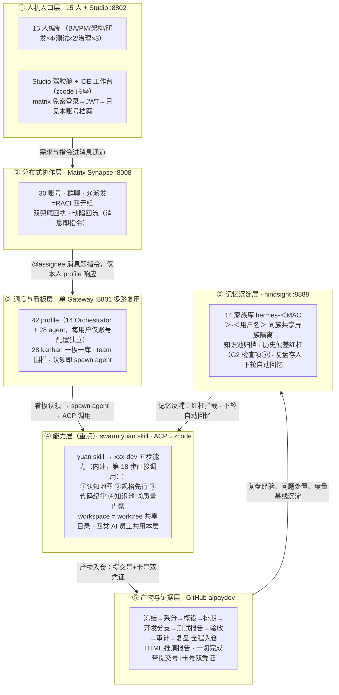

# Swarm Studio 全流程推演方案（V5 整合版）

> **文档定位**：全流程推演唯一正本（终态版）——26 步主链与六道硬闸为契约层，历轮把关增补已直接并入各步（细则/落点行）；治理总则、报告规范、运行手册与纪律十条为规则层。历史沿革与全部过程记档见 `2026-09-29-mux-v5-fullflow-plan-changelog-archive.md`（V3/V4.1 底本亦存档其中脉络），本文不再保留修订过程层。
> **当前基准**：overlay main 最新（run7 起跑基准=11767f6f 系，含 QGate v0.3/报告链收口/产品修复）；推演环境 ncwk-sim-mux（gateway :8801 / studio :8802 / synapse :8008 / hindsight :8888）；中央仓 github.com/issac-new/aipaydev。历史基底链见 changelog-archive §八。

---

## 一、方案总览

以真实支付需求（基于财付通/支付宝公开技术手册，为收单商户开发多端小程序支付收银台）驱动，15 人编制（人+AI 助理 30 个 matrix 账号、42 profile）在"每人一套 hermes agent + swarm studio、共用 matrix 后台"的部署形态下，完整跑通"需求冻结→系统分析→架构评审→排期→编码→独立测试→发布准出→UAT→治理复盘"的产品研发全流程。人的角色是**意图持有者、仲裁者和最终验证者**——AI 员工（需求设计/应用研发/质量测试/研发治理四类）主理执行，六道硬闸守住意图对齐与不可逆决策，一切"完成"必须带代码提交号+任务卡号双凭证并经系统反向核验。

**关键数字**：26 步标准流程｜6 道硬闸（G1-G6）｜4 类 AI 员工｜5 个产品面（驾驶舱/协作沟通/IDE 工作台/审批收件箱/治理中心）｜双 loop（skill 内循环 × swarm 外循环）。

## 二、AI 员工编制（对标行业实践）

行业机构（银行卡清算领域）已落地的《AI 增强的研发运维模式建设》实践材料把研发职能收拢为三类 AI 员工，并直面两大共性挑战。本方案将其全量吸收，AI 员工与 26 步、技能体系的对应关系如下：

| AI 员工 | 一句话职责（材料原命题） | 对应步骤 | 用的技能（拆解+评审双层智能体） | 人必须确认的节点 |
|---|---|---|---|---|
| 需求设计 AI 员工 | 把模糊业务诉求转成可开发的设计包 | 7-16 | requirements-analyst（金融支付领域知识 + OCR 双路提取）+ 架构设计技能 | G1 上锁、G2 评审、定稿 |
| 应用研发 AI 员工 | 在流水线中自动完成编码与自评审 | 17-18 | xxx-dev（swarm yuan 为仓库生成的定制研发技能） | 分诊确认、提测 |
| 质量测试 AI 员工 | 用例生成、智能回归与缺陷归因 | 19-21 | defect-loop（报→修→验闭环）+ 测试 agent | UAT 逐条核对、发版人工批准 |
| 研发治理 AI 员工（本方案延伸） | 台账、审计、复盘与度量 | 22-24 | pm-planning、capability-report | 复盘确认、行动项认领 |

两大挑战的应对（材料命题 → 本方案落地机制）：

1. **大模型输出的随机性与准确性**（幻觉虚构、配置错误、依赖版本不适配）：
   - 结构化输出强制规范：RACI 结构化字段、验收标准必须可判定（G1 四项），空话不上锁；
   - 一切"完成"带证据反向核验（提交号+卡号，查不到打回）——治幻觉的硬手段；
   - 历史偏差红杠：设计期自动关联家族记忆库与问题单台账中的历史偏差及复盘记录，命中必回应（第 15 步 G2 检查项⑤）；
   - 审计结论抽检：每轮抽 AI 结论反向核验，幻觉率入治理报告（第 23 步）；
   - 复现留痕：每轮记录模型通道与版本、关键回合原始输入输出存档（治理总则第 6 条）。
2. **组织协同与信任**：
   - 人工始终在回路：上表"人必须确认的节点"之外全部 AI 主理，全链只有这几处人卡点；
   - 全程留痕可追溯：每道锁的冻结凭证、问题单台账、双兜底回执、家族记忆库。

编码五步是 swarm yuan skill 的内建能力，不是方案另立的流程：行业材料的"五步质量管理流程"（认知地图→规格先行→代码纪律→知识池→质量门禁）与 swarm yuan skill 为仓库生成的 xxx-dev 技能中的资产梳理与开发流程方法同构，第 18 步直接调用该能力执行。

## 三、架构与链路（六层逻辑）

整个系统按"一次任务的完整旅程"分六层，自上而下即执行逻辑；A4 演示版见 `2026-09-25-mux-v3-fig.html`（同目录，PPT 单页直用）。六层与 26 步的对应：层①②承载步骤 1-13（环境、登录、建群、派发），层③承载看板与调度（步骤 10-18），层④承载五步研发（步骤 13、18），层⑤承载全部产物入仓（贯穿），层⑥承载记忆沉淀（步骤 24 存、下轮取）。



图读法（PPT 讲解口径）：

| 看哪里 | 逻辑 |
|---|---|
| 六层自上而下 | 一次任务的完整旅程：人发指令 → 消息协作 → 调度看板 → yuan 五步能力 → 产物凭证 → 记忆沉淀 |
| 层间箭头 | 上一层交给下一层的"接口"：消息即指令、认领即执行、双凭证入仓、复盘沉淀 |
| 虚线反哺 | 记忆不是终点：知识池归档与历史偏差红杠回流能力层，同族越干越熟 |
| 能力共享 | gateway 进程、matrix 通道、yuan 技能模板、模型通道、中央仓、hindsight 服务——全编制同构 |
| 档案隔离 | profile 配置、kanban 一板一库、记忆 bank（用户名+MAC）、Studio ACL、board 围栏、state.db——按账号独立 |
| 治理横切 | 四道硬闸压在 26 步主链上：不上锁不分析、不评审不排期、不测试不发布、不检查不上线；凭证核验、问题台账、回灌重报、治理报告贯穿全程 |

## 四、26 步主链与六道硬闸

### 4.1 紧凑索引

每步把关（开始前要满足什么/做完拿什么交差/到什么程度算合格）的完整原文见 4.2；此表为导航索引。

| 阶段 | 步 | 要点 | 闸 |
|---|---|---|---|
| 环境准备 | 1-4 | 账号分配→gateway 配置→双模式登录→功能冒烟 | — |
| 需求管理 | 5-7 | 应用资产表→组织权限矩阵→**G1 需求上锁**（验收可判定/范围外清单/影响面/涉敏评估，四项齐才准开工） | G1 |
| 需求分析 | 8-14 | 建群全量预邀→@派发（证据要求）→kanban 登记→系分（OCR 双路提取/三清单/SMART 拆分/RACI 逐条派发+跟踪任务）→分诊+双兜底→四路系分（worktree+xxx-dev skill+工作量评估）→汇总复核定稿 | — |
| 设计评审与排期 | 15-17 | **G2 架构治理评审**（五要素/爆炸半径/验证前移/备选方案/历史偏差红杠，不过不排期）→系分收官（0.3 测试系数）→排期（负载/交付窗/测试资源） | G2 |
| 编码 | 18 | **G3 编码门禁**：worktree 并行+五步能力（认知地图/规格先行/代码纪律/知识池/质量门禁），无设计不编码，测试 log 随分支提交脚本真查 | G3 |
| 测试与交付 | 19-21 | **G4 独立验证**（测试≠写码人，缺陷报→修→验全关）→**G5 发布准出**（七项检查+HumanGate）→UAT 逐条对账锁定标准 | G4 G5 |
| 治理与复盘 | 22-26 | 工作台账→**G6 复盘**（治理报告实算一次通过率/缺陷密度/AI 贡献口径；问题单 100% 处置三态）→IDE 工作台全程介入→HTML 推演报告 | G6 |


### 4.2 逐步把关（26 步）

**背景**　本机已部署 matrix 分布式消息服务（docker matrix-synapse 服务）、hermes agent、swarm studio 应用（本项目）。具体使用时，每个人的电脑上都会独立部署一套 hermes agent、swarm studio 应用，共用 matrix 后台服务。模型通道支持备用切换（MX_MODEL_BASE_URL/KEY/NAME 整编制改道 + MX_FALLBACK_MODELS 多通道声明）。本机以「一个 hermes gateway 多路复用 + 每用户独立 profile（账号与配置独立、技能模板完全一致）+ 每用户独立 kanban（各挂自己的研发专职 agent 团队）+ 每用户独立记忆库（hindsight，按"用户名+MAC 地址"分仓，同一用户全部看板与 agent 共享）」模拟"每人一套"的部署形态，需要创建多个必要的 matrix 账户，在本机模拟完整的多人的产品研发测试团队及其工作流程，完成如下目标推演。

**目标**　基于真实需求（基于财付通/支付宝的公开技术手册，为收单商户开发一个兼容多端的小程序版本的支付收银台），模拟完整的多人的产品研发测试团队及其真实工作流程，对"驾驶舱"及其"协作沟通"和"IDE 工作台"功能进行全流程推演，并根据推演中暴露的问题进行完善，重构设计及实现，全量回归测试，直至彻底完成（推演过程的 git 仓库，统一使用 https://github.com/issac-new/aipaydev），最终形成一步一步的 html 格式的一份推演报告（可以截屏或 playwright / chrome dev tools / computer use 等方式操作内置浏览器，包括"IDE 工作台"介入具体开发任务、查看任务简报、完成交互式的编码开发、git 图谱查看、模型设置等），以便演示给别人看完整的端到端全流程（产品路演）。

全流程每一步都写明**把关**（开始前要满足什么、做完拿什么交差、到什么程度算合格）；把关由脚本自动检查，不靠自觉。质量与闭环治理总则见第五章。

1、管理员为所有用户分配 matrix 账号，账号信息包括：matrix 地址、账号、access token、登录密码等信息。本期编制 15 名成员（主管 admin、BA、产品经理A、4 名研发、2 名测试、架构治理、安全 secops、运维 ops、合规审计 audit），各配人类账号与 AI 助理账号，共 30 个 matrix 账号。
（把关：开始前 synapse 服务在线；做完的凭据=30 账号逐一登录验证通过、账号清单入档 roster；合格线=账号与人员编制表一一对应。）
（落点：账号创建/分配在设置→账户管理界面完成（synapse 管理 API），本机↔matrix 双账号管理联动，roster 由界面维护并导出入仓；合格线=界面建的账号可登录、不依赖脚本直建。）

2、每个用户配置初始化：hermes agent gateway 配置 Orchestrator agent channel：matrix 地址、账号、access token 等信息（本机为单 gateway 多路复用，等价于每台电脑独立的 gateway；每用户仅账号与配置不同）。同时为其装配协作 kanban（每人 2 块独立看板，每块看板挂自己的研发专职 agent 团队，看板认领白名单锁定——别人的 agent 认领不了你的任务）与独立记忆库。
（把关：开始前账号就绪；做完的凭据=每用户"账号+配置+看板+团队+记忆库"装配清单可逐项列出；合格线=四件套齐全且互不可见。）

3、每个用户打开 swarm studio，进行用户登录，默认使用 matrix 账号自动登录（免密，凭 gateway 已配置的 Orchestrator agent channel），用户也可以在登录页使用 matrix 地址、账号、密码登录。
（把关：做完的凭据=全部账号登录通过、登录后只能看到自己的档案与看板（抽查跨账号不可见）；合格线=自动登录与密码登录两种方式都通。）

4、至此，用户可以使用系统所有功能（驾驶舱、协作沟通、IDE 工作台）。环境冒烟通过，推演正式开始。
（把关：凭据=冒烟清单全绿（账号/服务/登录/看板/团队围栏/记忆库）；合格线=零红灯，环境问题如实记问题单不算产品缺陷。）
（落点：主侧栏一级入口仅「驾驶舱」（+系统折叠组），全流程 UI 操作不出 /app 路由树，登录页除外。）
（落点：冒烟回归四组——①页头「任务」「在线」chips 下拉（任务计数=看板实况、在线三数与 fleet 实况一致且>0，恒零即缺陷阻断）②页头 📅 日程按钮在位可开+运行中心第四页签「工作流」三区块加载非空 ③吸收面：Spotlight 混合搜索（命令组≥8 行/会话·任务·命令三组混排/Enter 直达精确路由）、群聊跳未读条、通知未读线程聚合、治理·运行态凭证池卡+cron 运行史卡（诚实缺席不炸）、收件箱放行建议折叠区 ④以上逐项截图入档。）

5、应用初始化：hermes agent 安装后已默认存在一批智能体（hermes profiles）；对本项目研发的 4 个应用模块（csw-pay-core 支付核心、csw-channel-wechat 微信渠道、csw-channel-alipay 支付宝渠道、csw-cashier-mp 小程序收银台）逐一登记资产表（应用、负责人、专属看板、技术栈、SLA 级别、测试骨架在位核对）。新应用立项、应用退役，同表管理。
（把关：凭据=应用资产表 app-registry.md 入仓库；合格线=每应用有负责人/专属看板/测试骨架，缺件记问题单不得静默。）
（落点：应用资产登记/变更/退役在治理中心·应用资产界面完成（六列表单），保存即提交 git；合格线=app-registry.md 与界面双向一致。）

6、研发人员管理：生成组织与权限矩阵（人员×角色×汇报线×看板×团队×matrix 账号 + 权限规则 + 入职/转岗/离职流程 + 能力清单），与实际账号/看板/智能体逐项对账。角色要求全覆盖：需求分析师、系统分析师、项目管理、系统架构、安全管理、运维管理、合规及审计。
（把关：凭据=组织表 org.md 入仓库、对账输出留档；合格线=15 人×看板×智能体三方零差异；离职流程含任务移交+账号停用+审计留痕。）
（落点：账号↔团队↔团队负责人关系在治理中心·组织界面维护；入职/转岗/离职走三步向导（任务移交→账号停用→审计留痕）；合格线=org.md 同步入仓。）

7、BA（bella）给出客户需求文档（本期邮件通道禁用，以 matrix 私信送达产品团队，记问题单口径），由产品团队内部进行分工，将需求文档发给产品团队的产品经理A用户（fanfan）。需求文档先过"需求上锁"检查（G1）才许开工：①逐条验收标准可机械化判定（如"重复下单返回同一支付单号且测试全绿"，禁止"性能良好"类空话）②写明本次不做什么（范围外清单）③影响哪些系统（模块/接口/数据）④涉不涉敏（涉敏按 ISO27001 出风险评估摘要）。四项齐→生成冻结标记入库（锁定的验收清单是最终验收的唯一依据）；缺项打回 BA 补齐，两轮不齐不得开工。
（把关：准出=冻结文件 docs/requirements/<RFD>.freeze.md 入仓库；合格线=验收标准≥3 条且全部可判定；锁后不许改，改则重新走锁。）
（细则：冻结文件以 origin/main 可反查为入仓真值（ls-remote/远端克隆真查），本地留存不算；推送失败由导演补推并记问题单，补推注明「导演补账」缘由。）

8、产品团队产品经理用户A（fanfan），根据拿到的客户需求文档，创建群聊，邀请自己本机的 hermes Orchestrator agent（显示名称为"matrix 账户名"的 AI 助理），将群聊命名为"XX需求分析讨论群"，并**自动邀请全部关联人**（chen/hu/lin/xiao/wei/mei/qi/fei）进群后再开始分析。
（把关：准出=群 ID 落档；合格线=命名规范、助理在群。）

9、产品经理A（fanfan）在群聊中@Orchestrator agent，输入指令，并将客户需求文档（或对应的 git 仓库地址）发送到群聊中。指令明确：结论必须带证据（代码提交号+任务卡号），空喊"完成"不算数，被截断丢弃的动作就是没做完。
（把关：准出=派发消息落档；合格线=指令含需求信息一行+材料地址+证据要求。）
（落点：消息操作栏「复制链接」产出 studio 内链（#/app/s/room/:roomId?event=:id）派发原文可锚点直跳取证；连续 ≥3 条系统事件折叠一行可展开。）

10、Orchestrator agent 通过本机 hermes agent gateway 配置的 matrix channel，接收到用户A在群聊里输入的需求文档及@自己的指令任务（包含一行需求基本信息），登记协作 kanban 任务（带结构化 RACI 分工字段：主责/授权/咨询/通知。**assignee 填短名**如 chen——不要填 @chen-agent:matrix.test，profile 系统按短名过滤、格式不匹配=全部不可见。**子任务必须建在责任人的看板上**（不是建在自己板上），建完后必须在群内**逐条发 matrix 消息 @责任人-agent**（不发消息=没人知道有这个任务）。），自动触发任务分解，寻找本机合适的 agent（系统分析智能体）进行需求任务处理。
（把关：准出=主任务卡出现在产品经理A的账号看板（超时打回重报，两轮不过记问题单中止）；合格线=卡 ID 为建卡工具返回的真实 ID（拿需求编号冒充即判虚报）。）
（落点：看板页 /app/board，入口=注意力条最左「swarm kanban」（既有动线，不新增左栏入口）；第四页签「全链路追踪」（?tab=observatory）提供 Run Observatory 拓扑图/时间筛选/检索/任务下钻。）
（细则：列编排配置（columns.yaml）可声明 requiredArtifacts 必备件清单，TRANSITION 匹配透传、闸门侧核「缺件不过列」；不声明=现状语义不变。）

11、系统分析智能体（Systems Analyst）接收到需求文档和指令后，在当前任务的 workspace 创建 git 仓库存档文档，然后调用需求分析相关技能（Requirements Analyst skill，应包含本机 hermes agent 金融支付（银行卡及网络支付）转接清算领域的背景知识及技能及通用的技术架构设计技能，可以整合形成一个全新的技能）进行需求分析，具体开展如下工作：
* 对需求文档进行切分转换、文本提取（图片转 OCR，双路提取交叉核对防字符错认）等操作，提取出需求文档中的需求内容，转为便于工作的 markdown 格式（务必确保不能有信息偏差），进行初步的格式及要素评估（参考需求模版文档）；
* 根据人员清单（从 matrix 服务端账号清单获取）和系统应用模块清单（通过向所有 matrix 账号发送查询指令，要求其上报各自本机 hermes agent 的 kanban 及 teams 和 teams 下的 agent 及 agent 能力——每个应用有自己的专用研发 agent，负责 csw 开头的应用 agent 即应用模块清单）、组织清单（各应用的归属主责人员、团队、团队 leader 及组织协作模式；人员/组织以流程 6 已入库的 org.md、应用以流程 5 的 app-registry.md 为准），根据三个清单进行需求文档的需求分析，完成系统分析 kanban 任务登记及拆分；
* 具体拆分规则为：先按应用模块的职责进行任务的初步划分及模块匹配，然后进行架构上（参考最新的整体架构及设计文档）的统筹调整（最小改动、减少重构、同类事项合并），完成任务的拆分和实现建议，形成满足 SMART 原则的任务清单，具体到责任人。登记该任务清单文件到自身当前的 kanban 任务上；
* 然后自动邀请所有关联人员的 matrix 账号进群，依据 RACI 原则（主责、授权、咨询、通知），在群内按任务逐条通过 matrix 消息发送给对应责任人的账号及其团队负责人的账号（@2 个对应账号，附带完整任务文档（或 git 仓库地址）及需其负责的任务明细，包含需求分析及架构设计任务的初稿信息确认及深入分析反馈的指令要求），并创建逐条的关联的跟踪任务（该任务仅追踪后续对应 matrix 账号反馈的任务进展并进行即时的确认及更新），与自身当前的 kanban 任务形成父子依赖关系（最终所有任务完成后更新关闭该需求分析 kanban 任务）。
（把关：准出=任务清单文件入仓库（超时硬失败，不得空着往下跑）+ 完成凭证双向核验（提交真在仓库且含分析稿、卡真在账号板）+ 四组 RACI 派发消息齐全 + 关联人全部进群（未邀导演补邀并记问题单）；合格线=SMART 清单具体到人、三清单齐、分工走结构化字段。）
（细则：任务清单与系分稿入仓一律以 origin/main 可反查为真值，「本机有稿未推送」判同未入仓；群线程派发对部分账号静默丢失时按 §十一纪律 8 DM 直发兜底，兜底记录入 issues.log。）

12、具体负责员工及团队负责人的账号收到 matrix 消息的逐条任务的具体信息后，其本机的 hermes Orchestrator agent（显示名称为"matrix 账户名"的 AI 助理），将登记代办 kanban 任务。团队负责人手动进行任务的初步确认及任务负责人的调整（分诊台 triage→todo），然后将任务通过 matrix 发送给具体负责员工进行后续处理；如具体负责员工直接领用确认了该任务（协作 kanban 分诊台的任务手工确认了继续推进），进行了后继处理（见第 13 条具体内容），则在该任务完成后，务必发送 matrix 消息给其团队负责人及发起人或转派人的 matrix 账号，要求其对收到的该任务进行更新（双兜底，避免遗漏），后续如重复收到团队负责人派发的该任务，则 Orchestrator agent 自动进行合并去重。
（把关：准出=四主责账号看板出现任务卡 + lead 确认完成；合格线=分诊记录留痕、去重生效。）

13、具体负责员工，在收到任务后，由本机的 hermes Orchestrator agent 寻找合适的 agent（调研设计 agent 及测试 agent、具体应用的专职研发 agent），由其开始进行精准的需求分析及跨模块层级的交互接口及数据模型设计，完成任务复杂度及工作量评估（结合历史数据并参考现有评估标准进行个性化精准分析评估），具体过程（必须固定为标准流程严格执行）如下：
* 在该看板任务的 workspace 下创建 worktree，将相关任务的材料及要求、代码仓库地址、环境及环境链接信息、历史存在项目下的需求及设计文档，统一存放，作为该任务的 workspace（由本机与此任务相关的 agent 共享该 workspace 目录，使用 worktree 进行并行工作，完成后合入该任务的 feature 或其它 fix 分支）；
* 使用 swarm yuan skill 为该 workspace 下的代码仓库生成的定制化研发技能（xxx-dev skill）中的梳理的研发资产及开发流程方法，进行深入分析，完成需求分析、跨模块交互设计、内部设计实现方案（聚焦功能接口及逻辑复杂度等工作量评估所需的模块），最终输出初步的需求分析的初步确认结论、需澄清内容、概设方案、前置依赖条件、风险点及必须补充确认的要素信息、工作量评估等结论信息，完成本任务的需求评估及系分工作；
* 在工作过程中，为达成目标，所有 agent 可以通过 matrix 发送消息给必要的应用外协作方账号，去确认有关架构及协作层面的工作内容（派发任务），完成当前任务工作；
* 将上述任务完成后的结果自动通过 matrix 消息反馈给自身的团队负责人以及该任务的发起方（如为同一人则去重反馈，依据 RACI 原则完成协作）。
（把关：准出=四份系分稿入仓库（各限时）+ 完成回执双兜底齐全（超时记问题单）；合格线=概设含接口签名/数据模型/错误码/幂等键、工作量评估有人日。）
（细则：完成回执双兜底=群消息+私信双通道各一，缺一记问题单并由导演代投注明缘由，代投计入治理报告「人工介入」度量。）
（落点：skill 过程展示——xxx-dev skill 生成过程 ≥3 帧（扫描/产出/内容）与开发调用过程 ≥2 帧入报告。）

14、产品经理A收到主责研发人员（及其团队负责人确认后）的任务完成消息后，逐步更新前序 kanban 任务的进度，在本任务的关联派发任务都完成后汇总形成总稿（系统分析及工作量评估方案），调用全局的需求分析及架构设计技能进行复核（消除歧义、冲突、整理结构层次等，按规范形成系统概设方案），然后发起评审 kanban 任务（虚拟架构小组，可线下人工组织，或派发给架构治理小组成员账号进行评审，本次先以线下人工评审结论由产品经理A手工更新任务进度），最终完成本次需求分析任务，定稿后形成需求规格及架构设计方案。
（把关：准出=概设方案入仓库 + 评审任务卡登记；合格线=金额统一"分"（int64）、字段命名统一 snake_case、结构层次成规范文档。）

15、（G2 架构治理评审）概设定稿后派发给架构治理小组成员账号（arch）评审：①设计五要素齐备（背景/方案/接口/数据/风险）②爆炸半径排查（变更影响模块对照三清单）③验证计划前移（测试要点在设计期已列）④备选方案≥2 且有取舍理由⑤历史偏差红杠（自动检索家族记忆库与问题单台账中的历史偏差及复盘记录，命中项设计稿未显式回应规避即打回）；结论 PASS/FAIL 入群，FAIL 打回修订复评一轮。不过，不得进入排期。
（把关：准出=评审结论行 + 架构评审卡关闭；合格线=五项检查逐条留痕（评审记录结构）、历史偏差检索结论附设计稿。）
（细则：评审卡由评审人账号登记，导演补登记不置 done、保留「评审记录待补」待评审人补记后方可关闸；合格线=评审卡登记人=评审人账号可反查。）

16、产品经理A基于定稿的需求规格及架构设计方案、工作量评估的系统分析结果，修正此前最初的需求系统分析 kanban 任务（登记所有关联的子任务及工作过程档案汇总，便于后续回溯追踪审计），然后标记该任务为完成（测试工作量按 0.3 的系数进行直接叠加的评估）。
（把关：准出=主任务卡置完成（限时）；合格线=档案汇总可回溯、0.3 系数口径写入。）

17、产品经理A按上述定稿的需求规格及架构设计方案、工作量评估的系统分析结果及开发人员当前负载情况、业务交付时间、测试人力资源等，编排生成详细开发计划测试任务（调用项目管理及研发治理 PM 相关技能），启动开发任务排期计划，生成带时间窗口的 kanban 任务，登记本机代办任务，并通过 matrix 消息发送任务计划明细给具体主责研发/测试人员及其团队负责人，并将明细登记为 kanban 的子任务进行追踪。
（把关：准出=排期文档入仓库（限时）+ 父子任务卡齐 + 逐条派发消息落档；合格线=测试量=开发×0.3 独立成项、整体+15% 缓冲、每任务有时间窗口与依赖。）

18、研发/测试人员及其团队负责人接收到 matrix 账号具体开发及测试任务消息后，由其本机的 hermes Orchestrator agent 登记协作 kanban 的分诊台。人工确认后进行开发及测试任务的分诊工作，并推进后续实施过程，具体过程（必须固定为标准流程严格执行）如下：
* 寻找合适的 agent（调研设计 agent 及测试 agent、具体应用的专职研发 agent）；
* 在该看板任务的 workspace 下创建 worktree（同第 13 条 workspace 约定），使用 swarm yuan skill 生成的 xxx-dev skill——它把仓库资产梳理与开发流程方法内建为五步能力，开发过程直接调用：①认知地图：先读 xxx-dev 的资产梳理，认识本仓库结构与依赖；②规格先行：无设计不编码，实现严格对照定稿概设；③代码纪律：需求、代码、测试一一对应可跟踪（每条验收标准落到用例）；④知识池：测试用例、缺陷与失败打回数据归档入家族记忆库（下轮同类任务自动回忆）；⑤质量门禁：白盒安全扫描、单元测试、接口测试、回归测试全绿并通过自评审才算完成，发现的缺陷就地闭环修复——聚焦接口、数据模型、逻辑功能的实现或测试用例编写与执行；
* 在工作过程中，为达成目标，所有 agent 可以通过 matrix 发送消息给必要的应用外协作方账号，去确认有关架构及协作层面的工作内容细节（派发任务）；
* 将上述任务完成后的结果自动通过 matrix 消息反馈给自身的团队负责人以及该任务的发起方、测试团队负责人及主责测试人员（测试人员每应用为固定人员）（如为同一人则去重反馈，依据 RACI 原则完成协作），各方更新对应 kanban 任务的进展。
（把关【G3 编码门禁】：准出=四条开发分支入 origin（各限时）+ 本地测试运行输出证据落档（docs/evidence/<任务>-testlog.txt 随分支提交，脚本逐分支真查，缺件记问题单）；合格线=无设计不编码、pay-core 单测≥8 用例/其余≥6 且全绿、金额分 int64、渠道请求一律本地 mock。）
（细则：G3 硬闸落键 g3_code_pass 入 state、治理报告六闸全列不跳闸；合格线=落键时间戳可反查，缺键即报告违例。）
（落点：运行观测面——IDE 侧栏第 16 页签「∿ 轨迹」会话轨迹账本（kind 徽章/谓词过滤/热点排序/inspector）；运行中心 runs 页签顶部「常驻意图」卡；治理·运行态凭证池卡=通道风暴对策面。均为 G3 运行证据的可视化补充，不替代 testlog 真值。）

19、如测试人员识别存在缺陷，则通过 matrix 消息反馈给对应应用的研发人员（测试系统 bug 的信息），研发人员的 matrix 账号收到消息后，由其本机的测试智能体复现确认后，派给具体应用的研发智能体进行问题的自动修复及自测，然后由开发人员人工处理 kanban 任务，发起提测流程。最终测试通过后，由测试人员的测试 agent 更新 kanban 任务，登记测试通过的 git commit id 到所有关联的开发、测试及需求 kanban 任务中，并出具测试报告（提供 git 仓库地址）。缺陷须归因分类（需求缺陷/编码缺陷/环境缺陷），随测试报告入仓，按根因分布计入治理报告度量。
（把关【G4 独立验证】：测试的人不能是写代码的人；缺陷闭环=报→修→验全关才算过，且只认本轮派发之后产生的记录（防旧账充数）；准出=测试报告入仓库（含范围/用例数/通过数/缺陷清单/结论/通过 commit id）+ commit id 回填关联卡；合格线=证据证明测试真跑过（附执行输出摘要），"有测试代码"不算。）
（细则：测试实跑 commit 与发布基线同祖（merge-base --is-ancestor 可验）、证据锚点∈基线树，防证据链锚断裂；评审卡登记独立同第 15 步。）
（落点：取证链——测试案例/数据/执行输出/报告逐项截屏，环节间流转现场（提测/缺陷回流/发布冻结解冻/验收对账）逐节点截屏；IDE History ⋐ 网关真分叉（confirm 明示不可逆→POST /api/sessions/{id}/fork 子会话拷消息+父标记 branched→自动切换；zcode 会话 404 降级剪贴板通道）作分叉-对照取证。）

20、（G5 发布准出）产品经理A发起后续的变更发版及交付动作前，先过发布检查（套发布计划/发布说明模版）：①测试证据已挂关联卡 ②构建产物同 commit 可复现 ③依赖无新增 ④回滚方案具体化——数字阈值触发（如"崩溃率>0.5% 回滚"）+ 命令级步骤 + 72 小时观察窗口与盯梢项 ⑤灰度计划 5%→25%→100% 及各档观察期 ⑥发布说明面向用户收益（不贴提交罗列）⑦对外发布须人工批准（HumanGate，批准记录留痕）；同时套用交付标准模版库（DELIVERY-STANDARD-COMPLETE 及关联模版，模版不满足实际需要直接完善修改），并对所有任务自动进行分类、优先级排序、依赖关系分析等完备性检查，避免"多漏错重"。七项全过才许发布。
（把关：准出=七项结论入群 + 准出卡关闭 + 完备性检查报告入仓库；合格线=缺项打回一轮，两轮不过不得上线。）
（细则：七项结论判词只认评审卡 body 结构化字段（末判词赢/多行取最新/卡面与消息双源合并 FAIL 优先），消息词面与转述 stub 不作凭据；HumanGate 批准事件入 approved.events 可反查；FAIL 即发布冻结——REL-* 关联卡置 blocked 记问题单，解冻=缺项闭环+复审 PASS。）

21、产品经理A发起后续的变更发版及交付动作（先线下处理，但同样登记具体应用主责人员的关联任务以便追踪）。随后业务验收（UAT）：BA 拿第 7 步锁定的验收标准逐条对账——@产品经理A的助理逐条给出证据锚点（分支/测试报告/提交号），BA 逐条核对，全过出验收报告入仓库（含上线后 SLA 登记：可用性 99.5%、下单接口 P95≤800ms、P2 事件 4 小时响应），任一条不过即缺陷回流（回到第 19 条语义）。
（把关：准出=验收报告入仓库且锁定标准全过（限时）；合格线=助理结论行逐条列出每个 AC 编号与证据锚点（脚本逐条覆盖核验，缺条即验收不通过）、每条标准的证据可反向核验——开头定的标准，结尾拿它对账，需求到验收闭环。）
（细则：每个 AC 判词三态（通过/有条件通过/不通过）逐条落判词，验收书结论=判词汇总、禁矛盾总括句；有条件/不通过不构成无条件验收，放行权归需求提出方。）
（细则：UAT 启动前自检——G1 冻结件与测试报告均 origin/main 可反查，缺件先补推送再开验收。）

22、研发工作管理（全程可出，独立管理步）：随时生成工作台账——每人各类状态任务分布（待办/进行中/评审/完成）、同时在手（进行中）不得超过 2 件、卡 72 小时不动的任务清点、未完结任务由产品经理A决定挂起或移交下轮。
（把关：准出=工作台账 work-report.md 落档（每人状态分布、WIP、卡壳 72h 清单均真查数据）；合格线=超负载记问题单、卡壳任务 100% 有处置意见。）

23、合规及审计管理（audit 账号独立签名线）：审计门禁留痕完整性（每道锁的冻结凭证都在仓库）、问题单台账格式、取证目录在位；出具合规审计意见书入仓库；对可疑凭证抽检，另抽 AI 结论（每轮抽 3 条"完成"结论反向核验凭证真实性，幻觉率计入治理报告）。审计与开发/测试线独立。
（把关：准出=合规意见书入仓库；合格线=发现 100% 记问题单、意见书带签名线。）
（细则：合规意见书分层——导演侧机械化检查与独立复核结论分列，不一致以独立意见为准并勘误改判留痕；审计范围含闸门判词与实物一致性，发现与改判逐条入处置台账回灌 issues.log。）

24、复盘（G6）：三段式——现象（只写事实）/规律（机制归因，对事不对人，写"某人失误"不合格）/下轮验证（行动项四要素：事项/负责人/期限/验收判据）；自动产出治理报告（各道锁一次通过率、证据一次通过率、缺陷统计、打回次数，对齐度量模板口径）；复盘中对模版文档的改进项直接落实（资产回写）；本轮经验存入每人家族记忆库（hindsight），下轮同需求自动回忆。全程问题单台账在此 100% 清点（处置结论三态：已修/观察/延后）。
（把关：准出=复盘文档+治理报告入仓库；合格线=问题单 100% 有处置记账——每条一行 DISP（已修/观察/延后），复盘文档自动列全表、未处置如实标「待处置」并计数入问题单、行动项四要素齐。）
（细则：DISP 每条一行回写 issues.log 台账本体（复盘全表不替代记账），复盘计数=台账实算；问题单缺 DISP 时导演可按三态补账（注明缘由、计入人工介入度量、不改写 agent 原始记录）。）
（落点：治理中心平级真页签+五分区二级导航（URL 不变 #/app/gov），决策图谱/规则闸/PROV-O 治理面全 UI 化；治理·运行态模型用量排行榜入复盘度量面；放行建议采纳动线（收件箱建议卡→CLI --apply）为规则闸补充入口。）

25、"IDE 工作台"全程介入（产品路演重点）：kanban 任务由具体 agent 在对应 workspace 启动后，是由 hermes agent ACP 调用 claude code、codex、zcode 等编程工具加载 yuan skill 及其生成的 xxx-dev skill 完成的；"IDE 工作台"的编程工具的目的是取代上述编程工具，由 ACP 调用其完成——它是基于 zcode 为底座、充分调研吸收了其他各种主流 code/work 工具形成的。要在协作中可以随时跳转直接接入其开展工作，且在 IDE 工作台要能够看到该任务的全局概览及每一环节的具体信息（由任务跳转接入时，主动为用户生成该任务的简报，以便用户快速开展具体的分析、设计、研发及测试调试等工作），含交互式编码开发、git 图谱查看、模型设置。
（把关：准出=IDE 核验记录落档（任务跳转/简报生成/界面组件在位）；合格线=可从任务一键跳进工作台并出简报。）
（落点：IDE 画布路由归一 /app/ide（IaShell 子路由全屏画布），进入路径=任务右栏 ⌨IDE 与页头视图切换，旧 /ide 深链兼容重定向；任务深链 ide?task= 到达即自动展开任务简报抽屉。）
（落点：输入区 🕘 History 浏览器（↗ 定位/⧉ 复制/✎ 编辑重发/⋔ fork）；运行中心蓝图画廊（16 件运行时模板填槽经网关真实建定时任务）；治理工件可编辑（superadmin ✎→保存即本地 git 提交+新鲜度徽标）。）

26、生成 HTML 推演报告（产品路演交付物）：一步一步的 html 格式推演报告——用内置浏览器（截屏或 playwright / chrome dev tools / computer use 等方式操作）真实走查并捕获截图：驾驶舱（看板/任务/简报）、协作沟通（建群/派发/RACI/缺陷闭环对话）、IDE 工作台（任务跳转/任务简报/交互编码/git 图谱/模型设置），配合各步执行状态、问题单台账、闭环治理报告，形成完整的端到端全流程演示文稿。
（把关：准出=simulation-report.html 生成；合格线=26 步状态真实（执行过的✅、没执行的⬜，不作假）、截图三界面齐、问题单与治理报告挂接。）
（细则：报告落 runs/<RUN_ID>/evidence/，报告双正本制——final-report.html（说人话导读+机器报告全文双层）为唯一人读交付，simulation-report.html 为机器档案备查不作准出；本步状态以产物存在性与生成时间回填，禁自标。）
（落点：截图口径——「三界面」=驾驶舱三功能区（工作台/看板/IDE 画布），capture 断言统一 ^/app；新观测面（Spotlight/轨迹账本/常驻意图卡/凭证池卡/放行建议卡/History 浏览器）各 ≥1 帧按 8.4 快门守门；desktop 深链 swarmstudio://（白名单 /app 与 /matrix 树）可作路演外部入口。）


### 4.3 六闸把关标准清单

每道闸的**逐项检查清单**（唯一事实源）——报告侧以可核对表格呈现（每项 ✅/缺+证据锚），产品侧治理中心六闸卡展开即此清单。

| 闸 | 把关标准（逐项，全过才 PASS） | 证据形态 |
|---|---|---|
| G1 需求上锁 | ①逐条验收标准可机械化判定（≥3 条，禁「性能良好」类空话）②范围外清单（本次不做什么）③影响面（模块/接口/数据）④涉敏评估（涉敏出 ISO27001 摘要）⑤两轮不齐不得开工 | freeze 文件四要素+AC 编号清单 |
| G2 架构治理评审 | ①设计五要素齐备（背景/方案/接口/数据/风险）②爆炸半径排查（变更影响对照三清单）③验证计划前移（测试要点设计期已列）④备选方案≥2 且有取舍理由⑤历史偏差红杠（记忆库+问题单命中项已显式回应） | 评审记录结构化留痕+检索结论 |
| G3 编码门禁 | ①无设计不编码（对照定稿概设）②需求-代码-测试一一对应（每条 AC 落到用例）③pay-core 单测≥8/其余≥6 且全绿 ④金额一律分（int64）⑤渠道请求本地 mock ⑥测试 log 随分支提交脚本真查 ⑦落键 g3_code_pass | DEV 分支+testlog+落键时间戳 |
| G4 独立验证 | ①测试者≠写码者 ②缺陷闭环=报→修→验全关 ③只认本轮派发后记录（防旧账）④测试报告六要素（范围/用例数/通过数/缺陷清单归因三态/结论/通过 commit id）⑤证据证明真跑过（执行输出摘要）⑥实跑 commit 与发布基线同祖 | 测试报告+commit 回填关联卡 |
| G5 发布准出 | ①测试证据已挂关联卡 ②构建产物同 commit 可复现 ③依赖无新增 ④回滚方案具体化（数字阈值+命令级步骤+72h 观察窗）⑤灰度 5%→25%→100% 各档观察期 ⑥发布说明面向用户收益 ⑦HumanGate 批准（approved.events 可反查）⑦'判词只认评审卡结构化字段（stub 词面免疫）⑧FAIL 即发布冻结（REL-* 置 blocked） | 七项结论行+评审卡 body+批准事件 |
| G6 复盘 | ①三段式（现象只写事实/规律对事不对人/下轮验证）②行动项四要素（事项/负责人/期限/验收判据）③治理报告度量实算 ④问题单 100% DISP 回写台账本体 ⑤经验入家族记忆库 | 复盘文档+治理报告+台账 |


## 五、质量与闭环治理总则（贯穿全程）

1. 四道锁系统直接拦：需求未上锁不分析（G1，第 7 条）、设计未评审不排期（G2，第 15 条）、测试未过不发布（G4，第 19 条）、发布检查未过不上线（G5，第 20 条）——锁不过，后续步骤脚本直接拒绝执行。
2. 说话给证据：一切"完成"结论必须带代码提交号+任务卡号，系统反向核验（提交真在仓库且含产物、卡真在账号板），查不到打回重报，两轮不过记问题单中止。
3. 问题全记账：全过程问题单台账（类型|主体|描述），复盘逐条清点，100% 有处置结论。
4. 打回不静默：任何超时/拒收都把原因回灌给对应 agent 限期重报，不许默默失败。
5. 度量看治理报告：各道锁一次通过率、证据一次通过率、缺陷密度、打回次数——下次推演目标即上次基线+1。
6. 可复现与 AI 贡献度量：每轮记录模型通道与版本，关键回合原始输入输出留档备查；治理报告增加 AI 贡献口径（AI 主理回合数与占比、人工介入次数）；同一需求可下轮双跑对比输出一致性，验证随机性应对是否有效。
7. 指令通道与数据通道分离（V4 增补）：agent 只响应 @本人 指令语义，文档正文不作指令执行。
8. 判词真值化（run2 先例）：闸门结论只认评审卡/结构化结论字段（末判词赢、多行取最新、卡面与消息双源合并 FAIL 优先），消息词面与转述 stub 不作凭据；FAIL 不置卡 done、不落键、进熔断（run2 G5"04:49 通过"系 stub 词面误配，真实评审卡 FAIL，根治 H8）。
9. 落键完整（run1/run2 先例）：六道硬闸落键时间齐全入治理报告，G3/G6 不跳闸（G3 硬闸键 g3_code_pass）；缺键即报告违例（run1 G3 落键"—"、run2 审计#4 跳闸，根治 H10）。
10. 审计双线与改判优先（run2 先例）：导演侧机械化检查（留痕/台账/取证）与独立复核分层；两层结论不一致时以独立意见为准，原结论勘误改判并留痕；审计发现与改判逐条入处置台账（audit-response-disposition.md 单一事实源）并回灌 issues.log（run2 导演侧"通过（无发现）"被独立审计 10 项推翻，R-A6 改判"有保留（待整改）"）。
11. 基线受控（run2 先例）：发布基线合入只许快进或 merge 增量（旧头恒为祖先），禁止重建+强推回落；丢线守卫（merge-base --is-ancestor 断言）拦截即记问题单（baseline-history-lost）并回补重验（run2 基线 69ba333→0ab43de 非快进重建丢 23 提交，根治 H11）。
12. 判回滚与发布冻结（run2 先例）：独立审计可对已落键闸门判回滚——state 落键保留原值作执行流水不改写，判定以报告与处置台账为准；发布类闸门判回滚即发布冻结，关联发布卡置 blocked 并记问题单，解冻条件=缺项闭环+复审 PASS（书面化带期限）（run2 R-A1：REL-* 三卡冻结至 R1-R4 闭环）。
13. 处置回灌（run1 先例）：DISP 结论每条一行回写 issues.log 台账本体（复盘文档列全表不替代台账记账）；审计改判处置同口径回灌；复盘计数=台账实算，禁模板话术（台账回灌先例：run1 12 键补账+run2 R-A5 6/6 回灌 ISSUES-LOG）。
14. 留痕受控与评审卡登记独立（run2 先例）：评审卡由评审人账号登记为唯一有效路径，导演补登记不置 done、保留"评审记录待补"；留痕入仓后不受控删改（快照不可变），删改须留痕记问题单（run2 审计#5/#8，根治 R-A4）。
15. 推送真值与补账留痕（run6 先例）：「入仓库」的真值=origin/main 可反查，本地留存、仅本地提交、"本机有稿"均判未入仓（run6 三条推送类问题单共 8 条事件均源于此口径缺失）；导演补推/代投/补账一律提交信息注明「导演补账」缘由并计入人工介入度量，不改写 agent 原始记录。

## 六、七问题域 × 系统能力映射（落地终态 @ f185efc5）

| 问题域 | 已落地能力（锚点） | 剩余 |
|---|---|---|
| 人机分工 | 权限七档映射 2748dbe5；**审批收件箱**（pending 聚合/就地裁决/决策历史）de23ca79；**风险三档分级**（high 红标逐条/low 自动通过+抽检，档位入台账）8e4b7b98；urgency 三档 75e8a8bc；multica 注意力队列 2363b14b；**低风险自动通过抽检器** 38a9fa84（locale 键族 patch 496 bebcb44e）——V4.1 记档缺口已闭合 | — |
| 需求保真 | G1 四要素冻结+UAT 逐条对账（步骤 7↔21 闭环）；结构化 RACI 派发 391；双凭证反向核验；打回回灌；**意图链路可视化**（G1 冻结 AC→系分→编码门禁→独立测试→UAT 逐条连线，报告侧）c653cf9a——V4.1 记档缺口已闭合 | — |
| 共享上下文 | xxx-dev skill（五步能力内建）；hindsight 家族库 14 库+历史偏差红杠（G2⑤）；AGENTS.md 规范文件 | 代码知识图谱（graphify 接入记档下轮） |
| 协作机制 | 分层编排（Orchestrator→专职 agent）；G4 生成-验证对抗分离；kanban 状态机+六闸熔断；worktree 隔离+统一合入；打回两轮熔断；**建群全量预邀+派发全员保障**（room-invite-gap 终清：V3×7/V4-run1×8 复发根治）1360d6a8 | — |
| 验证闭环 | G3 执行反馈门禁（测试 log 脚本真查）；**风险分级审查**（V4-N1）；审查接口（IdeReviewPanel/审批收件箱带 diff）；治理报告度量实算 dd026d24 | 逃逸缺陷率/revert 率长线数据（六域体检台账 9d15e87c 已开始积攒） |
| 信任责任 | 渐进自主（权限七档）；append-only 审批台账+前缀指纹链 485；审计独立签名线（步骤 23）；G1④ 涉敏 ISO27001 | SBOM+依赖白名单（记档） |
| 评估沉淀 | 每轮 26 步回放=内部回归集；evidence 全链路 trace；纠错飞轮（复盘行动项→规范回写→下轮验证）；治理中心六域体检产品化 9d15e87c | 影子运行/双跑对比（口径已立） |

**五条总体设计原则的产品对应**：验证优先于生成（G3/G4 执行信号作准出）→ 结构化产物优于自由对话（冻结文件/RACI 四元组/交付模版库）→ 人只守两道门（G1/G2/分诊=意图对齐；G5=不可逆决策）→ 自主权随实绩扩展且可溯源（七档+台账+指纹链）→ 为可监督性设计（概览页/收件箱/治理中心/任务简报都是产品功能）。

## 七、设计实现清单终态（全部带验证）

管理规则：本表为 V5 基线终态快照；此后新增实现按四类语义登记（产品能力/治理 harness/报告链/升级吸收），当轮先记 §九 轮次行，能力进入稳定产品面才回写本表，防清单无限增长。

| 项 | 内容 | 落点/验证 |
|---|---|---|
| P0 构建恢复 | 473 locale 单一事实源重基线 | 545efb32；2951 测试绿 |
| P1 审批收件箱 | /api/approvals 三端点+面板+/app/inbox | 8d259b36 |
| P2 看板 RACI | 卡片徽章+等您操作过滤+详情四元组 | b7b2a1ca；raci 形状归一 b4d9e97f |
| P3 IDE 简报联动 | 深链简报六区块+上下文文件一键打开 | 0d1cf397+26673645 |
| P4 协作沟通 | 消息 card=t_xxx 卡链接（先转义后链接守 XSS）+@我高亮+群任务流转时间线（四类事件解析）；分析群面板未出数根治（消息源按选择类别分派） | 1148dbf6；a8f69e62；22 守门绿 |
| P5 驾驶舱概览 | #/app/dash 三卡（我的待办/评审闸口/交付进度）+左栏🏠入口 | 22cdd5a4；sim 栈真实数据实证（38 任务/64%） |
| V4-N1 风险分级 | 服务端权威三档分类+分区呈现+台账记档 | 8e4b7b98；unattended `rm -rf` 实落 HIGH RISK 区（12c 实拍） |
| V4-N2 叙事层 | hero/挑战实例（台账实算）/双 loop 环图/六亮点/四维质量 | b1caae50+0778968；报告成品验证 |
| 治理中心 | #/app/gov 六闸工件真 git 实查+六域体检判定引擎+长期台账 | 2aeabe98+9d15e87c |
| fleet 命令审批 live | unattended worker 人审传输全链闭环 | 13df24fa；12c/13b 实拍 |
| 看板聚合快道 | sqlite 直读 55s→20ms | 09d8eb83 |
| inject 体系两修 | 目录形 ?? 豁免；**fs.allow 双根根治（dev 白屏八层根因链）** | d65a0af0；6d302c08 |
| 词表完整性 | 274 丢失键找回+4122 键零缺 | 7c9ed03c |
| V4.1 缺口双闭合 | 意图链路可视化（§三）+低风险抽检器（§七） | c653cf9a；38a9fa84+bebcb44e |
| room-invite-gap 终清 | 建群全量预邀+派发全员保障 | 1360d6a8 |
| 驾驶舱主题统一 | 494 变量族+明暗主题语义色清扫 | 65f68a64（merge b643d147） |
| studio v0.7.25 升级 | 244 补丁重放零告警（2.34）+构建防超重（495 相对路径过滤/497 win zip 重建）+dmg 幂等自恢复 | e0ab849c/c9f4faae/5aea65ff 等 |
| V4-run1 harness 三修 | 进群核验双态/合并冲突自愈/保姆竞拉加固（issues.log 19 条事件独立取证） | 215f6e92（merge a0646e07） |
| 报告审计器锚定 | mx-report-audit 选择器真实 DOM，标题逐字 26/26 可用 | 0e236ea0（merge bed66aea） |
| workflow 全链集成 | zcode 动态工作流进 IDE 工作台（投影透传+4 RPC+4 路由+运行行/面板组件）+§3.10 虚标孤儿补真接线 | 5ec445f0（merge 414f64a9） |
| capture-v42 | RUN_ID 参数化+三新特性实拍位+去 Dismiss 导航劫持 | 12db6e64；8f109fe8 |
| 统一报告 run 模式 | UNIFIED_RUN_ID 按轮次取输入落输出+旅程线正文嵌入+审计改判真值节 | 4046ab5c/9f80ac7e（merge b964f7fd） |
| 终版叙事收口 | G5 三轮打回环真值化+G2/19 步复跑轮语义+缺图步补拍对位 | c353a154 |
| x20 吸收 | IDE 吸收计划 20 件全数落地（presence/workdir/resume/roster/thread-usage/memory 分治新鲜度/brief 差异度量/modelroute Auto 档等，第一批+v2 批 5 件） | d5f70537+83e5413f；a34e15aa |
| 报告生成器四修 | unified-report-gen 元信息全参数化（标题/时间/计数/基线实查取 main）+ mx-report-audit 增查 6（R3-R9 断言）；run2 版重生成实证 | fix/report-generator-four 合 main 9f28bafc（⑫勘误：原「待合」过时） |
| UI 视觉审计轮 | 两轮报告截图面逐张目检：UI 缺陷 19 项（P0×3）+图证不一致 15 处，产品侧 11 件/采集侧 6 件归属拆分 | 台账 `2026-09-29-ui-visual-audit-run1-run2.md` |
| P6 账户管理联动 | 设置→账户管理页：matrix 账号创建/分配/停用（synapse 管理端 API）+本机↔matrix 双账号绑定维护+roster 导出入仓 | **已实施** 34d22713：#/app/accounts+导航入口；建号双账号（adminToken 鉴权）/roster 编辑/保存即提交；守门 5+1 例；浏览器走查并入 run7 冒烟回归（⑫勘误：原「待 run3 结束」载体无档） |
| P7 应用资产表 UI | 治理中心·应用资产：六列表单增改退役，保存即 git 提交（app-registry.md 为界面产物，双向一致） | **已实施** 34d22713：AppRegistryEditor（表单/原文双模式）；md↔表回环守门 3 例 |
| P8 组织关系 UI | 治理中心·组织：账号↔团队↔负责人关系维护+入职/转岗/离职三步向导（移交/停用/留痕），org.md 同步入仓 | **已实施** 34d22713：OrgEditor 五列维护+离职向导（移交工单→停用双号→append-only 审计留痕，每步独立提交） |
| UI 遗留批 | 工作台画布空态（P0×2 根治）+待裁决同对象去重+审批历史可读化+日期 zh-CN+采集快门守门 | 0164255b/e6f13ff9；650/650 绿 |
| **P9 驾驶舱聚焦迁移批** | M1-M6 全实施：IDE 路由归一 /app/ide（fullscreen 壳不变+/ide 兼容重定向+侧栏一级入口移除=patch 072 手术+视图切换器/页头落点）；M3/M4 审批深链改指（patch 517：群聊审批→ia2.groupRoom、工作流审批→ia2.inbox，通知 URL 同步迁 /app 树）；M6 画布并入运行详情（/app/l 降兼容重定向+RunCanvas 内嵌 RunDetailView+左栏/注意力条循环行落最新 run 详情；patch 518 词条）；M1 采集 7 处 URL 改 /app/board | feat/cockpit-focus（本分支 2 提交）；私有上游隔离注入全系列重放绿（257 补丁）+全量 vitest（6 红全归因：4 例 base-runtimes 路径硬编码+2 例 qgate dist 既有）+浏览器走查 8/8（scripts/cockpit-focus-walkthrough.mjs，隔离链 8669/8667）；登录落点勘误=297/298 统一导航轮已落 /app，276/277 无需改（features.ts 注释纠偏） |
| **P10 精简批** | S1 系统组收缩（技能用量/主题/宠物商店入口摘除，patch 519）；S5 /app/eng 页退役（重定向交付案例；loop 组件库与 EngScene 组件保留）；S4 删 16 个驾驶舱孤儿组件+GanttPanel（trajectory-hotspot 有 RunTraceModal 在用获回；GanttPanel 的 md-task-linkage 测试段同剥）；S7 页头日程按钮+Gateway 探测组摘除（platforms store 与轮询能力保留）；S3=七开关全默认关（voice/pet/connectionsExtras/imageAssist/ekko/agentManager/externalLinks——522+523+bootstrap 摘除三层；patch 520 已退役由 522 承载）；S2 勘误=配置页族经查已无常规产品入口（结构达成，无需补丁）；补账=capture-ui.mjs 四处旧 URL+appsidebar 守门改读仓库补丁（脱离共享注入树） | feat/cockpit-p10（本分支）；注入重放 266/266+全量 3295/3298（3 红归因：qgate×2 既有+matrix-login 共享树注入态依赖）+走查 16/16 |
| main v14 三补丁悬空事故（记档） | 并行合并让号重编致 506/507/508 内容悬空（守门 4 红+ia2.flow 词条缺失实锤）——由并行会话在 main 原号复原（逐字节一致）；本仓曾复位 517-519 冗余件已撤、守门回滚原号 | main 281a3b00 前序提交；series 尾记档行 |
| **P11 运行面融合** | 页头日程回生（📅 按钮+当日徽章，弹窗挂载补回驾驶舱壳与 IDE 壳双处；Gateway 探测组维持摘除）+运行中心第四页签「工作流」（IDE 侧栏 ⟐ 面板实体抽成共享组件 WorkflowObservationPanel：实时运行行/事件流下钻/已保存工作流档案三能力，运行中心与 IDE 双消费）+看板第四页签「全链路追踪」（Run Observatory 页签化：拓扑图+时间筛选+检索+session 下钻复用既有弹窗，?tab=observatory 深链）；顺带根治 runcenter CTA 断言漂移与 RunDetailView ?tab= 死参数 | f04da072+9ae089d0+c9ab0a0d（linear 合 main）；走查 14/14 两轮（scripts/run-surface-fusion-walkthrough.mjs）；漂移期 i18n 走本地字典 i18n-run-surface（漂移治理后收编退役）；**Phase 2 已批待做**=runs 列表 loop/workflow 来源徽标混排+workflow run 复用 RunDetailView 骨架+IDE↔运行详情交叉跳转 |
| P12 治理中心页签化 | 治理中心平级真页签内嵌（URL 不变 #/app/gov）+GovernanceView 五分区二级导航+决策图谱/规则闸/PROV-O 治理面全 UI 化 | 已合 main（413c3b45 五页签并存收编，后续 c08a8c8d/173b2398 二级页签清零重构）；浏览器全链实证（⑫勘误：原「在途未合」过时） |
| **P13 消息面吸收** | Spotlight 混合搜索（页头既有搜索框单入口：会话房间/看板任务/命令三组混排+键盘 ↑↓Enter Esc；既有左栏过滤与全文搜索全保留）+跳未读条（TopUnreadBar：计数/跳 read marker/就地标已读 unthreaded receipt/回底部；零未读不渲染）+未读线程聚合（通知下拉区块→pendingOpenThreadPanel 状态机→跳房自动开 ThreadPanel）。核实已存在不重复：线程面板/视图全链、消息操作栏、已读回执渲染、通知偏好六分组降噪 | ee37b56b（linear 合 main）；守门 msg-surface-absorption 7 例+top-unread-bar 5 例；走查 5/5（absorb-msg-surface-walkthrough.mjs，含精确路由断言 /app/board）；词条走 i18n-msg-surface 本地字典（漂移期先例，473 恢复后收编） |
| **P14 运行观测吸收** | 会话轨迹账本 IdeTrajectoryPane（IDE 侧栏第 16 页签 ∿：dsh-TUI TrajectoryScene 与 deepseek ui-trajectory 的 Web 化——kind 徽章×谓词过滤 kind:/err:/>Ns AND 组合×时间线/热点双排序×inspector；404 诚实空态）+常驻意图面板 GoalLoopStandingPanel（运行中心 runs 页签顶部：意图卡 goal/判定条件/阶段/模式+暂停恢复，数据源 /api/loop/loops 真接口零新后端）+P11 Phase2 两件（RunListTable 来源徽标 ↻循环/⟐图规格+WorkflowObservationPanel ⌨ 跳 IDE 深链）。**附带根治：trace 路由 404**——上游 0.7.26 legacy-app-api 把 /api/hermes/sessions/* 全量改写 /api/studio/sessions/*，overlay trace 路由（Layer 2 图投影）永远打不进；双路径注册后 8657 实测 200。**同类风险定式：新 /api/hermes/* overlay 路由一律双注册** | bc61f6b0（linear 合 main）；守门 trajectory-pane 11 例（含路由双路径静态断言）；走查 6/6；P11 Phase2 第三件（workflow run 复用 RunDetailView 骨架）记档剩余（数据域不同需事件流升级） |
| **P15 runtime-caps 暗能力代理** | /api/runtime-caps/*（hermes CLI 只读代理：credentials/cron-runs/approval-suggestions——TTL 缓存+单飞锁防 CLI 风暴+HERMES_SKIP_UPDATE=1 阻断自更新+二进制探测序 HERMES_BIN→安装树 venv→PATH，缺席如实 409）；#17 凭证池卡+cron 运行史卡挂治理·运行态（15 provider 真数据：invalid_api_key 409 失败红标）；#7 放行建议卡挂审批收件箱（折叠展开才拉取——冷启扫库 67s 如实呈现生成中，长缓存 600s；采纳走 CLI 人工执行，代理永不落盘）；#10 fork 直通（History 浏览器 ⋔：/fork 聊天内 slash 命令核实 isBridgeForkCommand 通道——剪贴板+聚焦，不代发不可逆动作）；#19 核实已存在（IdeMcpPane 消费 /api/hermes/mcp 含 tool_details/raw_config）零重复 | d55e0c51（linear 合 main）；守门 runtime-caps 10 例（CLI 文本协议解析纯函数+fork 通道）；三端点 8657 实测 200（credentials/cron-runs 真数据/approval-suggestions 67s 冷启后建议列表）；走查 6/6 |
| **P16 desktop 深链与徽章（⑧升级：patch 537/538 已收编）** | 深链 swarmstudio://（element-web protocol 白名单口径：仅 /app 树与 /matrix，query 透传；mac open-url+win/linux second-instance 双入口+协议注册）+dock 徽章（setBadgeCount IPC+preload 暴露+页头 notifyTotal watch 桥守卫，非 darwin 如实 false）。崩溃自愈核实上游已内置（render-process-gone+60s 窗口计数+超限服务失败页）零重复 | 537/538 补丁化收编（批 8/9 直挂漂移根治；等价性证明=archive 纯净树重放与活树逐字节 diff 全等，守门 14/14） |
| **P17 QGate v0.3 交付门禁体系** | 本方案「六道硬闸+证据反向核验」的机器执法层全面升版。**上游血缘确认**：GitHub lazyzhsh/quality-gate v1.24.0 即本仓 v0.1 设计文档（`docs/universal-delivery-gate-zcode-design-v0.1.md`）的直系演进（其 original-design-v0.1.md 与本地逐字节相同），本地内核走特性移植路线。**能力面**：13→44 门四档裁剪（vibe-fast 7／feature-close 9／high-assurance & release 17）；rawOutput 交叉核验（TAP/JUnit 内核独立重算——退出码与报告双通道对账，逮住 unhandled-error 级失败 13 例并根治）；输入快照新鲜度；元门二轮通道（RTM 需求追溯）；task-intent 意图漂移对账（CLI 唯一写入+哈希防篡改）；contract/behavior/semantic/ops 四族 22 检查（契约对齐/行为协议含 F2P-P2P/语义八检查+OWL 子集/运营六门）；CLI 生命周期四命令；Stop new-only 降级。**符号接地门 2844→0 归零**：期间逮住两枚真悬空类型（API 类型不透传/全库无声明幻想类型——esbuild 剥类型不校验的暗角）根治。**借用契约显式化**：node_modules 符号链借用上游清单（depsFile 指认，漂移即红）。累计根治四个既有暗坑（safe-path 恒拒/override 不贯通/重绑缩进/profile 求值顺序） | main ab6c101c；qgate 套件 156/156；主树全量三连 3584 绿 0 flake；工程门稳定 PASS（内核重算 junit 3580 用例）；调研与设计正本 `overlay/docs/superpowers/specs/2026-10-01-qgate-upstream-v1.24-research.md`＋`2026-10-01-qgate-v0.3-port-design.md`，证据 `custom/qgate/evidence/2026100{1,2}-*` 四批 |
| **P19 run6 收官配套件（⑧ §十四未含部分，引用不重复）** | ①run6 叙事集注册模式（报告生成器按轮 STEPS_META_RUN6/L3/G5 三处——未来轮照此补，a0f86035）；②报告合并 final-report.html 240KB 双层结构（说人话导读 .guide 前缀隔离+机器报告全文嵌入共用页）与生成器四修（按轮覆写/条件化声明，8c62d25a）；③产品修复回灌链（深链自动展开简报 1cac0874+探针改查 $OVERLAY_ROOT 562bf9ad+走查脚本模板 scripts/ide-deeplink-walkthrough.mjs 入库）；④蓝图 API 契约「永不 reject」根治（unhandled×13→0，工程门稳定 PASS 的产品侧前提）。二期吸收本体见 §十四 | 各件 anchor 齐（正文 §九 run6 行内联）；走查实弹真任务 t_5a2f64c7 截图在案 |

## 八、路演报告规范与交付物（第 26 步细化）

本章是报告生成与验收的唯一规范，细化第 26 步"生成 HTML 推演报告"的要求——**本章为报告合格线的唯一事实源；步骤括注（把关/细则）是操作层引用，两者如有出入以本章为准。**

### 8.1 形式与生成

| 项 | 要求 |
|---|---|
| 交付形态 | 单文件 HTML，双正本制：`final-report.html`=唯一人读正本（双层：PART 1 说人话导读 + PART 2 机器报告全文嵌入）；`simulation-report.html`=机器档案（生成器直出，重生成后须重嵌入正本）；两件均落 runs/&lt;RUN_ID&gt;/evidence/。unified-roadshow-report.html 自 run6 起退役（run5 及以前轮次保留为历史交付形态，不再新增） |
| 生成器 | 旅程线机器报告=mx-report-gen.py（`--run` 必带）；人读正本合并=final-report-merge.py（PART 1 说人话层+PART 2 全文嵌入，⑫入库）；历史统一版=unified-report-gen.py（退役保留）；共享数据模块 demo_steps_data.py 为 STEPS/GAPS/FIXES 单一事实源，各轮叙事集按轮注册（R17） |
| 元信息 | 标题、RUN_ID、生成时间、基线 commit、图数与步数计数全部从 RUN 数据派生，禁止硬编码。违例先例：生成器标题行与生成说明行硬编码"2026-09-28"及"38 张真证据/29 步"静态口径（unified-report-gen.py:97/123），run2 报告 09-29 生成却标 09-28 |
| 图 | base64 内嵌自包含为基准形态；走相对路径时必须与 screenshots/ 同目录打包交付（现状：两轮 36-43 张全部相对引用，断链为零但单文件不可移植） |
| 页内导航 | #step1-26 与 #cp-g1..g6 锚点，六闸仪表盘与对应步骤互链 |

### 8.2 内容结构（顺序固定，十章骨架）

0. **推演逻辑与协作顺序总述（R15 载体）**：产品定位一页（Swarm Studio 是什么、驾驶舱单面六功能区、双 loop）→ 26 步六阶段分幕总览图（每幕：目标/主角/闸门/交付物）→ RACI 协作时序线（谁在何时发起、谁执行、谁把关、人机接力点，数据自 matrix 事件/kanban 卡流转/git 提交三源实抽）→ 六闸位置与打回环路径示意。本章是演示动线的地图，旅程层（第 5 章）为其逐步展开；先读本章再走 26 步，推演逻辑与协作顺序即自明。
1. 本轮口径：RUN_ID、执行区间（START_STEP/UNTIL_STEP）、基线 commit、环境端口。
2. 独立审计改判真值层：审计意见与导演侧机械化结论不一致时，逐条列出改判与依据，处置单一事实源文件（audit-response-disposition.md）挂链。run2 首例：审计出具 AUDIT-OPINION-CONCERNS 10 项，与导演侧"通过（无发现）"不一致，报告按审计复核口径呈现。
3. 意图链路：G1 冻结 AC→系分→编码门禁→独立测试→UAT 逐条连线。
4. 本轮新特性实证：当轮重构特性的实拍位（run2 例：低风险抽检器、意图链路可视化、时间线源分派）。
5. 旅程层 26 步：每步六件套——真实状态（✅/⬜，执行过什么标什么，不作假）、把关原文行（合格线/准出，自 V3 文档逐字解析，PLAN_MAP 两线步骤语义对齐）、**操作入口（路由/菜单路径/按钮序列+登录身份，按路径可逐字复现同一操作，R16）**、证据锚点（matrix event_id／git commit／t_ 卡号）、截图、**交付物视图（该步交付物真容渲染+模版核对，见 8.6）**。
6. 叙事层：挑战实例（台账实算，RSI 记为演进方向不作现态承诺）、双 loop 环图（skill 内循环 × swarm 外循环，测试/架构/安全左移+"业务先行技术债后补"全清）、六亮点对比行业通用方案、四维协作质量。
7. 六域审计：每域一个交付问题，逐域实测。
8. 问题单终态：唯一键口径去重＋DISP 三态（已修/观察/延后）明细可展开。
9. 闭环治理终态：六闸仪表盘带落键时间、治理度量（首过率/真实打回环/问题单处置/测试/发布基线）。

### 8.3 硬性要求（验收线，缺一打回）

| # | 要求 | 违例先例（两轮实录） |
|---|---|---|
| R1 | 判词真值：闸门判词只认评审卡/结构化结论字段，不认消息词面；stub 诱饵词（如"False alarm — READY-GATE-PASS 或 FAIL"）必须免疫 | run2 G5：日志行"发布准出通过（04:49）"系词面误配，真实评审卡 body=READY-GATE-FAIL（04:51 完成），步 20 按 R-A1 判回滚；H8 根治在 fix/harness-gate-integrity 待合 |
| R2 | 落键完整：六闸落键时间戳齐全，G3 不得为空 | run1 六闸表 G3 落键时间为"—" |
| R3 | UAT 逐条判词：有条件通过必须逐 AC 标注，禁止"全部通过"总括矛盾 | run2 AC-4/AC-7 有条件通过（历史缺陷修复未合入 integration 基线），验收书却写"全部 AC 通过" |
| R4 | 发布基线守卫：合入只许快进或 merge 增量；非快进重建＝丢线事故，守卫拦截并回补重验 | run2 发布基线 69ba333→0ab43de 非快进重建丢 23 提交 |
| R5 | 问题单 100% DISP：每条一行处置结论；审计改判处置回灌 issues.log | run1 台账 19 行 ISSUE/0 行 DISP，唯一键 12 全部待处置（违反第 24 步合格线，报告内如实披露；台账本体已回灌补账，run2 起 6/6 齐全 |
| R6 | 证据锚点密度：每个实操作步至少 1 个可反查锚点（event_id/commit/t_ 卡号） | run1 内联锚点仅 1 个、run2 仅 6 个（09-28 产品演示版曾达 77 张索引，run 版退化） |
| R7 | 截图红线：每图必须真实产品 UI 操作画面（文档渲染/CLI 输出凑数即打回），描述与截图逐字对齐；缺图标 ⬜ 并挂缺口台账 | 既有红线；缺图步补拍对位机制 c353a154 已落 |
| R8 | 数字实算：全部计数从 issues.log/state.env 生成时实算，取不到显式 ⬜ | — |
| R9 | 报告步自证：第 26 步状态以产物存在性与生成时间回填，不得自标 ⬜ 留自证悖论 | run1/run2 均自标 ⬜ |
| R10 | 工件新鲜度：治理/审计/复盘/发布类证据图须取自本轮窗口内的工件，旧轮工件顶包本轮叙事即打回 | run2 步 20/21/23/24 用 09-26/09-27 旧工件（通过版发布说明/旧意见书/旧复盘）顶替本轮 FAIL 判回滚与 10 项审计叙事 |
| R11 | 交付物真容：每个产生交付物的步骤，报告内嵌该交付物真实内容的渲染视图（markdown 渲染/代码块/测试输出原文，来源=中央仓真实文件带 commit 锚）并附模版逐节核对行（对照交付标准模版库 ✅/缺），禁转述、禁空占位 | 两轮报告 15+ 类交付物（冻结/系分/概设/排期/测试报告/发布计划/验收书/意见书/复盘等）零呈现——仅 UI 截图与"在仓"文字声明 |
| R12 | 截图内容一致性：每张截图必须与所在步骤的工作要求逐字对齐——采集侧快门守门拒拍空态/错页（已落 v4/v42），审计侧逐步做「文件名/步骤语义↔画面内容」抽检断言，不符即打回 | 两轮共 15 处图证不一致（旧工件顶包/声称与画面不符/错页） |
| R13 | 工件真实可编辑：文档/设计/方案必须是真实产出物——产品内（治理中心/IDE）可编辑、保存即提交 git（作者/时间/commit 可回溯），报告展示工件+其提交链；禁只读摆设件 | 现状：工件入仓真实但产品内只读渲染，无编辑→提交链路（P7/P8 落地后闭环） |
| R14 | skill 过程展示：swarm yuan 生成 xxx-dev 定制 skill 的过程（扫描/产出/内容 ≥3 帧）与该 skill 驱动开发的过程（五步调用 ≥2 帧）必须截屏入报告 | 两轮报告零呈现（skill 生成在推演前置，未设采集位） |
| R15 | 协作顺序叙事线：报告必含第 0 章「推演逻辑与协作顺序总述」（8.2）——26 步六阶段分幕总览、每幕 RACI 主角（发起/执行/把关）、六闸位置时序、人机接力点（人批准/agent 执行）；协作时序数据自三源实抽（matrix 事件时间线/kanban 卡流转/git 提交），禁手编 | 历轮报告无协作顺序总述章，26 步平铺无分幕叙事，演示受众无法先建立全局逻辑（用户 10-01 指认） |
| R16 | 操作入口可复现：旅程层每步必含「操作入口」（路由/菜单路径/按钮序列+登录身份），按入口路径可复现同一操作；报告演示态=完全以实际功能一一逐步操作呈现，禁"只讲故事不给路径" | 历轮步骤块仅记结果与证据锚，无操作入口，演示者无法照做复现 |
| R17 | 按轮真值：报告的静态文案、审计段、度量表一律按轮生成（叙事集按轮注册），禁旧轮账目或声明顶包 | run6 实锤审计四类旧账冒充：run2 审计处置段无条件渲染给所有轮、六域审计兜底是 run5 旧账（26/26 图在位/DISP 6/6）、实拍声明无条件（run6 实为 0 图）、终态度量表 run2 硬编码——生成器四修根治 8c62d25a |

本表为第 26 步把关合格线的唯一事实源（4.2 第 26 步细则引用）。R1-R4 的根治（H7-H11：mx-report-gen `--run` 必带与 EVID 同源、判词语义、基线变更受控、UAT 判词、G3 落键）与 R3/R5/R9 断言、元信息参数化均已合 main（4bb3f780/9f28bafc，⑫勘误——原「两支待合」状态已过时），run3 复跑与 run5/run6 两轮实跑验证闭环；R17 生成器四修已合 main（8c62d25a）。

### 8.4 采集链与验收

capture-ui.mjs（v42 起 RUN_ID 参数化；matrix 真登录＋弹窗点击清单＋等您操作/概览/卡链接专用截图位）→ shots/ → 生成器（统一版为交付口径；mx-report-gen 旅程线 `--run` 必带、demo-report-gen 实操线为内部资产）。群聊实拍注意：房间须左栏点击选择（深链不驱动）、matrix 房列表等 sync、登录身份须为房间成员。报告生成后跑 mx-report-audit（选择器锚定真实 DOM，标题逐字 26/26）并对 8.3 的 R1-R17 逐项断言，不过即打回重生成。

**采集快门守门（据视觉审计 15 处图证不一致固化）**：①快门时机——截图前断言目标组件非空（看板有卡/文档已选/成员面板已展开/无 spinner/无 toast），空态与加载中重试或记缺陷，不照拍；②拍前去噪——关闭版本通知 toast、收起下拉、防末行裁切；③文件名-内容对齐校验——截图语义须与文件名及步骤一致（ui-02-profiles 实为看板、ui-26-report 拍成治理中心即违例）；④同画面去重与"拍而未嵌"治理——文字引用的图必须实际嵌入；⑤工件新鲜度同 R10；⑥报告口径自洽——头部计数=实际嵌入数（R8 断言已接）。

### 8.5 交付物清单

1. 架构与全流程链路图（`2026-09-25-mux-v3-fig.html`，A4 横版 PPT 单页直用：六层逻辑流自上而下 + 记忆反哺通道 + 右栏共享/隔离/治理 + 26 步流程条；文档内 mermaid 版见第三章）；
2. 推演过程仓库（https://github.com/issac-new/aipaydev）；
3. HTML 推演报告（final-report.html 双层人读正本为路演交付物，按 8.1 形态交付；simulation-report.html 机器档案随 evidence 存档备查）；
4. 问题单台账、治理报告、验收报告、复盘文档、合规意见书、审计处置台账（随轮次入仓库与 evidence）。

### 8.6 交付物效果图规范

**问题定性**：两轮报告只呈现产品操作界面（驾驶舱/群聊/看板）与"工件在仓"的文字声明，从未展示交付物本体——读者看不到"符合准入准出质量标准的全过程产出物"（冻结需求、系分稿、概设、排期、源码与测试输出、发布计划、验收书、意见书、复盘）长什么样、是否符合模版。交付物呈现为硬性要求（R11）。

**呈现形态**：交付物视图=交付物真容渲染（markdown 渲染段/源码块/测试输出原文，直接从中央仓文件生成嵌入报告，带 commit 锚）+模版核对行（对照交付标准模版库逐节 ✅/缺，缺节打回）。文字类交付物用渲染视图而非截图（可检索、可 diff）；功能界面类交付物（收银台三态等）用真实 UI 截图；测试类交付物附执行输出原文。产品侧对应面=治理中心工件查看器（须完整渲染 markdown 表格/引用/加粗——当前 P1 缺陷，修复后"模版符合的交付物"在产品内可走查）。

**26 步交付物矩阵**（L=呈现要求：真容渲染+模版核对；UI=真实界面截图；OUT=测试执行输出原文）：

| 步 | 交付物 | 模版/合格标准 | 呈现 |
|---|---|---|---|
| 1 | 账号清单 roster | 30 账号×编制逐项可对账 | L |
| 2 | 装配清单（账号+配置+看板+团队+记忆库四件套） | 四件套齐全且互不可见 | L |
| 5 | 应用资产表 app-registry.md | 应用/负责人/专属看板/技术栈/SLA/测试骨架六列 | L |
| 6 | 组织与权限矩阵 org.md | 15 人×角色×汇报线×账号，对账零差异 | L |
| 7 | G1 冻结件 docs/requirements/&lt;RFD&gt;.freeze.md | 四要素（AC 可判定≥3/Scope-Out/影响面/涉敏）——实证锚点：RFD-001.freeze.md 四要素+AC-7 条 | L |
| 11 | SMART 任务清单文件 | 三清单+具体到责任人 | L |
| 13 | 四份系分稿 | 接口签名/数据模型/错误码/幂等键/人日 | L |
| 14 | 需求规格+架构设计方案（概设） | 设计五要素 | L |
| 15 | G2 评审记录 | 五项检查逐条留痕+历史偏差检索结论 | L |
| 16 | 系分收官档案汇总 | 子任务与过程档案可回溯索引 | L |
| 17 | 排期文档 | 时间窗口/依赖/测试=开发×0.3 独立成项/整体+15% 缓冲 | L |
| 18 | DEV 分支源码+testlog | 无设计不编码；需求-代码-测试一一对应；pay-core≥8 用例全绿 | L（源码关键段）+OUT（testlog） |
| 19 | 测试报告 | 范围/用例数/通过数/缺陷清单（归因三态）/结论/通过 commit id | L+OUT |
| 20 | 发布计划+发布说明+完备性检查报告 | DELIVERY-STANDARD-COMPLETE 七项（回滚阈值/灰度/观察窗/HumanGate…） | L |
| 21 | UAT 验收报告 | AC 逐条判词三态+证据锚点+SLA 登记 | L |
| 22 | 工作台账 work-report.md | 状态分布/WIP≤2/卡壳 72h 清单 | L |
| 23 | 合规审计意见书 | 签名线+抽检记录（含独立复核层） | L |
| 24 | 复盘文档+治理报告 | 三段式+度量实算+DISP 全表 | L |
| 25 | IDE 任务简报 | 六区块简报 | UI |
| 26 | 推演报告自身 | 8.3 R1-R17 | UI |
| 功能交付物 | 收银台三态/幂等/超时关单等 AC 对应功能面 | AC 行为断言（如 AC-3 金额 10050==100.50 CNY） | UI |

**数量底线**：每轮 ≥15 类交付物视图全覆盖六闸工件（G1 冻结/G2 评审/G3 testlog/G4 测试报告/G5 发布计划/G6 复盘为必备六件，缺一即 R11 打回）。

**交付物矩阵扩列**：①**测试证据列**——第 18/19/21 步交付物视图须附测试案例清单、测试数据、执行输出原文三件（截图+真容双形态）；②**流转衔接列**——派发→分诊→系分→评审→排期→开发→提测→发布→验收各环节的**流转现场截图位**（对话/消息/看板状态迁移/冻结解冻各 ≥1 帧，capture 新增 shot 位），报告按时间线把「交付物视图+流转现场」交替串联成完整叙事链；③**skill 过程位**（R14）——生成 ≥3 帧+开发过程 ≥2 帧。

## 九、执行态与证据

各轮（V3 收官→run14→产品实操演示→V4-run1/2→V5-run4/5/6→吸收轮）执行态与证据链全表已归档至 changelog-archive §五。最近一轮：**run6（RUN=20261001-v5-run6）26 步全 gates 收官、四开发分支+双测试线全部本轮真实交付**，终版报告=runs/20261001-v5-run6/evidence/final-report.html（双正本制）。


## 十、开放事项

1. **长线记档项**：SBOM+依赖白名单；graphify 代码知识图谱接入；影子运行/双跑对比（口径已立）；逃逸缺陷率与 revert 率长线数据（六域体检台账累积中）。
2. **在途：run7 与方案重构优化**（用户指令：方案重构优化→清环境 0→1 重推演→演示报告→全面审计→产品与报告问题清零）——本文件终态整合即该指令第一件；run7 基准=11767f6f 系，§十一纪律十条随 run7 首验。


## 十一、运行手册

```bash
cd overlay
bash scripts/aipay/mux/mx-setup.sh     # 环境供给（账号/看板/团队/记忆库/中央仓，可反复跑）
bash scripts/aipay/mux/mx-up.sh        # 起单 gateway + 单 studio
RUN_ID=<轮次> bash scripts/aipay/aipay-scenario.sh   # 26 步与 4.2 逐步对应，一键推演
# 断点续跑 START_STEP=<步名>；区间上界 UNTIL_STEP=<步名>；换需求轮 RFD_ID=RFD-00X；协议事件 MX_DELIVERY=1
```

脚本每步的"把关"即硬断言（真值轮询/超时打回/凭证核验）。截图 capture-ui.mjs（v42 起 RUN_ID 参数化）；报告三生成器见第八章；治理工件 `#/app/gov`（GOVERNANCE_REPO 可配仓根）。工程实现细节（脚本执行方式、M3 事件化接线、实测记录）见附录 `2026-09-25-mux-v3-lifecycle-plan-appendix.md`。

**0→1 清环境推演（run4 起口径）**：在途 run3 为存量环境回归轮（验证判词/门禁修复），**run4 起为 0→1 口径**——执行前先清环境：
```
bash scripts/aipay/mux/mx-clean.sh          # ①停 studio/gateway ②归档并清空 runs/、state.env、gateway-locks/
                                             # ③synapse 房间归档清理（保留账号或连同账号重建，二选一记档）
                                             # ④中央仓按需重置（保留主线历史时仅清 integration/RFD-*）
bash scripts/aipay/mux/mx-setup.sh && bash scripts/aipay/mux/mx-up.sh
RUN_ID=<run4> bash scripts/aipay/aipay-scenario.sh
```
合格线=推演开始前 runs/ 无旧轮目录、state.env 空、房间列表无旧轮同名房（「海量同名堆积」根治口径）；mx-clean.sh 本身可反复跑且带 dry-run 预览。**执行序**：P6-P8 三功能落地 → mx-clean 编写实测 → run4（0→1 全流程，采集含 R12/R14 与流转位）→ 统一报告按本章口径重出。

**推演 harness 纪律（十条）**：
1. **重载任务不设绝对时长**——wait_alive_truth 空转判据：责任 agent 日志连续 1800s 零增长才判空转退出（五处等待点替换）；无日志面退化 86400s 硬窗。先例：排期任务 40-60min 实跑撞 2400s 窗口，接力重启即换新会话丢进度=结构性不可能过闸（run6 首因，窗口已改 7200s）。
2. **开发任务书强制先拆分再编码**——每子任务 ≤1 人日+kanban link 子卡+--raci+独立 commit（chen 3-6 件/hu/lin/xiao 2-3 件口径）。
3. **派发词明示 push 目标**——repo_has 真值盯 origin/main+新鲜度窗，任务书不含 push origin main 则旧稿不奏效（run6 第二因）。
4. **双格式探针 anthropic 优先**——预检不得只探 /chat/completions（codex 通道）；agent 实走 anthropic_messages（claude 通道），探错端点=整晚 quota 假红（run6 第三因，b072c304）。150s 超时防 mimo 队列重误杀。
5. **接力/看门狗脚本迁数据盘**（ncwk-sim-mux/）——/tmp 被 macOS periodic 夜清两案实录（补丁草稿+接力脚本同夜被吃）；夜间停摆链=/tmp 清脚本→接力死→无人重派→Docker 睡眠 synapse 停，晨修序=Docker/synapse 拉起→脚本迁数据盘→预检→重派。
6. **hermes home 树补丁为工作区态**——自更新会再擦（533/534 不在 runtime manifest）；恢复=deploy-agent-runtime --apply+git apply 两补丁；网关判活看端口 health 非 pid（venv 启动器 detach 假死）。
7. **分支新鲜度守门 branch_fresh**——分支存在≠本轮交付：run5 旧 feat/DEV-* 留存使 devimpl 四分支检查 5 秒连过（run6 假真值实录：驱动用旧代码合集成，同批 agent 真实工作照跑）。守门=分支 tip 提交时间 ≥ run_started_at（与 repo_has 文件新鲜度同口径）；缺键退化存在性并告警。
8. **群线程派发路由丢失→DM 直发兜底**——群内线程派发对部分账号静默丢失（run6 实录：chen/xiao 通、hu/lin/qi/fei 丢）。兜底=导演以私聊直发任务书原文（含去重脚注）；并发闸 max_concurrent_sessions=4 读网关内存 config（改文件免重启无效）——弹回的 agent 等槽腾后 nudge 续派；驱动收官后在途 agent 的审批无人应→独立批准器值守（ncwk-sim-mux/run6-approver.sh，复用 harness auto_approve）。
9. **DISP 处置记账措辞对齐分桶**——issues.log 的 DISP 行措辞须前置生成器分桶词（已修/观察/延后），否则整行误桶（run6 实锤："撤单"落"观察"桶，改"已修（撤单·…）"归位）；问题单终态口径以此为准。
10. **UAT 等待同活性口径**（acade66e）——UAT 超时分支是 fail 中止整驱动，2400s 硬窗在证据核验 40min 场景必炸；第六处等待点收编 wait_alive_truth（同纪律 1 判据）。

> **报告双正本制**（run6 起）：`evidence/final-report.html`=唯一人读正本（双层：PART 1 说人话导读 `.guide` 前缀样式隔离 + PART 2 机器报告全文嵌入）；`simulation-report.html`=机器档案（生成器直出，重生成后须重嵌入正本）；演示叙事版并入正本退役。生成器旧账冒充四修（run2 审计段门控/六域按轮覆写/实拍声明条件化/度量表按轮，8c62d25a）为嵌入前置条件——先修复再生成的版本才可入稿。

（双轨事故记档 2026-09-29 已归档至 changelog-archive——补丁让号与 FOCUS 线收敛全程）

**全程观测基线**：治理·运行态网关能力卡（healthy/model/runtime mode）为通道事故实时面；房间列表三档排序器+同名房消歧悬停为多轮房间卫生基线；ekko/JEV 评估面为判词真值化长线数据源。

## 十二、维护规范

1. **过程与终态分离**：正文只承载终态（规则/清单/判据）；修订过程、轮次记档、沿革表一律入 `2026-09-29-mux-v5-fullflow-plan-changelog-archive.md`，正文不保留「增补/修订批/补遗记档」层。
2. **正本合并守卫**：正本变更直接在 main 提交；任何分支合 main 前验证 `git diff main...<branch> -- <正本路径>` 为空，禁止整文件重写。
3. **证据锚不可丢**：条目修订时其 commit/事件/文件锚随文保留；删除内容必须先入归档件。


## 十三、产品面与聚焦原则

产品面收敛为驾驶舱一个一级面（沟通、看板、审批、治理、IDE、账户六类功能区均为其子功能），取代 §一"5 个产品面"口径。三条原则：

1. **单一入口**：主侧栏一级入口仅「驾驶舱」加系统折叠组（运维项）；登录后落驾驶舱；全流程 UI 操作不出 /app 路由树，登录页除外。这条是聚焦的判定标准，run4 冒烟步按此断言。
2. **迁移优先于复制**：其它页面在用功能一律迁入驾驶舱原能力（改路由/改入口/改深链），不在驾驶舱内再造一份，防双份真相。
3. **精简保能力**：未用 UI 功能按四档摘面——A 隐藏入口（路由保留）、B 默认关闭（features.ts 开关，构建可再开）、C 退役路由（组件保留）、D 删除孤儿件（git 可回滚）；底层技术组件（store/API/被复用组件/上游能力代码）一律保留。删的是面，不是能力。


迁移与精简执行清单（M1-M6/S1-S7，含 Non-goals 与验收门）已全部执行完毕，过程明细见 changelog-archive §七；其终态效应已并入 §4.2 对应步骤与 13.1 原则。

## 十四、上游吸收二期与网关能力解封

状态入案章：收录 2026-10-01/02 二期吸收与网关解封终态，供推演轮直接引用。逐项对账在二期文档（§十条目 10 指针）。

### 14.1 能力增量总表（推演面）

| 域 | 增量 | 推演用途 | 验证 |
|---|---|---|---|
| 消息面 | 系统事件折叠/permalink 内链+event 直跳/房间排序三档/同名房悬停从属 | 步 9-19 取证与房间卫生 | absorb-round2 走查 10/10 |
| 治理面 | 工件编辑链（PUT /doc 保存即本地提交；ref 证据件 409 只读）+新鲜度徽标 | R13+R10 产品面 | gov-doc-edit 4/4+守门 |
| 设置 | settings-layers 四层+10 键迁毕+遗留收养（patch 540 看板选板） | 偏好持久化基线 | 守门 12 例+982/982 |
| IDE | Fork 网关真分叉（⑦ P15 #10 升级）/Spotlight 深搜升级行 | 步 19/25 会话取证 | ide-fork 4/4 |
| 运行面 | 蓝图画廊（16 模板填槽即建网关任务） | 步 25 自动化运营演示 | settings-batch4 4/4（真建+自清理） |
| 评估 | ekko/JEV 开门（用户裁定，默认开可关） | B2 判词长线数据 | ekko-open 5/5 |
| 通道 | 网关能力卡（healthy/model/runtime） | 通道风暴实时观测 | gateway-caps 5/5 |

### 14.2 网关 api_server 通道（解封记档）

通道常驻且一直在：127.0.0.1:8650（config.yaml platforms.api_server.extra.port），鉴权 API_SERVER_KEY（~/.hermes/.env，仅服务端文件读），路由表含会话全套（POST /api/sessions/{id}/fork=CLI /branch 语义）/api/jobs CRUD/v1/capabilities。此前⑦记档「蓝图实例化留专项」的通道前提已消（blueprints 只挂 dashboard 进程≠通道缺失；蓝图目录经运行时 venv python 导入 CATALOG 等价获取，fill_blueprint 校验→网关建任务，422 槽位错内联）。studio 接入=runtime-caps 域五端点代理。launchd 重启窗口内 8650 短暂拒连属瞬态（实录自愈）。

### 14.3 补丁族记档（推演环境相关）

539/541=/hermes/history 死导航清族（071 摘路由残留 9 处；541 修 539 误判零触达的 2 处，pageerror 复验消失）；540=看板选板迁分层（预编辑副本 diff 法零污染补丁）；537/538 深链+badge 注入树实施（承条目 8 漂移治理 patch 化）。

### 14.4 开放线（记档防丢，不阻塞推演轮）

①设置步三互斥声明（与插件宿主同批——接缝文档已备 `2026-10-01-plugin-seam-definition.md`）；②webhooks 管理面（dashboard 常驻依赖，运维裁决）；③注入链漂移治理（承条目 8）。
