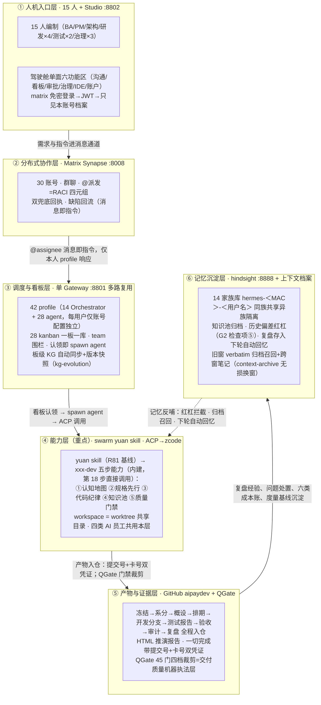

# Swarm Studio 全流程推演方案（V7 整合版）

> **文档定位**：全流程推演唯一正本（V7 运行韧性版）——承 V6 终态版全部契约层（26 步主链/六道硬闸/治理总则 1-15 条/报告规范/推演纪律），本轮增量专注**运行韧性与容量规划**（run7 报告实锤的方案层八缺口）。历史沿革见 changelog-archive（V3-V5）与 V6 正本（2026-10-02-mux-v6-fullflow-plan.md）。
> **当前基准**：overlay main 67c3e857 系（run7 收官+全功能回归三会话修复线+UX 复盘批）。run7（RUN=20261002-v5-run7）已收官：26 步/六闸/UAT 判词 7/7 全绿。推演环境 ncwk-sim-mux 已完成 0→1 备场（2026-10-03：mx-clean 全旗标清理+残留二连清零，gateway :8801 / studio :8802 / synapse :8008 / hindsight :8888 待起跑）；中央仓 github.com/issac-new/aipaydev（远端仅剩 main，九目录零文件）。
> **V6→V7 修订要点**（输入=2026-10-03-v6-plan-issue-analysis-from-run7-report.md，八缺口各带 run7 实锤锚）：①§四新增并发预算与容量守卫（P1）；②§十一环境重置合格线扩三面+总则 artifact_fresh（P2）；③总则 16 驱动韧性（P3）；④§十二会话断裂恢复+观测面语义（P4/P6）；⑤总则 17 完成凭证一体化（P5）；⑥附录 B 补丁收编纪律（P7）；⑦§五步 10 判据窗口改写（P8）。
> **V7.1 回归回灌修订**（2026-10-03，输入=四会话全功能回归 e4e4e183/33f0a7ff/8d8e44ff/0d24c88b+run8 备场清环境轮）：①§十二 0→1 段重写为 mx-clean 六旗标终态（--reset-central/--reset-workspaces/--reset-memory/房间 v2 purge/hermes 运行态清零）+起跑环境前置四条；②纪律 6 改 533/534 三通道自愈收编终态、纪律 13 除旧；③§9.4 快门守门⑦ IAB 冻结假象；④§12.x 观测面补在线面板计数语义；⑤§十一.4 回归轮遗留五项；⑥§14.3（现附录 A.3）回归轮补丁族（524 补遗/539 补遗+551/547/548-553 族）；⑦附录 B.6 注入链纪律五条。契约层（26 步/六闸/总则 1-18）零改写。
> **V7.2 说人话与全量呈现修订**（2026-10-03，用户三指令）：①§一重写为说人话总览（干什么/怎么干/干完得到什么）；②§2.1 能力表去 patch 锚（锚集中附录 A），正文讲用户可感知能力；③新增 §5.0 功能效果清单（业务/质量/交付/呈现四层，先看结果再看流程）；④新增 §5.4 各环节交付物与模板规范（14 环节字段级，缺字段即打回的唯一依据）；⑤§9.2 旅程层强化+**R18 全量呈现不裁剪**新验收线（对话收全文/操作前后帧/环节效果实证/交付物真容/报告自包含——自下轮起强制，生成器配套起跑前落位）；⑥§十四/十五 改制附录 A/B（工程内部机制与交付叙事分离）。契约层依旧零改写。
> **V7.3 附录 C 分树隔离**（2026-10-03 隔离轮）：新增附录 C——推演 harness 分树独立仓（simharness，subtree split 自 scripts/aipay 后删除）、执行面三参自持（快照+hermes-sim wrapper -I 语义）、快照语义（工作态/node_modules 镜像）、D3 覆盖事故防复发四件（模板入库/manifest 23 件/marker 扫描面/bak 恢复源）、mx-up 验收基线。契约层零改写。

---

## 一、方案总览（说人话版）

**这轮推演在干什么**：一家"软件公司"接到一张真实需求单——为连锁门店的收单商户做一个**小程序支付收银台**（依据财付通/支付宝公开技术手册，兼容微信与支付宝两个渠道）。这家公司 15 个人：1 名主管、1 名需求分析师（BA）、1 名产品经理、4 名研发、2 名测试，加上架构治理、安全、运维、合规审计各 1 名；**每人身边配一个 AI 助理**，干活的执行细节大多由 AI 员工主理，人负责提意图、做仲裁、做最终验证。全公司没有一间办公室：沟通在 Matrix 聊天里，任务在看板上，审批在审批收件箱里，度量在治理中心里，编码在 IDE 工作台里。

**怎么干活**：需求像真实公司一样流转，一步不跳——**需求冻结 → 系统分析 → 架构评审 → 排期 → 编码 → 独立测试 → 发布准出 → UAT 验收 → 治理复盘**，共 26 步。六个关口（G1-G6）守住不可逆决策：需求没锁死不许开工、设计没评审不许排期、测试没过不许发布、验收不过不许上线。每个"完成"都必须拿出双凭证（代码提交号 + 任务卡号），系统反向核验——查不到就是没做完，打回重报。

**干完后用户得到什么**（详见 §5.0 功能效果清单）：四个真实可运行的应用模块（支付核心/微信渠道/支付宝渠道/小程序收银台）、一整套入仓的交付文档（冻结单/系分/概设/排期/测试报告/发布说明/验收报告/治理报告/复盘）、以及一份从头到尾逐步重现的 HTML 报告——打开它，不熟悉本项目的人也能看懂"一张需求单是怎么变成上线功能的"。

**一句话定位**：这是一场用真实研发流程交付真实需求的实弹演习——不是脚本走场，所有对话、任务、提交、审批都是真发生且可反查的。

**产品面口径（V6 统一）**：驾驶舱**一个一级面**，沟通、看板、审批、治理、IDE、账户六类功能区均为其子功能（聚焦三原则见 §十三）；全流程 UI 操作不出 /app 路由树，登录页除外。

**关键数字**：26 步标准流程｜6 道硬闸（G1-G6）｜4 类 AI 员工｜15 人编制（30 个 matrix 账号、42 个智能体 profile）｜驾驶舱单面六功能区｜双 loop（skill 内循环 × swarm 外循环）｜交付门禁 45 门按域裁剪。

## 二、四组件能力底座与设计初衷（V6 新增）

全流程推演的每一步都落在四个组件的真实能力上。本章是"依据最新全量功能重构方案"的底座清单——每组件一段：它是什么（全量功能面）、为什么这样设计（设计初衷）、在 26 步中承担什么。锚点均为当前 main 实锚。

### 2.1 Swarm Studio（产品面 · overlay 二开 + upstream hermes-studio）

**是什么**：桌面应用（Electron+Vue），驾驶舱单面承载六功能区。服务端定制域（custom/server）按用户可感知的能力说：

| 域 | 用户可感知的能力 |
|---|---|
| 治理中心 | 六道闸的工件真 git 实查、六域体检、知识分区/决策图谱、组织与应用资产管理（保存即提交 git） |
| 变更治理 | 变更按 L1-L4 分级评审、决策时效、五维影响分析、三级冻结闸 |
| 知识图谱治理 | 看板知识随任务结案自动沉淀，相似条目去重合并、异常自动熔断转人工、版本快照可回滚 |
| 驾驭工程 | 统一能力目录与缺口报告、六类成本账、成熟度自检、八工程原语对账 |
| 无损换窗 | 长会话旧窗原文归档可召回、机械交接锚点、跨窗笔记带新鲜度警示 |
| 看板 | 任务分派/分解/围栏/列编排（缺必备件不许过列），任务↔提交↔评审全程关联 |
| 审批 | 审批收件箱（待办/决断/历史）+ 候选与规则评估，✅/🌀/♾️/❎ 四态反应审批 |
| 运行观测 | 循环引擎与图路由、运行中心全链路追踪、会话轨迹账本、模型用量与凭证池状态 |
| 其余 | 收件箱注意力队列、问卷、升级、证据台账、评审、MCP 配置、终端、IDE 引擎、matrix 消息面 |

（各域的工程锚点 patch/commit 集中记档于附录 A，正文不逐条内联。）

前端主视图族（custom/client）：ia2 主壳（TasksView/WorkbenchView/OrchestrateView/InboxView/AccountAdminView）+ 治理六视图与 13 分区 + SwarmKanbanView 看板 + 运行中心页签（工作流/Observatory 全链路追踪/治理中心）+ Cockpit RunTrace 九件套 + IDE 工作台 27 面板 + MatrixChatView 统一聊天 + settings-layers 设置分层。

**设计初衷**：把"为可监督性设计"做成产品功能——概览页/审批收件箱/治理中心/任务简报都是一等公民界面；工件必须真实可编辑（保存即 git 提交，R13），禁只读摆设件；产品面收敛为驾驶舱单面（§十三），删的是面不是能力。

**26 步角色**：层①人机入口——驾驶舱是全流程唯一操作面；治理中心承载 G1-G6 工件与复盘度量；IDE 工作台承载第 25 步编码介入。

### 2.2 hermes agent（运行时 · upstream v0.21.5）

**是什么**：自改进个人 agent 运行时（Nous Research 系），单网关进程多平台接入。与推演直接相关的全量能力：

- **多路复用唯一拓扑**：一机一网关服务全部 profile，`multiplex_profiles: false` 已废弃（gateway_multiplex_mode.py 解析后重写为 true）——本方案"单 gateway :8801 + 42 profile"即此形态。
- **profile/hermes home**：每用户独立 memories/sessions/skills/logs/plans/workspace/cron/home 目录树（profiles.py `_PROFILE_DIRS`），clone 复制 config.yaml/.env/SOUL.md/memories。
- **kanban 引擎**：约 20 个 CLI 模块（boards/decompose/gates/swarm/specify/pr_acceptance 等）+ 网关侧 watchers/dispatcher 后台调度——dispatcher 每 tick 对 ready+assigned+unclaimed 任务 `_default_spawn` 出 worker（认领即 spawn）。
- **skills 引擎**：skill 即 slash 命令（skill_commands.py，CLI/网关同用，兼容 agentskills.io）——swarm yuan 生成/安装的技能直接进此体系。
- **审批传输**：宿主拥有策略，插件只做展示传输；选择 once/session/always/deny 四态，超时 fail-closed（approval_transport.py）。
- **background_review / refine**：每轮后 fork 一个 agent 复盘"是否保存/更新 skill/memory"，直写存储不碰主对话与前缀缓存；显式 `/refine [指令]` 绕过闸门（background_review.py）——推演保真开关面即围绕它治理（§十二纪律 11）。
- **watchdog**：启动期死锁 faulthandler 全栈+退出码交系统重生（OOF-298）；另有 memory_monitor/restart_loop_guard。
- **MCP**：`hermes mcp serve` stdio 桥接会话/审批 9+N 工具；optional-mcps 68 目录。
- **matrix 集成**（adapter.py）：≤2 成员房间自动归类 DM 绕过白名单；线程 `MATRIX_AUTO_THREAD` 默认开；反应审批 ✅=once/🌀=session/♾️=always/❎=deny；`!` 前缀命令路由（`_resolve_matrix_bang_command`——仅命中已知网关命令或 skill 命令才转 `/cmd`，否则视为聊天文本）；E2EE/语音/媒体门控齐备。
- **会话与记忆**：SQLite 会话库全家桶+FTS5 搜索/导出/rewind；记忆提供方插件族（mem0/honcho/…）+ hindsight_recall 工具（本方案记忆层）；context_compressor 廉价模型摘要中段轮次（0.75 floor，先剪工具输出）。
- **并发闸**：max_concurrent_sessions（容量是策略）+ 每会话排他（正确性无条件）；租约读不到即 fail-closed 排队拒绝（active_sessions.py）——推演 533 排队补丁即在此层接力。

**设计初衷**（AGENTS.md 两大不变量）：**逐会话前缀缓存神圣**——任何中途变更历史/工具集/记忆都毁缓存翻倍成本（唯一例外压缩）；**核心是窄腰，能力在边缘**——新能力走 CLI 命令+skill、服务门控工具或插件，而非核心面。产品面（平台/provider）刻意激进扩张。

**26 步角色**：层③调度与看板——认领即 spawn、消息即指令的执行底座；层⑥记忆沉淀的 hindsight 宿主。

### 2.3 Matrix（协作底座 · synapse + element-web 参考吸收）

**是什么**：docker matrix-synapse 服务承载 30 账号的房间/线程/反应/DM 全量协作语义；element-web 为上游参考实现，其成熟交互模式按需吸收进 studio 消息面（P13：Spotlight 混合搜索、跳未读条、未读线程聚合、消息 permalink 内链+event 直跳、系统事件折叠、已读回执渲染、通知偏好六分组降噪）。

**设计初衷**：指令通道与数据通道分离（治理总则 7）——agent 只响应 @本人 指令语义，文档正文不作指令执行；消息、反应、线程都是可反查的协作凭证（event_id 入报告证据锚）；群聊=分布式协作的一等现场（建群全量预邀、RACI @派发、双兜底回执、缺陷回流）。

**26 步角色**：层②分布式协作层——步骤 8-19 的全部派发/回执/审批/缺陷对话现场。

### 2.4 swarm yuan skill（能力层 · ~/.zcode/skills/swarm-yuan）

**是什么**：元技能生成器——"对任意代码仓库跑一次，产出项目专属研发能力技能"，跨项目复用不依赖具体项目（SKILL.md:6-8）。两条主流程：12 步生成流程（FACT_FLOW_STEPS=12）+ 目标技能 9 节点执勤工作流，加指纹反馈回路构成总闭环。

**五步研发能力的实际载体**（方案 §三 层④引用的即是这些）：

| 五步 | 载体 | 锚 |
|---|---|---|
| ①认知地图 | exploration-guide §C+穷举+计数核验（≥95%）+reference-manual 两列地图+relations.jsonl 边集 | scripts/relations-extract.sh、inventory-verify.sh |
| ②规格先行 | fail-gate-hook 拦"无 spec 写码"+template-spec §1-25+state-machine 阶段守卫 | assets/hooks/fail-gate-hook.sh、facts.conf:83 |
| ③代码纪律 | rules.d 三值规则+hooks 双宿主+三条铁律 | assets/rules.d/ |
| ④知识池 | 知识四段协议+memory-writeback 三路写回+recipes 五要素配方 | capability-map.md:102 |
| ⑤质量门禁 | precheck 四族 55 门禁冻结预算+framework-gates 81 与规则库 1:1+行业档 8 | facts.conf:25-32 |

五步之外：代码图谱三选型（graphify v1.0.0 等）、mine-habits 六维行为挖掘、能力目录 46 档+19 运行时、Oracle Gate/failure-detector/integrity-guard、fingerprint/--diff 漂移对照、ontology 三份、成本估算。

**xxx-dev 定制技能生成机制**（第 13/18 步直接调用）：generate-skill.sh 按 UNIVERSAL_FILES 84 条以 lite/standard/compliance 三档拷贝六段式骨架；detect_skill_dir 探测 7 宿主目录；draft→active 状态门三关（占位符清零/路径零幻觉/计数达标）。

**运行时吸收基线**：R81（2026-10-01）——claude-code 2.1.286、codex rust-v0.159.3、graphify v1.0.0；19 项上游登记，证据 A/B/C 分级。

**设计初衷**：AI 瓶颈在"懂不懂项目"——两类失败（不懂规矩/想错逻辑）分别交给门禁与验证（README:38-45）；宿主管 agent 循环与沙箱，技能只管项目上下文；知识池"问题三选一沉淀"（清单/配方/规则）+条目过期三态处置。边界诚实：适用团队协作/≥80 文件/强合规/长期维护；不适用个人脚本、typo 级小改。

**26 步角色**：层④能力层——第 13 步系分（资产梳理+开发流程方法）与第 18 步编码五步能力的内建来源；第 26 步 R14 要求其生成/调用过程截屏入报告。

## 三、AI 员工编制（对标行业实践）

行业机构（银行卡清算领域）已落地的《AI 增强的研发运维模式建设》实践材料把研发职能收拢为三类 AI 员工，并直面两大共性挑战。本方案将其全量吸收，AI 员工与 26 步、技能体系的对应关系如下：

| AI 员工 | 一句话职责（材料原命题） | 对应步骤 | 用的技能（拆解+评审双层智能体） | 人必须确认的节点 |
|---|---|---|---|---|
| 需求设计 AI 员工 | 把模糊业务诉求转成可开发的设计包 | 7-16 | requirements-analyst（金融支付领域知识 + OCR 双路提取）+ 架构设计技能 | G1 上锁、G2 评审、定稿 |
| 应用研发 AI 员工 | 在流水线中自动完成编码与自评审 | 17-18 | xxx-dev（swarm yuan 为仓库生成的定制研发技能） | 分诊确认、提测 |
| 质量测试 AI 员工 | 用例生成、智能回归与缺陷归因 | 19-21 | defect-loop（报→修→验闭环）+ 测试 agent | UAT 逐条核对、发版人工批准 |
| 研发治理 AI 员工（本方案延伸） | 台账、审计、复盘与度量 | 22-24 | pm-planning、capability-report | 复盘确认、行动项认领 |

两大挑战的应对（材料命题 → 本方案落地机制）：

1. **大模型输出的随机性与准确性**（幻觉虚构、配置错误、依赖版本不适配）：
   - 结构化输出强制规范：RACI 结构化字段、验收标准必须可判定（G1 四项），空话不上锁；
   - 一切"完成"带证据反向核验（提交号+卡号，查不到打回）——治幻觉的硬手段；
   - 历史偏差红杠：设计期自动关联家族记忆库与问题单台账中的历史偏差及复盘记录，命中必回应（第 15 步 G2 检查项⑤）；
   - 审计结论抽检：每轮抽 AI 结论反向核验，幻觉率入治理报告（第 23 步）；
   - 复现留痕：每轮记录模型通道与版本、关键回合原始输入输出存档（治理总则第 6 条）。
2. **组织协同与信任**：
   - 人工始终在回路：上表"人必须确认的节点"之外全部 AI 主理，全链只有这几处人卡点；
   - 全程留痕可追溯：每道锁的冻结凭证、问题单台账、双兜底回执、家族记忆库。

编码五步是 swarm yuan skill 的内建能力，不是方案另立的流程：行业材料的"五步质量管理流程"（认知地图→规格先行→代码纪律→知识池→质量门禁）与 swarm yuan skill 为仓库生成的 xxx-dev 技能中的资产梳理与开发流程方法同构，第 18 步直接调用该能力执行。

## 四、架构与链路（六层逻辑）

整个系统按"一次任务的完整旅程"分六层，自上而下即执行逻辑；A4 演示版见 `2026-09-25-mux-v3-fig.html`（同目录，PPT 单页直用）。六层与 26 步的对应：层①②承载步骤 1-13（环境、登录、建群、派发），层③承载看板与调度（步骤 10-18），层④承载五步研发（步骤 13、18），层⑤承载全部产物入仓（贯穿），层⑥承载记忆沉淀（步骤 24 存、下轮取）。



图读法（PPT 讲解口径）：

| 看哪里 | 逻辑 |
|---|---|
| 六层自上而下 | 一次任务的完整旅程：人发指令 → 消息协作 → 调度看板 → yuan 五步能力 → 产物凭证 → 记忆沉淀 |
| 层间箭头 | 上一层交给下一层的"接口"：消息即指令、认领即执行、双凭证入仓、复盘沉淀 |
| 虚线反哺 | 记忆不是终点：知识池归档与历史偏差红杠回流能力层，同族越干越熟 |
| 能力共享 | gateway 进程、matrix 通道、yuan 技能模板、模型通道、中央仓、hindsight 服务——全编制同构 |
| 档案隔离 | profile 配置、kanban 一板一库、记忆 bank（用户名+MAC）、Studio ACL、board 围栏、state.db——按账号独立 |
| 治理横切 | 四道硬闸压在 26 步主链上：不上锁不分析、不评审不排期、不测试不发布、不检查不上线；凭证核验、问题台账、回灌重报、治理报告贯穿全程 |

### 4.x 并发预算与容量守卫（V7 新增，P1）

**问题来源**：编制 15 人×30 账号与网关 max_concurrent_sessions=4 的矛盾在 V6 无条文正视——run7 实锤 anexec 双人派发被拒（三发补投救回）、devimpl 十一次拒收、容量排队补丁三次被自更新擦除。

1. **峰值预算表**：26 步各步并发会话峰值须 ≤ 网关闸值——当前闸值 4 下的预算：anexec 四路=4（满格，任何第五消息必拒）；devimpl 四开发+PM 收尾=4；测试双线+集成=3。峰值超闸值的步骤必须按闸值分批派发（错峰 sleep 5 形同虚设，须真分批：第一批完成回执后再派第二批）。
2. **容量拒绝语义**：容量拒绝一律进排队泵静默重试（533 语义：不回声防通知风暴、不丢弃、槽腾自动重派）——网关缺此能力时该步不得四路并发。
3. **补丁面收编**：容量排队属运行时行为补丁，必须收编 runtime manifest（见附录 B），工作区态视为未部署。
4. **网关重启前置**：任何计划内重启（补丁激活/维护）前须确认无 in-flight turn（判据见 §十二观测面语义），run7 实锤误判快照重启腰斩双会话。

## 五、26 步主链与六道硬闸

### 5.0 先看结果：这轮做完，系统真实能做什么（功能效果清单）

需求交付完成后，以下效果逐项可验证（各项的验证锚=测试报告用例/测试执行输出/UAT 判词，不是宣称）：

**业务功能效果（收银台本身）**
- 下单即得唯一支付单号：同一订单重复提交返回**同一支付单号**（幂等键落地），不会产生重复扣款单；
- 渠道兼容：收银台同时对接微信支付与支付宝两个渠道，渠道请求在推演环境以本地 mock 承载（协议字段按公开技术手册对齐），换真实渠道凭证即可切换；
- 金额全链路以"分"（int64）表达与存储，杜绝浮点误差；字段命名统一 snake_case；
- 支付结果回执与订单状态可查询：接口签名、错误码、幂等键在概设文档逐项定义并逐条落到实现与用例。

**质量效果（可复核的数字）**
- 支付核心单测 ≥8 条、其余模块各 ≥6 条，全部执行且全绿（执行输出随分支提交，脚本真查）；
- 每条验收标准都有对应用例（需求-代码-测试一一对应）；缺陷报→修→验全关才准出，且只认本轮记录；
- 四个模块的开发分支全部合入集成分支，发布基线可追溯（合入只许快进）。

**交付与协作效果（过程资产）**
- 一套完整入仓文档链：冻结单→应用资产表→组织矩阵→系分任务清单→四份系分稿→概设定稿→排期计划→测试报告→发布说明与发布计划→验收报告→治理报告→复盘（字段级模板见 §5.4）；
- 全过程留痕可反查：每步派发/回执是 matrix event_id、每个任务是看板卡号、每次提交是 git commit——三者互链，报告里点得回去；
- 治理闭环：六闸全部落键、问题单 100% 有处置结论（已修/观察/延后）、经验入家族记忆库供下轮自动回忆。

**呈现效果（给用户看的）**
- 一份 HTML 报告完整重现"需求单→上线功能"全过程：每一步谁在哪个界面做了什么操作、系统怎么响应、留下了什么工件、起了什么效果——全量呈现、不缩略剪裁（验收线 R18，见 §9.3）。

### 5.1 紧凑索引

每步把关（开始前要满足什么/做完拿什么交差/到什么程度算合格）的完整原文见 5.2；此表为导航索引。

| 阶段 | 步 | 要点 | 闸 |
|---|---|---|---|
| 环境准备 | 1-4 | 账号分配→gateway 配置→双模式登录→功能冒烟 | — |
| 需求管理 | 5-7 | 应用资产表→组织权限矩阵→**G1 需求上锁**（验收可判定/范围外清单/影响面/涉敏评估，四项齐才准开工） | G1 |
| 需求分析 | 8-14 | 建群全量预邀→@派发（证据要求）→kanban 登记→系分（OCR 双路提取/三清单/SMART 拆分/RACI 逐条派发+跟踪任务）→分诊+双兜底→四路系分（worktree+xxx-dev skill+工作量评估）→汇总复核定稿 | — |
| 设计评审与排期 | 15-17 | **G2 架构治理评审**（五要素/爆炸半径/验证前移/备选方案/历史偏差红杠，不过不排期）→系分收官（0.3 测试系数）→排期（负载/交付窗/测试资源） | G2 |
| 编码 | 18 | **G3 编码门禁**：worktree 并行+五步能力（认知地图/规格先行/代码纪律/知识池/质量门禁），无设计不编码，测试 log 随分支提交脚本真查 | G3 |
| 测试与交付 | 19-21 | **G4 独立验证**（测试≠写码人，缺陷报→修→验全关）→**G5 发布准出**（七项检查+HumanGate）→UAT 逐条对账锁定标准 | G4 G5 |
| 治理与复盘 | 22-26 | 工作台账→**G6 复盘**（治理报告实算一次通过率/缺陷密度/AI 贡献口径；问题单 100% 处置三态）→IDE 工作台全程介入→HTML 推演报告 | G6 |


### 5.2 逐步把关（26 步）

**背景**　本机已部署 matrix 分布式消息服务（docker matrix-synapse 服务）、hermes agent、swarm studio 应用（本项目）。具体使用时，每个人的电脑上都会独立部署一套 hermes agent、swarm studio 应用，共用 matrix 后台服务。模型通道支持备用切换（MX_MODEL_BASE_URL/KEY/NAME 整编制改道 + MX_FALLBACK_MODELS 多通道声明）。本机以「一个 hermes gateway 多路复用 + 每用户独立 profile（账号与配置独立、技能模板完全一致）+ 每用户独立 kanban（各挂自己的研发专职 agent 团队）+ 每用户独立记忆库（hindsight，按"用户名+MAC 地址"分仓，同一用户全部看板与 agent 共享）」模拟"每人一套"的部署形态，需要创建多个必要的 matrix 账户，在本机模拟完整的多人的产品研发测试团队及其工作流程，完成如下目标推演。

**目标**　基于真实需求（基于财付通/支付宝的公开技术手册，为收单商户开发一个兼容多端的小程序版本的支付收银台），模拟完整的多人的产品研发测试团队及其真实工作流程，对"驾驶舱"及其"协作沟通"和"IDE 工作台"功能进行全流程推演，并根据推演中暴露的问题进行完善，重构设计及实现，全量回归测试，直至彻底完成（推演过程的 git 仓库，统一使用 https://github.com/issac-new/aipaydev），最终形成一步一步的 html 格式的一份推演报告（可以截屏或 playwright / chrome dev tools / computer use 等方式操作内置浏览器，包括"IDE 工作台"介入具体开发任务、查看任务简报、完成交互式的编码开发、git 图谱查看、模型设置等），以便演示给别人看完整的端到端全流程（产品路演）。

全流程每一步都写明**把关**（开始前要满足什么、做完拿什么交差、到什么程度算合格）；把关由脚本自动检查，不靠自觉。质量与闭环治理总则见第六章。

1、管理员为所有用户分配 matrix 账号，账号信息包括：matrix 地址、账号、access token、登录密码等信息。本期编制 15 名成员（主管 admin、BA、产品经理A、4 名研发、2 名测试、架构治理、安全 secops、运维 ops、合规审计 audit），各配人类账号与 AI 助理账号，共 30 个 matrix 账号。
（把关：开始前 synapse 服务在线；做完的凭据=30 账号逐一登录验证通过、账号清单入档 roster；合格线=账号与人员编制表一一对应。）
（落点：账号创建/分配在设置→账户管理界面完成（synapse 管理 API），本机↔matrix 双账号管理联动，roster 由界面维护并导出入仓；合格线=界面建的账号可登录、不依赖脚本直建。）

2、每个用户配置初始化：hermes agent gateway 配置 Orchestrator agent channel：matrix 地址、账号、access token 等信息（本机为单 gateway 多路复用，等价于每台电脑独立的 gateway；每用户仅账号与配置不同）。同时为其装配协作 kanban（每人 2 块独立看板，每块看板挂自己的研发专职 agent 团队，看板认领白名单锁定——别人的 agent 认领不了你的任务）与独立记忆库。
（把关：开始前账号就绪；做完的凭据=每用户"账号+配置+看板+团队+记忆库"装配清单可逐项列出；合格线=四件套齐全且互不可见。）

3、每个用户打开 swarm studio，进行用户登录，默认使用 matrix 账号自动登录（免密，凭 gateway 已配置的 Orchestrator agent channel），用户也可以在登录页使用 matrix 地址、账号、密码登录。
（把关：做完的凭据=全部账号登录通过、登录后只能看到自己的档案与看板（抽查跨账号不可见）；合格线=自动登录与密码登录两种方式都通。）

4、至此，用户可以使用系统所有功能（驾驶舱、协作沟通、IDE 工作台）。环境冒烟通过，推演正式开始。
（把关：凭据=冒烟清单全绿（账号/服务/登录/看板/团队围栏/记忆库）；合格线=零红灯，环境问题如实记问题单不算产品缺陷。）
（落点：主侧栏一级入口仅「驾驶舱」（+系统折叠组），全流程 UI 操作不出 /app 路由树，登录页除外。）
（落点：冒烟回归四组——①页头「任务」「在线」chips 下拉（任务计数=看板实况、在线三数与 fleet 实况一致且>0，恒零即缺陷阻断）②页头 📅 日程按钮在位可开+运行中心第四页签「工作流」三区块加载非空 ③吸收面：Spotlight 混合搜索（命令组≥8 行/会话·任务·命令三组混排/Enter 直达精确路由）、群聊跳未读条、通知未读线程聚合、治理·运行态凭证池卡+cron 运行史卡（诚实缺席不炸）、收件箱放行建议折叠区 ④以上逐项截图入档。）

5、应用初始化：hermes agent 安装后已默认存在一批智能体（hermes profiles）；对本项目研发的 4 个应用模块（csw-pay-core 支付核心、csw-channel-wechat 微信渠道、csw-channel-alipay 支付宝渠道、csw-cashier-mp 小程序收银台）逐一登记资产表（应用、负责人、专属看板、技术栈、SLA 级别、测试骨架在位核对）。新应用立项、应用退役，同表管理。
（把关：凭据=应用资产表 app-registry.md 入仓库；合格线=每应用有负责人/专属看板/测试骨架，缺件记问题单不得静默。）
（落点：应用资产登记/变更/退役在治理中心·应用资产界面完成（六列表单），保存即提交 git；合格线=app-registry.md 与界面双向一致。）

6、研发人员管理：生成组织与权限矩阵（人员×角色×汇报线×看板×团队×matrix 账号 + 权限规则 + 入职/转岗/离职流程 + 能力清单），与实际账号/看板/智能体逐项对账。角色要求全覆盖：需求分析师、系统分析师、项目管理、系统架构、安全管理、运维管理、合规及审计。
（把关：凭据=组织表 org.md 入仓库、对账输出留档；合格线=15 人×看板×智能体三方零差异；离职流程含任务移交+账号停用+审计留痕。）
（落点：账号↔团队↔团队负责人关系在治理中心·组织界面维护；入职/转岗/离职走三步向导（任务移交→账号停用→审计留痕）；合格线=org.md 同步入仓。）

7、BA（bella）给出客户需求文档（本期邮件通道禁用，以 matrix 私信送达产品团队，记问题单口径），由产品团队内部进行分工，将需求文档发给产品团队的产品经理A用户（fanfan）。需求文档先过"需求上锁"检查（G1）才许开工：①逐条验收标准可机械化判定（如"重复下单返回同一支付单号且测试全绿"，禁止"性能良好"类空话）②写明本次不做什么（范围外清单）③影响哪些系统（模块/接口/数据）④涉不涉敏（涉敏按 ISO27001 出风险评估摘要）。四项齐→生成冻结标记入库（锁定的验收清单是最终验收的唯一依据）；缺项打回 BA 补齐，两轮不齐不得开工。
（把关：准出=冻结文件 docs/requirements/<RFD>.freeze.md 入仓库；合格线=验收标准≥3 条且全部可判定；锁后不许改，改则重新走锁。）
（细则：冻结文件以 origin/main 可反查为入仓真值（ls-remote/远端克隆真查），本地留存不算；推送失败由导演补推并记问题单，补推注明「导演补账」缘由。）

8、产品团队产品经理用户A（fanfan），根据拿到的客户需求文档，创建群聊，邀请自己本机的 hermes Orchestrator agent（显示名称为"matrix 账户名"的 AI 助理），将群聊命名为"XX需求分析讨论群"，并**自动邀请全部关联人**（chen/hu/lin/xiao/wei/mei/qi/fei）进群后再开始分析。
（把关：准出=群 ID 落档；合格线=命名规范、助理在群。）

9、产品经理A（fanfan）在群聊中@Orchestrator agent，输入指令，并将客户需求文档（或对应的 git 仓库地址）发送到群聊中。指令明确：结论必须带证据（代码提交号+任务卡号），空喊"完成"不算数，被截断丢弃的动作就是没做完。
（把关：准出=派发消息落档；合格线=指令含需求信息一行+材料地址+证据要求。）
（落点：消息操作栏「复制链接」产出 studio 内链（#/app/s/room/:roomId?event=:id）派发原文可锚点直跳取证；连续 ≥3 条系统事件折叠一行可展开。）

10、Orchestrator agent 通过本机 hermes agent gateway 配置的 matrix channel，接收到用户A在群聊里输入的需求文档及@自己的指令任务（包含一行需求基本信息），登记协作 kanban 任务（带结构化 RACI 分工字段：主责/授权/咨询/通知。**assignee 填短名**如 chen——不要填 @chen-agent:matrix.test，profile 系统按短名过滤、格式不匹配=全部不可见。**子任务必须建在责任人的看板上**（不是建在自己板上），建完后必须在群内**逐条发 matrix 消息 @责任人-agent**（不发消息=没人知道有这个任务）。），自动触发任务分解，寻找本机合适的 agent（系统分析智能体）进行需求任务处理。
（把关：准出=主任务卡出现在产品经理A的账号看板（超时打回重报，两轮不过记问题单中止）；合格线=卡 ID 为建卡工具返回的真实 ID（拿需求编号冒充即判虚报）。）
（细则 V7：群通知判据——消息洪环境以 state 事件锚（dispatch_marker 可反查）为主判据，文本复查窗（60s）降级观察；四组双 @ 全未见时统一回灌补发+限时重查，仍缺记执行缺口单——run7 四组 60s 全超时+回灌机制 704c1099 落地实录。）
（落点：看板页 /app/board，入口=注意力条最左「swarm kanban」（既有动线，不新增左栏入口）；第四页签「全链路追踪」（?tab=observatory）提供 Run Observatory 拓扑图/时间筛选/检索/任务下钻。）
（细则：列编排配置（columns.yaml）可声明 requiredArtifacts 必备件清单，TRANSITION 匹配透传、闸门侧核「缺件不过列」；不声明=现状语义不变。）
（落点：板级 KG 随任务结案自动同步（A1 攒批窗口，KG_AUTO_SYNC 总闸），相似度三档去重与合并熔断（A2/A3），版本快照可回滚（A4）——看板即活的组织知识资产，同步态在治理中心·知识分区可见。）

11、系统分析智能体（Systems Analyst）接收到需求文档和指令后，在当前任务的 workspace 创建 git 仓库存档文档，然后调用需求分析相关技能（Requirements Analyst skill，应包含本机 hermes agent 金融支付（银行卡及网络支付）转接清算领域的背景知识及技能及通用的技术架构设计技能，可以整合形成一个全新的技能）进行需求分析，具体开展如下工作：
* 对需求文档进行切分转换、文本提取（图片转 OCR，双路提取交叉核对防字符错认）等操作，提取出需求文档中的需求内容，转为便于工作的 markdown 格式（务必确保不能有信息偏差），进行初步的格式及要素评估（参考需求模版文档）；
* 根据人员清单（从 matrix 服务端账号清单获取）和系统应用模块清单（通过向所有 matrix 账号发送查询指令，要求其上报各自本机 hermes agent 的 kanban 及 teams 和 teams 下的 agent 及 agent 能力——每个应用有自己的专用研发 agent，负责 csw 开头的应用 agent 即应用模块清单）、组织清单（各应用的归属主责人员、团队、团队 leader 及组织协作模式；人员/组织以流程 6 已入库的 org.md、应用以流程 5 的 app-registry.md 为准），根据三个清单进行需求文档的需求分析，完成系统分析 kanban 任务登记及拆分；
* 具体拆分规则为：先按应用模块的职责进行任务的初步划分及模块匹配，然后进行架构上（参考最新的整体架构及设计文档）的统筹调整（最小改动、减少重构、同类事项合并），完成任务的拆分和实现建议，形成满足 SMART 原则的任务清单，具体到责任人。登记该任务清单文件到自身当前的 kanban 任务上；
* 然后自动邀请所有关联人员的 matrix 账号进群，依据 RACI 原则（主责、授权、咨询、通知），在群内按任务逐条通过 matrix 消息发送给对应责任人的账号及其团队负责人的账号（@2 个对应账号，附带完整任务文档（或 git 仓库地址）及需其负责的任务明细，包含需求分析及架构设计任务的初稿信息确认及深入分析反馈的指令要求），并创建逐条的关联的跟踪任务（该任务仅追踪后续对应 matrix 账号反馈的任务进展并进行即时的确认及更新），与自身当前的 kanban 任务形成父子依赖关系（最终所有任务完成后更新关闭该需求分析 kanban 任务）。
（把关：准出=任务清单文件入仓库（超时硬失败，不得空着往下跑）+ 完成凭证双向核验（提交真在仓库且含分析稿、卡真在账号板）+ 四组 RACI 派发消息齐全 + 关联人全部进群（未邀导演补邀并记问题单）；合格线=SMART 清单具体到人、三清单齐、分工走结构化字段。）
（细则：任务清单与系分稿入仓一律以 origin/main 可反查为真值，「本机有稿未推送」判同未入仓；群线程派发对部分账号静默丢失时按 §十二纪律 8 DM 直发兜底，兜底记录入 issues.log。）

12、具体负责员工及团队负责人的账号收到 matrix 消息的逐条任务的具体信息后，其本机的 hermes Orchestrator agent（显示名称为"matrix 账户名"的 AI 助理），将登记代办 kanban 任务。团队负责人手动进行任务的初步确认及任务负责人的调整（分诊台 triage→todo），然后将任务通过 matrix 发送给具体负责员工进行后续处理；如具体负责员工直接领用确认了该任务（协作 kanban 分诊台的任务手工确认了继续推进），进行了后继处理（见第 13 条具体内容），则在该任务完成后，务必发送 matrix 消息给其团队负责人及发起人或转派人的 matrix 账号，要求其对收到的该任务进行更新（双兜底，避免遗漏），后续如重复收到团队负责人派发的该任务，则 Orchestrator agent 自动进行合并去重。
（把关：准出=四主责账号看板出现任务卡 + lead 确认完成；合格线=分诊记录留痕、去重生效。）

13、具体负责员工，在收到任务后，由其本机的 hermes Orchestrator agent 寻找合适的 agent（调研设计 agent 及测试 agent、具体应用的专职研发 agent），由其开始进行精准的需求分析及跨模块层级的交互接口及数据模型设计，完成任务复杂度及工作量评估（结合历史数据并参考现有评估标准进行个性化精准分析评估），具体过程（必须固定为标准流程严格执行）如下：
* 在该看板任务的 workspace 下创建 worktree，将相关任务的材料及要求、代码仓库地址、环境及环境链接信息、历史存在项目下的需求及设计文档，统一存放，作为该任务的 workspace（由本机与此任务相关的 agent 共享该 workspace 目录，使用 worktree 进行并行工作，完成后合入该任务的 feature 或其它 fix 分支）；
* 使用 swarm yuan skill 为该 workspace 下的代码仓库生成的定制化研发技能（xxx-dev skill）中的梳理的研发资产及开发流程方法，进行深入分析，完成需求分析、跨模块交互设计、内部设计实现方案（聚焦功能接口及逻辑复杂度等工作量评估所需的模块），最终输出初步的需求分析的初步确认结论、需澄清内容、概设方案、前置依赖条件、风险点及必须补充确认的要素信息、工作量评估等结论信息，完成本任务的需求评估及系分工作；
* 在工作过程中，为达成目标，所有 agent 可以通过 matrix 发送消息给必要的应用外协作方账号，去确认有关架构及协作层面的工作内容（派发任务），完成当前任务工作；
* 将上述任务完成后的结果自动通过 matrix 消息反馈给自身的团队负责人以及该任务的发起方（如为同一人则去重反馈，依据 RACI 原则完成协作）。
（把关：准出=四份系分稿入仓库（各限时）+ 完成回执双兜底齐全（超时记问题单）；合格线=概设含接口签名/数据模型/错误码/幂等键、工作量评估有人日。）
（细则：完成回执双兜底=群消息+私信双通道各一，缺一记问题单并由导演代投注明缘由，代投计入治理报告「人工介入」度量。）
（落点：skill 过程展示——xxx-dev skill 生成过程 ≥3 帧（扫描/产出/内容）与开发调用过程 ≥2 帧入报告。）

14、产品经理A收到主责研发人员（及其团队负责人确认后）的任务完成消息后，逐步更新前序 kanban 任务的进度，在本任务的关联派发任务都完成后汇总形成总稿（系统分析及工作量评估方案），调用全局的需求分析及架构设计技能进行复核（消除歧义、冲突、整理结构层次等，按规范形成系统概设方案），然后发起评审 kanban 任务（虚拟架构小组，可线下人工组织，或派发给架构治理小组成员账号进行评审，本次先以线下人工评审结论由产品经理A手工更新任务进度），最终完成本次需求分析任务，定稿后形成需求规格及架构设计方案。
（把关：准出=概设方案入仓库 + 评审任务卡登记；合格线=金额统一"分"（int64）、字段命名统一 snake_case、结构层次成规范文档。）

15、（G2 架构治理评审）概设定稿后派发给架构治理小组成员账号（arch）评审：①设计五要素齐备（背景/方案/接口/数据/风险）②爆炸半径排查（变更影响模块对照三清单）③验证计划前移（测试要点在设计期已列）④备选方案≥2 且有取舍理由⑤历史偏差红杠（自动检索家族记忆库与问题单台账中的历史偏差及复盘记录，命中项设计稿未显式回应规避即打回）；结论 PASS/FAIL 入群，FAIL 打回修订复评一轮。不过，不得进入排期。
（把关：准出=评审结论行 + 架构评审卡关闭；合格线=五项检查逐条留痕（评审记录结构）、历史偏差检索结论附设计稿。）
（细则：评审卡由评审人账号登记，导演补登记不置 done、保留「评审记录待补」待评审人补记后方可关闸；合格线=评审卡登记人=评审人账号可反查。）

16、产品经理A基于定稿的需求规格及架构设计方案、工作量评估的系统分析结果，修正此前最初的需求系统分析 kanban 任务（登记所有关联的子任务及工作过程档案汇总，便于后续回溯追踪审计），然后标记该任务为完成（测试工作量按 0.3 的系数进行直接叠加的评估）。
（把关：准出=主任务卡置完成（限时）；合格线=档案汇总可回溯、0.3 系数口径写入。）

17、产品经理A按上述定稿的需求规格及架构设计方案、工作量评估的系统分析结果及开发人员当前负载情况、业务交付时间、测试人力资源等，编排生成详细开发计划测试任务（调用项目管理及研发治理 PM 相关技能），启动开发任务排期计划，生成带时间窗口的 kanban 任务，登记本机代办任务，并通过 matrix 消息发送任务计划明细给具体主责研发/测试人员及其团队负责人，并将明细登记为 kanban 的子任务进行追踪。
（把关：准出=排期文档入仓库（限时）+ 父子任务卡齐 + 逐条派发消息落档；合格线=测试量=开发×0.3 独立成项、整体+15% 缓冲、每任务有时间窗口与依赖。）

18、研发/测试人员及其团队负责人接收到 matrix 账号具体开发及测试任务消息后，由其本机的 hermes Orchestrator agent 登记协作 kanban 的分诊台。人工确认后进行开发及测试任务的分诊工作，并推进后续实施过程，具体过程（必须固定为标准流程严格执行）如下：
* 寻找合适的 agent（调研设计 agent 及测试 agent、具体应用的专职研发 agent）；
* 在该看板任务的 workspace 下创建 worktree（同第 13 条 workspace 约定），使用 swarm yuan skill 生成的 xxx-dev skill——它把仓库资产梳理与开发流程方法内建为五步能力，开发过程直接调用：①认知地图：先读 xxx-dev 的资产梳理，认识本仓库结构与依赖；②规格先行：无设计不编码，实现严格对照定稿概设；③代码纪律：需求、代码、测试一一对应可跟踪（每条验收标准落到用例）；④知识池：测试用例、缺陷与失败打回数据归档入家族记忆库（下轮同类任务自动回忆）；⑤质量门禁：白盒安全扫描、单元测试、接口测试、回归测试全绿并通过自评审才算完成，发现的缺陷就地闭环修复——聚焦接口、数据模型、逻辑功能的实现或测试用例编写与执行；
* 在工作过程中，为达成目标，所有 agent 可以通过 matrix 发送消息给必要的应用外协作方账号，去确认有关架构及协作层面的工作内容细节（派发任务）；
* 将上述任务完成后的结果自动通过 matrix 消息反馈给自身的团队负责人以及该任务的发起方、测试团队负责人及主责测试人员（测试人员每应用为固定人员）（如为同一人则去重反馈，依据 RACI 原则完成协作），各方更新对应 kanban 任务的进展。
（把关【G3 编码门禁】：准出=四条开发分支入 origin（各限时）+ 本地测试运行输出证据落档（docs/evidence/<任务>-testlog.txt 随分支提交，脚本逐分支真查，缺件记问题单）；合格线=无设计不编码、pay-core 单测≥8 用例/其余≥6 且全绿、金额分 int64、渠道请求一律本地 mock。）
（细则：G3 硬闸落键 g3_code_pass 入 state、治理报告六闸全列不跳闸；合格线=落键时间戳可反查，缺键即报告违例。）
（落点：运行观测面——IDE 侧栏第 16 页签「∿ 轨迹」会话轨迹账本（kind 徽章/谓词过滤/热点排序/inspector）；运行中心 runs 页签顶部「常驻意图」卡；治理·运行态凭证池卡=通道风暴对策面。均为 G3 运行证据的可视化补充，不替代 testlog 真值。）
（落点：保真形态下 background_review 收敛为治理卡点——实质干活 agent 的工作线程可发纯命令 body `!refine <闸>` 显式触发技能/记忆沉淀复盘（gate_review v3，与 !approve 同构路由）；无闸不 fork，token 花在刀刃上。）

19、如测试人员识别存在缺陷，则通过 matrix 消息反馈给对应应用的研发人员（测试系统 bug 的信息），研发人员的 matrix 账号收到消息后，由其本机的测试智能体复现确认后，派给具体应用的研发智能体进行问题的自动修复及自测，然后由开发人员人工处理 kanban 任务，发起提测流程。最终测试通过后，由测试人员的测试 agent 更新 kanban 任务，登记测试通过的 git commit id 到所有关联的开发、测试及需求 kanban 任务中，并出具测试报告（提供 git 仓库地址）。缺陷须归因分类（需求缺陷/编码缺陷/环境缺陷），随测试报告入仓，按根因分布计入治理报告度量。
（把关【G4 独立验证】：测试的人不能是写代码的人；缺陷闭环=报→修→验全关才算过，且只认本轮派发之后产生的记录（防旧账充数）；准出=测试报告入仓库（含范围/用例数/通过数/缺陷清单/结论/通过 commit id）+ commit id 回填关联卡；合格线=证据证明测试真跑过（附执行输出摘要），"有测试代码"不算。）
（细则：测试实跑 commit 与发布基线同祖（merge-base --is-ancestor 可验）、证据锚点∈基线树，防证据链锚断裂；评审卡登记独立同第 15 步。）
（落点：取证链——测试案例/数据/执行输出/报告逐项截屏，环节间流转现场（提测/缺陷回流/发布冻结解冻/验收对账）逐节点截屏；IDE History ⋐ 网关真分叉（confirm 明示不可逆→POST /api/sessions/{id}/fork 子会话拷消息+父标记 branched→自动切换；zcode 会话 404 降级剪贴板通道）作分叉-对照取证。）

20、（G5 发布准出）产品经理A发起后续的变更发版及交付动作前，先过发布检查（套发布计划/发布说明模版）：①测试证据已挂关联卡 ②构建产物同 commit 可复现 ③依赖无新增 ④回滚方案具体化——数字阈值触发（如"崩溃率>0.5% 回滚"）+ 命令级步骤 + 72 小时观察窗口与盯梢项 ⑤灰度计划 5%→25%→100% 及各档观察期 ⑥发布说明面向用户收益（不贴提交罗列）⑦对外发布须人工批准（HumanGate，批准记录留痕）；同时套用交付标准模版库（DELIVERY-STANDARD-COMPLETE 及关联模版，模版不满足实际需要直接完善修改），并对所有任务自动进行分类、优先级排序、依赖关系分析等完备性检查，避免"多漏错重"。七项全过才许发布。
（把关：准出=七项结论入群 + 准出卡关闭 + 完备性检查报告入仓库；合格线=缺项打回一轮，两轮不过不得上线。）
（细则：七项结论判词只认评审卡 body 结构化字段（末判词赢/多行取最新/卡面与消息双源合并 FAIL 优先），消息词面与转述 stub 不作凭据；HumanGate 批准事件入 approved.events 可反查；FAIL 即发布冻结——REL-* 关联卡置 blocked 记问题单，解冻=缺项闭环+复审 PASS。）

21、产品经理A发起后续的变更发版及交付动作（先线下处理，但同样登记具体应用主责人员的关联任务以便追踪）。随后业务验收（UAT）：BA 拿第 7 步锁定的验收标准逐条对账——@产品经理A的助理逐条给出证据锚点（分支/测试报告/提交号），BA 逐条核对，全过出验收报告入仓库（含上线后 SLA 登记：可用性 99.5%、下单接口 P95≤800ms、P2 事件 4 小时响应），任一条不过即缺陷回流（回到第 19 条语义）。
（把关：准出=验收报告入仓库且锁定标准全过（限时）；合格线=助理结论行逐条列出每个 AC 编号与证据锚点（脚本逐条覆盖核验，缺条即验收不通过）、每条标准的证据可反向核验——开头定的标准，结尾拿它对账，需求到验收闭环。）
（细则：每个 AC 判词三态（通过/有条件通过/不通过）逐条落判词，验收书结论=判词汇总、禁矛盾总括句；有条件/不通过不构成无条件验收，放行权归需求提出方。）
（细则：UAT 启动前自检——G1 冻结件 origin/main 可反查、测试报告 origin/integration 可反查（发布基线分支，与 testpass 派发词 push 目标一致；run7 曾因两口径不一致死循环九连 FAIL，relay 换代掩盖，根治后收官实证）。缺件先补推送再开验收。）

22、研发工作管理（全程可出，独立管理步）：随时生成工作台账——每人各类状态任务分布（待办/进行中/评审/完成）、同时在手（进行中）不得超过 2 件、卡 72 小时不动的任务清点、未完结任务由产品经理A决定挂起或移交下轮。
（把关：准出=工作台账 work-report.md 落档（每人状态分布、WIP、卡壳 72h 清单均真查数据）；合格线=超负载记问题单、卡壳任务 100% 有处置意见。）

23、合规及审计管理（audit 账号独立签名线）：审计门禁留痕完整性（每道锁的冻结凭证都在仓库）、问题单台账格式、取证目录在位；出具合规审计意见书入仓库；对可疑凭证抽检，另抽 AI 结论（每轮抽 3 条"完成"结论反向核验凭证真实性，幻觉率计入治理报告）。审计与开发/测试线独立。
（把关：准出=合规意见书入仓库；合格线=发现 100% 记问题单、意见书带签名线。）
（细则：合规意见书分层——导演侧机械化检查与独立复核结论分列，不一致以独立意见为准并勘误改判留痕；审计范围含闸门判词与实物一致性，发现与改判逐条入处置台账回灌 issues.log。）

24、复盘（G6）：三段式——现象（只写事实）/规律（机制归因，对事不对人，写"某人失误"不合格）/下轮验证（行动项四要素：事项/负责人/期限/验收判据）；自动产出治理报告（各道锁一次通过率、证据一次通过率、缺陷统计、打回次数，对齐度量模板口径）；复盘中对模版文档的改进项直接落实（资产回写）；本轮经验存入每人家族记忆库（hindsight），下轮同需求自动回忆。全程问题单台账在此 100% 清点（处置结论三态：已修/观察/延后）。
（把关：准出=复盘文档+治理报告入仓库；合格线=问题单 100% 有处置记账——每条一行 DISP（已修/观察/延后），复盘文档自动列全表、未处置如实标「待处置」并计数入问题单、行动项四要素齐。）
（细则：DISP 每条一行回写 issues.log 台账本体（复盘全表不替代记账），复盘计数=台账实算；问题单缺 DISP 时导演可按三态补账（注明缘由、计入人工介入度量、不改写 agent 原始记录）。）
（落点：治理中心平级真页签+五分区二级导航（URL 不变 #/app/gov），决策图谱/规则闸/PROV-O 治理面全 UI 化；治理·运行态模型用量排行榜入复盘度量面；放行建议采纳动线（收件箱建议卡→CLI --apply）为规则闸补充入口。）
（落点：治理报告度量面挂驾驭工程四件——六类成本账（token/人工干预/工具执行/等待时延/故障返工/安全治理，B2）、L1-L5 成熟度量化自检（人工介入率/审计完整率/单位任务成本/失败率/MTTR，B3）、统一能力目录缺口报告（B1）、八工程原语对账（B4）；KG 演化治理态（同步报告/去重统计/版本回滚）在治理中心·知识分区呈现（甲组）。自检清单口径，不作认证勋章。）

25、"IDE 工作台"全程介入（产品路演重点）：kanban 任务由具体 agent 在对应 workspace 启动后，是由 hermes agent ACP 调用 claude code、codex、zcode 等编程工具加载 yuan skill 及其生成的 xxx-dev skill 完成的；"IDE 工作台"的编程工具的目的是取代上述编程工具，由 ACP 调用其完成——它是基于 zcode 为底座、充分调研吸收了其他各种主流 code/work 工具形成的。要在协作中可以随时跳转直接接入其开展工作，且在 IDE 工作台要能够看到该任务的全局概览及每一环节的具体信息（由任务跳转接入时，主动为用户生成该任务的简报，以便用户快速开展具体的分析、设计、研发及测试调试等工作），含交互式编码开发、git 图谱查看、模型设置。
（把关：准出=IDE 核验记录落档（任务跳转/简报生成/界面组件在位）；合格线=可从任务一键跳进工作台并出简报。）
（落点：IDE 画布路由归一 /app/ide（IaShell 子路由全屏画布），进入路径=任务右栏 ⌨IDE 与页头视图切换，旧 /ide 深链兼容重定向；任务深链 ide?task= 到达即自动展开任务简报抽屉。）
（落点：输入区 🕘 History 浏览器（↗ 定位/⧉ 复制/✎ 编辑重发/⋔ fork）；运行中心蓝图画廊（16 件运行时模板填槽经网关真实建定时任务）；治理工件可编辑（superadmin ✎→保存即本地 git 提交+新鲜度徽标）。）
（落点：会话上下文无损滚存——旧窗 verbatim 归档可召回（context-archive sessions/windows/search）+跨窗工作笔记（ctx-notes，新鲜度门 STALE 警示+诚实降级）；长任务的编码会话跨窗不丢细节（丙组 C1-C4 产品面）。）

26、生成 HTML 推演报告（产品路演交付物）：一步一步的 html 格式推演报告——用内置浏览器（截屏或 playwright / chrome dev tools / computer use 等方式操作）真实走查并捕获截图：驾驶舱（看板/任务/简报）、协作沟通（建群/派发/RACI/缺陷闭环对话）、IDE 工作台（任务跳转/任务简报/交互编码/git 图谱/模型设置），配合各步执行状态、问题单台账、闭环治理报告，形成完整的端到端全流程演示文稿。
（把关：准出=simulation-report.html 生成；合格线=26 步状态真实（执行过的✅、没执行的⬜，不作假）、截图三界面齐、问题单与治理报告挂接。）
（细则：报告落 runs/<RUN_ID>/evidence/，报告双正本制——final-report.html（说人话导读+机器报告全文双层）为唯一人读交付，simulation-report.html 为机器档案备查不作准出；本步状态以产物存在性与生成时间回填，禁自标。）
（落点：截图口径——「三界面」=驾驶舱三功能区（工作台/看板/IDE 画布），capture 断言统一 ^/app；新观测面（Spotlight/轨迹账本/常驻意图卡/凭证池卡/放行建议卡/History 浏览器）各 ≥1 帧按 9.4 快门守门；desktop 深链 swarmstudio://（白名单 /app 与 /matrix 树）可作路演外部入口。）


### 5.3 六闸把关标准清单

每道闸的**逐项检查清单**（唯一事实源）——报告侧以可核对表格呈现（每项 ✅/缺+证据锚），产品侧治理中心六闸卡展开即此清单。

| 闸 | 把关标准（逐项，全过才 PASS） | 证据形态 |
|---|---|---|
| G1 需求上锁 | ①逐条验收标准可机械化判定（≥3 条，禁「性能良好」类空话）②范围外清单（本次不做什么）③影响面（模块/接口/数据）④涉敏评估（涉敏出 ISO27001 摘要）⑤两轮不齐不得开工 | freeze 文件四要素+AC 编号清单 |
| G2 架构治理评审 | ①设计五要素齐备（背景/方案/接口/数据/风险）②爆炸半径排查（变更影响对照三清单）③验证计划前移（测试要点设计期已列）④备选方案≥2 且有取舍理由⑤历史偏差红杠（记忆库+问题单命中项已显式回应） | 评审记录结构化留痕+检索结论 |
| G3 编码门禁 | ①无设计不编码（对照定稿概设）②需求-代码-测试一一对应（每条 AC 落到用例）③pay-core 单测≥8/其余≥6 且全绿 ④金额一律分（int64）⑤渠道请求本地 mock ⑥测试 log 随分支提交脚本真查 ⑦落键 g3_code_pass | DEV 分支+testlog+落键时间戳 |
| G4 独立验证 | ①测试者≠写码者 ②缺陷闭环=报→修→验全关 ③只认本轮派发后记录（防旧账）④测试报告六要素（范围/用例数/通过数/缺陷清单归因三态/结论/通过 commit id）⑤证据证明真跑过（执行输出摘要）⑥实跑 commit 与发布基线同祖 | 测试报告+commit 回填关联卡 |
| G5 发布准出 | ①测试证据已挂关联卡 ②构建产物同 commit 可复现 ③依赖无新增 ④回滚方案具体化（数字阈值+命令级步骤+72h 观察窗）⑤灰度 5%→25%→100% 各档观察期 ⑥发布说明面向用户收益 ⑦HumanGate 批准（approved.events 可反查）⑦'判词只认评审卡结构化字段（stub 词面免疫）⑧FAIL 即发布冻结（REL-* 置 blocked） | 七项结论行+评审卡 body+批准事件 |
| G6 复盘 | ①三段式（现象只写事实/规律对事不对人/下轮验证）②行动项四要素（事项/负责人/期限/验收判据）③治理报告度量实算 ④问题单 100% DISP 回写台账本体 ⑤经验入家族记忆库 | 复盘文档+治理报告+台账 |

### 5.4 各环节交付物与模板规范（字段级）

每个环节"拿什么交差"落到**模板字段**——以下字段结构是任务书/派发词/报告生成的唯一依据，agent 产出缺字段即打回；报告侧按 R11 嵌真容渲染并逐节核对。缺模板或模板不满足实际需要时，按 G5 第 20 步约定**直接完善模板库再用**，不绕开。

| 环节（步） | 交付物 | 模板字段（缺一打回） |
|---|---|---|
| 需求上锁（7/G1） | `docs/requirements/<RFD>.freeze.md` 冻结单 | RFD 编号与需求名｜需求背景一句话｜AC-1..n 验收标准（每条可机械化判定，≥3 条）｜范围外清单（本次不做什么）｜影响面（模块/接口/数据三列）｜涉敏评估（涉敏附 ISO27001 风险摘要）｜冻结时间与提交指纹（origin/main 可反查） |
| 应用资产（5） | `docs/admin/app-registry.md` 资产表 | 应用名｜负责人｜专属看板｜技术栈｜SLA 级别｜测试骨架在位核对；新立项/退役同表流转 |
| 组织权限（6） | `docs/admin/org.md` 组织矩阵 | 人员×角色×汇报线×看板×团队×matrix 账号六列对账｜权限规则｜入职/转岗/离职三流程（含任务移交+账号停用+审计留痕）｜能力清单 |
| 系分拆分（11） | SMART 任务清单（入仓） | 任务 ID｜任务名｜所属应用模块｜责任人（短名）｜RACI（主责/授权/咨询/通知）｜预估人日｜依赖关系；先按模块职责初分、再按架构统筹（最小改动/同类合并）调整 |
| 系分稿（13） | `docs/analysis/AN-<模块>.md` 系分稿 | 需求理解与初步结论｜需澄清内容｜接口签名清单｜数据模型｜错误码表｜幂等键｜概设方案｜前置依赖与风险｜工作量评估（人日，结合历史数据） |
| 概设定稿（14） | `docs/design/` 概设方案 | 定稿汇总（消歧/消冲突/理层次）｜金额统一"分"int64｜字段 snake_case｜结构层次成规范文档 |
| 排期（17） | `docs/plan/` 排期计划 | 任务×时间窗口×依赖｜测试工作量=开发×0.3 独立成项｜整体+15% 缓冲｜按负载/交付窗/测试资源编排 |
| 编码（18/G3） | 开发分支+`docs/evidence/<任务>-testlog.txt` | 分支含实现与用例｜测试执行输出随分支提交（脚本真查）｜五步能力过程可追溯（认知地图→规格先行→代码纪律→知识池→质量门禁） |
| 测试报告（19/G4） | `docs/test/` 测试报告 | 范围｜用例数｜通过数｜缺陷清单（每条归因：需求/编码/环境）｜结论｜通过 commit id（回填全部关联卡）｜执行输出摘要（证明真跑过） |
| 发布准出（20/G5） | 发布计划+发布说明 | ①测试证据挂卡号 ②构建同 commit 可复现 ③依赖无新增 ④回滚方案（数字阈值+命令级步骤+72h 观察窗）⑤灰度 5%→25%→100% 各档观察期 ⑥发布说明面向用户收益 ⑦人工批准留痕（HumanGate）；另附任务完备性检查（分类/优先级/依赖，防多漏错重） |
| 验收（21） | `docs/acceptance/` 验收报告 | 每条 AC 编号×判词三态（通过/有条件通过/不通过）×证据锚点｜结论=判词汇总（禁矛盾总括）｜上线 SLA 登记（可用性 99.5%/下单 P95≤800ms/P2 事件 4h 响应） |
| 工作台账（22） | `work-report.md` | 每人状态分布（待办/进行中/评审/完成）｜WIP 清点（进行中≤2）｜72h 未动任务清点与处置 |
| 审计（23） | `docs/retro/` 合规意见书 | 留痕完整性核对（每道闸冻结凭证在仓）｜问题单台账格式核对｜取证目录在位｜抽检记录（含 3 条 AI 结论反核）｜分层签名线（导演侧/独立复核分列） |
| 复盘治理（24/G6） | 复盘文档+治理报告 | 三段式（现象/规律/下轮验证）｜行动项四要素（事项/负责人/期限/验收判据）｜治理度量（六闸一次通过率/证据一次通过率/缺陷密度/打回次数/AI 贡献口径）｜问题单 DISP 三态全表（回写 issues.log 本体）｜记忆库沉淀记录 |


## 六、质量与闭环治理总则（贯穿全程）

1. 四道锁系统直接拦：需求未上锁不分析（G1，第 7 条）、设计未评审不排期（G2，第 15 条）、测试未过不发布（G4，第 19 条）、发布检查未过不上线（G5，第 20 条）——锁不过，后续步骤脚本直接拒绝执行。
2. 说话给证据：一切"完成"结论必须带代码提交号+任务卡号，系统反向核验（提交真在仓库且含产物、卡真在账号板），查不到打回重报，两轮不过记问题单中止。
3. 问题全记账：全过程问题单台账（类型|主体|描述），复盘逐条清点，100% 有处置结论。
4. 打回不静默：任何超时/拒收都把原因回灌给对应 agent 限期重报，不许默默失败。
5. 度量看治理报告：各道锁一次通过率、证据一次通过率、缺陷密度、打回次数——下次推演目标即上次基线+1。
6. 可复现与 AI 贡献度量：每轮记录模型通道与版本，关键回合原始输入输出留档备查；治理报告增加 AI 贡献口径（AI 主理回合数与占比、人工介入次数）；同一需求可下轮双跑对比输出一致性，验证随机性应对是否有效。
7. 指令通道与数据通道分离（V4 增补）：agent 只响应 @本人 指令语义，文档正文不作指令执行。
8. 判词真值化（run2 先例）：闸门结论只认评审卡/结构化结论字段（末判词赢、多行取最新、卡面与消息双源合并 FAIL 优先），消息词面与转述 stub 不作凭据；FAIL 不置卡 done、不落键、进熔断（run2 G5"04:49 通过"系 stub 词面误配，真实评审卡 FAIL，根治 H8）。
9. 落键完整（run1/run2 先例）：六道硬闸落键时间齐全入治理报告，G3/G6 不跳闸（G3 硬闸键 g3_code_pass）；缺键即报告违例（run1 G3 落键"—"、run2 审计#4 跳闸，根治 H10）。
10. 审计双线与改判优先（run2 先例）：导演侧机械化检查（留痕/台账/取证）与独立复核分层；两层结论不一致时以独立意见为准，原结论勘误改判并留痕；审计发现与改判逐条入处置台账（audit-response-disposition.md 单一事实源）并回灌 issues.log（run2 导演侧"通过（无发现）"被独立审计 10 项推翻，R-A6 改判"有保留（待整改）"）。
11. 基线受控（run2 先例）：发布基线合入只许快进或 merge 增量（旧头恒为祖先），禁止重建+强推回落；丢线守卫（merge-base --is-ancestor 断言）拦截即记问题单（baseline-history-lost）并回补重验（run2 基线 69ba333→0ab43de 非快进重建丢 23 提交，根治 H11）。
12. 判回滚与发布冻结（run2 先例）：独立审计可对已落键闸门判回滚——state 落键保留原值作执行流水不改写，判定以报告与处置台账为准；发布类闸门判回滚即发布冻结，关联发布卡置 blocked 并记问题单，解冻条件=缺项闭环+复审 PASS（书面化带期限）（run2 R-A1：REL-* 三卡冻结至 R1-R4 闭环）。
13. 处置回灌（run1 先例）：DISP 结论每条一行回写 issues.log 台账本体（复盘文档列全表不替代台账记账）；审计改判处置同口径回灌；复盘计数=台账实算，禁模板话术（台账回灌先例：run1 12 键补账+run2 R-A5 6/6 回灌 ISSUES-LOG）。
14. 留痕受控与评审卡登记独立（run2 先例）：评审卡由评审人账号登记为唯一有效路径，导演补登记不置 done、保留"评审记录待补"；留痕入仓后不受控删改（快照不可变），删改须留痕记问题单（run2 审计#5/#8，根治 R-A4）。
15. 推送真值与补账留痕（run6 先例）：「入仓库」的真值=origin/main 可反查，本地留存、仅本地提交、"本机有稿"均判未入仓（run6 三条推送类问题单共 8 条事件均源于此口径缺失）；导演补推/代投/补账一律提交信息注明「导演补账」缘由并计入人工介入度量，不改写 agent 原始记录。

16. **驱动韧性**（run7 先例）：核验/沉淀类子命令失败（jq 解析、kanban 读、消息发送）不得击杀驱动主循环——错误隔离（记单续跑）+接力器兜底；仅硬闸语义失败允许 fail 退出。上线前 bash -n 与全部 jq 表达式静态自检入守门（run7 gate_review jq 裸键语法错三连死循环实录，热修 c24a9d60）。
17. **完成凭证一体化**（run7 先例）：agent 报 DONE 与回执/群通知/评审登记不得为分离动作——派发词结论行格式强制携带回执要素（如 AN-DONE-X commit=Y card=Z notified=已发），核验一把抓，缺任一要素=未完成打回；核验侧回灌（要求补做→限时重查→仍缺才记单）为标准闭环（run7 四类尾部动作被丢实录：回执×3/双@×4/评审卡/raci 字段）。
18. **工件新鲜度**（run7 先例）：跨轮同路径工件的核验必须带新鲜度——文件内容含本轮 RUN 标记，或提交时间晚于 run_started_at（branch_fresh 的推广，artifact_fresh）；仅存在性核验会被旧轮同名文件顶名过闸（run7 集成分支 run6 旧测试报告险情实录——repo_has 存在性判真即跳过本轮报告刷新路径）。
## 七、七问题域 × 系统能力映射（落地终态 @ fdba8f63）

| 问题域 | 已落地能力（锚点） | 剩余 |
|---|---|---|
| 人机分工 | 权限七档映射；审批收件箱（pending 聚合/就地裁决/决策历史）；风险三档分级；multica 注意力队列；低风险自动通过抽检器 | — |
| 需求保真 | G1 四要素冻结+UAT 逐条对账（步骤 7↔21 闭环）；结构化 RACI 派发；双凭证反向核验；打回回灌；意图链路可视化 | — |
| 共享上下文 | xxx-dev skill（五步能力内建）；hindsight 家族库 14 库+历史偏差红杠（G2⑤）；AGENTS.md 规范文件；**旧窗 verbatim 归档召回+机械锚点+跨窗笔记（丙组 C1-C4，patch 544/545）** | graphify 代码图谱接入 IDE 面（skill 侧三选型已备） |
| 协作机制 | 分层编排（Orchestrator→专职 agent）；G4 生成-验证对抗分离；kanban 状态机+六闸熔断；worktree 隔离+统一合入；打回两轮熔断；建群全量预邀+派发全员保障 | — |
| 验证闭环 | G3 执行反馈门禁（测试 log 脚本真查）；风险分级审查；审查接口（IdeReviewPanel/审批收件箱带 diff）；治理报告度量实算；**QGate v0.3 45 门四档裁剪=交付质量机器执法层（P17）** | 逃逸缺陷率/revert 率长线数据 |
| 信任责任 | 渐进自主（权限七档）；append-only 审批台账+前缀指纹链；审计独立签名线（步骤 23）；G1④ 涉敏 ISO27001 | SBOM+依赖白名单（记档） |
| 评估沉淀 | 每轮 26 步回放=内部回归集；evidence 全链路 trace；纠错飞轮（复盘行动项→规范回写→下轮验证）；治理中心六域体检产品化；**六类成本账+L1-L5 量化自检+能力目录+八原语对账（乙组 B1-B4，patch 543）** | 影子运行/双跑对比（口径已立） |
| 知识演化（V6 新行） | **KG 自动同步攒批+相似度三档去重+合并熔断+版本快照回滚（甲组 A1-A4，patch 542）；冲突收件箱+快照回放（既有）；治理中心·知识分区 UI 承载** | 跨批次实体消歧/实体链接（源文②诚实局限同款） |

**五条总体设计原则的产品对应**：验证优先于生成（G3/G4 执行信号作准出；QGate rawOutput 交叉核验）→ 结构化产物优于自由对话（冻结文件/RACI 四元组/交付模版库）→ 人只守两道门（G1/G2/分诊=意图对齐；G5=不可逆决策）→ 自主权随实绩扩展且可溯源（七档+台账+指纹链）→ 为可监督性设计（概览页/收件箱/治理中心/任务简报都是产品功能）。

## 八、设计实现清单终态（全部带验证）

管理规则：本表为基线终态快照；此后新增实现按四类语义登记（产品能力/治理 harness/报告链/升级吸收），当轮先记 §十 执行态行，能力进入稳定产品面才回写本表，防清单无限增长。V5 表 P0-P19 全量沿用（锚点见 V5 正本存档），V6 增下列：

| 项 | 内容 | 落点/验证 |
|---|---|---|
| P18 甲组 KG 演化治理四件套 | A1 自动同步攒批窗口（kgtrigger 域：攒 N 条或等够 T 秒先到先触发、advanceTick 状态机+首见建基线、KG_AUTO_SYNC 总闸）+A2 相似度三档去重（Jaccard+Levenshtein 加权、≥0.85 自动别名/[0.6,0.85) 转人工/<0.6 新实体）+A3 合并治理分级+熔断（涉层级转 manual、批新增比>20% 熔断全转人工、空图冷启动豁免）+A4 板级 KG 版本快照+回滚（tmp+rename 快照、pre-rollback 另存可再回滚） | 304c3006 merge；patch 542；/api/kg-evolution 六路（status/tick/arm/disarm/versions/rollback）+super_admin 写闸；治理中心知识分区 UI（同步报告/版本下拉+两步回滚/自动同步状态行/相似度标签）e033da08；收口轮裁决台账闭环（board-adjudicated 持久化，keep-existing 不再重扣死循环）0a3ffe32 |
| P18 乙组驾驭工程治理面四件套 | B1 统一能力目录（三系 mcpcatalog/extmarket/registry-admin 只读聚合读模型+四要素缺口报告）+B2 六类成本账（token/人工干预/工具执行/等待时延/故障返工/安全治理）+B3 L1-L5 成熟度量化自检（人工介入率/审计完整率/单位任务成本/失败率/MTTR，自检清单非认证）+B4 八工程原语对账（任务/会话/状态/工具/记忆/权限/评估/审计的唯一标识+版本+生命周期，静态定义锚点+活体计数+覆盖矩阵） | b755e548 merge；patch 543；/api/harness 四子路由 812ec073；驾驭工程页签（四 Section 聚合+TasksView 注册）d5521b37 |
| P18 丙组无损换窗四件套 | C1 旧窗 verbatim 归档+召回（零摘要，sessions/windows/search/state/advance 召回 API+会话可观测）+C2 机械交接锚点（窗口号/任务/最近动作三行，零模型调用）+C3 跨窗工作笔记（ctx-notes CRUD/search+新鲜度门 STALE 警示+"从未写笔记"诚实降级）+C4 强制脱敏+engine-state 可观测 | 1b9ddac0 merge；patch 544+545；收口轮压缩边界史表（chat_compression_boundary_history 追加式，advance 按次切窗/缺表回落/防御兜底，boundarySource 溯源）e02550e3 |
| P19 保真运行开关面 | MX_BGREVIEW（默认 0 关每 turn 自动 fork；background_review 收敛到治理卡点）+gate_review v3（扫群定位 agent 最近工作线程、thread 内发纯命令 body `!refine <闸>`——与 !approve 同构路由；v1 DM 垫话空会话/v2 @mention 前缀致 matrix 命令归一化失效均已废）+MX_APPROVE_MODE auto（默认，脚本秒批双通道）/hybrid（关键动作真人 element 手批+过程性代审 agent DM 复核+超时转人工）/manual+MX_REASONING_EFFORT（默认保持宿主 ultra）+memory 对齐宿主 4400/2750 | 8f93a048+a74ec6e3+b4603ef9+78527e0a+479178a0+a0fe08a1+dfb302c4+d1e24f9e；分类器 14/14 单测+poll jq 4 用例；run7 为混合状态轮（前 11 步关 review 后开），报告引用性能数据须标注口径 |
| P20 loop/构建链 ts-node 真启动修复族 | cron-parser 退役遮蔽垫片改真 API 具名导入+local-store proper-lockfile.d.ts 三斜线引用+computeNextTick 可空兜底+控制器回包 ok 键重复展开序统一——vitest esbuild 不查类型、ts-node 真编译抓出的潜伏族；540/543 重生成锚到纯净重放态（跨组 routes 锚撞与干净树不可重放雷根治） | fdba8f63/20e94bce/55d4f7cd/bcaedeca/175e89d8+8251f51d |

## 九、路演报告规范与交付物（第 26 步细化）

本章是报告生成与验收的唯一规范，细化第 26 步"生成 HTML 推演报告"的要求——**本章为报告合格线的唯一事实源；步骤括注（把关/细则）是操作层引用，两者如有出入以本章为准。**

### 9.1 形式与生成

| 项 | 要求 |
|---|---|
| 交付形态 | 单文件 HTML，双正本制：`final-report.html`=唯一人读正本（双层：PART 1 说人话导读 + PART 2 机器报告全文嵌入）；`simulation-report.html`=机器档案（生成器直出，重生成后须重嵌入正本）；两件均落 runs/&lt;RUN_ID&gt;/evidence/。unified-roadshow-report.html 自 run6 起退役 |
| 生成器 | 旅程线机器报告=mx-report-gen.py（`--run` 必带）；人读正本合并=final-report-merge.py（PART 1 说人话层+PART 2 全文嵌入，PART1_BY_RUN/STEPS_META 按轮注册 R17）；共享数据模块 demo_steps_data.py 为 STEPS/GAPS/FIXES 单一事实源 |
| 元信息 | 标题、RUN_ID、生成时间、基线 commit、图数与步数计数全部从 RUN 数据派生，禁止硬编码 |
| 图 | base64 内嵌自包含为基准形态；走相对路径时必须与 screenshots/ 同目录打包交付 |
| 页内导航 | #step1-26 与 #cp-g1..g6 锚点，六闸仪表盘与对应步骤互链 |

### 9.2 内容结构（顺序固定，十章骨架）

0. **推演逻辑与协作顺序总述（R15 载体）**：产品定位一页（Swarm Studio 是什么、驾驶舱单面六功能区、双 loop）→ 26 步六阶段分幕总览图（每幕：目标/主角/闸门/交付物）→ RACI 协作时序线（谁在何时发起、谁执行、谁把关、人机接力点，数据自 matrix 事件/kanban 卡流转/git 提交三源实抽）→ 六闸位置与打回环路径示意。本章是演示动线的地图，旅程层（第 5 章）为其逐步展开；先读本章再走 26 步，推演逻辑与协作顺序即自明。
1. 本轮口径：RUN_ID、执行区间（START_STEP/UNTIL_STEP）、基线 commit、环境端口。
2. 独立审计改判真值层：审计意见与导演侧机械化结论不一致时，逐条列出改判与依据，处置单一事实源文件挂链。
3. 意图链路：G1 冻结 AC→系分→编码门禁→独立测试→UAT 逐条连线。
4. 本轮新特性实证：当轮重构特性的实拍位。
5. 旅程层 26 步：每步六件套——真实状态（✅/⬜，执行过什么标什么，不作假）、把关原文行、**操作入口（路由/菜单路径/按钮序列+登录身份，按路径可逐字复现同一操作，R16）**、证据锚点（matrix event_id／git commit／t_ 卡号）、截图、**交付物视图（该步交付物真容渲染+模版核对，见 9.6）**；且按 R18 全量呈现——关键对话收全文（派发词/回执/审批/缺陷对话原文或完整线程，不截首尾）、关键操作给前后帧序列（操作前界面→操作动作→系统响应）、环节效果有实证位（该步做完系统多了什么能看见的东西：功能行为/看板变化/度量数字），禁"待过/详见 evidence"式缩略句充当呈现。
6. 叙事层：挑战实例（台账实算）、双 loop 环图（skill 内循环 × swarm 外循环）、六亮点对比行业通用方案、四维协作质量。
7. 六域审计：每域一个交付问题，逐域实测。
8. 问题单终态：唯一键口径去重＋DISP 三态明细可展开。
9. 闭环治理终态：六闸仪表盘带落键时间、治理度量（首过率/真实打回环/问题单处置/测试/发布基线）。

### 9.3 硬性要求（验收线，缺一打回）

| # | 要求 | 违例先例（历轮实录） |
|---|---|---|
| R1 | 判词真值：闸门判词只认评审卡/结构化结论字段，不认消息词面；stub 诱饵词必须免疫 | run2 G5：日志行"发布准出通过（04:49）"系词面误配，真实评审卡 body=READY-GATE-FAIL |
| R2 | 落键完整：六闸落键时间戳齐全，G3 不得为空 | run1 六闸表 G3 落键时间为"—" |
| R3 | UAT 逐条判词：有条件通过必须逐 AC 标注，禁止"全部通过"总括矛盾 | run2 AC-4/AC-7 有条件通过，验收书却写"全部 AC 通过" |
| R4 | 发布基线守卫：合入只许快进或 merge 增量；非快进重建＝丢线事故，守卫拦截并回补重验 | run2 发布基线 69ba333→0ab43de 非快进重建丢 23 提交 |
| R5 | 问题单 100% DISP：每条一行处置结论；审计改判处置回灌 issues.log | run1 台账 19 行 ISSUE/0 行 DISP |
| R6 | 证据锚点密度：每个实操作步至少 1 个可反查锚点（event_id/commit/t_ 卡号） | run1 内联锚点仅 1 个、run2 仅 6 个 |
| R7 | 截图红线：每图必须真实产品 UI 操作画面，描述与截图逐字对齐；缺图标 ⬜ 并挂缺口台账 | 既有红线；缺图步补拍对位机制已落 |
| R8 | 数字实算：全部计数从 issues.log/state.env 生成时实算，取不到显式 ⬜ | — |
| R9 | 报告步自证：第 26 步状态以产物存在性与生成时间回填，不得自标 ⬜ 留自证悖论 | run1/run2 均自标 ⬜ |
| R10 | 工件新鲜度：治理/审计/复盘/发布类证据图须取自本轮窗口内的工件，旧轮工件顶包本轮叙事即打回 | run2 步 20/21/23/24 用 09-26/09-27 旧工件顶替 |
| R11 | 交付物真容：每个产生交付物的步骤，报告内嵌该交付物真实内容的渲染视图（来源=中央仓真实文件带 commit 锚）并附模版逐节核对行，禁转述、禁空占位 | 两轮报告 15+ 类交付物零呈现 |
| R12 | 截图内容一致性：每张截图必须与所在步骤的工作要求逐字对齐——采集侧快门守门拒拍空态/错页，审计侧逐步做「文件名/步骤语义↔画面内容」抽检断言 | 两轮共 15 处图证不一致 |
| R13 | 工件真实可编辑：文档/设计/方案必须是真实产出物——产品内可编辑、保存即提交 git；报告展示工件+其提交链；禁只读摆设件 | 现状已闭环（P7/P8 治理工件编辑链） |
| R14 | skill 过程展示：swarm yuan 生成 xxx-dev 定制 skill 的过程（扫描/产出/内容 ≥3 帧）与该 skill 驱动开发的过程（五步调用 ≥2 帧）必须截屏入报告 | 两轮报告零呈现（skill 生成在推演前置，未设采集位） |
| R15 | 协作顺序叙事线：报告必含第 0 章「推演逻辑与协作顺序总述」（9.2）——26 步六阶段分幕总览、每幕 RACI 主角、六闸位置时序、人机接力点；协作时序数据自三源实抽，禁手编 | 历轮报告无协作顺序总述章（用户 10-01 指认） |
| R16 | 操作入口可复现：旅程层每步必含「操作入口」（路由/菜单路径/按钮序列+登录身份）；报告演示态=完全以实际功能一一逐步操作呈现，禁"只讲故事不给路径" | 历轮步骤块仅记结果与证据锚，无操作入口 |
| R17 | 按轮真值：报告的静态文案、审计段、度量表一律按轮生成（叙事集按轮注册），禁旧轮账目或声明顶包 | run6 实锤审计四类旧账冒充——生成器四修+合并器/生成器按轮注册表根治（78d2d414/44059326） |
| R18 | 全量呈现不裁剪：报告须把"需求交付全过程+全流程操作+实际工作效果"作为整体直观呈现——①关键对话收全文（禁截首尾/禁只留结论行）②关键操作给前后帧序列（操作前→动作→系统响应，点击序列可复现）③每个产生效果的环节有实证位（功能行为/看板变化/度量数字，取自本轮真值）④交付物真容全量渲染（R11 的强化：长文档可结构化摘录+全文锚，禁一句"已入仓"带过）⑤报告自包含可独立阅读——不要求读者再去翻 evidence 才能理解任一步做了什么 | 用户 2026-10-03 指令："最终完成的推演报告要将需求交付全过程和全流程操作以及实际的工作效果给用户一个整体直观且完整的呈现，不能缩略剪裁" |

本表为第 26 步把关合格线的唯一事实源（5.2 第 26 步细则引用）。R1-R4/R3/R5/R9 断言与元信息参数化、R17 按轮注册均已合 main，run3/run5/run6 实跑验证闭环，run7 为现行验证轮。R18 为 2026-10-03 用户新立验收线，自下一轮起强制。**生成器配套已落地**（同日）：载荷契约 `evidence/r18-steps.json`（r18-collect.py 为写入单一事实源）+生成器 r18_block 三位渲染（对话全文/前后帧/效果实证，空载荷步渲染诚实"未采集"章）+hero 覆盖率位+审计查 8 按步型必采矩阵断言（对话必采{9,11,17,19,21}/操作必采{8,10,25} 每组≥2 帧/效果必采{7,20,24}/其余✅步任一位）+采集位 r18-frames.mjs（前后帧射手）；端到端验证 tests/r18-capability.test.sh（夹具树隔离三段：渲染/审计打回/合并幂等）。

### 9.4 采集链与验收

capture-ui.mjs（v42 起 RUN_ID 参数化；matrix 真登录＋弹窗点击清单＋等您操作/概览/卡链接专用截图位）→ shots/ → 生成器。**R18 采集链（V7.2 配套）**：对话全文=r18-collect.py dialog（matrix /context 按锚事件拉全文，幂等拒重）；操作前后帧=r18-frames.mjs（一个操作三帧 `<步>-op<k>-{before,action,after}.png`）+r18-collect.py op 登记（entry=可复现路径）；环节效果=r18-collect.py effect（效果陈述+证据锚列表）；载荷单一事实源 evidence/r18-steps.json，生成器/审计器/采集器三方共契约。群聊实拍注意：房间须左栏点击选择（深链不驱动）、matrix 房列表等 sync、登录身份须为房间成员。报告生成后跑 mx-report-audit（选择器锚定真实 DOM，标题逐字 26/26）并对 9.3 的 R1-R17 逐项断言，不过即打回重生成。

**采集快门守门（据视觉审计 15 处图证不一致固化）**：①快门时机——截图前断言目标组件非空，空态与加载中重试或记缺陷，不照拍；②拍前去噪——关闭版本通知 toast、收起下拉、防末行裁切；③文件名-内容对齐校验；④同画面去重与"拍而未嵌"治理；⑤工件新鲜度同 R10；⑥报告口径自洽——头部计数=实际嵌入数；⑦IAB 冻结假象（2026-10-03 回归轮两撤实录）——后台标签 rAF 冻结致动画/弹窗类组件"不渲染"假缺陷，走查判缺陷前必以前台复核（NModal teleport 类同理区分测试环境干扰），勿据后台帧报缺陷。

### 9.5 交付物清单

1. 架构与全流程链路图（`2026-09-25-mux-v3-fig.html`，A4 横版 PPT 单页直用；文档内 mermaid 版见第四章）；
2. 推演过程仓库（https://github.com/issac-new/aipaydev）；
3. HTML 推演报告（final-report.html 双层人读正本为路演交付物；simulation-report.html 机器档案随 evidence 存档备查）；
4. 问题单台账、治理报告、验收报告、复盘文档、合规意见书、审计处置台账（随轮次入仓库与 evidence）。

### 9.6 交付物效果图规范

**问题定性**：报告不能只呈现产品操作界面与"工件在仓"的文字声明——读者要看到"符合准入准出质量标准的全过程产出物"长什么样、是否符合模版。交付物呈现为硬性要求（R11）。

**呈现形态**：交付物视图=交付物真容渲染（markdown 渲染段/源码块/测试输出原文，直接从中央仓文件生成嵌入报告，带 commit 锚）+模版核对行（对照交付标准模版库逐节 ✅/缺，缺节打回）。文字类交付物用渲染视图而非截图（可检索、可 diff）；功能界面类交付物用真实 UI 截图；测试类交付物附执行输出原文。产品侧对应面=治理中心工件查看器。

**26 步交付物矩阵**（L=呈现要求：真容渲染+模版核对；UI=真实界面截图；OUT=测试执行输出原文）：

| 步 | 交付物 | 模版/合格标准 | 呈现 |
|---|---|---|---|
| 1 | 账号清单 roster | 30 账号×编制逐项可对账 | L |
| 2 | 装配清单（账号+配置+看板+团队+记忆库四件套） | 四件套齐全且互不可见 | L |
| 5 | 应用资产表 app-registry.md | 应用/负责人/专属看板/技术栈/SLA/测试骨架六列 | L |
| 6 | 组织与权限矩阵 org.md | 15 人×角色×汇报线×账号，对账零差异 | L |
| 7 | G1 冻结件 docs/requirements/&lt;RFD&gt;.freeze.md | 四要素（AC 可判定≥3/Scope-Out/影响面/涉敏） | L |
| 11 | SMART 任务清单文件 | 三清单+具体到责任人 | L |
| 13 | 四份系分稿 | 接口签名/数据模型/错误码/幂等键/人日 | L |
| 14 | 需求规格+架构设计方案（概设） | 设计五要素 | L |
| 15 | G2 评审记录 | 五项检查逐条留痕+历史偏差检索结论 | L |
| 16 | 系分收官档案汇总 | 子任务与过程档案可回溯索引 | L |
| 17 | 排期文档 | 时间窗口/依赖/测试=开发×0.3 独立成项/整体+15% 缓冲 | L |
| 18 | DEV 分支源码+testlog | 无设计不编码；需求-代码-测试一一对应；pay-core≥8 用例全绿 | L（源码关键段）+OUT（testlog） |
| 19 | 测试报告 | 范围/用例数/通过数/缺陷清单（归因三态）/结论/通过 commit id | L+OUT |
| 20 | 发布计划+发布说明+完备性检查报告 | DELIVERY-STANDARD-COMPLETE 七项 | L |
| 21 | UAT 验收报告 | AC 逐条判词三态+证据锚点+SLA 登记 | L |
| 22 | 工作台账 work-report.md | 状态分布/WIP≤2/卡壳 72h 清单 | L |
| 23 | 合规审计意见书 | 签名线+抽检记录（含独立复核层） | L |
| 24 | 复盘文档+治理报告 | 三段式+度量实算+DISP 全表 | L |
| 25 | IDE 任务简报 | 六区块简报 | UI |
| 26 | 推演报告自身 | 9.3 R1-R17 | UI |
| 功能交付物 | 收银台三态/幂等/超时关单等 AC 对应功能面 | AC 行为断言 | UI |

**数量底线**：每轮 ≥15 类交付物视图全覆盖六闸工件（G1 冻结/G2 评审/G3 testlog/G4 测试报告/G5 发布计划/G6 复盘为必备六件，缺一即 R11 打回）。

**交付物矩阵扩列**：①测试证据列——第 18/19/21 步附测试案例清单/数据/执行输出三件；②流转衔接列——派发→分诊→系分→评审→排期→开发→提测→发布→验收各环节流转现场截图位 ≥1 帧，报告按时间线把「交付物视图+流转现场」交替串联；③skill 过程位（R14）——生成 ≥3 帧+开发过程 ≥2 帧。

## 十、执行态与证据

各轮执行态与证据链全表见 changelog-archive §五。最近一轮：**run6（RUN=20261001-v5-run6）26 步全 gates 收官、四开发分支+双测试线全部本轮真实交付**，终版报告=runs/20261001-v5-run6/evidence/final-report.html（双正本制）。

**run7（RUN=20261002-v5-run7）已收官（2026-10-03 05:54，全程 13h5m 零停摆）**——26 步全走完、六闸 G1-G6 全落键（首过率 3/4：G5 真实打回一次后过闸 t_73b1518a）；四开发分支 branch_fresh 4/4 本轮新鲜（chen 3241e5a/hu 7c09aab/xiao 12c568b/lin 4766cb6）合入 integration/RFD-001；UAT 判词 7/7（判词器 python 后端首轮零误报，验收书 a7eb6b3 入 main）；register 假凭证打回环（17:33 拒收→18:01 过）；排期 46min 零超时。夜里韧性实录：gate_review jq 裸键击杀驱动（c24a9d60 热修）+UAT 核对口径 main/integration 不一致死循环九连（afd10ce1 根治+V6 步 21 细则勘误）——接力器兜底零进度损失。收官链全绿：42 图采集→26 步实锚+PART1_RUN7 注册→双正本→mx-report-audit R1-R17 全过→视觉验收 5/5 pass→持久化 reports/run7/→central 回灌 b3f9296。overlay 收官批=9ee4299f。

## 十一、开放事项与能力演进线

1. **已落地演进线（V6 收编）**：四源文 12 提案甲乙丙三组全部落地（P18；调研正本 `docs/2026-10-02-swarm-capability-research-4articles.md` 差距矩阵 14 行闭合）；保真运行开关面（P19）；QGate v0.3（P17）。
2. **长线记档项**：SBOM+依赖白名单；graphify 代码图谱接入 IDE 面；影子运行/双跑对比（口径已立）；逃逸缺陷率与 revert 率长线数据（六域体检台账累积中）；KG 跨批次实体消歧/实体链接（源文②诚实局限同款，冲突检测前提）。
3. **待下轮验证**：MX_APPROVE_MODE=hybrid 起跑实测（DM 建房/!deny 线程路由为运行面路径）；!refine 治理卡点链路实测；IDE↔运行详情交叉跳转（P14 记档剩余）。
4. **回归轮遗留（2026-10-03 全功能回归三会话+mimo 补轮）**：①mx-up 偶发退出码 1 且网关 8801 未起（根因未查；同日备场轮双绿属正常——起跑以 mx-up 后双 health 显式断言兜底，见 §十二前置③）；②patch 540 重生成版重放失败（does not apply，与 499 同族"锚在漂移态树上"雷，仅记档未根治）；③「改已记账补丁后 inject 跳重放」（533 升级未重放致 run_busy.py 停旧版实录）未根治——升级已记账补丁后须手工全链重放对账；④fanfan UI 出站 Enter 发送在合成键盘下不触发，待真实键盘人工复验；⑤L10 Changelog NModal 在 IAB 后台标签不渲染，待装机/Electron 验证（用户已授权）。

## 十二、运行手册

```bash
cd overlay
bash scripts/aipay/mux/mx-setup.sh     # 环境供给（账号/看板/团队/记忆库/中央仓，可反复跑）
bash scripts/aipay/mux/mx-up.sh        # 起单 gateway + 单 studio
RUN_ID=<轮次> bash scripts/aipay/aipay-scenario.sh   # 26 步与 5.2 逐步对应，一键推演
# 断点续跑 START_STEP=<步名>；区间上界 UNTIL_STEP=<步名>；换需求轮 RFD_ID=RFD-00X；协议事件 MX_DELIVERY=1
```

脚本每步的"把关"即硬断言（真值轮询/超时打回/凭证核验）。截图 capture-ui.mjs（v42 起 RUN_ID 参数化）；报告链见第九章；治理工件 `#/app/gov`（GOVERNANCE_REPO 可配仓根）。

**0→1 清环境推演（run4 起口径；2026-10-03 回归轮后 mx-clean 六旗标态）**：执行前先清环境：
```
bash scripts/aipay/mux/mx-clean.sh --apply --reset-central --reset-workspaces [--reset-memory]
bash scripts/aipay/mux/mx-setup.sh && bash scripts/aipay/mux/mx-up.sh
RUN_ID=<runN> bash scripts/aipay/aipay-scenario.sh
```
旗标语义：`--reset-central`=中央仓 docs 九目录清空（admin 三张基础注册表 roster/app-registry/org 保留——文档评审 registry API 数据源）+清空提交推 origin/main+快照 tag 上推+删远端 integration/feat/test/wt/fix/wip 全部旧轮分支；`--reset-workspaces`=agent 工作区整树 tar 归档后删（setup 重建净克隆）；`--reset-memory`=hindsight 模拟 14 家族记忆 bank 清场（pg_dump 全库归档前置+单事务+宿主 bank 绝缘）——跨轮家族记忆保留是默认态，零记忆起跑须显式指定。看板整树归档重置、hermes 运行态归档清零（pending_messages/sessions/approvals/state*/cron——旧在途消息不清会致网关每启刷 WARNING 并误触发 mx-up matrix 降级自愈长挂）、synapse 房间逐房 v2 purge（`DELETE /_synapse/admin/v2/rooms/{id}`，1.154 起 v1 /delete 与 kick 均未注册；v2 不可用回落 leave 全退+拒邀请）均为无旗标缺省动作。

合格线（mx-clean 自带核验+起跑前复核）：runs/ 无旧轮目录、state.env 归档移除、kanban 整树空（setup 重建）、hermes 运行态五类清零、**服务器房间数=0 且全部账号 joined=0**、中央仓远端**仅剩 main 分支**且九目录零文件（admin 注册表除外）、workspaces 为净克隆。旧三面 caveat（workspaces/旧轮分支/integration 分支的人工甄别义务）已由旗标收编；artifact_fresh（总则 18）仍为纵深防御——未全旗标重置的轮次以新鲜度甄别兜底，勿以"分支/文件存在"当本轮交付。

**起跑环境前置（2026-10-03 回归轮补充）**：①磁盘低水位——系统盘 <20GB 先清理再起跑/构建（vite/vitest OOM 与 node_modules 残缺实录，17GB 时曾炸装机轮）；②hindsight :8888 须先在（mx-setup 前置检查会拒跑；launchctl 未挂载，冷启走 `~/.hermes/profiles/orchestrator/hindsight/start.sh`）；③mx-up 收尾后**显式断言** gateway/studio 双 health 再起跑——曾实录 mx-up 退出码 1 且网关 8801 未起（根因未查，见 §十一）；④vite dev server 挂约一天后模块请求 504 而根路径 200 的僵尸态，重启即愈，走查前先探活。

**推演 harness 纪律（十三条）**：
1. **重载任务不设绝对时长**——wait_alive_truth 空转判据：责任 agent 日志连续 1800s 零增长才判空转退出；无日志面退化 86400s 硬窗。先例：排期任务 40-60min 实跑撞 2400s 窗口，接力重启即换新会话丢进度=结构性不可能过闸（run6 首因，窗口已改 7200s）。
2. **开发任务书强制先拆分再编码**——每子任务 ≤1 人日+kanban link 子卡+--raci+独立 commit。
3. **派发词明示 push 目标**——repo_has 真值盯 origin/main+新鲜度窗，任务书不含 push origin main 则旧稿不奏效（run6 第二因）。
4. **双格式探针 anthropic 优先**——预检不得只探 /chat/completions；agent 实走 anthropic_messages，探错端点=整晚 quota 假红（run6 第三因）。150s 超时防队列重误杀。
5. **接力/看门狗脚本迁数据盘**（ncwk-sim-mux/）——/tmp 被 macOS periodic 夜清两案实录；夜间停摆链=/tmp 清脚本→接力死→无人重派→Docker 睡眠 synapse 停，晨修序=Docker/synapse 拉起→脚本迁数据盘→预检→重派。
6. **hermes home 树补丁三通道自愈（run8 备场轮收编后终态）**——533/534 已收编 runtime manifest（21 件）+mx-up 起跑双通道收敛（deploy-agent-runtime --apply 内容同步+mx_apply_agent_patches git apply）+mx-relay 接力器第三通道，marker 双面核验（安装环境或源码树，任一在位即过）；hermes 自更新擦树后每次 mx-up 自动恢复，无需人工重放。网关判活看端口 health 非 pid。仍未收编的新运行时补丁一律走 附录 B.5 三步收编，工作区态视为未部署。
7. **分支新鲜度守门 branch_fresh**——分支存在≠本轮交付：守门=分支 tip 提交时间 ≥ run_started_at；缺键退化存在性并告警（run7 devimpl 4/4 全新鲜即本守门实证）。
8. **群线程派发路由丢失→DM 直发兜底**——群内线程派发对部分账号静默丢失（run6 实录）。兜底=导演以私聊直发任务书原文（含去重脚注）；并发闸弹回的 agent 等槽腾后 nudge 续派；**网关重启后 agent 会话上下文丢失——孤立"续跑/提示"短消息只做字面响应不接任务，唯一有效恢复=重发完整任务书**（run7 实录）。
9. **DISP 处置记账措辞对齐分桶**——issues.log 的 DISP 行措辞须前置生成器分桶词（已修/观察/延后），否则整行误桶。
10. **UAT 等待同活性口径**——UAT 超时分支是 fail 中止整驱动，2400s 硬窗在证据核验 40min 场景必炸；第六处等待点收编 wait_alive_truth（同纪律 1 判据）。
11. **保真形态默认（run7 起口径）**——推演=真实场景的复刻实验，偏离默认行为的"优化"污染实验效度。不设 MX_* 环境变量即保真形态：background_review 每 turn 自动 fork 关闭（MX_BGREVIEW=0），沉淀收敛到治理卡点（工作线程内纯命令 body `!refine <闸>` 显式触发，五治理闸主责+实质干活者每轮恰一次）；审批 auto 全自动（MX_APPROVE_MODE 可选 hybrid=关键动作真人手批/过程性代审复核；manual=全真人）；推理档位保持宿主 ultra。性能口径引证：自动 fork 曾占单 agent LLM 时间 79%（fanfan 160/203min），根因报告 `docs/2026-10-02-sim-perf-rootcause-and-fix.md`。
12. **KG 演化与无损换窗开关**——KG_AUTO_SYNC 总闸（默认开）+KG_DEDUP_*/KG_MERGE_BREAKER_RATIO 可调（patch 542）；context-archive 归档召回 API 经 /api/context-archive/*（patch 544/545）。推演中默认全开=产品真实形态。
13. **判驱动状态先 grep 派发行勿只看 tail**——scenario.log 尾部常被审批行淹没，"任务尚未派发"误判会错发 nudge（run7 director-nudge-mislead 实录，导演自查纠偏三连记档）；同理勿把旧轮工作区遗留当本轮进度（workspaces 已可 `--reset-workspaces` 归档重置；未重置轮以 branch_fresh/artifact_fresh 甄别）。

> **报告双正本制**（run6 起）：`evidence/final-report.html`=唯一人读正本（双层：PART 1 说人话导读 `.guide` 前缀样式隔离 + PART 2 机器报告全文嵌入）；`simulation-report.html`=机器档案。按轮注册（STEPS_META_RUNn/PART1_BY_RUN）为 R17 硬闸，未注册轮拒绝合并/生成，禁编造叙事、禁旧轮顶包。

**全程观测基线**：治理·运行态网关能力卡（healthy/model/runtime mode）为通道事故实时面；房间列表三档排序器+同名房消歧悬停为多轮房间卫生基线；ekko/JEV 评估面为判词真值化长线数据源。


### 12.x 会话断裂恢复与观测面语义（V7 新增，P4/P6）

**会话断裂恢复**（run7 实锤：网关重启腰斩三会话三次摸索）：判据=agent 日志静默且无活动 turn；恢复唯一有效模式=**重发完整任务书**（附断点引导：检查工作区 git status/log 续作、已完成勿重做）——"续跑提示"类短消息触发的新 turn 只做字面回复即停（三人验证一致），勿再发；重发后 2 分钟内出现 API call 即接单成功。

**观测面语义**：gateway_state.json 的 active_agents 是 turn 边界快照（turn 进行中显示陈旧值）——只作趋势参考，**不作判活依据**；判活唯一口径=责任 agent 日志活性（wait_alive_truth 语义）；任何自动重启/清理动作前置条件=二次确认无 in-flight turn（run7 idle-restart 守护误判快照重启腰斩双会话实录）。在线面板计数语义（2026-10-03 回归轮 F6 定口径）：机器位=运行中网关数（单网关拓扑恒 1）、agent 位=connected 通道数、人员位=当前登录账号（≥1）——三档非同一量纲，勿横向相加比较。

## 十三、产品面聚焦原则

产品面收敛为驾驶舱一个一级面（沟通、看板、审批、治理、IDE、账户六类功能区均为其子功能），取代 V5 §一"5 个产品面"口径（V6 已统一）。三条原则：

1. **单一入口**：主侧栏一级入口仅「驾驶舱」加系统折叠组（运维项）；登录后落驾驶舱；全流程 UI 操作不出 /app 路由树，登录页除外。这条是聚焦的判定标准，冒烟步按此断言。
2. **迁移优先于复制**：其它页面在用功能一律迁入驾驶舱原能力（改路由/改入口/改深链），不在驾驶舱内再造一份，防双份真相。
3. **精简保能力**：未用 UI 功能按四档摘面——A 隐藏入口（路由保留）、B 默认关闭（features.ts 开关，构建可再开）、C 退役路由（组件保留）、D 删除孤儿件（git 可回滚）；底层技术组件（store/API/被复用组件/上游能力代码）一律保留。删的是面，不是能力。

迁移与精简执行清单（M1-M6/S1-S7，含 Non-goals 与验收门）已全部执行完毕，过程明细见 changelog-archive §七；其终态效应已并入 §5.2 对应步骤与 13.1 原则。

## 附录 A、上游吸收记档（工程内部机制，非交付叙事）

> 本附录与附录 B 承载工程底座的内部记档（patch 谱系/注入纪律/维护规范）。§二至§九的交付叙事不依赖本附录即可阅读；需要核查工程锚点或执行运维操作时再查此处。

### A.1 吸收谱系（截至 2026-10-02）

| 波次 | 内容 | 验证 |
|---|---|---|
| 一期 x20 | IDE 吸收 20 件（presence/workdir/resume/roster/thread-usage/memory 分治新鲜度/brief 差异度量/modelroute Auto 档等） | d5f70537+83e5413b；a34e15aa |
| 二期（14.2 旧表并入） | 消息面（系统事件折叠/permalink/房间排序/同名房悬停）+治理工件编辑链+settings-layers 四层+IDE Fork 网关真分叉+蓝图画廊 16 模板+ekko/JEV 开门+网关能力卡 | absorb-round2 走查 10/10；各域守门 |
| QGate v0.3 | 13→44 门四档裁剪+rawOutput 交叉核验+输入快照新鲜度+元门二轮通道+task-intent 意图漂移对账+contract/behavior/semantic/ops 四族 22 检查+CLI 生命周期四命令；符号接地门 2844→0 归零 | main ab6c101c；套件 156/156；全量三连 3584 绿 |
| 四源文 12 提案 | 甲 KG 演化治理 A1-A4／乙 驾驭工程 B1-B4／丙 无损换窗 C1-C4（P18 全表） | 三组 merge 各自守门+走查 |
| 保真开关面 | MX_BGREVIEW/gate_review v3/MX_APPROVE_MODE/MX_REASONING_EFFORT/memory 对齐（P19 全表） | 分类器 14/14+poll jq 4 用例 |

### A.2 网关 api_server 通道（解封记档）

通道常驻 127.0.0.1:8650（config.yaml platforms.api_server.extra.port），鉴权 API_SERVER_KEY（~/.hermes/.env，仅服务端文件读），路由表含会话全套（POST /api/sessions/{id}/fork=CLI /branch 语义）/api/jobs CRUD/v1/capabilities。studio 接入=runtime-caps 域只读代理（TTL 缓存+单飞锁防 CLI 风暴+HERMES_SKIP_UPDATE=1 阻断自更新）。launchd 重启窗口内 8650 短暂拒连属瞬态（实录自愈）。

### A.3 补丁族记档（推演环境相关）

539/541=/hermes/history 死导航清族；540=看板选板迁分层；537/538 深链+badge 注入树实施；542=kg-evolution 六路挂载；543=harness 四子路由挂载；544/545=context-archive+ctx-notes 挂载；546=压缩边界史表（收口轮）。540/543 已重生成锚到纯净重放态（8251f51d，全链重放确定性验证）。

**回归轮补丁族（2026-10-03 全功能回归，main 37aa4c64→f80429bc 线）**：524 补遗=ConnectionsPanel connectionsExtras 缺 import（整页空白+全应用导航冻结级联，P0）；539 补遗+551=HistoryView 悬空 `name:'hermes.historySession'` push 清族（改路径式 /app/history）；547=看板抽屉未指派卡不滤（G5 卡 NULL assignee 滤光=抽屉打不开根因，回归实测 0→2 有效）；548/549/550/552=i18n 回归四连——rebalance/rebase 丢键复发族（548 ia2 九键、549 journey 错误 toast 本地化、550 changelog 0.7.27 八键、552 usage costStates/pricing 块），守门 `i18n-upstream-keys-gate.test.ts` 已立；553=A-H 八项 UX 晦涩修复（原编 552 撞号让位改号）。非编号锚：D4 三壳 overflow:clip（6dc5436e，顶栏操作区死区 P0）；merge-review 裁决死循环根治（0a3ffe3，board-adjudicated-\<slug\>.json 持久台账+keep-existing 豁免）；网关 platforms/base.py 与并发测试入库存档（原被 .gitignore 挡库外）。

### A.4 开放线（记档防丢，不阻塞推演轮）

①设置步三互斥声明（与插件宿主同批——接缝文档 `2026-10-01-plugin-seam-definition.md`）；②webhooks 管理面（dashboard 常驻依赖，运维裁决）；③KG 跨批次实体消歧（§十一 2）。

## 附录 B、维护规范（工程内部机制，非交付叙事）

1. **过程与终态分离**：正文只承载终态（规则/清单/判据）；修订过程、轮次记档、沿革表一律入 changelog-archive，正文不保留「增补/修订批/补遗记档」层。
2. **正本合并守卫**：正本变更直接在 main 提交；任何分支合 main 前验证 `git diff main...<branch> -- <正本路径>` 为空或为本次变更本体，禁止无关整文件重写。
3. **证据锚不可丢**：条目修订时其 commit/事件/文件锚随文保留；删除内容必须先入归档件。
4. **契约层稳定**：26 步主链与六闸语义（§五）自 V5 冻结，变更须整轮推演验证后才可动；运行纪律（§十二）按轮追加先例时只增不改写。
5. **运行时补丁收编**（V7 新增，P7）：凡涉 gateway/runtime 行为的上游补丁（容量排队/出站守卫/kanban 链路等），必须三步收编——正本入 overlay/runtime/、登记 runtime-manifest.json、`deploy-agent-runtime.mjs --apply` 验证收敛；**工作区态补丁视为未部署**（hermes 自更新会擦，run6/run7 三次实录）。每次 mx-up 后跑 deploy dry-run 对账（清单全相同为合格）。
6. **注入链纪律（2026-10-03 回归/漂移轮固化）**：①manifest-树失配自愈——inject manifest 宣称已注入但树被 reset/clean 过时前端 500，恢复=三树 `npm run clean`+删 manifest+全量重注入（勿信 manifest 自报）；②「改已记账补丁 inject 跳重放」已知坑——升级已注入补丁内容后 inject 不会自动重放，须按 HEAD+全链 include 重放并做 LIVE==REPLAY 逐字节对账（533 升级未重放致 run_busy.py 停旧版实录）；③补丁编号唯一性——撞号（552 双补丁并存+series UU）让位改号收编，series 冲突按 patch 编号排序解，插入行后必须 hunk recount+补末行换行（corrupt 事故两录）；④注入生效边界——overlay→upstream 注入后 8647/8649 须重启，runtime→hermes 注入后**须重启各 profile 网关**才生效；⑤反向操作禁止——`npm run clean` 在脏树上可能逆放补丁（mx-clean 逆放 539 灾情根因），clean 前必查 manifest 与树的致性。

## 附录 C、推演 harness 分树隔离（2026-10-03 隔离轮）

> 目标：推演栈与产品仓（overlay/upstream/宿主 ~/.hermes）彻底解耦，根治四类历史事故——mx-clean 逆放擦产品补丁、共享执行面互踩、hermes 自更新与补丁部署互擦、产品构建期间推演断供。

1. **两仓分界**：推演 harness（mx-* 脚本/场景/技能/报告生成器）经 `git subtree split` 独立为 **simharness 仓**（ncwk 根下与 overlay 平级；commit ddb4484）。overlay 侧 `scripts/aipay/` 删除；overlay 对 simharness **只读消费**（隔离边界测试三断言：产品零反向依赖、引用全落白名单、零写原语指向产品/上游树）。跨仓守门留在 overlay（raci-rest-guard ④ 白名单重锚 simharness 相对路径，MX_SIMHARNESS_ROOT 可覆盖；ensure-injected-delta-guard 的 AGENT_PREFIXES 双向比对同步重锚）。
2. **执行面三参自持**：STUDIO_DIST/HERMES_BIN/HERMES_PYTHONPATH 缺省指向 SIM 自有快照（ncwk-sim-mux/），缺位回落宿主/活树并大声告警。HERMES_PYTHONPATH **只余 agent 源码快照**——installs（py3.14）site-packages 进 PYTHONPATH 即与宿主 venv（py3.11）混载原生扩展，pydantic_core 炸载→mcp SDK 导入环（网关 MCP 告警环实录）。
3. **hermes-sim wrapper**：`mx_provision_agent_src` 生成 .py+shell 双件，`venv python -I` 复刻官方 venv wrapper 语义（依赖只取 venv 自身 site-packages）+ `sys.path` 前置快照源——sim 网关执行的全是快照代码，宿主自更新/产品补丁操作不再互相污染。验收=网关进程命令行带 `-I …/hermes-sim.py`、env PYTHONPATH 仅快照路径。
4. **快照语义**：agent 源码快照=宿主 git **跟踪文件的工作态**（HEAD+脏态指纹；git archive HEAD 漏未提交补丁层——StdioServerParameters 缺失网关卡 MCP 连接环实录），git 化+provenance 档案；product-dist 快照=dist+**node_modules 全量镜像**（bundle 外部依赖 9 包从仓库根解析，快照目录链无 node_modules→studio 300s 不就绪实录；dist 重灌 `--delete` 必须加 `--exclude=node_modules`）。
5. **D3 覆盖事故（2026-10-03 21:29 实锤，防复发条款）**：deploy-agent-runtime 旧模板（旧基线内容副本）覆盖宿主 5 个 kanban 文件，抹掉 HEAD 已收编的 pin_first_board_resolution/guardrail 重装层/Q2 域隔离字段——宿主 orchestrator 网关错误环 605 次、推演快照连带继承。根治四件：①模板回灌宿主 `.bak.1791034185944`（部署前完好态，幂等备份是恢复源，KEEP_BACKUPS=3 勿清）；②**runtime/ 移出 .gitignore**（模板无版本控制即漂移——本次事故直接根因）；③manifest 增补未跟踪分发件 kanban_gates.py/noise_filter.py（快照只取 git 跟踪文件，未跟踪运行件必须走 manifest 通道，共 23 件）；④mx_apply_agent_patches marker 扫描面=六代码目录（390 marker 在 hermes_cli/、533 在 tests/，只扫 gateway/ 必漏）。
6. **验收基线（每次 mx-up 后）**：8801/health + 8802/health/ready 双绿；gateway.log 零 AttributeError/pydantic/告警环；`deploy-agent-runtime` dry-run 对账全相同；simharness 守门 `tests/run-gates.sh`（41 用例）+ isolation-boundary 三断言全过。
