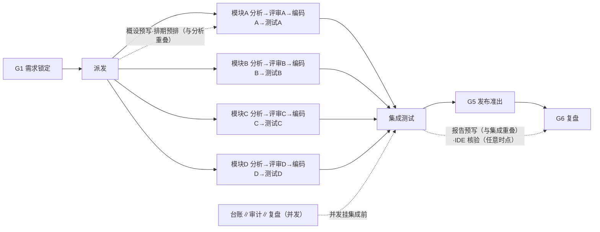
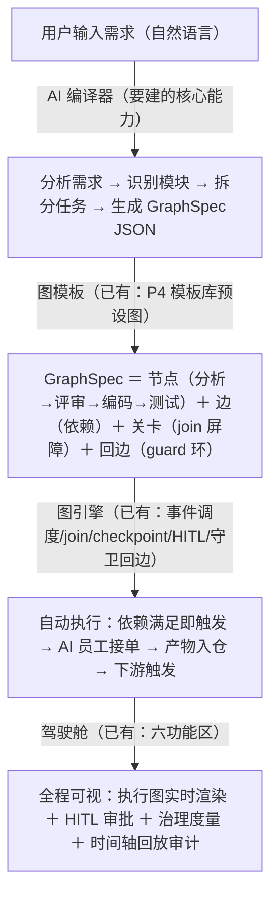
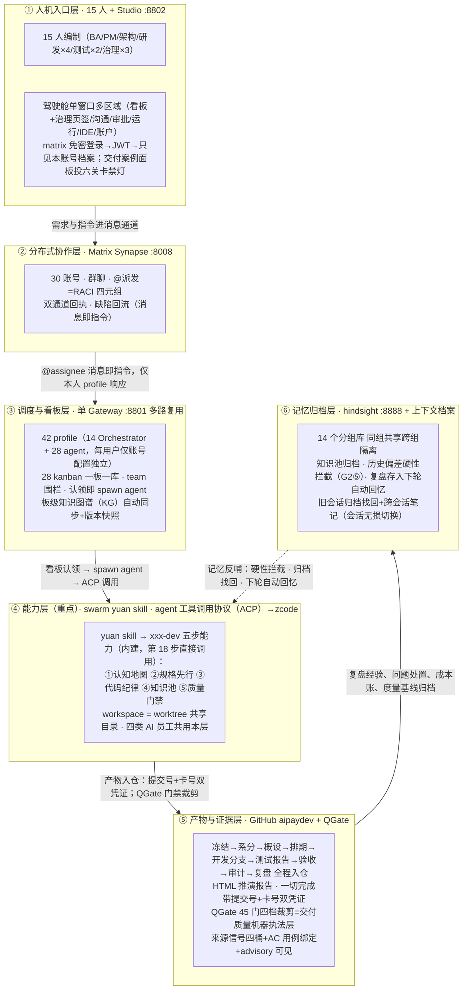
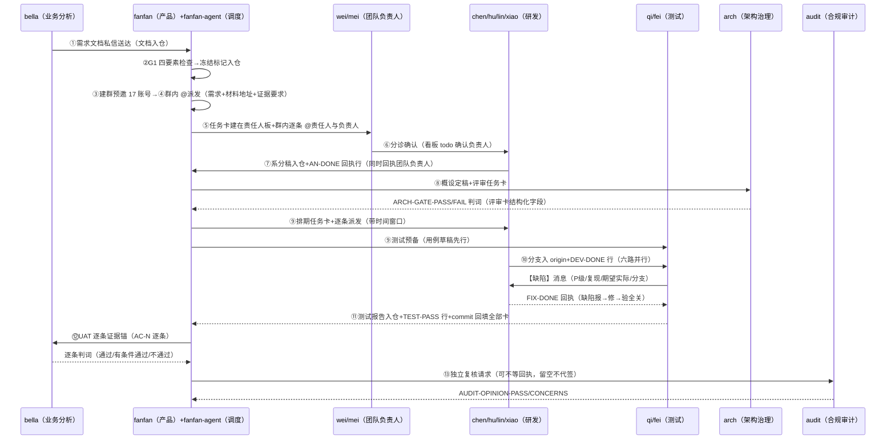

# Swarm Studio 全流程推演方案

## 总述：三分钟看懂这场推演

SwarmStudio 是一个让 AI 像一家软件公司一样干活的驾驶舱。这份方案定义一场考试：**15 个 AI 员工组成一家虚拟公司，接过一张真实的支付收银台需求单，从需求分析一直做到功能上线，人只在关键关卡把关。**全程证据存档，最后交一份没接触过本项目的人也能看懂的报告。每一轮这样的完整模拟叫一轮推演（run），按顺序编号：run1、run2……

**这场考试怎么运作？** 三个问题说清：

1. **谁干活？**——15 个角色（主管、业务分析师、产品经理、架构、4 名研发、2 名测试、安全、运维、审计），全部由 AI 扮演。每个角色有聊天账号和任务看板，互相用群聊、@消息、看板卡协作，像真公司一样。
2. **怎么保证不是演的？**——三条硬规矩：说"做完了"必须给证据（代码提交号+任务卡号，系统反查两个都真实）；六个强制关卡（需求冻结→架构评审→编码门禁→独立测试→发布准出→复盘）不过不放行；所有问题记台账，结束时 100% 要有处置结论，不许悄悄消失。
3. **怎么判断考试成功？**——三条标准：功能真实可用（收银台能下单、重复提交不产生两笔订单）；质量数字过硬（单元测试全绿、每条验收标准都有对应用例）；过程第三方可重现（报告里每个结论都能按编号反查到原始证据）。

**读这份方案前，认识十个词：**

| 词 | 一句话解释 |
|---|---|
| 推演 / 一轮（run） | 一次从需求到上线的完整模拟 |
| AI 员工 / 编制 | 15 个角色各由 AI 扮演，人只在关卡把关 |
| 驾驶舱 | SwarmStudio 的操作界面：看板、沟通、审批、运行中心、IDE 画布、账户六个区 |
| 26 步主链 | 推演的固定流程：分账号→锁需求→分析→设计→编码→测试→发布→验收→复盘→出报告 |
| 关卡（G1-G6） | 六个强制检查点，G1 需求冻结、G2 架构评审、G3 编码门禁、G4 独立测试、G5 发布准出、G6 复盘 |
| 双凭证 | "完成"结论必须带代码提交号+任务卡号，系统核验两处都真实 |
| 中央仓 | 全部交付物提交的 git 仓库；"入仓"指推送到 origin/main |
| 驱动脚本 | 按 26 步自动推进推演的程序（aipay-scenario.sh） |
| 问题单 | 所有问题记入 issues.log 台账，结束时 100% 有处置结论 |
| 治理报告 | 轮次结束自动汇总的度量：关卡一次通过率、缺陷统计、AI 贡献占比 |

**五个部分怎么读：** 先读第一部分（要什么）和第五部分（怎么算成），这是主干；第二部分是机制设计（怎么保证），给实现和评审的人；第三、四部分是每一轮的实例与操作细节，给执行的人。换需求单只换第三部分，其余不变。

> **文档定位**：全流程推演唯一正本。报告生成器与审计器以本文件为解析源；26 步主链、六道关卡、治理机制、交付物模板字段语义冻结，变更须整轮推演验证。历史沿革、历轮事故、补丁谱系一律见《[推演历史与工程档案](2026-10-05-mux-history-and-engineering-archive.md)》。

## 第一部分 方案目标

> **本部分导读**：回答"为什么考、考什么、考不过的边界在哪"。先立三条总原则（§1.0），再说明执行形态的终态方向（§1.0.1）与环境纪律（§1.0.2），然后是要验证的三条假设（§1.1）、做完后应具备的能力清单（§1.2）和明确不考的内容（§1.3）。

### 1.0 三核原则（方案优化的最高准绳，冲突时按此裁决）

| 核 | 含义 | 冲突裁决 |
|---|---|---|
| **贴近真实** | 推演=真实场景的复刻实验——AI 员工以自身能力完整处理任务，人角色也由 AI 模拟驱动；产物真、工具真、流程真 | 与速度冲突时**真实优先**（跳步/代投=污染实验效度） |
| **最高质量** | 交付物过核验门禁（字段级/端侧可反查），问题不静默、台账 100% 处置、报告第三方可懂 | 与速度冲突时**质量优先**（假绿=最贵的返工） |
| **最快速度** | 在真实+质量不妥协的前提下压缩实际时长时间：并发最大化、流水线重叠、报告预写、窗按实测校准 | 不得以牺牲前两核换速度 |

### 1.0.1 推演的终极形态：图执行（loop graph），非线性脚本

当前推演=aipay-scenario.sh **线性 bash 脚本**（26 步顺序执行+并行补丁）。终极形态=**用 SwarmStudio 自己的 loop graph 引擎跑推演**——推演方案定义成 GraphSpec（JSON 图），事件驱动执行器按依赖关系调度节点，数据满足即触发（不等前一步全完）：

**26 步→DAG 节点映射**（示意）：



- **节点**=任务（分析/编码/测试/评审/台账/报告），非"步骤"
- **边**=依赖（模块A分析完成→评审A可触发），非"步骤N在N-1之后"
- **执行器**=事件驱动（依赖满足即触发），非顺序轮询
- **关卡**=join 屏障（G1 等需求锁定、G5 等全部模块测试+集成通过），非脚本 if/else
- **一张图三种用途**：GraphSpec=推演方案定义（编排器画布可编辑）；运行日志=执行实况（运行中心实时可视）；事件日志=审计证据（时间轴回放）——推演的三层产物统一为一张图

**转译要求**：26 步转译为 GraphSpec JSON 后用产品图引擎调度；编排器画布承担推演方案的视觉编辑（改图=改方案）；转译正确性以与 §2.4 步语义逐行一致的门禁测试保证；checkpoint/resume 与断点续跑（START_STEP/UNTIL_STEP）语义一致。

**需求→图自动生成（北极星）**：理论上所有需求研发交付全流程=一张 loop graph，且这张图可以**根据具体需求自动生成并运转**：



已有件（产品侧已建）：GraphSpec 格式+事件驱动执行器+join 屏障+守卫回边+checkpoint/resume+人工介入中断（HITL）+编排器画布+运行中心+P4 模板库+每日简报模板（系统内置 GraphSpec 实例）；六个图节点执行器+KanbanBridge（DryRun/HTTP 真实桥接 GRAPH_KANBAN_BASE，26 步图模板可实例化跑通）；工作量估计写入数据库，派发时给任务多的执行者优先派活（加权）；角色边界注册表（图派发时自动给每个角色注入"只做什么、不做什么"）；能力声明注册表（角色能做什么写成清单，不该做的写明不做什么）；REST 接口校验；图执行影子模式（shadow：跟着驱动一起跑但不接管主流程，run13 起转为主执行通道）。
待建件（缺口）：①**需求→GraphSpec 编译器**（AI 读需求→输出任务图 JSON——本质是需求分析的输出格式从 markdown 换成 GraphSpec）；②推演 26 步转译为标准图模板并转正为主执行通道：先影子模式与驱动双跑验证结果等价，确认后 `MX_GRAPH_ENGINE=on` 切图引擎接管调度（run13 起）；③图执行器↔agent 派发对接的实战完善。分期路线见 2026-10-08-team-parallel-dev-capability.md；并行能力的需求正本=《2026-10-09-parallel-capability-foundation-spec.md》（五类工作都要"先估工作量、再拆小、并行做、最后合并成一份"，机制条款见 §4.2）。run12 已有第一个全流程并行实例：G5 整改测试分给三人同时做（matrix event $LlZZQ4HX；经验教训随轮次结束回填该 spec）。

### 1.0.2 全新环境独立回归（每轮推演的完整性铁律）

**每轮推演=全新环境的全流程独立回归测试**——不依赖任何前序轮次的产出物，不携带任何前序轮次的状态残留。目的：保证推演结果的因果可信——通过=系统真的好，失败=系统真的有 bug，而不是"上一轮留了好底子"或"上一轮的残留干扰了本轮"。

| 维度 | 清理机制（mx-clean） | 验证断言 |
|---|---|---|
| 中央仓 | `--reset-central` 九目录清空+推 origin/main+删旧轮分支+快照 tag | 远端仅 main、九目录零文件（admin 注册表保留） |
| Agent 工作区 | `--reset-workspaces` tar 归档后全删，mx-setup 重建净克隆 | workspaces/ 为空或净克隆 |
| 看板 | 整树归档重置 | kanban/ 整树空 |
| Matrix 房间 | 全部房间 v2 purge | 房间数=0 且全部账号 joined=0 |
| 运行态 | pending_messages/sessions/approvals/state*/cron 清零 | 五类运行态=0 |
| runs/ 目录 | 旧轮目录归档移除 | runs/ 无旧轮目录 |
| 分组记忆 | `--reset-memory` pg_dump 归档后清 14 bank | 14 bank 各表计数=0 |
| **唯一例外** | 账号凭据（synapse 用户）保留（重建成本高且与推演结果无关） | roster 15 人一致 |

**禁止事项**：
- 禁止任何步引用前序轮的 git commit / 看板卡号 / Matrix event_id 作为本轮凭据
- 禁止 agent 工作区残留前序轮的 worktree 或分支（branch_fresh 门禁已立）
- 禁止治理报告的 metrics 行引用前序轮数据冒充本轮实测（按轮强制关卡已立）
- 禁止复盘的"经验回忆"从前序轮的记忆库取数据冒充本轮产出（记忆召回探针需声明来源轮次）

**例外声明**：分组记忆库（hindsight）的跨轮经验回忆是**设计功能而非污染**——但必须在本轮口径章声明"本轮回忆了上轮的哪些经验"（记忆召回探针已设计），读者可判断回忆对结果的影响。

### 1.1 推演要验证的三条假设

1. **分布式多 agent 研发可以按真实公司流程交付真实需求——且以流式并行模式**：15 人编制（每人配 AI 助理）在无办公室条件下，把一张真实需求单以"模块拆分→并发分析→逐模块评审编码测试→集成准出"的**流水线模式**（非瀑布串行）走完全程，全程在驾驶舱六功能区内完成。验证的不仅是"能交付"更是"能高效并行交付"。
2. **治理靠机制不靠自觉**：每个"完成"必须带双凭证（代码提交号+任务卡号）并被系统反向核验；六道强制关卡守住不可逆决策；问题全记账、复盘全处置。
3. **过程可完整重现给第三方**：一份自包含的 HTML 报告让不熟悉本项目的人看懂"一张需求单怎么变成上线功能"，且每个结论可按锚点反查。

这场考试的规模，一组数字看全：

| 维度 | 数字 | 说明 |
|---|---|---|
| 流程 | 26 步 | 从分账号到出报告的固定主链（§2.4） |
| 关卡 | 6 道（G1-G6） | 强制检查点，不过不放行（§5.3） |
| 编制 | 15 人 | 主管/业务分析/产品/架构/研发×4/测试×2/安全/运维/审计（§2.2） |
| 账号 | 30 个 matrix 账号 | 每人一个人类账号+一个 AI 助理账号 |
| 智能体 | 42 个配置 | 14 个调度器+28 个执行 agent，共用一个网关 |
| 界面 | 驾驶舱 6 区 | 看板/沟通/审批收件箱/运行中心/IDE 画布/账户 |
| 循环 | 双循环 | 技能内循环×群体外循环 |
| 门禁 | 45 门 | 按域裁剪；每门判定带来源信号（核验/声明/降级/无信号）并与验收标准绑定（QGate v1.31.1 起，见 §2.3 层⑤） |

### 1.2 完成后系统真实能力（效果清单，验收锚点=测试报告用例/执行输出/UAT 判词）

**业务功能**：下单幂等（同一订单重复提交返回同一支付单号）；微信/支付宝双渠道适配（推演环境本地 mock 承载，协议字段按公开技术手册一致，换真实凭证即可切换）；金额全链条"分"（int64）与字段 snake_case；支付结果回执与订单状态可查询，接口签名/错误码/幂等键逐条定义并落到实现与用例。

**质量（可复核数字）**：支付核心单测 ≥8 条、其余模块各 ≥6 条，全部执行且全绿（执行输出随分支提交，脚本实际核验）；每条验收标准有对应用例（需求-代码-测试一一对应）；缺陷报→修→验全关才准出且只认本轮记录；开发分支全部合入集成分支，基线可追溯（只许快进或 merge 增量）。

**交付与协作（过程资产）**：完整入仓文档链（冻结单→资产表→组织矩阵→任务清单→系统分析稿→概要设计→排期→测试报告→发布计划与说明→完备性检查→验收报告→工作台账→审计意见书→复盘，字段级模板见 §2.7）；全过程留痕互链（matrix event_id／看板卡号／git commit 三源互链）；治理链条完整（六道关卡全部通过、问题单 100% 处置、经验入分组记忆库）。

**呈现**：HTML 报告完整重现全过程（每步四段+全量呈现，见 §5.4/§5.5），并以第 4 章产品成效块集中呈现交付物成效（功能实证/质量数字/交付完整度，§5.4）。

### 1.3 不做什么（边界）

- 不接真实渠道资金流（推演环境一律本地 mock，密钥不出服务端）；
- 不验证性能与容量指标（SLA 数字只登记不实测；容量预算属执行约束，见 §4.2）；
- 不做多需求并行（一轮一张需求单；多轮同需求双跑对比属长线记档项）；
- 不验证跨机联邦形态：单机单 gateway 多路复用等价多机（§2.4 步 2），"测试者≠写码者"等独立性分离为账号级而非机器级；"谁离线不影响全网"的联邦韧性不在验证范围。

## 第二部分 方案设计（机制契约，场景无关）

> **本部分导读**：回答"系统怎么保证考试不作弊"。自底向上分六块：先认识四个基础组件怎么配合（§2.1），再看谁在干活（§2.2 编制）、系统分几层（§2.3 架构）、流程怎么走（§2.4 26 步）、每个界面支撑什么（§2.5）、治理靠什么机制（§2.6）、每个环节交什么作业（§2.7 模板字段）；最后看任务在 agent 之间怎么交接（§2.8 组织关系与流程衔接）。第一部分说"要什么"，本部分回答"靠什么做到"；所有条款与具体需求单无关。

### 2.1 四个基础组件

四个组件各管一段，串起来就是一次任务的旅程：人在**驾驶舱**里看和操作；指令和对话走 **Matrix** 聊天网络；**hermes 网关**听着消息，把任务派给对应 agent 并盯着它干活；agent 用 **swarm yuan 技能**获得"懂这个项目"的研发能力。下表逐个说明。

| 组件 | 是什么 | 设计初衷 | 在 26 步中的角色 |
|---|---|---|---|
| Swarm Studio（产品面） | 桌面应用（Electron+Vue），驾驶舱单窗口多区域：/app 路由树内看板（含治理页签组）/沟通/审批收件箱/运行中心/IDE 画布/账户管理（信息架构 2.0）；服务端治理域（变更治理/知识图谱治理/驾驭工程/会话无损切换/看板/审批/运行观测）工件保存即提交 git；Delivery Cases 交付案例面板（/app/cases）承载六道关卡协议事件投影 | 把"为可监督性设计"做成产品功能；工件必须真实可编辑，禁只读摆设件 | 层①人机入口：全流程唯一操作面；治理中心承载六道关卡工件与复盘度量；IDE 工作台承载第 25 步 |
| hermes agent（运行时） | 自改进个人 agent 运行时，单网关进程多平台接入（一机一网关服务全部 profile）；kanban 引擎（约 20 CLI 模块+watchers/dispatcher，认领即 spawn）；skills 引擎（slash 命令体系）；审批传输（once/session/always/deny 四态，超时 fail-closed）；矩阵集成（反应审批/`!` 命令路由/线程） | 两大不变量：逐会话前缀缓存神圣（中途变更历史/工具集/记忆=毁缓存翻倍成本，唯一例外压缩）；核心是窄腰架构（核心精简、能力外挂） | 层③调度与看板：认领即 spawn、消息即指令的执行基础设施；层⑥记忆归档宿主 |
| Matrix（协作基础设施） | docker matrix-synapse 承载全部账号的房间/线程/反应/DM 协作语义；element-web 交互模式按需吸收（Spotlight 混合搜索/跳未读条/permalink 内链等） | 指令通道与数据通道分离；消息/反应/线程都是可反查凭证；群聊=分布式协作一等现场 | 层②分布式协作层：步 8-19 的派发/回执/审批/缺陷对话现场 |
| swarm yuan skill（能力层） | 元技能生成器：对任意代码仓库跑一次，产出项目专属研发能力技能；五步研发能力内建（①认知地图②规格先行③代码纪律④知识池⑤质量门禁）；xxx-dev 定制技能生成机制（lite/standard/compliance 三档六段式骨架） | AI 瓶颈在"懂不懂项目"：不懂规矩交给门禁、想错逻辑交给验证；宿主管循环与沙箱，技能只管项目上下文 | 层④能力层：步 13 系分与步 18 编码五步能力的内建来源 |

（各组件工程锚点谱系见《推演历史与工程档案》工程附录 A。）

### 2.2 AI 员工编制（对标行业实践）

行业（银行卡清算领域）《AI 增强的研发运维模式建设》把研发职能收拢为三类 AI 员工；本方案全量吸收并延伸第四类：

| AI 员工 | 一句话职责 | 对应步骤 | 用的技能 | 人必须确认的节点 |
|---|---|---|---|---|
| 需求设计 | 把模糊业务诉求转成可开发的设计包 | 7-16 | requirements-analyst（金融支付领域知识+OCR 双路提取）+架构设计技能 | G1 上锁、G2 评审、定稿 |
| 应用研发 | 在流水线中自动完成编码与自评审 | 17-18 | xxx-dev（swarm yuan 为仓库生成的定制研发技能） | 分诊确认、提测 |
| 质量测试 | 用例生成、智能回归与缺陷归因 | 19-21 | defect-loop（报→修→验完整处理）+测试 agent | UAT 逐条核对、发版人工批准 |
| 研发治理（本方案延伸） | 台账、审计、复盘与度量 | 22-24 | pm-planning、capability-report | 复盘确认、行动项认领 |

AI 员工干活有两大风险，本方案各有一套应对。

**风险一：随机性与准确性**——AI 可能编造结论。应对：结构化输出强制规范（RACI 字段、可判定的验收标准）、双凭证反向核验、历史偏差硬性拦截（G2 检查项⑤）、审计每轮抽 3 条 AI 结论反核（幻觉率进治理报告）、复现留痕（模型通道与版本、关键回合输入输出存档）。

**风险二：组织协同与信任**——人怎么敢放手让 AI 主理？应对：人工只在"人必须确认的节点"把关（见下表末列），其余 AI 主理；全程留痕（冻结凭证、问题台账、双通道回执、分组记忆库），事后条条可查。

### 2.3 六层架构

整个系统按"一次任务的完整旅程"分六层，自上而下即执行逻辑。六层与 26 步的对应：层①②承载步骤 1-13（环境、登录、建群、派发），层③承载看板与调度（步骤 10-18），层④承载五步研发（步骤 13、18），层⑤承载全部产物入仓（贯穿），层⑥承载记忆归档（步骤 24 存、下轮取）。



这张图怎么读：

- **自上而下**就是一次任务的完整旅程：人在①发指令 → 消息走② → 网关在③派活 → agent 在④干活 → 产物在⑤入仓 → 经验在⑥归档。
- **层间箭头**是交接方式：消息即指令、认领即执行、双凭证入仓、复盘归档。
- **虚线**是记忆反哺：下一轮推演自动带着上一轮的教训干活。
- **共享与隔离并行**：网关、通道、技能、模型、中央仓、记忆服务全编制共用一套；但每人的配置、看板、记忆库、权限、状态互相看不见。
- 四道关卡横切主链，凭证核验、问题台账、退回重报、治理报告贯穿全程。

### 2.4 26 步主链（场景动作+机制约束；验收见第五部分，执行坑见第四部分）
> 每步条目三段式：**这步做什么**（概述+机制约束）→ **操作指引**（六字段表：操作者/通道/动作序列/等待信号/超时与失败/产出——驱动脚本的真实执行细节，源=aipay-scenario.sh，人按此操作路径同此）→ **交付物及质量判据**（交付物+判据一行摘要，全量判据以 §5.2 为准）。历轮已知问题与改进项不入正本——台账见《推演历史与工程档案》"方案步条历史层"章（问题单按轮记 issues.log；报告每步③④段自台账实测，§5.4）。
>
> 阶段导航：环境准备 1-4（账号→配置→登录→冒烟）｜需求管理 5-7（资产表→组织矩阵→G1 上锁）｜需求分析 8-14（建群预邀→派发→登记→拆分→分诊→四路系统分析（系分）→汇总定稿）｜设计评审与排期 15-17（G2 评审→收尾→排期）｜编码 18（G3 门禁）｜测试与交付 19-21（G4 独立验证→G5 发布准出→UAT 对账）｜治理与复盘 22-26（台账→G6 复盘→IDE 介入→HTML 报告）。

**步 1｜账号分配**
**这步做什么**：管理员为所有用户分配 matrix 账号（matrix 地址/账号/access token/登录密码），编制 15 名成员（主管 admin、BA、产品经理A、4 名研发、2 名测试、架构治理、安全 secops、运维 ops、合规审计 audit），各配人类账号与 AI 助理账号，共 30 个 matrix 账号。账号创建/分配在设置→账户管理界面完成（synapse 管理 API），本机↔matrix 双账号联动，roster 由界面维护并导出入仓，不依赖脚本直建。
**操作指引**（驱动脚本按此执行，源=aipay-scenario.sh；人读操作路径同此）

| 项 | 内容 |
|---|---|
| 操作者 | 驱动脚本（持 admin token） |
| 通道 | 界面+REST：设置→账户管理界面建号；`GET account/whoami` 逐账号验证 |
| 动作序列 | ①管理员界面创建 30 个 matrix 账号（15 人类+15 AI 助理） ②导出 roster.md 入仓 ③逐账号 whoami 验证 token 有效 |
| 等待信号 | 全部账号 whoami 通过；roster 与编制表计数一致 |
| 超时与失败 | token 失效即中止（环境未就绪，不得带病启动） |
| 产出 | `docs/admin/roster.md` 入仓；`jwt_*` 凭据键 |

**交付物及质量判据**：交付物=`docs/admin/roster.md`（账号｜AI 助理账号｜角色，字段见 §2.7）；凭据=30 账号逐一登录验证通过、清单入档；合格线=账号与人员编制表一一对应，账号数/角色数自 roster 实测（全量判据见 §5.2）。

**步 2｜每用户配置初始化**
**这步做什么**：每用户配置 hermes gateway 的 Orchestrator agent channel（matrix 地址、账号、access token；单 gateway 多路复用，等价每台电脑独立 gateway，每用户仅账号与配置不同）；装配协作 kanban（每人 2 块独立看板，各挂研发专职 agent 团队，看板认领白名单锁定）与独立记忆库。
**操作指引**（驱动脚本按此执行，源=aipay-scenario.sh；人读操作路径同此）

| 项 | 内容 |
|---|---|
| 操作者 | 驱动脚本 |
| 通道 | REST（网关配置）+看板装配 |
| 动作序列 | ①每用户配 Orchestrator channel（matrix 地址/账号/token） ②每人装配 2 块看板+研发 agent 团队 ③建独立记忆库 |
| 等待信号 | 四件套（账号/配置/看板/团队/记忆库）逐项存在；跨账号抽查不可见 |
| 超时与失败 | 缺件记问题单继续；装配失败中止 |
| 产出 | 每用户装配清单；`42 个智能体配置` 就位 |

**交付物及质量判据**：交付物=每用户"账号+配置+看板+团队+记忆库"装配清单；合格线=四件套齐全且互不可见。

**步 3｜登录**
**这步做什么**：每用户打开 swarm studio 登录：默认 matrix 账号免密自动登录（凭 gateway 已配置通道），也可登录页用 matrix 地址+账号+密码登录。
**操作指引**（驱动脚本按此执行，源=aipay-scenario.sh；人读操作路径同此）

| 项 | 内容 |
|---|---|
| 操作者 | 每个账号 |
| 通道 | 驾驶舱登录页 |
| 动作序列 | ①matrix 免密自动登录（gateway 已配通道） ②抽查密码登录路径 ③登录后确认只见本账号档案与看板 |
| 等待信号 | 30 账号全部登录通过；跨账号抽查不可见 |
| 超时与失败 | 任一账号登不上即中止（冒烟不过不启动） |
| 产出 | `login_done` 截图（`/app/board?tab=accounts`） |

**交付物及质量判据**：凭据=全部账号登录通过、登录后只见自己档案与看板（抽查跨账号不可见）；合格线=免密与密码两种方式都通。

**步 4｜环境冒烟**
**这步做什么**：账号/服务/登录/看板/团队围栏/记忆库冒烟清单全绿后推演正式开始。主侧栏一级入口仅「驾驶舱」（+系统折叠组），全流程 UI 操作不出 /app 路由树（登录页除外）。冒烟四组：①页头「任务」「在线」chips 下拉核对；②日程按钮+运行中心「工作流」页签三区块加载非空；③吸收面（Spotlight 混合搜索/群聊跳未读条/通知未读线程聚合/治理运行态卡）；④逐项截图入档。
**操作指引**（驱动脚本按此执行，源=aipay-scenario.sh；人读操作路径同此）

| 项 | 内容 |
|---|---|
| 操作者 | 驱动脚本 |
| 通道 | REST 存活探测+界面截图（capture_step 落 `/app` 全页） |
| 动作序列 | ①`/health/ready`+gateway `/health` 双存活探测 ②页头"任务/在线"计数核对（任务数=看板实况、在线三数>0） ③日程按钮+运行中心"工作流"页签加载非空 ④吸收面四组逐项核对 ⑤逐项截图入档 |
| 等待信号 | 冒烟清单全绿后写 `smoke_done=1` |
| 超时与失败 | gateway/studio 不通即中止；单项红灯记问题单（环境问题不算产品缺陷） |
| 产出 | `smoke_done-*.png`；`smoke_done` 键 |

**交付物及质量判据**：凭据=冒烟清单全绿（任务计数=看板实况、在线三数>0）；合格线=零红灯，环境问题如实记问题单不算产品缺陷。

**步 5｜应用初始化**
**这步做什么**：对 4 个应用模块（csw-pay-core 支付核心、csw-channel-wechat 微信渠道、csw-channel-alipay 支付宝渠道、csw-cashier-mp 小程序收银台）逐一登记资产表（应用/负责人/专属看板/技术栈/SLA 级别/测试骨架在位核对），新立项、退役同表管理。登记在治理中心·应用资产界面完成（gov-registry 页签 AppRegistryEditor 七列表单），保存即提交 git。
**操作指引**（驱动脚本按此执行，源=aipay-scenario.sh；人读操作路径同此）

| 项 | 内容 |
|---|---|
| 操作者 | 驱动脚本（界面同源：治理中心·应用资产页签） |
| 通道 | REST `PUT /api/governance/registry/app-registry`（与界面"保存（提交 git）"同一端点）+git 推 origin/main |
| 动作序列 | ①逐应用核对测试骨架文件（vitest.config）/专属看板/负责人 ②生成 `docs/admin/app-registry.md` ③经产品端点写库 ④推送 origin/main |
| 等待信号 | `appinit_done` 幂等守卫（重跑跳过） |
| 超时与失败 | 骨架缺口记 `app-init-incomplete` 继续；产品通道失败降级直写记问题单；推送失败记问题单留存 |
| 产出 | `docs/admin/app-registry.md` 入仓；截图 `/app/board?tab=gov-registry` |

**交付物及质量判据**：交付物=`docs/admin/app-registry.md`；合格线=每应用有负责人/专属看板/测试骨架，缺件记问题单不得静默。

**步 6｜研发人员管理**
**这步做什么**：生成组织与权限矩阵（人员×角色×汇报线×看板×团队×matrix 账号+权限规则+入职/转岗/离职流程+能力清单），与实际账号/看板/智能体逐项对账。角色全覆盖：需求分析师、系统分析师、项目管理、系统架构、安全管理、运维管理、合规及审计。关系维护在治理中心·组织界面（gov-org 页签 OrgEditor）；三流程走三步向导（任务移交→账号停用→审计留痕，服务端原子序逐步 commit）。
**操作指引**（驱动脚本按此执行，源=aipay-scenario.sh；人读操作路径同此）

| 项 | 内容 |
|---|---|
| 操作者 | 驱动脚本（界面同源：治理中心·组织页签） |
| 通道 | REST `PUT /api/governance/registry/org` + 对账（profile×看板×fleet-manifest 三方 jq 断言）+git |
| 动作序列 | ①生成 `docs/admin/org.md`（七角色治理线/权限矩阵/三流程） ②三方对账 ③入仓推送 |
| 等待信号 | `people_done` 幂等守卫 |
| 超时与失败 | 对账不一致记 `people-org-mismatch` 继续；其余同步 5 |
| 产出 | `docs/admin/org.md` 入仓；截图 `/app/board?tab=gov-org` |

**交付物及质量判据**：交付物=`docs/admin/org.md`+对账输出留档；合格线=15 人×看板×智能体三方零差异。

**步 7｜需求上锁（G1）**
**这步做什么**：BA（bella）给出客户需求文档（送达方式按场景档案 §3.1），产品团队内部分工后发给产品经理A（fanfan）。需求先过 G1 四项检查：①逐条验收标准可机械化判定（禁"性能良好"类空话）②范围外清单③影响面（模块/接口/数据）④涉敏评估（涉敏按 ISO27001 出风险评估摘要）。四项齐→冻结标记入库（锁定清单是最终验收唯一依据）；缺项打回补齐，两轮不齐不得开工；锁后不许改，改则重新走锁。
**操作指引**（驱动脚本按此执行，源=aipay-scenario.sh；人读操作路径同此）

| 项 | 内容 |
|---|---|
| 操作者 | bella（BA，驱动脚本代发私信）；G1 判读=驱动脚本 |
| 通道 | git 提交（author=bella）+matrix 私信 fanfan（`createRoom is_direct`） |
| 动作序列 | ①bella 提交需求文档入仓 ②私信 fanfan："客户需求文档已出：RFD-001 收银台…请产品团队接手" ③驱动做 G1 四要素判读（AC 编号可判定/范围外清单/影响面/涉敏） ④缺项私信退回："G1 准入退回：缺 X，请按 templates/prd.md 补齐后重推" ⑤四项齐→写冻结标记 `frozen: true` 推 origin/main |
| 等待信号 | `g1_frozen` 键；退回后二轮重判 |
| 超时与失败 | 退回重判短循环两轮；仍缺→记 `g1-acceptance-blocked` 并中止（分析不得开始） |
| 产出 | `docs/requirements/RFD-001.freeze.md` 入仓；`ba_dm_marker`；截图 `/app/board?tab=trace`；开案例房+G1 事件 |

**交付物及质量判据**：交付物=`docs/requirements/＜RFD＞.freeze.md`（字段见 §2.7）；合格线=AC≥3 条且全部可判定，入仓以 origin/main 可反查为准。

**步 8｜建群**
**这步做什么**：产品经理A（fanfan）按需求文档创建群聊，邀请本机 hermes Orchestrator agent（显示名为"matrix 账户名"的 AI 助理），群命名"XX需求分析讨论群"，自动邀请全部关联人（chen/hu/lin/xiao/wei/mei/qi/fei）进群后再开始分析。
**操作指引**（驱动脚本按此执行，源=aipay-scenario.sh；人读操作路径同此）

| 项 | 内容 |
|---|---|
| 操作者 | fanfan（产品经理A） |
| 通道 | matrix 建群（POST createRoom）+预邀 |
| 动作序列 | ①建群"支付收银台需求分析讨论群" ②一次性预邀 17 个账号（fanfan-agent+chen/hu/lin/xiao/wei/mei/qi/fei 各自人类+agent） ③逐账号检错退避入群（重试 4 次） ④按名单核验缺员 |
| 等待信号 | `room_analysis` 存房间 ID（幂等不重建） |
| 超时与失败 | 建群返回异常中止；退避后仍缺员记 `room-join-missing` 不静默 |
| 产出 | state 键 `room_analysis`（后续所有群操作的房间锚） |

**交付物及质量判据**：交付物=群 ID 存档；合格线=命名规范、助理在群、关联人全量预邀。

**步 9｜派发**
**这步做什么**：产品经理A在群聊中 @Orchestrator agent 输入指令，并将需求文档（或对应 git 仓库地址）发到群聊。指令明确：结论必须带证据（代码提交号+任务卡号），空喊"完成"不算数。
**操作指引**（驱动脚本按此执行，源=aipay-scenario.sh；人读操作路径同此）

| 项 | 内容 |
|---|---|
| 操作者 | fanfan 人类账号发信，@fanfan-agent 执行 |
| 通道 | 群消息（带 m.mentions 精确 @） |
| 动作序列 | 先查 `g1_frozen` 在位（未冻结即中止）→发派发词。派发词骨架（全文见 aipay-scenario.sh 步 9 段）："请处理需求 RFD-001。需求文档：aipaydev 仓库 <路径>（先 git pull）。先自动邀请所有关联人进群，然后加载需求分析技能执行系统分析：1) 需求切分+OCR 双路交叉核对 2) 三清单匹配 3) SMART 任务清单具体到人 4) 按 RACI 逐条 @派发+建父子跟踪任务。结论行必须二选一：`ANALYSIS-DONE-RFD-001 commit=<commitId> card=<真实卡ID>` 或 `ANALYSIS-BLOCKED-RFD-001 reason=…`。不许谎报。" 关键约束三条随词注入：子任务建在责任人看板；建完必须群内逐条 @发消息；assignee 填团队档案名（不填 mxid，填错=永远认领不到） |
| 等待信号 | `dispatch_marker` 存 event_id（重发需 REDISPATCH=1 清标记） |
| 超时与失败 | 发送本身无重试（可达性校验在 dispatch_in_room 路径做） |
| 产出 | 派发消息 event_id；scenario.log 派发行 |

**交付物及质量判据**：交付物=派发消息存档；合格线=指令含需求信息一行+材料地址+证据要求。

**步 10｜看板登记与任务分解**
**这步做什么**：Orchestrator agent 经 gateway 的 matrix channel 接收需求与 @指令后，登记协作 kanban 任务（结构化 RACI 字段：主责/授权/咨询/通知），自动触发任务分解，寻找系统分析智能体处理。机制约束：assignee 填短名（如 chen，不带域名后缀——profile 按短名过滤，格式不匹配=全部不可见）；子任务建在责任人看板上；建完必须在群内逐条 @责任人-agent 发消息（不发=没人知道有任务）。
**操作指引**（驱动脚本按此执行，源=aipay-scenario.sh；人读操作路径同此）

| 项 | 内容 |
|---|---|
| 操作者 | 卡由 fanfan-agent 自己建；驱动脚本只轮询验收、不合格回灌 |
| 通道 | 看板轮询（`hermes kanban --board fanfan list --json`）+群消息回灌 |
| 动作序列 | ①轮询 fanfan 板出现 RFD-001 主卡（活性判定=agent 日志活性） ②结论行凭证反向核验：commit 真在仓库且含产物、card 真在板 ③不合格群内回灌："验收拒收：你账号的板查无 RFD 任务卡…请登记主卡后以 ANALYSIS-DONE 行重报。填需求编号当卡 ID 判虚报" |
| 等待信号 | 主卡在板+凭证双向核过→`register_done` |
| 超时与失败 | 首窗 600s；回灌后二窗 600s；两轮无卡记 `kanban-registration-skipped` 并中止 |
| 产出 | `register_done` 键；截图 `/app/board` |

**交付物及质量判据**：交付物=主任务卡（出现在产品经理A账号看板，超时打回重报，两轮不过记问题单中止）；合格线=卡 ID 为建卡工具返回的真实 ID（拿需求编号冒充即判虚报）；群通知判据以 state 事件锚点为主、文本复查窗 60s 降级观察。

**步 11｜系统分析与拆分**
**这步做什么**：系统分析智能体在任务工作区建 git 仓库存档文档，调用需求分析技能（金融支付领域知识+通用架构设计），做四件事：

1. 吃透需求：切分转换需求内容；图片用两条路 OCR 提取、交叉核对后转成 markdown（保证零信息偏差）；按需求模板评估格式与要素。
2. 对三份底账做拆分：人员清单（matrix 服务端账号）、应用模块清单（各账号上报的看板/团队/agent 能力）、组织清单（org.md 与 app-registry.md）。
3. 拆任务：先按应用模块职责初分，再按整体架构统筹调整（最小改动、减少重构、同类合并），形成 SMART 任务清单、具体到责任人，登记到自己的看板。
4. 派活：自动邀请所有关联人进群；按 RACI 逐条 @派发（@责任人+@团队负责人，附完整任务文档）；建父子关联跟踪任务，子任务全部完成后才关主任务。
**操作指引**（驱动脚本按此执行，源=aipay-scenario.sh；人读操作路径同此）

| 项 | 内容 |
|---|---|
| 操作者 | 驱动脚本核验（回灌消息以 fanfan 名义发） |
| 通道 | git 真值（带新鲜度窗口）+matrix 消息回溯 48h/12 页+看板 sqlite 直查 raci 列 |
| 动作序列 | ①等任务清单 `docs/analysis/RFD-001-tasklist.md` 入仓 ②结论行证据核验（commit/card 双反查） ③四组 RACI 双 @ 消息复查（(chen,wei)(hu,wei)(lin,wei)(xiao,mei)） ④关联人进群核验 ⑤结构化 raci 字段查板库 ⑥任一不过→群内回灌具体缺陷（"凭证核验未通过：…只需补这一行，不要重做已完成的分析"） |
| 等待信号 | `analysis_verified`/`analysis_done` |
| 超时与失败 | 清单入仓 2400s（未达中止）；凭证 300s+回灌 600s（两轮失败中止）；RACI 消息 60s/对（缺→回灌+记问题单放行，不阻塞）；raci 未结构化→免等记问题单；关联人不在群→补邀+记问题单 |
| 产出 | 任务清单入仓；`analysis_done` 截图 |

**交付物及质量判据**：交付物=任务清单文件入仓（超时硬失败）+RACI 派发记录；合格线=SMART 清单具体到人、三清单齐、四组 RACI 派发消息齐全、关联人全部进群、完成凭证双向核验（提交确实在仓库且含产物、卡确实在账号看板）。

**步 12｜分诊与派工**
**这步做什么**：主责员工及团队负责人账号收到逐条任务消息后，其 Orchestrator agent 登记代办任务；团队负责人在分诊台手动初步确认及调整负责人（triage→todo），再经 matrix 发给具体负责员工；负责员工领用确认后推进（见步 13），完成后务必发消息给团队负责人及发起人/转派人要求更新（双通道防遗漏）；重复收到派发则 agent 自动合并去重。
**操作指引**（驱动脚本按此执行，源=aipay-scenario.sh；人读操作路径同此）

| 项 | 内容 |
|---|---|
| 操作者 | 团队负责人 wei/mei（驱动脚本代做分诊确认，纯板操作无消息） |
| 通道 | 看板状态流转（PATCH `/api/hermes/kanban/<id>` 或 CLI） |
| 动作序列 | ①轮询 chen/hu/lin/xiao 四账号板各出现 RFD-001 任务卡 ②lead 查到卡 ID 后置 todo（triage→todo） ③重复派发由 agent 自动合并去重 |
| 等待信号 | 四账号板卡齐+lead 确认→`triage_done` |
| 超时与失败 | 每账号 1800s；未见卡记 `triage-missing` 继续（不中止） |
| 产出 | `triage_done` 键；截图 |

**交付物及质量判据**：交付物=四主责账号看板任务卡；合格线=lead 确认完成、分诊记录留痕、去重生效。

**步 13｜精准系分（四路）**
**这步做什么**：负责员工的调度 agent 找合适的专业 agent（调研设计/测试/应用研发），对每个模块做三件事：精准需求分析、跨模块接口与数据模型设计、工作量评估（结合历史数据）。流程：

1. 在看板任务的工作区建 worktree，材料、仓库地址、环境信息、历史文档统一放进（相关 agent 共享这个工作区并行干，完成后合入 feature 或 fix 分支）。
2. 用 xxx-dev 定制技能的资产梳理与开发流程方法深入分析，产出：初步确认结论、需澄清的内容、概设方案、前置依赖、风险点、必须补充确认的要素、工作量评估。
3. 过程中可以经 matrix 向应用外的协作方确认（派发任务）。
4. 结果自动反馈自己的团队负责人与任务发起方（同一人则去重）。
**操作指引**（驱动脚本按此执行，源=aipay-scenario.sh；人读操作路径同此）

| 项 | 内容 |
|---|---|
| 操作者 | chen/xiao/hu/lin 各自人类账号四路同发（@各自 agent+lead agent） |
| 通道 | 群消息 dispatch_in_room（自动附去重脚注+RACI 解析脚注；发送后查网关日志，命中容量丢弃自动重递一次） |
| 动作序列 | ①四路系分派发（任务号固定：AN-PAYCORE=chen 支付核心、AN-MP=xiao 收银台前端、AN-CHWX=hu 微信渠道、AN-CHALI=lin 支付宝渠道）。派发词骨架："执行系统分析（用 xxx-dev 技能+分组记忆库历史数据做工作量评估）：1) 工作区建 worktree 分支 2) 先读需求/架构/组织/任务清单四件 3) 输出 docs/analysis/AN-<任务>-analysis.md（初步结论/待澄清/概设含接口签名+数据模型+错误码+幂等键/前置依赖/风险/人日） 4) 提交并 push 到 origin main 5) 群内发唯一一行：`AN-DONE-<任务ID> commit=<id> done=<一句话摘要>`。缺任一要素=未完成会被打回。不许谎报。" ②2 份分析稿入仓后即派 fanfan 概设预写（不等四稿齐） |
| 等待信号 | 四稿逐个 `repo_has` 入仓；回执=群内 AN-DONE 行 |
| 超时与失败 | 概设预写窗 3600s；每稿 wait 3600s；稿未达记 `anexec-missing` 继续；回执缺→回灌+记问题单放行；预写未触发→记问题单回退到步 14 集中派发 |
| 产出 | `anexec_d1`/`review_prewrote`/`anexec_done`；四份 AN-*.md 入仓；`!refine` 治理线程四条 |

**交付物及质量判据**：交付物=四份系分稿 `docs/analysis/AN-<模块>.md`（字段见 §2.7）；合格线=概设含接口签名/数据模型/错误码/幂等键、工作量评估有人日、完成回执双通道齐全。**四路并行**

**步 14｜汇总复核定稿**
**这步做什么**：产品经理A收到各方完成消息后逐步更新前序任务进度，关联任务全部完成后汇总总稿（系统分析及工作量评估方案），调用全局需求分析与架构设计技能复核（消歧/消冲突/理层次），发起评审任务（虚拟架构小组：线下人工组织或派发架构治理成员账号，本次先线下人工评审由产品经理A手工更新进度），定稿形成需求规格及架构设计方案。
**操作指引**（驱动脚本按此执行，源=aipay-scenario.sh；人读操作路径同此）

| 项 | 内容 |
|---|---|
| 操作者 | fanfan 派发汇总复核；线下虚拟架构小组评审由驱动脚本代走板 |
| 通道 | 群消息+git 入仓等待+看板评审卡 |
| 动作序列 | ①四稿齐后派 fanfan："加载 requirements-analyst 技能做汇总复核：读四份 AN-*.md→消除歧义与冲突（金额统一'分'int64、字段 snake_case）→形成 docs/design/RFD-001-architecture-design.md→push 到 origin main（推 feat 分支不算入库）→账号板登记评审任务卡。结论行 REVIEW-DOC-DONE 开头。不许谎报。" ②活性等待概设文档入仓 ③评审卡出现→走 todo→review→done |
| 等待信号 | `repo_has docs/design/…-architecture-design.md`+fanfan 板评审卡 |
| 超时与失败 | 1800s；日志空转即中止；评审卡未见→回灌 fanfan 自登（免等）→驱动兜底补登记但不标记 done（留"评审记录待补"）记 `review-card-missing` |
| 产出 | 概设文档入仓；`review_done`；截图 |

**交付物及质量判据**：交付物=概设方案入仓+评审任务卡；合格线=金额统一"分"（int64）、字段 snake_case、结构层次成规范文档。

**步 15｜架构治理评审（G2）**
**这步做什么**：概设定稿后派发架构治理成员（arch）评审五项：①设计五要素齐备（背景/方案/接口/数据/风险）②变更影响范围排查（爆炸半径，对照三清单）③验证计划前移（测试要点设计期已列）④备选方案≥2 且有取舍理由⑤历史偏差硬性拦截（自动检索分组记忆库与问题单台账，命中项设计稿未显式回应即打回）。结论 PASS/FAIL 入群，FAIL 打回修订复评一轮；不过不得进入排期。评审卡由评审人账号登记（驱动脚本补登记不标记 done，保留"评审记录待补"待评审人补记后方可关闭关卡）。
**操作指引**（驱动脚本按此执行，源=aipay-scenario.sh；人读操作路径同此）

| 项 | 内容 |
|---|---|
| 操作者 | arch（架构治理）评审；驱动脚本先补邀 arch 进群+代建评审卡 |
| 通道 | 看板（arch-governance 板评审卡，body 含检查单）+群派发 |
| 动作序列 | ①建评审卡"${RFD_ID} 架构治理评审（G2）"（body=四项检查单+结论行格式） ②群派发："执行 G2 架构治理评审：1) 设计五要素齐备（对照 templates/design.md） 2) 爆炸半径=变更影响模块 vs 三清单 3) 验证计划前移 4) 备选方案 ≥2 且有取舍理由。评审记录落评审卡 body。结论行 `ARCH-GATE-PASS` 或 `ARCH-GATE-FAIL（附缺项）`。不许谎报。" ③判词双源合并（房间行+卡 body，FAIL 优先） |
| 等待信号 | `g2_arch_pass` 键（判词行出现即达） |
| 超时与失败 | 首评 `MX_GATE_WAIT`（缺省 3600s）；FAIL→退回修订复评一轮 2400s；两轮未过中止（排期不得开始）；熔断计数跨调用持久，≥2 轮须 `GATE_BREAKER_OVERRIDE=1` |
| 产出 | arch 板评审卡标记 done；`g2_arch_pass`；dlv G2 pass 事件 |

**交付物及质量判据**：交付物=评审结论行+架构评审卡（关闭）；合格线=五项检查逐条留痕、历史偏差检索结论附设计稿、评审卡登记人=评审人账号可反查。

**步 16｜系分收尾**
**这步做什么**：产品经理A基于定稿规格与工作量评估修正最初的需求系统分析任务（登记全部关联子任务与过程档案汇总，便于回溯审计），标记完成；测试工作量按 0.3 系数叠加评估。
**操作指引**（驱动脚本按此执行，源=aipay-scenario.sh；人读操作路径同此）

| 项 | 内容 |
|---|---|
| 操作者 | fanfan（收尾主任务） |
| 通道 | 群派发+看板主卡状态 |
| 动作序列 | 先查 `g2_arch_pass`（关卡前置）→派发："收尾 RFD-001 主任务：1) 全部关联子任务与过程档案（4 份 AN-*.md、tasklist、概设路径+commit）汇总登记进主卡 body 2) 主卡标记 done（测试工作量按 0.3 系数叠加口径写入）。结论行 CLOSE-DONE 开头。" |
| 等待信号 | `kanban_done fanfan RFD-001`（主卡状态=done） |
| 超时与失败 | 1200s；未 done→仅记观察行（全链唯一不记问题单不中止的步——主任务收尾不阻塞下游） |
| 产出 | `close_done`；`gate_review arch` 治理线程 |

**交付物及质量判据**：交付物=主任务卡（标记完成，限时）+档案汇总；合格线=档案汇总可回溯、0.3 系数口径写入。

**步 17｜排期**
**这步做什么**：产品经理A按定稿规格、工作量评估、开发负载、交付时间、测试人力，编排详细开发计划测试任务（调用项目管理及研发治理 PM 技能），生成带时间窗口的 kanban 任务，登记本机代办，经 matrix 发送计划明细给主责研发/测试及其团队负责人，登记为子任务追踪。
**操作指引**（驱动脚本按此执行，源=aipay-scenario.sh；人读操作路径同此）

| 项 | 内容 |
|---|---|
| 操作者 | fanfan（pm-planning 技能） |
| 通道 | 群派发+git 入仓+看板父子卡+逐条派发消息 |
| 动作序列 | ①幂等守卫（排期文档已在则跳过） ②派发："加载 pm-planning 技能编排开发/测试计划：1) 产出 docs/plan/RFD-001-schedule.md（任务表；测试工作量=开发×0.3 独立成项；整体+15% 缓冲） 2) 任务 ID 固定：DEV-PAYCORE(chen)/DEV-CHWX(hu)/DEV-CHALI(lin)/DEV-MP(xiao)、TEST-BE(qi)/TEST-FE(fei) 3) kanban 建排期父任务+子卡填结构化 raci 4) 逐条 matrix 派发（@责任人-agent+@lead-agent）。结论行 PLAN-DONE 开头。不许谎报。" ③活性等待排期文档入仓 ④派发对话全文留档（r18-collect --step 17） |
| 等待信号 | `repo_has docs/plan/RFD-001-schedule.md` |
| 超时与失败 | 1800s；空转即中止（无回灌轮） |
| 产出 | 排期文档入仓；`plan_done`；截图 |

**交付物及质量判据**：交付物=排期文档入仓（限时）+父子任务卡+派发消息；合格线=测试量=开发×0.3 独立成项、整体+15% 缓冲、每任务有时间窗口与依赖。

**步 18｜编码（G3）**
**这步做什么**：研发/测试人员及团队负责人收到任务后，经分诊台人工确认推进，用 xxx-dev 内建的五步能力开发：

1. 认知地图——先读资产梳理，弄清这个仓库有什么。
2. 规格先行——无设计不编码，严格对照定稿概设。
3. 代码纪律——需求-代码-测试一一对应，每条验收标准落到用例。
4. 知识池——用例、缺陷、失败数据归档进分组记忆库。
5. 质量门禁——白盒扫描/单测/接口/回归全绿并通过自评审，缺陷就地修复。

过程约定：任务工作区建 worktree（与步 13 同一约定）；可经 matrix 向应用外协作方确认；结果自动反馈团队负责人、发起方、测试负责人及主责测试（同一人去重）。
**操作指引**（驱动脚本按此执行，源=aipay-scenario.sh；人读操作路径同此）

| 项 | 内容 |
|---|---|
| 操作者 | chen（3 路）/xiao/hu/lin 各自人类账号六路同刻派发；qi/fei 测试预备轮 |
| 通道 | 群消息 dispatch_in_room×6+测试预备×2 |
| 动作序列 | ①先查 `g2_arch_pass` ②六路同时派发（废除分批）：chen 的 DEV-PAYCORE-C（接口先行件，≤0.5 人日）/-S/-N 三件+xiao 的 DEV-MP 为 d1 批；hu/lin 渠道双路为 d2 批。派发词骨架："执行开发任务 DEV-X：1) 工作区 git pull 后 `git checkout -b feat/DEV-X` 2) 按概设契约实现（金额分 int64、渠道请求本地 mock） 3) vitest 全绿+`docs/evidence/DEV-X-testlog.txt` 随分支提交 4) push origin feat/DEV-X；结论行 `DEV-DONE-DEV-X`。"渠道词自含对接指令："先做独立部分…待 origin/feat/DEV-PAYCORE-C 出现后 `git fetch && git rebase origin/feat/DEV-PAYCORE-C` 补对接，冲突以契约为准。" ③>1 人日腿强制拆 2-3 子件：每子件独立 commit+`PROGRESS-<任务>-<子件>` 进度锚+首 commit=骨架评审 ④测试预备轮派 qi/fei 起草用例（只起草不执行） |
| 等待信号 | 接口先行件锚 `branch_fresh feat/DEV-PAYCORE-C`；多锚并发等待 `wait_alive_truth_multi`（锚过即记 ✓）；180s 节流出分支 commit 计数+PROGRESS 锚进 scenario.log |
| 超时与失败 | 接口先行件 1800s；两批多锚各 1800s；分支未达记 `dev-branch-missing` 继续；拆分证据（<2 commit）巡检记问题单；testlog 缺件记问题单 |
| 产出 | 六条 feat 分支入 origin；`devimpl_done`+`g3_code_pass`；截图 `/app/ide` |

**交付物及质量判据**：交付物=六条开发分支入 origin（各限时）+testlog（`docs/evidence/＜任务＞-testlog.txt` 随分支提交，脚本逐分支实际核验）；合格线=无设计不编码、pay-core 单测≥8/其余≥6 且全绿、金额分 int64、渠道请求本地 mock、G3 写入关卡标志 g3_code_pass。**编码六路并行**（渠道双路同时派出、独立部分先行、接口先行件分支落地后 rebase 对接）。

**步 19｜独立测试（G4）**
**这步做什么**：测试人员识别缺陷经 matrix 反馈研发；研发账号的测试智能体复现确认后派应用研发智能体修复及自测，开发人员人工处理任务发起提测。测试通过后测试 agent 更新任务，登记测试通过的 git commit id 到所有关联卡，出具测试报告。缺陷归因三态（需求/编码/环境）随报告入仓，按根因分布计入治理度量。
**操作指引**（驱动脚本按此执行，源=aipay-scenario.sh；人读操作路径同此）

| 项 | 内容 |
|---|---|
| 操作者 | 驱动脚本做集成合并（git）；qi/fei 派发测试 |
| 通道 | git 集成分支+群派发+缺陷对话 |
| 动作序列 | ①驱动建 `integration/RFD-001` 分支，六条 feat 增量 merge（续建禁强推，testlog 冲突取 ours 解决） ②派 qi（TEST-BE 后端集成测试）："若 test-drafts 已有草稿核对后补齐执行，否则从零写（两态均正常）：1) 按概设契约编 vitest 用例（放 apps/test-integration/：下单幂等/双渠道参数/回调验签拒绝/重复回调幂等/超时关单） 2) 执行全量；缺陷走 defect-loop：本群发【缺陷】消息 @对应研发（P 级/复现/期望实际/分支 commit） 3) 结论行 `TEST-PASS-TEST-BE` 或 `TEST-FAIL（附用例数）`。"fei 同构（前端） ③缺陷修复计数：群内【缺陷】数 vs FIX-DONE 数 ④测试过→派测试报告："汇总结果写 docs/test/RFD-001-test-report.md→push integration 分支→通过的 commit id 回填全部关联卡。结论行 REPORT-DONE。" |
| 等待信号 | `defect_done`（缺陷数=修复数且双结论行在）；`testpass_done`+`g4_pass`（报告在 integration 分支可查） |
| 超时与失败 | 缺陷观测窗 5400s（轮询 30s）；报告 1800s 活性等待；分支缺席跳过合并记问题单 |
| 产出 | 测试报告入仓；`g4_pass`；dlv P4→P5；步 19 对话全文留档 |

**交付物及质量判据**：交付物=测试报告入仓（范围/用例数/通过数/缺陷清单/结论/通过 commit id）+commit id 回填关联卡；合格线=测试者≠写码者、缺陷报→修→验全关且只认本轮记录、执行输出摘要证明实际执行过（"有测试代码"不算）、实跑 commit 与发布基线同祖。

**步 20｜发布准出（G5）**
**这步做什么**：产品经理A发版交付前先过发布检查七项（套发布计划/发布说明模板）：①测试证据已挂关联卡②构建产物同 commit 可复现③依赖无新增④回滚方案具体化（数字阈值触发+命令级步骤+72 小时观察窗口与监控项）⑤灰度 5%→25%→100% 各档观察期⑥发布说明面向用户收益（不贴提交罗列）⑦对外发布人工批准（HumanGate 批准留痕）。同时套用交付标准模板库（模板不满足实际需要直接完善再用），对全部任务做分类/优先级/依赖完备性检查（防多漏错重）。七项全过才许发布；评审分节落卡，缺项边评边补，禁终态打回；判词只认评审卡结构化字段（末判词赢/多行取最新/双源合并 FAIL 优先），FAIL 即发布冻结（REL-* 标记 blocked 记问题单，解冻=缺项补齐+复审 PASS）。
**操作指引**（驱动脚本按此执行，源=aipay-scenario.sh；人读操作路径同此）

| 项 | 内容 |
|---|---|
| 操作者 | fanfan（G5 评审）；对外发布=人工批准（批准事件留档） |
| 通道 | 看板评审卡（fanfan-review 板）+群派发+HumanGate 事件 |
| 动作序列 | ①先查 `g4_pass` ②建 G5 评审卡（幂等 `g5_rgid`） ③派发七项检查单（骨架）："按 templates/release-plan.md 与 release-notes.md 产出：1) G4 证据挂卡 2) 构建同 commit 可复现 3) 依赖无新增 4) 回滚=数字阈值（如崩溃率>0.5%）+命令级步骤+72h 观察窗 5) 灰度 5%→25%→100% 各档观察期 6) 发布说明面向用户收益 7) HumanGate 人工批准。评审分节落卡边评边补，禁终态一次打回。结论行 `READY-GATE-PASS` 或 `READY-GATE-FAIL（附缺项）`。" ④PASS→置卡 done+人工批准事件 `G5-HUMANGATE-APPROVED` 落 approved.events+QGate release-report 落盘 ⑤release 子步=建 REL-MERGE/REL-TAG/REL-DELIVER 三张卡置 todo |
| 等待信号 | `g5_ready`+`ready_done`+`release_done`（判词双源合并 FAIL 优先；本轮既有 PASS 不重派） |
| 超时与失败 | 首评 3600s；退回补齐 2400s；两轮未过熔断中止（不得发布，重试须 `GATE_BREAKER_OVERRIDE=1`）；窗口超时后终态复核判词一次（判词已到按末判词重判，不在才判超） |
| 产出 | `evidence/qgate-release-report.txt`、`approved.events`、完备性检查入仓；三张 REL 卡 |

**交付物及质量判据**：交付物=七项结论入群+准出卡关闭+完备性检查报告入仓；合格线=缺项打回一轮，两轮不过不得上线；HumanGate 批准事件入 approved.events 可反查。

**步 21｜UAT 验收**
**这步做什么**：产品经理A发起交付动作（登记主责关联任务追踪）。随后用户验收测试（UAT）：BA 拿步 7 锁定的验收标准（AC）逐条对账，产品经理A助理逐条给出证据锚点（分支/测试报告/提交号），BA 逐条核对，全过出验收报告入仓（含上线 SLA 登记：可用性 99.5%/下单 P95≤800ms/P2 事件 4h 响应），任一条不过即缺陷回流（回步 19 语义）。每条 AC 判词三态（通过/有条件通过/不通过）逐条落判词，结论=判词汇总禁矛盾总括；有条件/不通过不构成无条件验收，放行权归需求提出方。
**操作指引**（驱动脚本按此执行，源=aipay-scenario.sh；人读操作路径同此）

| 项 | 内容 |
|---|---|
| 操作者 | bella（需求提出方）派发+逐条核对；验收书驱动脚本代写（author=bella） |
| 通道 | 群派发+验收书 git 入仓 |
| 动作序列 | ①前置三查（integration 分支/测试报告/冻结件在位，缺即中止不派单） ②提取冻结 AC 清单 ③派发："业务验收（UAT）：按 G1 冻结清单 ${AC 清单}逐条给出证据（commit/分支/测试报告行号），结论行 `UAT-EVIDENCE` 开头、每条一行；编号必须用冻结清单原编号（AC-N 一一对应，不得自设）。bella 将逐条核对。" ④bella 逐条判词三态（通过/有条件通过/不通过），语义判定脚本统一（共享切段/整词匹配） ⑤验收书逐条落"AC-N → 判词+证据锚"入仓 |
| 等待信号 | 群内 `^UAT-EVIDENCE` 行（行首正则防回声误判）；AC 覆盖核验（缺条即不通过） |
| 超时与失败 | 1800s 活性等待；证据行未达中止；任一条不过→缺陷回流（回步 19 语义）；非全过记 `uat-conditional`，验收书写"不构成无条件验收，放行权归 bella" |
| 产出 | `docs/acceptance/RFD-001-acceptance.md` 入仓（含 SLA 登记）；`uat_done`；dlv P5→P6 |

**交付物及质量判据**：交付物=验收报告入仓（字段见 §2.7）；合格线=助理结论行逐条列出 AC 编号与证据锚点（脚本逐条覆盖核验，缺条即不通过）、每条证据可反向核验；UAT 启动前自检 freeze 在 origin/main、测试报告在 origin/integration。

**步 22｜工作台账**
**这步做什么**：研发工作管理（**快速模式下与步 23/24 并发执行，不串行等待**）：随时生成工作台账——每人各类状态任务分布（待办/进行中/评审/完成）、同时在手（进行中）≤2、72 小时无进展的任务清点、未完结任务由产品经理A决定挂起或移交下轮。
**操作指引**（驱动脚本按此执行，源=aipay-scenario.sh；人读操作路径同此）

| 项 | 内容 |
|---|---|
| 操作者 | 驱动脚本（纯数据实查，无 LLM 参与） |
| 通道 | sqlite 直查全部账号板库+git 入仓 |
| 动作序列 | ①逐账号统计任务状态分布（待办/进行中/评审/完成） ②WIP 清点（进行中>2=超载记 `wip-overload`） ③72 小时无进展任务清点+处置意见（fanfan 决定挂起或移交） ④生成 work-report.md 推 origin/main |
| 等待信号 | `workmgr_done` 幂等守卫 |
| 超时与失败 | 无等待；推送失败记问题单留存 evidence |
| 产出 | `work-report.md` 入仓；截图 `/app/s/chat` |

**交付物及质量判据**：交付物=`work-report.md` 存档（字段见 §2.7）；合格线=每人状态分布、WIP、停滞 72h 清单均实际核验数据；超负载记问题单、停滞任务 100% 有处置意见。

**步 23｜合规审计**
**这步做什么**：合规及审计管理（audit 账号独立签名线；**快速模式下与步 22/24 并发执行**）：审计门禁留痕完整性（每道关卡冻结凭证在仓）、问题单台账格式、取证目录在位；出具合规审计意见书入仓；对可疑凭证抽检，另抽 AI 结论（每轮 3 条"完成"反核，幻觉率入治理报告）。审计与开发/测试线独立。意见书分层：驱动脚本侧机械化检查与独立复核结论分列，不一致以独立意见为准并勘误改判留痕；发现与改判逐条入处置台账写回 issues.log。
**操作指引**（驱动脚本按此执行，源=aipay-scenario.sh；人读操作路径同此）

| 项 | 内容 |
|---|---|
| 操作者 | 驱动脚本（机械化审计）+audit-agent 独立复核（fire-and-forget 不等待） |
| 通道 | studio REST（事故报告汇编导出）+群派发+git 入仓 |
| 动作序列 | ①导出事故报告汇编（`GET /api/incident/sessions/<RUN>/report.md`） ②机械化审计三查（门禁留痕对账/问题单四段格式/交付物缺件） ③派发："合规及审计请求：门禁留痕已由驱动侧机械化审计（意见书将入仓），请独立复核并回 `AUDIT-OPINION-PASS` 或 `AUDIT-OPINION-CONCERNS（附清单）`。范围：门禁留痕完整性/凭证抽检/问题单处置合规/复盘对事不对人。" ④意见书入仓（独立性声明/抽检 3 条 AI 结论反核/关切清单/分层签名线——独立复核未回执留空不代签） ⑤免等窗终态复核：对回执类缺口追加 DISP 收尾行 |
| 等待信号 | `audit_done`（不等待 audit-agent 回执） |
| 超时与失败 | 导出失败/发现→记问题单继续；推送失败记问题单 |
| 产出 | `evidence/incident-report.md`；审计意见书入仓；delivery 面板灯截图（`/app/runs`） |

**交付物及质量判据**：交付物=合规意见书入仓（独立性声明/抽检记录 3 条/关切清单/分层签名线字段齐，见 §2.7）；合格线=发现 100% 记问题单；独立复核未回执如实留空不代签。

**步 24｜复盘（G6）**
**这步做什么**：三段式复盘——现象（只写事实）/规律（机制归因，对事不对人，写"某人失误"不合格）/下轮验证（行动项四要素：事项/负责人/期限/验收判据）；自动产出治理报告（各关卡一次通过率、证据一次通过率、缺陷统计、打回次数、AI 贡献口径）；对模板的改进项直接落实（资产回写）；本轮经验存入分组记忆库（hindsight）下轮同需求自动回忆。问题单台账在此 100% 清点（处置三态：已修/观察/延后），处置记录（DISP）每条一行回写 issues.log 本体。
**操作指引**（驱动脚本按此执行，源=aipay-scenario.sh；人读操作路径同此）

| 项 | 内容 |
|---|---|
| 操作者 | 驱动脚本 |
| 通道 | studio REST（虚拟损益/自治度对账导出）+hindsight 探针+git 原子归档 |
| 动作序列 | ①先查 `uat_done` ②导出 AI 虚拟损益表+自治度对账（黄条偏差呈现） ③hindsight 记忆库探针（health+bank 归属） ④复盘三段式（现象只写事实/规律对事不对人/下轮验证行动项四要素）由 issues.log 聚合实测 ⑤治理报告（关卡一次通过率/缺陷统计/AI 贡献）+台账归档原子入仓（提交/推送/回读三环验证） ⑥全部问题单 DISP 100% 回写 issues.log |
| 等待信号 | `retro_done` |
| 超时与失败 | 探针失败记问题单继续；归档失败记 `archive-commit-failed` 挂收尾回写（不终止驱动） |
| 产出 | 复盘文档+治理报告入仓；`evidence/virtual-pl.txt`、`autonomy-reconcile.txt`；dlv G6 终态 |

**交付物及质量判据**：交付物=复盘文档+治理报告入仓；合格线=问题单 100% 有处置记账（未处置如实标"待处置"并计数入问题单）、行动项四要素齐、度量实测。

**步 25｜IDE 工作台全程介入**
**这步做什么**："IDE 工作台"全程介入：kanban 任务由 agent 在 workspace 启动后，hermes 经 ACP 调用编程工具（claude code/codex/zcode）加载 yuan skill 及 xxx-dev skill 完成；IDE 工作台的定位是取代这些外部工具由 ACP 调用（基于 zcode、吸收主流 code/work 工具）。协作中可随时跳转接入；进入即见任务全局概览与各环节信息（任务跳转时主动生成任务简报），含交互式编码开发、git 图谱查看、模型设置。
**操作指引**（驱动脚本按此执行，源=aipay-scenario.sh；人读操作路径同此）

| 项 | 内容 |
|---|---|
| 操作者 | 驱动脚本（API/代码级核验）+界面走查 |
| 通道 | REST 探针+源码探针+界面截图 |
| 动作序列 | ①`GET /ide` 返回 200 ②源码含 `route.query.task`（任务参数路由）③简报组件存在（*brief*） ④界面走查：任务右栏 ⌨IDE 跳转→到达即自动展开任务简报抽屉→交互编码/git 图谱/模型设置逐项核验 ⑤跳转前后帧留档 |
| 等待信号 | `ide_done` |
| 超时与失败 | 任一缺口记 `ide-route`/`ide-task-param`/`ide-brief` 记问题单继续 |
| 产出 | `ide_done`；截图 `/app/ide`；操作前后帧 |

**交付物及质量判据**：交付物=IDE 核验记录（任务跳转/简报生成/界面组件在位）；合格线=可从任务一键跳进工作台并出简报。

**步 26｜HTML 推演报告**
**这步做什么**：生成交付物——用内置浏览器（截屏或 playwright / chrome dev tools / computer use 等）真实走查并捕获截图：驾驶舱（看板/任务/简报）、协作沟通（建群/派发/RACI/缺陷回流对话）、IDE 工作台（任务跳转/简报/交互编码/git 图谱/模型设置），配合各步执行状态、问题单台账、治理报告，形成端到端演示文稿。报告规范与验收唯一事实源=第五部分 §5.4/§5.5。
**操作指引**（驱动脚本按此执行，源=aipay-scenario.sh；人读操作路径同此）

| 项 | 内容 |
|---|---|
| 操作者 | 驱动脚本 |
| 通道 | 三条命令串行（均必带 `--run`）：生成→审计→合并 |
| 动作序列 | ①刷新治理度量 ②`python3 mux/mx-report-gen.py --run <RUN_ID>`（26 步逐步截图自动嵌入；帧数=0 拒出报告） ③`python3 mux/mx-report-audit.py --run <RUN_ID>`（对 §5.5 逐项断言；FAIL 即熔断不得收尾） ④`python3 mux/final-report-merge.py --run <RUN_ID>`（双正本合并；PART1 未注册轮拒绝合并） ⑤delivery 协议断言（六 stage/六 gate/终态） |
| 等待信号 | `report_done` |
| 超时与失败 | 任一命令非零即中止（不写 report_done 标志、报告不交付） |
| 产出 | `evidence/simulation-report.html`+`final-report.html` 双正本+txt 三件套 |

**交付物及质量判据**：交付物=`final-report.html`（人读正本）+`simulation-report.html`（机器档案）+txt 三件套落 runs/＜RUN_ID＞/evidence/；合格线=26 步状态真实（执行过✅、未执行⬜，不作假）、报告验收=§5.5 全线、本步状态以产物存在性与生成时间回填。报告结构规范：
- **末三章递进**：六域审计（"过关了吗"）→问题终态（"出了什么、怎么处理"）→闭环治理终态（报告第九章章名；"治理系统工作了吗"，三件证据支撑结论：处置完成+经验归档+度量对比）
- **G1-G6 仪表盘在"六道关卡"节**（3 列 2 行卡片，含关卡名/状态/时间/把关人）；闭环治理终态节不再重复
- **驾驶舱联动地图**渲染在 hero 后（六功能区分区色块+四条跨区链条胶囊+箭头）
- **四段式步块**（这步做什么/交付物及质量判据/已知问题/处置与改进）+术语首现自动释义（词表=mux/glossary.txt 单一事实源）
- **模版字段值可见**（字段名+命中值摘录，不只 ✅/缺）
- **产品成效块**（第 4 章固定呈现：下单/幂等功能实证+质量数字表+交付完整度，见 §5.4）
- **双空步合并**（已知问题=无+处置与改进=无→合并单行，不凑段）
- **txt 派生物自动产出**（HTML→纯文本+26 步结构化摘录）
### 2.5 产品界面支撑清单（产品设计事实，按步键控）

| 步 | 产品界面支撑（路由/组件/语义） |
|---|---|
| 4 | 冒烟四组：页头任务/在线 chips、📅 日程、运行中心「工作流」页签、Spotlight 混合搜索（命令组≥8 行/三组混排/Enter 直达）、群聊跳未读条、通知未读线程聚合、治理运行态凭证池卡+cron 运行史卡（诚实缺席不炸）、收件箱放行建议折叠区 |
| 5 | 治理中心·应用资产（#/app/board 治理页签组）六列表单，保存即 git；app-registry.md 与界面双向一致 |
| 6 | 治理中心·组织界面；三步向导（移交→停用→留痕）；org.md 同步入仓 |
| 7 | 治理中心 G1 工件区（#/app/board 治理页签组）；冻结标记入仓（锁后不许改） |
| 9 | 消息操作栏「复制链接」产出 studio 内链（#/app/s/room/:roomId?event=:id）派发原文锚点直跳取证；≥3 条系统事件折叠一行可展开 |
| 10 | 看板页 /app/board，入口=注意力条最左「swarm kanban」；第四页签「全链条追踪」（?tab=observatory）拓扑/时间筛选/检索/下钻；列编排 columns.yaml 可声明 requiredArtifacts（缺件不过列）；板级 KG 随任务结案自动同步（KG_AUTO_SYNC 总开关/三档去重/版本快照） |
| 13 | skill 过程展示位：xxx-dev 生成 ≥3 张截图+开发调用 ≥2 张截图入报告 |
| 15 | arch-governance 板评审卡；结论行回房+评审卡判词同步 |
| 17 | 排期板 fanfan-pm-plan |
| 18 | 运行观测面：IDE 侧栏「∿ 轨迹」会话轨迹账本、运行中心「常驻意图」卡、治理运行态凭证池卡（G3 运行证据可视化补充，不替代 testlog 权威记录）；保真形态下 background_review 集中为治理确认点（工作线程纯命令 body `!refine <闸>` 显式触发） |
| 19 | 取证链：测试案例/数据/执行输出/报告逐项截屏，环节流转现场逐节点截屏；IDE History ⋐ 网关真分叉（confirm 明示不可逆→POST /api/sessions/{id}/fork；zcode 会话 404 降级剪贴板） |
| 24 | 治理中心=/app/board 治理页签组（gov-org 组织与知识/gov-registry/gov-audit/gov-docs/gov-harness 五页签）；治理报告度量面挂驾驭工程四件（六类成本账/L1-L5 自检/能力目录/八原语对账）；KG 演化治理态在知识分区 |
| 25 | IDE 画布路由归一 /app/ide（IaShell 子路由全屏画布），任务右栏 ⌨IDE 与页头视图切换进入，旧 /ide 深层链接兼容重定向；ide?task= 到达即自动展开任务简报抽屉；🕘 History 浏览器（定位/复制/编辑重发/fork）；运行中心蓝图画廊；治理工件可编辑（保存即本地 git 提交+新鲜度徽标）；会话上下文无损滚存（旧会话 verbatim 归档找回+跨会话笔记） |
| 26 | 截图口径「三界面」=驾驶舱三功能区（工作台/看板/IDE 画布），capture 断言统一 ^/app；新观测面各 ≥1 张截图按 §5.6 截图门禁；desktop 深层链接 swarmstudio://（白名单 /app 与 /matrix 树） |

> **路由与页签事实**（锚点=overlay/custom/client/ia2/routes.ts:222-244、TasksView.vue:39-68、i18n-tasks-tabs.ts:14-23；启动前实际访问校验见 §4.1 前置⑤）：/app/board 为九个平级页签——看板/需求追溯/交付健康/运行观测/协作与知识（gov-org）/能力与规则（gov-registry）/审计与变更（gov-audit）/文档评审（gov-docs）/工程效能（gov-harness）；治理中心独立路由 /app/gov 已退役，重定向至 gov-org（旧深层链接不死链）。「应用资产」=gov-registry 页签内 AppRegistryEditor 编辑器；「REL-* 三卡」=数据级任务卡（REL- 前缀卡号），非独立产品功能；看板「每人只见本账号板」=服务端可见性过滤；运行中心（#/app/runs）=运行/介入收件箱/任务运行/工作流四页签；账户管理=#/app/accounts；交付案例=#/app/cases（/app/eng 重定向）。
>
> **QGate 判定流产品面（两处）**：①交付案例卡「同步 QGate 判定」（#/app/cases）——governance `GET /api/governance/qgate-verdicts`（逐门最新判定，六态→交付三态，带来源桶）→ qgate-bridge 逐门 delivery.gate 事件入案例房；空档/Matrix 未连/无房间三态如实提示。②治理健康页「机器执法实况」条（#/app/board?tab=accounts）——G1-G6 按 qgate 域映射（L0→G1、L1→G3、L2/L3→G4、L4/L5→G5）chip+来源分布行（核验/声明/降级/无信号）；G2/G6 为人工域，灰态"—"不编造。锚点=custom/server/governance/governance-controller.ts（/qgate-verdicts）、custom/client/matrix-teams/stores/qgate-bridge.ts、custom/client/ia2/views/gov/GovHealthSection.vue。
>
> **治理证据端点与推演侧消费**（步 23/24 证据可引用，不键控步骤）：事故报告汇编器 `/api/incident/sessions/:id/report[.md]`（三类 17 要素、七源只读实取、缺席要素如实标 absent）；自治度对账 `/api/incident/sessions/:id/autonomy`（偏差黄条）；AI 虚拟损益表 `/api/hermes/virtual-pl`；治理事件总线 `/api/hermes/governance-events`（六域三级 append-only）；机器执法判定流 `/api/governance/qgate-verdicts`；报告能力面 `/api/hermes/report/*`（PART1 骨架生成草稿+报告验收断言，§5.4 形式契约）。消费约定：步 23 可附事故报告汇编导出件（evidence/incident-report.md）、步 24 可附自治度对账+虚拟损益表导出件（evidence/autonomy-reconcile.txt、evidence/virtual-pl.txt）——生成器在位即透传。

### 2.6 治理机制（设计性条款）

治理机制的思路一句话：**不指望 AI 自觉，靠机制卡住不可逆的动作**。十条机制分四类——拦住的（第 1 条）、要证据的（第 2/8/9 条）、全记账的（第 3/4/5 条）、可复现的（第 6/7 条）；第 10 条是治理证据与度量能力的总纲。

1. 四道锁直接拦：需求未上锁不分析（G1/步 7）、设计未评审不排期（G2/步 15）、测试未过不发布（G4/步 19）、发布检查未过不上线（G5/步 20）——锁不过，后续步骤脚本直接拒绝执行。
2. 说话给证据：一切"完成"结论必须带代码提交号+任务卡号，系统反向核验（提交确实在仓库且含产物、卡确实在账号看板），查不到打回重报，两轮不过记问题单中止。
3. 问题全记账：全过程问题单台账（类型|主体|描述），复盘逐条清点，100% 有处置结论。
4. 打回不静默：任何超时/拒收都把原因退回给对应 agent 限期重报，不许默默失败。
5. 度量看治理报告：各关卡一次通过率、证据一次通过率、缺陷密度、打回次数——下次推演目标即上次基线+1。
6. 可复现与 AI 贡献度量：每轮记录模型通道与版本、关键回合原始输入输出留档；治理报告含 AI 贡献口径（AI 主理回合数与占比、人工介入次数）。
7. 指令通道与数据通道分离：agent 只响应 @本人 指令语义，文档正文不作指令执行。
8. 交付协议事件全程开启：delivery.* 协议事件层缺省启用=产品真实形态（交付案例面板由协议事件提供数据）；显式关闭（MX_DELIVERY=0）自动记问题单降级，禁静默关旗标跑全程。
9. **delivery 事件序列完整性**：每个 stage done 事件必须随该阶段 gate pass 事件成对发射——漏发即记问题单（delivery-*-event-missing）；交付案例面板门禁灯只投影已发射事件，灯灰=事件缺口的如实呈现，禁止用叙事把缺口写成已发生。
10. **治理证据与度量能力（能力正本=《2026-10-08-six-article-research-capabilities.md》，本条只立契约）**：①事故报告汇编——任一会话三类 17 要素一键汇编，七源只读实取，缺席要素如实标 absent 不造数；②自治度对账——理论面（自治阶梯→身份白名单→审批历史）vs 实际面（轨迹/消息/审批窗口），偏差黄条呈现；③证据 hash 链防篡改——hash(n)=sha256(前链+规范化记录体)，不重算/重算掩蔽双攻击面可检出；④缺陷二分分诊——product_gap vs implementation_gap 入证据台账（缺陷归因在"已修/观察/延后"三态外的产品/实施维度）；⑤AI 虚拟损益表——成本面（session_usage×价目）∪ 交付面（看板实耗），单位产出成本交付为零时如实缺席；⑥治理事件总线——append-only 六域三级，审批/证据裁决自动入流，只读查询面不开公开 emit（防伪造事件流）；⑦Eval 校准度量——判词自报把握 p 的分桶+ECE+Brier（以 /app/eval 为支撑）；⑧工具事件业务语义层+自治阶梯配置面（insight/assist/auto 三档+人工确认点，auto 档与确认点语义矛盾拒收）。引擎执法两段：H3-v1 执法门（瀑布 preExecute 拦截三级裁决）+permmodes v4 会话档通道（createSession.config.mode 建会话生效、switchCollaborationMode 会话内切；执法链=阶梯＞会话档＞全局档）。交互审批桥两段：待审批单入审批收件箱（一单一执行，硬边界不经桥）+瀑布级挂起（确认类裁决原地等待——批准即续跑、否决/超时（TTL 封顶）拒且单留、并发消费竞态如实拒；开关 HERMES_ENFORCE_SUSPEND 随执法总开关）。进程重启挂起即断（票据留存批后重试；跨重启续跑属引擎回合级持久化，未建前以启动扫描遗留挂起单发提醒事件缓解）。阶梯对账偏差 0 黄条持续呈现执行面证据。

### 2.7 交付物体系与模板字段（缺一打回的唯一依据）

每个环节"拿什么交差"落到模板字段——任务书/派发词/报告生成的唯一依据；报告侧嵌原文渲染并逐节核对；缺模板或模板不满足实际需要时，按步 20 约定直接完善模板库再用，不绕开。

| 环节（步） | 交付物 | 模板字段（缺一打回） |
|---|---|---|
| 需求上锁（7/G1） | `docs/requirements/<RFD>.freeze.md` | RFD 编号与需求名｜背景一句话｜AC-1..n（每条可机械化判定，≥3）｜范围外清单｜影响面（模块/接口/数据）｜涉敏评估（涉敏附 ISO27001 摘要）｜冻结时间与提交指纹（origin/main 可反查） |
| 应用资产（5） | `docs/admin/app-registry.md` | 应用名｜负责人｜专属看板｜技术栈｜SLA｜测试骨架在位核对；新立项/退役同表流转 |
| 组织权限（6） | `docs/admin/org.md` | 人员×角色×汇报线×看板×团队×matrix 账号六列对账｜权限规则｜入职/转岗/离职三流程（移交+停用+留痕）｜能力清单 |
| 系分拆分（11） | SMART 任务清单（入仓） | 任务 ID｜任务名｜应用模块｜责任人（短名）｜RACI 四元组｜预估人日｜依赖；先按模块职责初分再按架构统筹 |
| 系分稿（13） | `docs/analysis/AN-<模块>.md` | 需求理解与初步结论｜需澄清｜接口签名清单｜数据模型｜错误码表｜幂等键｜概设方案｜前置依赖与风险｜工作量评估（人日） |
| 概设定稿（14） | `docs/design/` 概设方案 | 定稿汇总（消歧/消冲突/理层次）｜金额统一"分"int64｜snake_case｜结构层次成规范文档 |
| 排期（17） | `docs/plan/` 排期计划 | 任务×时间窗口×依赖｜测试=开发×0.3 独立成项｜整体+15% 缓冲｜按负载/交付窗/测试资源编排 |
| 编码（18/G3） | 开发分支+`docs/evidence/<任务>-testlog.txt` | 分支含实现与用例｜测试执行输出随分支提交（脚本实际核验）｜五步能力过程可追溯 |
| 测试报告（19/G4） | `docs/test/` 测试报告 | 范围｜用例数｜通过数｜缺陷清单（归因三态）｜结论｜通过 commit id（回填全部关联卡）｜执行输出摘要 |
| 发布准出（20/G5） | 发布计划+发布说明+完备性检查 | 七项（证据挂卡/同 commit 复现/依赖无新增/回滚数字阈值+命令+72h 观察窗/灰度三档/用户收益/人工批准留痕）；另附完备性检查（分类/优先级/依赖，防多漏错重） |
| 验收（21） | `docs/acceptance/` 验收报告 | 每条 AC×判词三态×证据锚点｜结论=判词汇总（禁矛盾总括）｜SLA 登记 |
| 工作台账（22） | `work-report.md`（中央仓根） | 每人状态分布｜WIP 清点（≤2）｜72h 未动任务清点与处置 |
| 审计（23） | `docs/retro/` 合规意见书 | 留痕完整性核对｜台账格式核对｜取证目录在位｜抽检记录（含 3 条 AI 结论反核）｜独立性声明｜关切清单｜分层签名线 |
| 复盘治理（24/G6） | 复盘文档+治理报告 | 三段式｜行动项四要素｜治理度量实测｜问题单 DISP 三态全表（回写 issues.log）｜记忆库归档记录 |

> 模板写法规范：上表"模板字段"的说明性文字用判断句（字段是什么、判什么）；"缺一打回"的判据必须是可机械化核对的条件（存在性/正则/计数/时间锚点），不写"完善/合理/清晰"类无法判定的虚词。交付物模板实体=harness 内嵌模板（mx-scenario-lib.sh 生成函数）+中央仓 templates/（design.md 等）；模板修订走步 20 约定（不满足实际需要直接完善再用，改后随轮验证），harness 侧改动门禁测试同批更新。

### 2.8 agent 组织关系与流程衔接（谁把任务交给谁）

一条需求单在 agent 之间的完整交接链如下图。每个箭头都是一次正式交接：交出方给物料，接收方给回执，断了走断链处置（下表末列）。组织关系：wei 带 chen/hu/lin 三名研发，mei 带 xiao（分组依据=RACI 四组派发对）；qi/fei 测试双线由产品经理 fanfan 按排期直接派工；arch/audit 独立线不隶属研发组。



**交接点清单**（断链=接收方没拿到或没回执，处置列是固定动作）：

| 交接 | 交出方→接收方 | 交接物 | 确认信号 | 断链处置 |
|---|---|---|---|---|
| ① 需求送达 | bella→fanfan | 需求文档（入仓）+私信 | fanfan 回应开工 | 私信丢失→重发（方案为私信送达约定，禁邮件通道） |
| ③④ 建群派发 | fanfan→fanfan-agent | 群+派发词（需求/材料地址/证据要求） | 派发 event_id 存档 | 预邀缺员→补邀+记问题单；派发未达→私聊直发任务书兜底 |
| ⑤ 任务分解 | fanfan-agent→四负责人 | 任务卡（建在责任人板）+群内逐条 @消息 | 责任人板出现卡 | 无卡→拒收回灌"板查无卡请登记后重报"两轮→中止 |
| ⑥ 分诊确认 | 团队负责人→执行者 | 看板卡 todo 确认 | 四账号板卡齐 | 1800s 无卡→记问题单继续（不阻塞他人） |
| ⑦ 系分交付 | 四研发→fanfan（+团队负责人） | AN 稿入仓+AN-DONE 行（commit+done） | 双通道回执（群+私信各一） | 缺回执→回灌补发（免等窗，记问题单放行） |
| ⑧ 设计评审 | fanfan→arch | 概设文档+评审卡（检查单） | 判词行+卡面（双源合并） | FAIL→退回修订复评一轮；两轮未过熔断中止 |
| ⑨ 排期派工 | fanfan→六研发+两测试 | 排期文档+子卡（带时间窗口）+逐条派发 | PLAN-DONE+分支锚 | 空转 1800s→中止（无回灌轮） |
| ⑩ 开发交付 | 四研发→qi/fei | feat 分支+testlog+DEV-DONE 行 | 分支新鲜度核验 | 分支未达→记问题单继续；1 人日以上腿拆 2-3 子件逐件提交 |
| 缺陷回流 | qi/fei→对应研发 | 群内【缺陷】消息（P 级/复现/期望实际/分支） | FIX-DONE 回执 | 缺陷数>修复数→缺陷观测窗 5400s 内等，超窗记问题单 |
| ⑫ UAT 验收 | fanfan-agent→bella | 逐条证据锚（AC-N 逐条一行） | 逐条判词三态 | 任一条不过→缺陷回流（回测试步语义） |
| ⑬ 独立复核 | 驱动→audit-agent | 复核请求（四范围） | AUDIT-OPINION 行 | 不回执→签名线留空不代签（不等待） |

**三条衔接纪律**：①消息即指令——只响应 @本人 的指令语义，文档正文不作指令执行（§2.6-7）；②回执双通道——完成必须群消息+私信各回一次，防单通道丢失（步 12）；③结论行唯一——每步最终结论只由该步负责人出一行（RACI 的 R 唯一），并行执行不改变这一条（§4.2 四步第 4 步）。

## 第三部分 推演场景设计

> **本部分导读**：回答"这一轮考哪张卷子"。第二部分的机制不变，本部分填入具体实例：用哪张需求单（§3.1）、换一张需求单时什么变什么不变（§3.2）、驱动脚本的执行段与 26 步怎么对应（§3.3 映射表——报告生成的唯一依据）。

### 3.1 场景档案：RFD-001 收银台（当前实例）

| 项 | 值 |
|---|---|
| 需求 | 收单商户多端小程序支付收银台（依据财付通/支付宝公开技术手册，兼容微信/支付宝双渠道） |
| 编制 | 15 人（主管 admin/BA bella/产品经理A fanfan/研发 chen·hu·lin·xiao/测试 qi·fei/架构 arch/安全 secops/运维 ops/审计 audit），各配 AI 助理，共 30 个 matrix 账号 |
| 中央仓 | https://github.com/issac-new/aipaydev（0→1 轮启动=远端仅 main、九目录零文件〔admin 三张注册表除外〕） |
| 应用模块 | csw-pay-core（支付核心）/csw-channel-wechat/csw-channel-alipay/csw-cashier-mp |
| 环境拓扑 | 单 gateway :8801（42 profile 多路复用）+ studio :8802 + synapse :8008 + hindsight :8888；每人 2 块看板挂专职 agent 团队；分组记忆库按"用户名+MAC"分仓 |
| 场景专属约定 | 本期邮件通道禁用，需求文档以 matrix 私信送达（记问题单口径）；模型通道支持备用切换（MX_MODEL_BASE_URL/KEY/NAME 整编制改道+MX_FALLBACK_MODELS 多通道声明） |

### 3.2 场景参数与机制不变量（换需求轮声明）

换 RFD（RFD_ID=RFD-00X）时**只换**：需求文档与 AC 清单、涉及的应用模块集、场景专属约定列。**不变**：26 步主链与六道关卡（§2.4/§5.3）、治理机制（§2.6）、交付物模板（§2.7）、执行纪律（§4.3）、验收体系（§5）。场景剧本（谁在哪个群做什么）属机制在场景上的实例化，随 RFD 重派但不改机制本身。

可选演练位（换轮声明，默认关）：注入攻击演练——一轮至多一处，在检索类步的工具返回植入注入载荷，验证守卫拦截/降级/零误伤三路径；验收=守卫审计台账记录+问题单（type=injection-drill）+报告问题单章可见；不计六道关卡、不入必采清单分母。

分层轮声明（换轮声明，默认 L2）：推演分 L2 全量轮（全 26 步，里程碑/发版前跑）与 L1 lite 裁剪轮（devimpl→report 精简链条，日常产品回归迭代跑）。lite 轮跳过的步骤用夹具补环境与仓产物，状态键以 `lite_fixtures_from=<源轮次>` 显式标注来源；报告口径写明"lite 轮（夹具自 <源轮次>）"，不与全量轮混同统计。种子命令：`bash mux/mx-lite-seed.sh --to <本轮> --from <源轮次>`。产品契约有变时，跑 L1 前须先更新概设（否则开发按旧契约实施）。夹具三类（环境/仓/轮级状态）与边界代价见 simharness/mux/run13-lite-round-plan.md。

### 3.3 场景段与方案步号映射（唯一事实源）

场景驱动（aipay-scenario.sh）的执行段（stage）与 §2.4 方案步号不是一一对应（一段可覆盖多步、一步可由两段合承）。本表是唯一映射事实源——报告生成器的叙事表（STEPS_META）、操作路径表（steps_entry）、交付物表（ARTIFACT_VIEWS）与审计器的步骤状态断言必须自本表派生或逐行一致，并配门禁测试（改任一端，测试当场失败）。

| 方案步 | 场景 stage | state.env 状态标志 | 备注 |
|---|---|---|---|
| 1-4 | smoke | smoke_done（步 1 另锚点 roster 清单与 jwt_* 键） | 账号/配置/登录/冒烟四合一段 |
| 5 | appinit | appinit_done | 应用资产表 |
| 6 | people | people_done | 组织权限矩阵 |
| 7 | ba + reqgate | g1_frozen（另锚点 dm_bella_fanfan / ba_dm_marker） | 需求私信送达+G1 冻结 |
| 8 | room | room_analysis | 建群预邀 |
| 9 | dispatch | dispatch_marker | 派发指令 |
| 10 | register | register_done | 看板登记+分解 |
| 11 | analysis | analysis_done / analysis_verified | 系分拆分派发 |
| 12 | triage | triage_done | 分诊双通道 |
| 13 | anexec | anexec_done（分批另锚点 anexec_d1/d2） | 四路系分执行 |
| 14 | review | review_done | 汇总复核定稿 |
| 15 | archgate | g2_arch_pass（另锚点 card_arch_g2） | 键名=g2_arch_pass（不是 archgate_done） |
| 16 | close | close_done | 系分收尾 |
| 17 | plan | plan_done | 排期 |
| 18 | devimpl | devimpl_done（关卡标志 g3_code_pass） | 编码 G3 |
| 19 | defect + testpass | defect_done / testpass_done（关卡标志 g4_pass） | 缺陷修复验证+独立测试 G4 |
| 20 | ready + release | ready_done / release_done（关卡标志 g5_ready，评审卡 g5_rgid） | 发布准出 G5 |
| 21 | uat | uat_done | UAT 验收 |
| 22 | workmgr | workmgr_done | 工作台账 |
| 23 | audit | audit_done（另锚点 audit_dispatched） | 合规审计 |
| 24 | retro | retro_done | 复盘 G6 |
| 25 | ide | ide_done | IDE 工作台 |
| 26 | report | report_done | HTML 报告 |

## 第四部分 执行注意事项

> **本部分导读**：回答"跑的时候按什么手册操作"。给执行者三样东西：怎么启动和清环境（§4.1 运行手册）、同时跑多少任务不超载（§4.2 容量与并行）、31 条执行纪律（§4.3，每条都来自历轮真实事故）。前两部分说清了设计，这一部分是操作台上的注意事项。

### 4.1 运行手册

```bash
cd simharness                         # 推演 harness 独立仓（运维规范见工程档案附录 C）
bash mux/mx-setup.sh                  # 环境供给（账号/看板/团队/记忆库/中央仓，可反复跑）
bash mux/mx-up.sh                     # 起单 gateway + 单 studio
RUN_ID=<轮次> bash aipay-scenario.sh  # 26 步一键推演
# 断点续跑 START_STEP=<步名>；区间上界 UNTIL_STEP=<步名>；换需求轮 RFD_ID=RFD-00X
# delivery 协议事件缺省启用=产品真实形态
```

0→1 清环境：`bash mux/mx-clean.sh --apply --reset-central --reset-workspaces [--reset-memory]` 后 setup+up+scenario。旗标语义：`--reset-central`=中央仓九目录清空（admin 注册表保留）+清空提交推 origin/main+快照 tag+删旧轮分支；`--reset-workspaces`=agent 工作区 tar 归档后删；`--reset-memory`=14 分组记忆 bank 清空（pg_dump 归档前置）。看板整树归档重置、hermes 运行态清零（pending_messages/sessions/approvals/state*/cron）、synapse 房间 v2 purge 为缺省动作。

清环境合格线（mx-clean 自带核验+启动前复核）：runs/ 无旧轮目录、state.env 归档移除、kanban 整树空、运行态五类清零、**房间数=0 且全部账号 joined=0**、中央仓远端仅 main 且九目录零文件、workspaces 净克隆。

启动环境前置九条：①磁盘低水位（系统盘 <20GB 先清理）；②hindsight :8888 须先在（mx-setup 前置检查拒绝启动；冷启走 `~/.hermes/profiles/orchestrator/hindsight/start.sh`）；③mx-up 收尾后显式断言 gateway/studio 双 health 再启动；④vite dev server 假死状态（模块 504 而根 200）重启即愈，走查前先存活探测；⑤界面路由锚点版本校验——§2.5 引用的每条路由/入口在预检时实际访问校验（HTTP 可达+目标组件非空渲染），失效记问题单并按 §5.6 降级口径处理，禁静默改拍近似页冒充；⑥delivery 冒烟自检——冒烟段自动开案例房+stage/gate 事件落房读回（协议面健康自证）；⑦判定服务存活探测——判定后端 GET /health，在线则快照版本三元组入 evidence，离线记问题单（type=decision-backend-degraded）不阻断（fail-open）；⑧容量与负载预检——mx-up 启动前断言并发容量 ≥13 且容量重试队列去重时间戳标记在位，不过拒绝启动；系统负载告警 MX_LOAD_WARN（默认 200）；⑨推演期防休眠——mx-up 挂 caffeinate -dims，推演全程系统不入睡。

### 4.2 容量与并发预算：全并发+快速模式

一个矛盾必须先算清楚：15 人编制、30 个账号要同时干活，但网关同时处理的会话数有上限（max_concurrent_sessions）。**并发上限定为 30**。依据：GLM-5.3 支持并发 30、GLM-5.3-Flash 支持并发 50，而推演最多 13 路 agent 同时请求，30 已留足余量、不会占满容量重试队列。预算如下：

1. **峰值预算表**：系分执行四路并行=4；编码六路并行=6（渠道双路同时派出，瞬态超额由容量重试队列兜底）；测试双线+集成=3。**全阶段全量并发**。
2. **容量拒绝语义**：容量拒绝一律进容量重试队列静默重试（不回声防通知风暴、不丢弃、槽腾自动重派）——网关缺此能力时该步不得四路并发。容量重试队列去重时间戳=事件首见时间（依据键 event_id，重入不重置），20min 过期必然生效。
3. **补丁纳入**：容量排队属运行时行为补丁，必须纳入 runtime manifest（工程档案附录 B）才算部署，只在工作区不算。
4. **网关重启前置**：任何计划内重启前确认无 in-flight turn（判据见 §4.3 第 2 条）。
5. **快速模式**（`MX_FAST=1`，缺省开）：所有 wait 轮询间隔 15s→5s、关卡等待窗口按实测节奏动态校准（基线=本轮已完成段的 p90 而非上轮硬编）、审批自动批量扫描降频至 30s、governance 步（22-24）并发执行不串行、程序性动作（回执/评审卡/结构化 RACI 记问题单）免等待直接放行。目标：从启动到 report_done 净实际时长 ≤4 小时。

**五类工作并行（平台基础能力）**：并行不是个别环节的提速手段，是平台的基础能力。需求分析、方案设计、代码研发、质量测试、报告编写五类工作，派发时默认按四步走：

1. **规划**：任务进入先估计工作量，超过 1 人日就评估怎么拆（原代码研发的纪律 31，推广到五类工作）。
2. **拆解**：拆成能各自独立做的子任务——需求分析按业务领域或验收标准组拆，方案设计按模块或接口边界拆，代码研发按应用、组件、分支拆，测试按用例组拆，报告按章节或读者拆。每个子任务有明确负责人、验收物、RACI（R 只有一人，最终结论只由 R 出）。
3. **并行执行**：子任务同时派发（图驱动派发；同时运行的任务数不超容量上限——并行上限=容量上限减正在运行的任务数）。先共享材料再各做各的（如用例文件先推送到共享分支，再分头跑）。
4. **合并**：R 收齐各子任务的结果，合并成唯一的最终产物（一份概要设计契约、一个集成分支、一份测试报告、一份报告正本）。并行不改变"结论只有一行""不许谎报"的纪律。

工作量估计写入数据库、派发按任务量加权，这两件是计算基础（overlay main 418fe874）。不变的边界：RACI 责任唯一、结论行唯一、证据完整（每个并行结果都能追溯到谁做的、执行了什么命令）；拆分有成本——工作量低于阈值或任务间强耦合的不硬拆，拆分开销大于收益时不拆，并如实记录。第一个全流程实例=run12 G5 整改测试分三人并行（7 个整改项：qi 负责 01-03 加汇总和结论行，wei 逐组报 04-07，fanfan 在等待期预审②③；matrix event $LlZZQ4HX）。

**流式流水线架构**：

执行采用按模块流水，不做阶段瀑布（"分析全完→编码全完→测试全完"每段等最慢者）：

| 模块 | 分析→编码→测试（各模块独立流水，不等他模块） |
|---|---|
| csw-pay-core | ████████→████████→████ |
| csw-channel-wechat | ████████→████████→████ |
| csw-channel-alipay | ████████→████████→████ |
| csw-cashier-mp | ████████→████████→████ |
| 全局 | G1 → 派发全部四路 →（模块陆续交付）→ 集成测试 → G5 → G6 |

- **关卡适配**：G1 全局；G2 拆为模块设计评审（每模块分析完即评）+ 集成评审（齐后合审）；G3 拆为模块代码审查（交付即审）+ 集成门禁；G4 拆为模块单测（随编码跑）+ 集成测试；G5/G6 全局不变。
- **关键路径** = G1(5min) + 最慢模块分析(~45min) + 该模块编码(~60min) + 集成测试(~30min) + G5(15min) + G6+报告(与集成并发预备) ≈ **2.5-3h**。
- **实施**：模块就绪即触发的事件驱动派发（纪律 27⑥）。

**26 步并行度地图（哪些步可以同时跑/提前启动——逐步标注触发条件）**：

| 步 | 并行策略 | 触发条件（不等什么） | 与谁同时跑 |
|---|---|---|---|
| 1-4 冒烟 | 串行（快，共 ~5 分钟） | — | — |
| 5 应用登记 | 与步 6 并行 | G1 前即可 | 步 6 |
| 6 组织矩阵 | 与步 5 并行 | 同上 | 步 5 |
| 7 G1 锁定 | 串行（快） | 5/6 齐 | — |
| 8 建群 | 步 7 后即刻 | — | — |
| 9 派发 | 步 8 后即刻 | — | — |
| 10 看板登记 | **步 9 发出即启动** | 不等 agent 回执 | 步 11 预备 |
| 11 系分拆分 | **步 9 发出即启动**（agent 收到任务书即开始） | 不等步 10 完成 | 步 10 |
| 12 分诊 | **每人独立并行**（收到即分诊） | 不等四人齐 | 步 13 首路 |
| 13 四路系分 | **四路并行**+每路完成即触发下游 | 不等四路齐 | 步 14 流式、首路编码预备 |
| 14 汇总复核 | **首稿入仓即起笔**（消歧可先做） | 不等四稿齐 | 步 13 尾路 |
| 15 G2 评审 | **逐模块流式审**（每模块设计完即审）+ 末路齐后集成合审 | 不等四模块齐 | 步 13 尾路+首路编码 |
| 16 系分收尾 | 末路 G2 过后即关 | — | — |
| 17 排期 | **步 13 进行中即预排**（概设+工作量齐后定稿） | 不等 G2 全过 | 步 13/15 |
| 18 六路编码 | **逐模块触发**（该模块 G2 过即派编码，pay-core 拆三件） | 不等四模块 G2 齐全 | 步 15 尾路+首路测试 |
| 19 测试 | **逐模块触发**（该模块分支入 origin 即跑单测）+ 末路合入后集成测试；用例在步 18 进行中已写好 | 不等四模块全交付 | 步 18 尾路 |
| 20 G5 准出 | **测试进行中即预备清单**（七项检查预填） | 不等步 19 全完 | 步 19 尾路 |
| 21 UAT | **测试进行中即预备证据**（fanfan 逐条预备 AC 锚点） | 不等步 20 完成 | 步 19/20 |
| 22 台账 | **G5 过后即刻**（不串行等 23/24） | — | 步 23/24 |
| 23 审计 | 与 22/24 并发 | — | 步 22/24 |
| 24 复盘 | 与 22/23 并发 | — | 步 22/23 |
| 25 IDE 核验 | **步 18 后任意时点**（不占关键路径） | — | 步 19-24 任一时段 |
| 26 报告 | **叙事草稿自 G4 后预写**；治理步并发跑时同步嵌入截图 | 不等步 22-24 串行完成 | 步 22-25 |

**关键路径压缩效果**（只算不可并行的最长链）：
G1(5min) → 派发(2min) → 最慢模块分析(45min) → 该模块 G2(15min) → 该模块编码(60min) → 集成测试(30min) → G5(15min) → G6(10min) ≈ **~3h**
（其余步全部与关键路径上的步并行/提前完成，不增加实际时长时间）


**提速措施汇总**：

| 措施 | 预期省 |
|---|---|
| 系分四路并行 | ~45 分钟 |
| 编码六路并行（pay-core 拆三件+渠道+收银台） | ~30 分钟 |
| 概设预写（四路系分进行中 fanfan 同步起稿） | ~30 分钟 |
| 用例前移（编码进行中测试同步写用例） | ~60 分钟 |
| 治理步并发（台账/审计/复盘三步不串行） | ~30 分钟 |
| 叙事草稿预写（G4 后即出草稿） | ~50 分钟 |
| 轮询间隔缩短（15s→5s）+关卡等待窗口动态校准 | ~10 分钟 |
| **合计（瀑布叠加）** | **~4.2 小时（瀑布模式净目标 ≤5h）** |
| **流式流水线** | **~6.5 小时（流式净目标 ≤3h）** |

### 4.3 执行纪律

**等待与活性**
1. 重载任务不设绝对时长：无进展判据=责任 agent 日志连续 1800s 零增长才判无进展等待退出；总时长硬性上限封顶 MX_ALIVE_HARD_SEC（下限 7200s，idle>900 长等待档×8 放大——1800 档即 14400s，防 devimpl 链式腿合法长等待被误杀；env 设值绝对覆盖），由 mx-scenario-lib wait_alive_truth/_multi 统一兑现。卡死早检：静默时长过半且日志尾为错误态即提前判定停滞，不等无进展等待窗口走满。UAT 等待同此口径。
2. 活性判定唯一口径=责任 agent 日志活性；网关 active_agents 快照只作趋势参考不作活性判定依据；任何自动重启/清理前置条件=二次确认无 in-flight turn；在线面板三档（机器/agent/人员）量纲不同勿相加。
3. 多 agent 同时静默先查公共通路（网关/投递层）再判个体停摆；停滞结论内建共因提示。

**派发与投递**
4. 群线程派发对部分账号丢失→驱动脚本以私聊直发任务书原文兜底（含去重脚注），兜底记录入 issues.log。
5. 网关重启后唯一有效恢复=重发完整任务书（附断点引导：检查工作区 git status/log 续作、已完成勿重做）；"续跑提示"类短消息只做字面响应，无效。
6. 建群即按 RACI 全量预邀；派发前确认接收方在群。
7. 完成凭证一体化：派发词结论行强制携带回执要素（如 AN-DONE-X commit=Y card=Z notified=已发），缺任一要素=未完成打回；核验侧退回重报为标准流程；RACI 回执窗降级为 fire-and-forget（副作用证据不占关键路径）。

**判词与台账**
8. 关卡结论只认评审卡/结构化结论字段（末判词赢/多行取最新/卡面与消息双源合并 FAIL 优先）；消息词面与转述不作凭据；FAIL 不将卡标记 done、不写标志、强制中止。**等待窗口是等待上限，不是判词有效期**：窗口超时后必须终态复核一次判词——复核时判词已存在则按末判词重判放行，确无判词才判超时。熔断纪律：同闸同轮的熔断问题单幂等记一次（重试不刷单）；驱动因熔断退出属正常退出，自愈监督器不得重启它，重试须人工设 `GATE_BREAKER_OVERRIDE=1` 后断点续跑。
9. 六道强制关卡通过时间记录齐全入治理报告；缺失即报告违例。
10. DISP 处置结论逐行回写 issues.log 台账本体（复盘全表不替代记账）；措辞用三态分桶词（已修/观察/延后）；复盘计数=台账实测，禁模板文案。免等窗问题单族（回执缺失/结构化 RACI 缺）在审计段以当前真值终态复核：补账成功者追加 DISP 收尾行（原单保留不删改，两时点真值并存）。
11. 问题单缺 DISP 时驱动脚本可按三态补账（注明缘由、计入人工介入度量、不改写 agent 原始记录）。

**仓库与凭证**
12. 「入仓库」权威记录=origin/main 可反查；本地留存/"本机有稿"均判未入仓；驱动脚本补推/代投/补账一律提交信息注明缘由并计入人工介入度量；任务书措辞须明示推送目标（push 到 origin main）。
13. 发布基线合入只许快进或 merge 增量（旧头恒为祖先），禁重建+强推回落；丢线守卫（merge-base --is-ancestor 断言）拦截即记问题单并回补重验。
14. 工件新鲜度：跨轮同路径工件核验必须带新鲜度（内容含本轮 RUN 标记，或提交时间晚于启动时刻）；分支存在≠本轮交付（branch_fresh/artifact_fresh 门禁）。
15. 评审卡由评审人账号登记为唯一有效路径；留痕入仓后不受控删改，删改须留痕记问题单。

**审计与回滚**
16. 驱动脚本侧机械化检查与独立复核分层；两层结论不一致以独立意见为准，原结论勘误改判留痕；发现与改判逐条入处置台账写回 issues.log。
17. 独立审计可对已通过的关卡判回滚：state 标志保留原值作执行流水不改写，判定以报告与处置台账为准；发布类关卡判回滚即发布冻结（关联卡标记 blocked），解冻=缺项补齐+复审 PASS（书面化带期限）。

**驱动与脚本**
18. 核验/归档类子命令失败（jq 解析、kanban 读、消息发送）不得终止驱动主循环——错误隔离+重试接力机制兜底；仅强制关卡语义失败允许 fail 退出。
19. harness 提交前静态扫描门禁：`set -e` 裸命令族与已知脚本坑型（全角字符/空数组展开/pipefail 下赋值/算术上下文裸字符串比较/local 自引用/curl 裸赋值）提交即拦；崩溃信息必带可 grep 锚点行。
20. 判驱动状态先 grep 派发行勿只看 tail（日志尾部常被审批行淹没，误判会错发超时提醒）；勿把旧轮工作区遗留当本轮进度。

**采集与报告**
21. 全量呈现三载荷（对话全文/操作前后截图/环节效果）的采集动作内置于驱动步骤：派发即采对话，截图由巡检自动化在步骤进行中执行——跑完才补采则截图类无法补。
22. 报告导读层骨架自动生成自 state.env+scenario.log 时间线，人工只润色；按轮注册强制关卡保留（禁编造叙事、禁旧轮冒充）。

**成员装配与端点写入**
23. 成批邀入房/装配成员一律用检错退避重试件（mx_join_retry/dlv_invite_retry 族）；裸 mx_join、dlv_invite 的静默吞错写法（`|| true`、`>/dev/null`）禁用于成员装配路径——限流 burst 下尾部账号静默掉队。循环后按人头核验，缺员记问题单（room-join-missing / delivery-room-member-missing）。
24. 建号/停用/写入类端点验证必须核销端侧真实状态（synapse admin GET/仓内反查），禁只看返回 JSON；探测三态分清（无此号/已停用/被拒），被拒必须响亮报错不得空数组静默成功。

**报告结构与截图纪律**
25a. **截图采集强制内置于驱动**：capture_step() 函数在 16 个关键步末尾自动调 r18-frames.mjs 拍当轮实时截图；报告生成器有截图硬性门禁（零 PNG=拒出报告，禁空壳）；门禁⑰以三条断言固定。禁用收尾后补拍冒充实时截图。
25b. **叙事草稿预写**：驱动跑至 G4 后即运行骨架生成器出草稿，人工在收尾前完成润色——消灭按轮注册强制关卡的等待空窗。
25c. **全新环境独立回归**（§1.0.2）：每轮 mx-clean 全旗标（--reset-central --reset-workspaces --reset-memory）→ mx-setup 重建 → 八维断言验证 → 才允许启动。禁止引用前序轮凭据/分支/工件/记忆冒充本轮产出。

**运行中禁改与等待封顶**
25. **驱动运行中禁改主脚本**：bash 边执行边读脚本文件，位移后读取错位致随机崩溃。harness 侧修改必须等驱动退出或改后立即重启驱动。库文件（mx-lib/mx-scenario-lib）在驱动启动时一次性 source 完毕，运行中改安全。
26. **活性等待必须有封顶**：wait_alive_truth 以 agent 真实工作行（API call/tool 完成/Turn 起止）零新增判定停滞，不以文件增长活性判定——agent 忙于其他任务时永不判定停滞=无限等待。必须叠加以产物为锚点的硬性超时上限兜底（默认 7200s，env 可调），超时即记问题单+继续/降级，禁无限等。残余核验等待一律用活性判据（wait_alive_truth），不用 wait_truth。
27. **流水线重叠**：①四路系分进行中→fanfan 同步起概设骨架（消歧/消冲突可先做，四稿齐后补合——不等末稿再起笔）；②编码进行中→测试员工并行写用例并准备测试环境（G4 拿到代码即跑，非从零起）；③治理三步并发：工作台账+独立审计+复盘在 G5 过关卡后即并行启动，不逐个串行等待；④叙事草稿预写：驱动跑至 G4 后即出草稿；⑤轮询间隔全面缩短（15s→5s）。⑥**模块就绪即触发**：每模块分析入仓→立即派该模块编码+设计评审；每模块分支入 origin→立即跑该模块单测+代码审查；集成测试在最后模块交付后即刻启动——不等全齐再批量动作，砍掉段间"等最慢者"空窗。合计可省 5-6 小时（含流式收益）。

29. **并发多锚点等待**：同一阶段多分支实际状态锚点一律 wait_alive_truth_multi（锚点过即记 ✓、无进展等待超时提醒并行启动滞后锚点负责人）——串行 for 等待令滞后者超时提醒被排队。
30. **派发可达性校验**：dispatch_in_room 派发后短窗查网关日志，该 event 命中容量丢弃/排队即自动重递一次（带重递标记+去重键合并语义）+记问题单——消息入房≠网关启动 agent；慢路径（held 20min 后丢）由巡检兜底。
31. **任务拆分与依赖设置（五类工作通用，拆分规则见 §4.2 四步）**：单卡 ≤1 人日（单会话可吞上限实测 ≈2 人日）；大任务拆成"接口先行件（≤0.5 人日）+实现件"；依赖波次的触发条件关联到**接口先行件分支**而非整个大任务（整个大任务缺席时不可逆损失）。机械巡检：>1 人日腿分支须 ≥2 commit（逐子件提交即拆分证据），devimpl 收尾自动核验，缺证据记问题单 split-evidence-missing；派发词挂增量 push+PROGRESS 中间锚点+骨架评审；DEV 任务书带 testlog 完成前自检句。
32. **交付边界（防过度交付）**：任务书随词注入边界纪律——只许 feat/* 分支交付，禁直推 main，禁代做他人任务；预写/预备轮只许做物料准备（草稿、用例草案），不建分支、不交付、不碰 main；devimpl 记 main 基线，段末反查 main 污染（记问题单 main-pollution）。"提前动手"的许可必须同时给边界清单——只给许可不给清单，就会产生越界交付。

**台账记问题单口径**
28. 同一问题的 ISSUE/DISP 以**类型段**为连接键（主体段不参与 join，防措辞差断链）；DISP 首词只用三态分桶词（已修/观察/延后），禁表外词；**"已修"处置必须带修复锚点（commit/event/文件路径）**，无锚点处置一律降为观察或待处置；悬挂 DISP（无对应 ISSUE）视为台账卫生缺陷，补 ISSUE 配对或标注别名归属。

**保真形态默认**：推演=真实场景的复刻实验，偏离默认行为的"优化"污染实验效度。不设 MX_* 环境变量即保真：background_review 每 turn 自动 fork 关闭（MX_BGREVIEW=0），集中到治理确认点（`!refine <闸>`）；审批 auto 全自动（可选 hybrid=关键动作真人手批/过程性代审复核；manual=全真人）；推理档位保持宿主默认。KG 演化与会话无损切换开关推演中默认全开=产品真实形态。

## 第五部分 验收标准（唯一事实源）

> **本部分导读**：回答"怎么算考过"。判据只认本部分：每一步的准出与合格线（§5.2）、六个关卡的判据（§5.3）、报告的规范与验收清单（§5.4/§5.5）、证据怎么采集、一轮何时算完成（§5.6）。散落在脚本或报告里的"隐形验收线"一律无效。

### 5.1 验收层级声明

验收尾径的唯一事实源=本部分。层级：**§5.2 逐步验收表/§5.3 六道关卡判据/§5.5 报告验收清单 ＞ §2.4 步内把关括注（一行摘要，解析锚点）＞ 报告渲染**。三者不一致时以本部分为准并记勘误。任何新增验收要求必须落进本部分才有效——散落在执行脚本或报告生成器里的"隐形验收线"视为未声明。

### 5.2 逐步验收表（准出/凭据/合格线）

| 步 | 准出（做完拿什么交差） | 合格线（到什么程度算合格） |
|---|---|---|
| 1 | 30 账号逐一登录验证通过；roster 入档 | 账号与编制表一一对应；界面建的账号可登录、不依赖脚本直建 |
| 2 | 每用户四件套（账号+配置+看板+团队+记忆库）装配清单可逐项列出 | 四件套齐全且互不可见 |
| 3 | 全部账号登录通过；抽查跨账号不可见 | 免密与密码两种登录都通 |
| 4 | 冒烟清单全绿（含观测面计数语义：任务计数=看板实况、在线三数>0） | 零红灯；环境问题如实记问题单不算产品缺陷 |
| 5 | app-registry.md 入仓库 | 每应用有负责人/专属看板/测试骨架；缺件记问题单不得静默 |
| 6 | org.md 入仓库+对账输出留档 | 15 人×看板×智能体三方零差异；离职流程含移交+停用+留痕 |
| 7 | freeze 文件入仓库，且以 origin/main 可反查为准（本地留存不算；推送失败驱动脚本补推记问题单并注明缘由） | AC≥3 条且全部可判定；锁后不许改，改则重新走锁 |
| 8 | 群 ID 存档 | 命名规范、助理在群；关联人全量预邀 |
| 9 | 派发消息存档 | 指令含需求信息一行+材料地址+证据要求 |
| 10 | 主任务卡出现在 PM 账号看板（超时打回重报，两轮不过记问题单中止） | 卡 ID 为建卡工具返回真实 ID（冒充即判虚报）；群通知判据以 state 事件锚点为主、文本复查窗 60s 降级观察 |
| 11 | 任务清单文件入仓库（超时硬失败不得无效执行）+凭证双向核验+四组 RACI 派发消息齐全+关联人全部进群 | SMART 具体到人、三清单齐、分工走结构化字段；入仓以 origin/main 可反查为准 |
| 12 | 四主责账号看板出现任务卡+lead 确认完成 | 分诊记录留痕、去重生效 |
| 13 | 四份系分稿入仓库（各限时）+完成回执双通道齐全（群消息+私信各一，缺一记问题单并由驱动脚本代投注明缘由） | 概设含接口签名/数据模型/错误码/幂等键；工作量评估有人日 |
| 14 | 概设方案入仓库+评审任务卡登记 | 金额统一"分"int64、snake_case、结构层次成规范文档 |
| 15 | 评审结论行+架构评审卡关闭 | 五项检查逐条留痕；历史偏差检索结论附设计稿；评审卡登记人=评审人账号可反查 |
| 16 | 主任务卡标记完成（限时） | 档案汇总可回溯；0.3 系数口径写入 |
| 17 | 排期文档入仓库（限时）+父子任务卡齐+逐条派发消息存档 | 测试=开发×0.3 独立成项；整体+15% 缓冲；每任务有时间窗口与依赖 |
| 18 | 六条开发分支入 origin（各限时）+testlog 随分支提交（脚本逐分支实际核验，缺件记问题单） | 无设计不编码；pay-core≥8/其余≥6 且全绿；金额分 int64；渠道请求本地 mock；G3 关卡标志可反查 |
| 19 | 测试报告入仓库+commit id 回填全部关联卡 | 测试者≠写码者；缺陷报→修→验全关且只认本轮记录；执行输出摘要证明实际执行过；实跑 commit 与发布基线同祖（merge-base --is-ancestor 可验） |
| 20 | 七项结论入群+准出卡关闭+完备性检查报告入仓库 | 判词只认评审卡结构化字段；HumanGate 批准事件入 approved.events 可反查；FAIL 即发布冻结 |
| 21 | 验收报告入仓库且锁定标准全过（限时） | AC 逐条判词三态+证据锚点（脚本逐条覆盖核验，缺条即不通过）；结论=判词汇总禁矛盾总括；UAT 启动前自检：freeze 在 origin/main、测试报告在 origin/integration（发布基线口径） |
| 22 | work-report.md 存档中央仓（每人状态分布/WIP/停滞 72h 均实际核验数据） | 超负载记问题单；停滞任务 100% 有处置意见 |
| 23 | 合规意见书入仓库（独立性声明/抽检记录 3 条实查/关切清单/分层签名线字段齐） | 发现 100% 记问题单；独立复核未回执如实留空不代签 |
| 24 | 复盘文档+治理报告入仓库 | 问题单 100% DISP 回写台账本体；未处置如实标"待处置"并计数；行动项四要素齐；度量实测 |
| 25 | IDE 核验记录存档（任务跳转/简报生成/界面组件在位） | 可从任务一键跳进工作台并出简报 |
| 26 | simulation-report.html 生成（状态以产物存在性与生成时间回填，禁自标） | 26 步状态真实不作假；报告验收=§5.5 全线 |

### 5.3 六道关卡判据（逐项清单，全过才 PASS）

| 关卡 | 把关标准 | 证据形态 |
|---|---|---|
| G1 需求上锁 | ①逐条 AC 可机械化判定（≥3，禁空话）②范围外清单③影响面（模块/接口/数据）④涉敏评估（涉敏出 ISO27001 摘要）⑤两轮不齐不得开工 | freeze 文件四要素+AC 编号清单 |
| G2 架构治理评审 | ①设计五要素（背景/方案/接口/数据/风险）②爆炸半径排查（对照三清单）③验证计划前移④备选方案≥2 且有取舍⑤历史偏差硬性拦截（命中项已显式回应） | 评审记录结构化留痕+检索结论 |
| G3 编码门禁 | ①无设计不编码②需求-代码-测试一一对应③pay-core≥8/其余≥6 全绿④金额分 int64⑤渠道本地 mock⑥testlog 随分支脚本实际核验⑦写入关卡标志 g3_code_pass | DEV 分支+testlog+标志写入时间戳 |
| G4 独立验证 | ①测试者≠写码者②缺陷报→修→验全关③只认本轮记录④测试报告六要素⑤执行输出证明实际执行⑥实跑 commit 与基线同祖 | 测试报告+commit 回填关联卡 |
| G5 发布准出 | ①测试证据挂卡②构建同 commit 可复现③依赖无新增④回滚具体化（数字阈值+命令级+72h 观察窗）⑤灰度三档各档观察期⑥发布说明面向用户收益⑦HumanGate 批准可反查；判词只认评审卡结构化字段；FAIL 即冻结 | 七项结论行+评审卡 body+批准事件 |
| G6 复盘 | ①三段式②行动项四要素③治理度量实测④问题单 100% DISP 回写⑤经验入分组记忆库 | 复盘文档+治理报告+台账 |

### 5.4 报告规范（形式与每步结构）

**形式**：单文件 HTML 双正本制——`final-report.html`=唯一人读正本（导读层+机器报告全文嵌入）；`simulation-report.html`=机器档案（生成器直出，重生成后重嵌入正本）；均落 runs/＜RUN_ID＞/evidence/。生成器=mx-report-gen.py（`--run` 必带，方案解析源=本文件）；合并=final-report-merge.py。**报告能力正本=overlay 产品侧 `custom/server/report/`（验收断言 acceptance/证据透传 evidence-blocks/PART1 骨架 part1-skeleton，含测试）——simharness 生成器/审计器为推演期兼容消费壳，两侧判定语义必须一致（差异即缺陷）。**元信息（标题/RUN_ID/生成时间/基线 commit/计数）全部从 RUN 数据派生，禁硬编码。图 base64 内嵌自包含；页内锚点 #step1-26 与 #cp-g1..g6 互链。**二合一报告层（叠加后处理）**：`unified-report-layer.py --run` 只读叠加三层人读面——受众卡层（产品/需求分析/架构设计/研发设计/代码开发/测试/研发管理/平台八个视角各 4-6 张问答卡，数字实测）、完整审阅层（内嵌报告正本）、路演素材层（roadshow-outline 每块 headline/points/anchor 三字段 ≥10 块）——不动报告正本与审计断言面，缺项如实标"本轮未见该数据"。

**每步四段（固定结构，顺序不得变；①②与 §2.4 步条同构，③④自台账/档案实测）**——报告每个步块必须依次呈现：

1. **这步做什么**：本轮实际做了什么——真实操作记录（谁、何时、在哪个通道做了什么动作），锚点=matrix event_id／git commit／看板卡号三源之一；关键对话收全文（派发词/回执/审批/缺陷对话原文），关键操作给前后截图序列（操作前→动作→系统响应）；本轮未执行的步如实标 ⬜ 并说明阻塞原因。
2. **交付物及质量判据**：该步交付物原文渲染（中央仓真实文件带 commit 锚点+解析源标注）+**字段级模板核对**（§2.7 该步字段清单逐字段断言，字段在位=✅、缺=红，禁关键词包含命中充数；内嵌渲染可截断为结构化摘录，但必须带全文锚点（路径@commit），禁一句"已入仓"带过）+对照 §5.2 该步合格线逐项判定（过/不过/部分过），六道关卡步附关卡判据逐项表。无交付物的步明示"本步无文件域交付物"及其实际产出在哪（卡/消息/事件）。
3. **已知问题**：该步的 ISSUE/DISP 行（自 issues.log 按步过滤）内嵌呈现——方案层历轮实锤与改进台账见工程档案"方案步条历史层"章（正本不含）；无问题则明示"本步零问题单"。
4. **处置与改进**：该步问题单的 DISP 处置结论（已修带锚点/观察/延后）与档案台账中关联到本步的改进项落地状态；无则明示"无"。

四段之外的内容（产品路径参考、术语脚注等）一律进步块折叠区或附录《产品操作手册》，不作默认展开。

**呈现形态与数量底线**：文字类交付物用原文渲染视图（可检索、可 diff），功能界面类交付物用真实 UI 截图，测试类交付物附执行输出原文；产品侧对应面=治理中心工件查看器。每轮 ≥15 类交付物视图，其中六道关卡工件（G1 冻结/G2 评审/G3 testlog/G4 测试报告/G5 发布计划/G6 复盘）为必备六件，缺一即打回；无文件域交付物的步明示"本步无文件域交付物"及其实际产出在哪（卡/消息/事件）。第 18/19/21 步附测试证据三件（案例清单/数据/执行输出）；派发→分诊→系分→评审→排期→开发→提测→发布→验收各环节流转现场截图 ≥1 张截图，报告按时间线把交付物视图与流转现场交替串联；skill 过程位：xxx-dev 生成 ≥3 张截图+开发调用 ≥2 张截图。图执行轮另附图执行证据三件并计入交付物视图：GraphSpec 图模板原文（26 步→节点/边/关卡 join 屏障的 JSON）、运行中心图执行实况截图、时间轴回放截图。引用 QGate 门禁判定的证据一律引用其 release-report/status 输出原文（含来源分布行、声明关联与未验证声明、advisory 面），禁手抄结论为"全绿"——来源分布含降级/声明/无信号桶或存在未验证声明时必须随行呈现（证据写入文件=evidence/qgate-release-report.txt，生成器透传、审计断言随行）。

**产品成效呈现（第 4 章固定块，run13 起）**：交付物成效三件——① **业务功能实证**：收银台下单流程端到端实测（微信/支付宝双渠道各 ≥1 次走查：下单→支付→回执→订单状态查询）+ 幂等实测（同一订单连续提交两次，断言返回同一支付单号）；前后截图与执行输出落 evidence/product-outcome/。② **质量成效数字表**：单测条数与全绿数、AC 覆盖（每条验收标准有对应用例）、缺陷统计与归因分布、UAT 判词三态分布——全部实测（数据源=evidence/product-outcome/quality-summary.env，驱动于步 26 落盘）。③ **交付完整度**：文档链清单（§2.7 全链逐件带入仓锚）、开发分支与合入基线 commit、发布说明面向用户收益。证据在位才渲染；缺席如实标注"未采集"并记问题单（type=product-outcome-missing），禁以过程叙事冒充成效。

**十章骨架（机器报告章节必备项与顺序）**：0 推演逻辑与协作顺序总述（分幕总览+RACI 时序线三源实抽）→1 本轮口径 →2 独立审计改判实际数据层 →3 意图链（G1 AC→…→UAT 连线）→4 本轮交付成效（产品成效块+新特性实证）→5 叙事层（挑战实例/双循环/六亮点/四维协作质量）→6 旅程层 26 步（每步四段）→7 六域审计 →8 问题单终态（唯一键去重+DISP 明细）→9 闭环治理终态（六道关卡仪表盘+度量实测）。

**PART1 人读导读层模板（公文六段式）**：①标题行（RUN/RFD/起止窗口=state 标志实抽）→②卡"这场推演在验证什么"（人工一句+特性旗标实抽）→③卡"本轮诚实结论"（26 步完成度/六道关卡通过记录/一次通过率/问题单 DISP 分布全实测，结论句人工）→④卡"本轮产品成效"（单测全绿数/AC 覆盖/幂等验证判词/UAT 判词分布，实测数字位=evidence/product-outcome/quality-summary.env，人工一句成效定性；证据未采集轮如实标 ⬜）→⑤卡"真实缺口"（issues.log 类型分布实抽+人工逐条语境带问题单键）→⑥卡"怎么读"+治理有效性实测表（第 0 章注入）。数字一律实测数字位，人工只写语境句（三问自检：判断句？带锚点？人话？）；骨架=`mx-narrative-skeleton.py --part1`（数字预填+TODO 语境），人工润色后注册 `final-report-merge.py` 的 PART1_BY_RUN——未注册轮拒绝合并（禁旧轮冒充）。

### 5.5 报告验收清单（缺一打回）

**步语义与数据权威记录**
- 步语义一致：报告每步的标题、叙事、载荷、交付物必须与 §2.4 该步语义一致；场景段与步号映射唯一事实源=§3.3，生成器的叙事表/路径表/交付物表与审计器的步骤状态断言必须自映射派生或逐行一致，并配门禁测试；
- 步骤状态推导键与 §3.3 映射一致（键名错配=已执行步被误标 ⬜）；
- 关卡判词只认评审卡/结构化结论字段，消息词面与转述不作凭据；
- 六道关卡通过时间记录齐全，缺失即违例；
- UAT 逐条判词三态，禁"全部通过"式矛盾总括；
- 全部计数自 issues.log/state.env 生成时实测，取不到显式 ⬜；编制/账号等组织数字自 roster 实测，禁手编；
- 报告步自证：第 26 步状态以产物存在性与生成时间回填；
- 按轮权威记录：静态文案/审计段/度量表按轮生成，禁旧轮账目冒充；
- 工件新鲜度：治理/审计/复盘/发布类证据须取自本轮窗口内工件。

**呈现完整性**
- 每个实操作步至少 1 个可反查锚点（event_id/commit/卡号）；
- 全量呈现不裁剪：关键对话收全文（禁截首尾）、关键操作给前后截图序列（操作前→动作→系统响应）、每个产生效果的环节有实证位（功能行为/看板变化/度量数字，取自本轮权威记录）、交付物原文全量渲染（长文档可结构化摘录+全文锚点）、报告自包含可独立阅读；
- 覆盖率与计数口径：报告头部"全量呈现覆盖"等汇总指标按必采清单实测（分子=达标项数、分母=必采总数 13 项：对话 5 步+操作 3 步+效果 3 步+skill 1 步+delivery 门禁灯 1 步），禁"任一载荷键在位即计"；效果陈述须带可反查锚点（commit/event/文件路径），纯文字一句话不计入；
- 截图红线：每图必须真实产品 UI 操作画面，描述与截图逐字一致，缺图标 ⬜ 并挂缺口台账；采集侧截图门禁拒拍空态/错页；
- skill 过程展示：xxx-dev 生成过程 ≥3 张截图+开发调用过程 ≥2 张截图；
- 协作顺序总述：报告必含第 0 章（分幕总览/每幕 RACI 主角/六道关卡位置时序/人机接力点），时序数据自三源实抽，禁手编；
- 交付物原文：每个产生交付物的步骤内嵌真实内容渲染+字段级核对（§5.4 第二问），禁转述、禁空占位；
- 操作记录权威记录化：每步"操作记录"=本轮实际动作+锚点；产品路径参考表入报告附录《产品操作手册》并逐条标注"轮次无关的产品事实，非本轮实录"，正文逐步块不得以该表冒充操作记录；
- 门禁证据引用：凡引用 QGate 判定/通过率的报告行须带来源分布（qgate release-report 来源列与分布行透传）；降级/声明/无信号桶非零、或存在未验证声明（no-gate/gate-not-run）、或存在未解除 advisory 时，该处不得表述为"全绿/已核验"；
- 产品界面覆盖率：五个产品面（沟通/任务/审批/度量/编码）各计 UI 实拍或产品内操作证据，报告 PART1 增承载率行（n/5+逐面一句判定）；验收线 ≥4/5（编码面允许 CLI 作业+IDE 走查组合计达），不达标不阻断收尾但逐面记问题单入下轮前置；
- 产品成效呈现（run13 起）：报告第 4 章必含产品成效块（§5.4 三件）；数字实测禁手填；功能实证截图须真实产品 UI（界面未就绪按 §5.6 采集纪律⑩ 降级记问题单）；成效块缺席且无问题单=审计 FAIL；证据未采集的过渡轮（run12）如实标注不判 FAIL；
- 并行度实测：报告步 18（开发实施）必含并行度实测行——"活跃 agent·分钟 ÷（实际经过分钟×编制路数）"折算成百分比，数据源=dev 段各 agent 日志真实工作行（判据与驱动活性判定同源）+scenario.log 段界；基线=run11 复盘口径 ~50%（平均 2 路在活），验收线 ≥2× 基线，不达标不阻断收尾、如实呈现记复盘；数字生成器实测禁手填，审计断言行在；分析、设计、测试、报告四类工作的并行度实测自图执行轮起逐步纳入（数据源同为 scenario.log 段界+agent 工作行）；
- 进度刻度随行：并行度行在则**分支落地时间线**行必在（每分支落地时刻=tip 提交时间，仓内可反查）+PROGRESS 中间锚点计数随行（B 件产出：任务书增量 push+PROGRESS-<任务ID>-<子件ID> 行；驱动长等待环 180s 节流出推进行进 scenario.log）——只报利用率不报推进刻度即审计打回；
- 新增数字先实测：凡报告内新增汇总数字，先查取数脚本是否实测（禁叙事表/合并层手编）；组织度量面板未接入前，口径章注明待接入。

**防凑数（负面清单）**
- 空态禁渲染：全量呈现三载荷为零的步不渲染零信息行；截图缺失不渲染占位——空态必须在报告头计"未采集 N 项"并逐项对应问题单编号，问题单缺号即验收不过；
- 每步问题可见：步块第四问内嵌该步 ISSUE/DISP，文末台账仍为全量单一事实源；
- 判据判定替代原文复制：步块第二段只给逐项判定结论（过/不过/部分过+差异说明），不整段复制方案原文充数；
- 交付物原文升级：交付物渲染与字段级核对并入步块第二段，核对=字段级+计数/覆盖率断言，禁关键词命中充数；
- 术语规范：报告正文用行业标准术语；内部代号（补丁号/事故昵称/流程俚语）首次出现必须给全称或一句话解释，违例计入审计发现；
- 方案解析源单一：生成器与审计器的方案路径必须指向当前正本，正本换代时同步切换并记档。
- **静态注册表兜底条款**：生成器一切按轮注册表（关卡打回/六域/注记/新特性/说人话叙事）的默认分支必须 ⬜/拒绝渲染，禁沿用静态文本（未注册=成功文案即历史数据冒充）；六域台账（domain-audit.jsonl）覆写只采纳 run 字段与本轮匹配的行，历轮台账只作来源注。
- **叙事锚点实测**：叙事草稿人工润色稿所引时刻（HH:MM）必须可在 scenario.log 命中、所引计数必须与 issues.log 一致；布尔旗标键（*_done=1）不得冒充锚点，锚点=event_id/commit/卡号三源之一。
- **文案质量（公文技法）**：报告人读层（PART1/叙事层/步叙事）与交付物模板执行三条——①结论先行：首屏=主旨+关键数字+诚实结论，禁穿靴戴帽；②句句可反查：叙事句=判断句+锚点（时刻须在 scenario.log 命中、计数与台账一致、布尔旗标不作锚点），交付物模板字段说明写判断句、判据写可机械化核对条件（禁"完善/加强/清晰"类虚词）；③说人话：内部代号首现给一句话人话释义（术语卡+悬停双通道），空话黑名单（赋能/抓手/拆分粒度/众所周知/大幅提升/正在推进中 等）入审计 A7 WARN。叙事骨架生成器 TODO 提示自带三问自检（判断句？带锚点？人话？）。
- **步骤状态双轨**：步✅=机制步执行完成（state 标志维度）；交付物合格线未达的步，交付物维度红标+记问题单，不以机制✅遮交付物缺。

### 5.6 采集链与收尾判据

采集链：capture-ui.mjs（RUN_ID 参数化，matrix 真登录+弹窗点击清单）→ shots/ → 生成器；**叙事草稿预写**：驱动跑至 G4 后即运行骨架生成器（mx-narrative-skeleton.py）出草稿（keys/ts/imgs 实际数据预填+叙事 TODO），人工在收尾前完成润色——消灭按轮注册强制关卡的等待空窗。全量呈现三载荷=r18-collect.py（对话按锚点事件拉全文幂等拒重；操作登记入口；效果=陈述+证据锚点）+r18-frames.mjs（一个操作三张截图 before/action/after），载荷单一事实源 evidence/r18-steps.json，生成器/审计器/采集器三方共契约；采集时点内置于驱动步骤（§4.3 第 21 条）。

截图门禁与采集纪律十条：①截图前断言目标组件非空，空态/加载中重试或记缺陷不照拍；②拍前去噪（关 toast/收下拉/防末行裁切）；③文件名-内容一致校验；④同画面去重与"拍而未嵌"治理；⑤工件新鲜度同上；⑥头部计数=实际嵌入数；⑦后台标签页动画冻结会造成"不渲染"假象，判缺陷前必以前台复核；⑧SPA 为 hash 路由——path 形式 URL 一律落默认会话页（假截图），路由事实以懒加载 chunk 全量提取为准；⑨操作截图以方案指定入口+data-testid/深层链接选择器+多账号视角实现截图互异，禁以"产品点不开"下判（凡"产品做不到"类结论必须先按指定入口复测）；⑩界面不可达时合规降级三件套=记问题单（type=product-surface-degraded）+以最接近的真实功能页补拍+图注如实标注降级语义，三者齐才算降级。

**必采清单**（§2.5 有明文截图数承诺的步一律入分母，矩阵单一事实源=r18_matrix.py，审计器按矩阵断言）：对话全文={步 9/11/17/19/21}；操作前后截图={步 8/10/25} 每组 ≥2 张截图；效果实证={步 7/20/24} 各带可反查锚点；skill 过程截图={步 13}（生成 ≥3 张截图+调用 ≥2 张截图）；delivery 门禁灯截图={步 23}（/app/cases 面板六道关卡灯 ≥1 张截图，审计独立见证位）；其余 ✅ 步任一位在位。面板未就绪按第⑩条降级口径记问题单，审计缺截图 FAIL 降 WARN。产品成效帧（run13 起入分母）：下单流程前后截图 ≥2 张+幂等执行输出 1 项（evidence/product-outcome/）；矩阵单一事实源 r18_matrix.py 同批改（生成器 hero 统计/审计器查 8/门禁检查⑫ 三方同步），run12 不回溯。

**收尾判据（一轮宣告完成的全部门槛）**：①26 步状态与六道关卡通过记录真实，步骤状态推导键与 §3.3 映射一致；②mx-report-audit 对 §5.5 逐项断言零 FAIL（WARN 逐条有处置）——**审计 FAIL 即不得收尾，报告不得持久化交付；mx-report-audit 必须由驱动在写入 report_done 标志前硬跑并强制中止**；③必采清单达标，未达标按防凑数条款计缺口并逐条记问题单；④交付物全景清单全绿（文件域无独立工件的按步注记除外）；⑤问题单 100% DISP 且按步可见（三态词表+类型段连接键+已修带锚点，§4.3 第 28 条）；⑥simharness 门禁测试套件全过（tests/run-gates.sh+isolation-boundary 三断言）；⑦报告持久化；⑧收尾回写（中央仓补充提交）逐条带 DISP 记账。**全绿只是准入；零新缺陷的完整收尾轮才算达成**。
