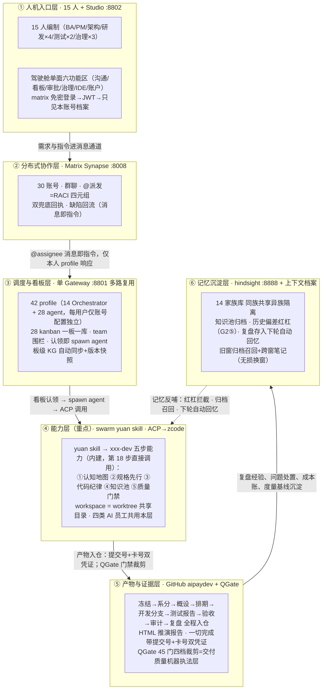

# Swarm Studio 全流程推演方案

> **文档定位**：全流程推演唯一正本（终态）。本文只描述推演的目标、机制设计、场景、执行要求与验收标准五件事；历史沿革、历轮事故与违例先例、执行态记档、工程补丁谱系与维护运维规范一律见《[推演历史与工程档案](2026-10-05-mux-history-and-engineering-archive.md)》。
> **当前基准**：报告生成器与审计器的方案解析源指向本文件（验收线"方案解析源单一"）。
> **契约层**：26 步主链、六道硬闸、治理机制、交付物模板字段，语义自本方案确立起冻结；变更须整轮推演验证。

## 阅读地图：五个部分各回答一个问题

| 部分 | 回答的问题 | 谁读 |
|---|---|---|
| 一、方案目标 | 为什么做这场推演？做完系统应能做什么、不做什么？ | 所有人（先读） |
| 二、方案设计 | 系统与流程的机制契约是什么（与具体需求单无关）？ | 设计/实现/评审者 |
| 三、推演场景设计 | 这一轮用哪张需求单、哪些角色、什么环境来跑机制？ | 执行组织者 |
| 四、执行注意事项 | 跑的时候有哪些已知约束与纪律？ | 执行/运维 |
| 五、验收标准 | 做到什么程度算达成？交付物与报告怎么验收？ | 验收/审计/报告生成 |

读法：一、二、五构成"目标—机制—判据"主干；三、四是每一轮的实例与操作层。换需求轮只换第三部分，其余不变。

## 第一部分 方案目标

### 1.1 推演要验证的三条假设

1. **分布式多 agent 研发可以按真实公司流程交付真实需求**：15 人编制（每人配 AI 助理，执行细节由 AI 员工主理、人负责意图/仲裁/终验）在无办公室条件下（沟通=Matrix 聊天、任务=看板、审批=收件箱、度量=治理中心、编码=IDE 工作台），把一张真实需求单走完"冻结→系分→评审→排期→编码→独立测试→发布准出→UAT→复盘"全程。
2. **治理靠机制不靠自觉**：每个"完成"必须带双凭证（代码提交号+任务卡号）并被系统反向核验；六道硬闸守住不可逆决策；问题全记账、复盘全处置。
3. **过程可完整重现给第三方**：一份自包含的 HTML 报告让不熟悉本项目的人看懂"一张需求单怎么变成上线功能"，且每个结论可按锚点反查。

关键数字：26 步标准流程｜6 道硬闸（G1-G6）｜4 类 AI 员工｜15 人编制（30 个 matrix 账号、42 个智能体 profile）｜驾驶舱单面六功能区｜双 loop（skill 内循环×swarm 外循环）｜交付门禁 45 门按域裁剪。

### 1.2 完成后系统真实能力（效果清单，验收锚=测试报告用例/执行输出/UAT 判词）

**业务功能**：下单幂等（同一订单重复提交返回同一支付单号）；微信/支付宝双渠道适配（推演环境本地 mock 承载，协议字段按公开技术手册对齐，换真实凭证即可切换）；金额全链路"分"（int64）与字段 snake_case；支付结果回执与订单状态可查询，接口签名/错误码/幂等键逐条定义并落到实现与用例。

**质量（可复核数字）**：支付核心单测 ≥8 条、其余模块各 ≥6 条，全部执行且全绿（执行输出随分支提交，脚本真查）；每条验收标准有对应用例（需求-代码-测试一一对应）；缺陷报→修→验全关才准出且只认本轮记录；开发分支全部合入集成分支，基线可追溯（只许快进或 merge 增量）。

**交付与协作（过程资产）**：完整入仓文档链（冻结单→资产表→组织矩阵→任务清单→系分稿→概设→排期→测试报告→发布计划与说明→完备性检查→验收报告→工作台账→审计意见书→复盘，字段级模板见 §2.7）；全过程留痕互链（matrix event_id／看板卡号／git commit 三源互链）；治理闭环（六闸落键、问题单 100% 处置、经验入家族记忆库）。

**呈现**：HTML 报告完整重现全过程（每步四问+全量呈现，见 §5.4/§5.5）。

### 1.3 不做什么（边界）

- 不接真实渠道资金流（推演环境一律本地 mock，密钥不出服务端）；
- 不验证性能与容量指标（SLA 数字只登记不实测；容量预算属执行约束，见 §4.2）；
- 不做多需求并行（一轮一张需求单；多轮同需求双跑对比属长线记档项）。

## 第二部分 方案设计（机制契约，场景无关）

### 2.1 四组件底座

| 组件 | 是什么 | 设计初衷 | 在 26 步中的角色 |
|---|---|---|---|
| Swarm Studio（产品面） | 桌面应用（Electron+Vue），驾驶舱单面六功能区（沟通/看板/审批/治理/IDE/账户）；服务端治理域（治理中心/变更治理/知识图谱治理/驾驭工程/无损换窗/看板/审批/运行观测）工件保存即提交 git | 把"为可监督性设计"做成产品功能；工件必须真实可编辑，禁只读摆设件 | 层①人机入口：全流程唯一操作面；治理中心承载六闸工件与复盘度量；IDE 工作台承载第 25 步 |
| hermes agent（运行时） | 自改进个人 agent 运行时，单网关进程多平台接入（一机一网关服务全部 profile）；kanban 引擎（约 20 CLI 模块+watchers/dispatcher，认领即 spawn）；skills 引擎（slash 命令体系）；审批传输（once/session/always/deny 四态，超时 fail-closed）；矩阵集成（反应审批/`!` 命令路由/线程） | 两大不变量：逐会话前缀缓存神圣（中途变更历史/工具集/记忆=毁缓存翻倍成本，唯一例外压缩）；核心是窄腰、能力在边缘 | 层③调度与看板：认领即 spawn、消息即指令的执行底座；层⑥记忆沉淀宿主 |
| Matrix（协作底座） | docker matrix-synapse 承载全部账号的房间/线程/反应/DM 协作语义；element-web 交互模式按需吸收（Spotlight 混合搜索/跳未读条/permalink 内链等） | 指令通道与数据通道分离；消息/反应/线程都是可反查凭证；群聊=分布式协作一等现场 | 层②分布式协作层：步 8-19 的派发/回执/审批/缺陷对话现场 |
| swarm yuan skill（能力层） | 元技能生成器：对任意代码仓库跑一次，产出项目专属研发能力技能；五步研发能力内建（①认知地图②规格先行③代码纪律④知识池⑤质量门禁）；xxx-dev 定制技能生成机制（lite/standard/compliance 三档六段式骨架） | AI 瓶颈在"懂不懂项目"：不懂规矩交给门禁、想错逻辑交给验证；宿主管循环与沙箱，技能只管项目上下文 | 层④能力层：步 13 系分与步 18 编码五步能力的内建来源 |

（各组件工程锚点谱系见《推演历史与工程档案》工程附录 A。）

### 2.2 AI 员工编制（对标行业实践）

行业（银行卡清算领域）《AI 增强的研发运维模式建设》把研发职能收拢为三类 AI 员工；本方案全量吸收并延伸第四类：

| AI 员工 | 一句话职责 | 对应步骤 | 用的技能 | 人必须确认的节点 |
|---|---|---|---|---|
| 需求设计 | 把模糊业务诉求转成可开发的设计包 | 7-16 | requirements-analyst（金融支付领域知识+OCR 双路提取）+架构设计技能 | G1 上锁、G2 评审、定稿 |
| 应用研发 | 在流水线中自动完成编码与自评审 | 17-18 | xxx-dev（swarm yuan 为仓库生成的定制研发技能） | 分诊确认、提测 |
| 质量测试 | 用例生成、智能回归与缺陷归因 | 19-21 | defect-loop（报→修→验闭环）+测试 agent | UAT 逐条核对、发版人工批准 |
| 研发治理（本方案延伸） | 台账、审计、复盘与度量 | 22-24 | pm-planning、capability-report | 复盘确认、行动项认领 |

两大共性挑战的应对：**随机性与准确性**——结构化输出强制规范（RACI 字段/AC 可判定）、双凭证反向核验、历史偏差红杠（G2 检查项⑤）、审计抽检 AI 结论（每轮 3 条反核，幻觉率入治理报告）、复现留痕（模型通道与版本+关键回合输入输出存档）。**组织协同与信任**——人工只在"人必须确认的节点"卡点，其余 AI 主理；全程留痕（冻结凭证/问题台账/双兜底回执/家族记忆库）。

### 2.3 六层架构

整个系统按"一次任务的完整旅程"分六层，自上而下即执行逻辑（A4 演示版 `2026-09-25-mux-v3-fig.html`）。六层与 26 步的对应：层①②承载步骤 1-13（环境、登录、建群、派发），层③承载看板与调度（步骤 10-18），层④承载五步研发（步骤 13、18），层⑤承载全部产物入仓（贯穿），层⑥承载记忆沉淀（步骤 24 存、下轮取）。



图读法：六层自上而下=一次任务的完整旅程；层间箭头=上一层交给下一层的接口（消息即指令、认领即执行、双凭证入仓、复盘沉淀）；虚线=记忆反哺能力层；能力共享（网关/通道/技能模板/模型/中央仓/记忆服务全编制同构）与档案隔离（profile 配置、看板、记忆 bank、ACL、state 按账号独立）并行；四道硬闸横切主链，凭证核验、问题台账、回灌重报、治理报告贯穿全程。

### 2.4 26 步主链（场景动作+机制约束；验收见第五部分，执行坑见第四部分）

> 每步条目=场景动作与机制约束，尾行（把关：…）为验收一行摘要（报告解析锚；全量判据以 §5.2 为准）。
>
> 阶段导航：环境准备 1-4（账号→配置→登录→冒烟）｜需求管理 5-7（资产表→组织矩阵→G1 上锁）｜需求分析 8-14（建群预邀→派发→登记→拆分→分诊→四路系分→汇总定稿）｜设计评审与排期 15-17（G2 评审→收官→排期）｜编码 18（G3 门禁）｜测试与交付 19-21（G4 独立验证→G5 发布准出→UAT 对账）｜治理与复盘 22-26（台账→G6 复盘→IDE 介入→HTML 报告）。

1、管理员为所有用户分配 matrix 账号，账号信息包括 matrix 地址、账号、access token、登录密码等。编制 15 名成员（主管 admin、BA、产品经理A、4 名研发、2 名测试、架构治理、安全 secops、运维 ops、合规审计 audit），各配人类账号与 AI 助理账号，共 30 个 matrix 账号。账号创建/分配在设置→账户管理界面完成（synapse 管理 API），本机↔matrix 双账号管理联动，roster 由界面维护并导出入仓，不依赖脚本直建。
（把关：凭据=30 账号逐一登录验证通过、账号清单入档 roster；合格线=账号与人员编制表一一对应。）

2、每个用户配置初始化：hermes agent gateway 配置 Orchestrator agent channel（matrix 地址、账号、access token；本机为单 gateway 多路复用，等价于每台电脑独立 gateway，每用户仅账号与配置不同）；同时装配协作 kanban（每人 2 块独立看板，每块挂自己的研发专职 agent 团队，看板认领白名单锁定——别人的 agent 认领不了你的任务）与独立记忆库。
（把关：凭据=每用户"账号+配置+看板+团队+记忆库"装配清单可逐项列出；合格线=四件套齐全且互不可见。）

3、每个用户打开 swarm studio 登录：默认 matrix 账号免密自动登录（凭 gateway 已配置的 Orchestrator agent channel），也可登录页用 matrix 地址+账号+密码登录。
（把关：凭据=全部账号登录通过、登录后只见自己档案与看板（抽查跨账号不可见）；合格线=免密与密码两种方式都通。）

4、环境冒烟：账号/服务/登录/看板/团队围栏/记忆库冒烟清单全绿，推演正式开始。主侧栏一级入口仅「驾驶舱」（+系统折叠组），全流程 UI 操作不出 /app 路由树，登录页除外。冒烟四组：①页头「任务」「在线」chips 下拉核对；②日程按钮+运行中心「工作流」页签三区块加载非空；③吸收面（Spotlight 混合搜索/群聊跳未读条/通知未读线程聚合/治理运行态卡）；④逐项截图入档。
（把关：凭据=冒烟清单全绿；合格线=零红灯，环境问题如实记问题单不算产品缺陷。）

5、应用初始化：hermes agent 安装后已默认存在一批智能体（hermes profiles）；对本项目研发的 4 个应用模块（csw-pay-core 支付核心、csw-channel-wechat 微信渠道、csw-channel-alipay 支付宝渠道、csw-cashier-mp 小程序收银台）逐一登记资产表（应用/负责人/专属看板/技术栈/SLA 级别/测试骨架在位核对）。新立项、退役同表管理。登记在治理中心·应用资产界面完成（六列表单），保存即提交 git。
（把关：凭据=应用资产表 app-registry.md 入仓库；合格线=每应用有负责人/专属看板/测试骨架，缺件记问题单不得静默。）

6、研发人员管理：生成组织与权限矩阵（人员×角色×汇报线×看板×团队×matrix 账号+权限规则+入职/转岗/离职流程+能力清单），与实际账号/看板/智能体逐项对账。角色全覆盖：需求分析师、系统分析师、项目管理、系统架构、安全管理、运维管理、合规及审计。关系维护在治理中心·组织界面；三流程走三步向导（任务移交→账号停用→审计留痕）。
（把关：凭据=组织表 org.md 入仓库、对账输出留档；合格线=15 人×看板×智能体三方零差异。）

7、BA（bella）给出客户需求文档（送达方式按场景档案 §3.1），由产品团队内部分工后发给产品经理A（fanfan）。需求文档先过"需求上锁"（G1）四项检查：①逐条验收标准可机械化判定（禁"性能良好"类空话）②写明本次不做什么（范围外清单）③影响哪些系统（模块/接口/数据）④涉不涉敏（涉敏按 ISO27001 出风险评估摘要）。四项齐→冻结标记入库（锁定清单是最终验收唯一依据）；缺项打回补齐，两轮不齐不得开工。锁后不许改，改则重新走锁。
（把关：准出=冻结文件 docs/requirements/＜RFD＞.freeze.md 入仓库；合格线=验收标准≥3 条且全部可判定。）

8、产品经理A（fanfan）根据需求文档创建群聊，邀请自己本机的 hermes Orchestrator agent（显示名为"matrix 账户名"的 AI 助理），群命名"XX需求分析讨论群"，并自动邀请全部关联人（chen/hu/lin/xiao/wei/mei/qi/fei）进群后再开始分析。
（把关：准出=群 ID 落档；合格线=命名规范、助理在群。）

9、产品经理A在群聊中 @Orchestrator agent 输入指令，并将需求文档（或对应 git 仓库地址）发到群聊。指令明确：结论必须带证据（代码提交号+任务卡号），空喊"完成"不算数。
（把关：准出=派发消息落档；合格线=指令含需求信息一行+材料地址+证据要求。）

10、Orchestrator agent 通过本机 gateway 的 matrix channel 接收需求文档与 @自己的指令任务，登记协作 kanban 任务（结构化 RACI 字段：主责/授权/咨询/通知）。机制约束：assignee 填短名（如 chen，不带域名后缀——profile 按短名过滤，格式不匹配=全部不可见）；子任务建在责任人看板上（不是自己板）；建完必须在群内逐条 @责任人-agent 发消息（不发=没人知道有任务）。自动触发任务分解，寻找系统分析智能体处理。
（把关：准出=主任务卡出现在产品经理A账号看板（超时打回重报，两轮不过记问题单中止）；合格线=卡 ID 为建卡工具返回的真实 ID（拿需求编号冒充即判虚报）。）

11、系统分析智能体接收需求文档和指令后，在当前任务 workspace 创建 git 仓库存档文档，调用需求分析技能（含金融支付转接清算领域知识+通用架构设计技能）开展工作：①需求文档切分转换、图片 OCR 双路提取交叉核对，转 markdown（确保零信息偏差），按需求模板做格式及要素评估；②依据三个清单（人员清单=matrix 服务端账号；应用模块清单=各账号上报的本机 kanban/teams/agent 能力；组织清单=步 6 的 org.md 与步 5 的 app-registry.md）完成需求分析与任务登记拆分；③拆分规则：先按应用模块职责初划分与模块匹配，再按最新整体架构统筹调整（最小改动/减少重构/同类合并），形成 SMART 任务清单具体到责任人，登记到自身 kanban 任务；④自动邀请所有关联人进群，按 RACI 在群内逐条 @派发（双 @：责任人+团队负责人，附完整任务文档与任务明细），并创建逐条关联跟踪任务（父子依赖，全部完成后更新关闭主任务）。
（把关：准出=任务清单文件入仓库（超时硬失败）+完成凭证双向核验+四组 RACI 派发消息齐全+关联人全部进群；合格线=SMART 清单具体到人、三清单齐、分工走结构化字段。）

12、具体负责员工及团队负责人账号收到逐条任务消息后，其本机 Orchestrator agent 登记代办 kanban 任务。团队负责人在分诊台手动初步确认及调整负责人（triage→todo），然后将任务经 matrix 发给具体负责员工；负责员工直接领用确认后推进（见步 13），完成后务必发消息给团队负责人及发起人/转派人要求更新（双兜底，避免遗漏）；重复收到派发则 agent 自动合并去重。
（把关：准出=四主责账号看板出现任务卡+lead 确认完成；合格线=分诊记录留痕、去重生效。）

13、具体负责员工收到任务后，由其本机 Orchestrator agent 寻找合适 agent（调研设计/测试/应用专职研发 agent）做精准需求分析、跨模块交互接口与数据模型设计、工作量评估（结合历史数据个性化评估）。标准流程：①在看板任务 workspace 下创建 worktree，材料/要求/仓库地址/环境链接/历史需求设计文档统一存放（相关 agent 共享该 workspace，并行工作，完成后合入任务 feature 或 fix 分支）；②使用 swarm yuan skill 为该 workspace 代码仓库生成的定制研发技能（xxx-dev）中的资产梳理与开发流程方法深入分析，输出初步确认结论、需澄清内容、概设方案、前置依赖、风险点、必须补充确认要素、工作量评估；③过程中可经 matrix 向应用外协作方账号确认架构与协作内容（派发任务）；④结果自动经 matrix 反馈自身团队负责人与任务发起方（同一人则去重）。
（把关：准出=四份系分稿入仓库（各限时）+完成回执双兜底齐全（超时记问题单）；合格线=概设含接口签名/数据模型/错误码/幂等键、工作量评估有人日。）

14、产品经理A收到主责研发人员（及其团队负责人确认后）的任务完成消息后，逐步更新前序 kanban 任务进度，关联派发任务全部完成后汇总总稿（系统分析及工作量评估方案），调用全局需求分析与架构设计技能复核（消歧/消冲突/理层次，按规范形成系统概设方案），发起评审 kanban 任务（虚拟架构小组：线下人工组织或派发架构治理成员账号，本次先线下人工评审由产品经理A手工更新进度），定稿形成需求规格及架构设计方案。
（把关：准出=概设方案入仓库+评审任务卡登记；合格线=金额统一"分"（int64）、字段 snake_case、结构层次成规范文档。）

15、（G2 架构治理评审）概设定稿后派发给架构治理成员（arch）评审：①设计五要素齐备（背景/方案/接口/数据/风险）②爆炸半径排查（变更影响模块对照三清单）③验证计划前移（测试要点设计期已列）④备选方案≥2 且有取舍理由⑤历史偏差红杠（自动检索家族记忆库与问题单台账历史偏差，命中项设计稿未显式回应规避即打回）。结论 PASS/FAIL 入群，FAIL 打回修订复评一轮；不过不得进入排期。评审卡由评审人账号登记（导演补登记不置 done，保留"评审记录待补"待评审人补记后方可关闸）。
（把关：准出=评审结论行+架构评审卡关闭；合格线=五项检查逐条留痕、历史偏差检索结论附设计稿。）

16、产品经理A基于定稿需求规格与架构设计方案、工作量评估结果，修正最初的需求系统分析 kanban 任务（登记所有关联子任务及工作过程档案汇总，便于回溯审计），标记完成（测试工作量按 0.3 系数直接叠加评估）。
（把关：准出=主任务卡置完成（限时）；合格线=档案汇总可回溯、0.3 系数口径写入。）

17、产品经理A按定稿规格、工作量评估、开发人员当前负载、业务交付时间、测试人力资源，编排详细开发计划测试任务（调用项目管理及研发治理 PM 技能），生成带时间窗口的 kanban 任务，登记本机代办，经 matrix 发送计划明细给主责研发/测试及其团队负责人，并登记为 kanban 子任务追踪。
（把关：准出=排期文档入仓库（限时）+父子任务卡齐+逐条派发消息落档；合格线=测试量=开发×0.3 独立成项、整体+15% 缓冲、每任务有时间窗口与依赖。）

18、研发/测试人员及团队负责人收到开发及测试任务消息后，由其本机 Orchestrator agent 登记协作 kanban 分诊台，人工确认后推进：①寻找合适 agent；②在任务 workspace 创建 worktree（同步 13 约定），使用 xxx-dev 内建五步能力开发：认知地图（先读资产梳理认识仓库结构与依赖）→规格先行（无设计不编码，严格对照定稿概设）→代码纪律（需求-代码-测试一一对应，每条验收标准落到用例）→知识池（用例/缺陷/失败打回数据归档家族记忆库）→质量门禁（白盒扫描/单测/接口/回归全绿并通过自评审，缺陷就地闭环）——聚焦接口、数据模型、逻辑功能实现或用例编写执行；③过程中可经 matrix 向应用外协作方确认架构协作细节；④结果自动反馈团队负责人、发起方、测试负责人及主责测试（同一人去重），各方更新对应 kanban 进展。
（把关【G3 编码门禁】：准出=四条开发分支入 origin（各限时）+本地测试运行输出证据落档（docs/evidence/＜任务＞-testlog.txt 随分支提交，脚本逐分支真查）；合格线=无设计不编码、pay-core 单测≥8/其余≥6 且全绿、金额分 int64、渠道请求本地 mock。）

19、测试人员识别缺陷则经 matrix 反馈对应研发人员；研发账号收到后由其测试智能体复现确认，派给应用研发智能体自动修复及自测，开发人员人工处理 kanban 任务并发起提测。测试通过后由测试 agent 更新 kanban 任务，登记测试通过的 git commit id 到所有关联开发/测试/需求卡，出具测试报告（提供仓库地址）。缺陷归因三态（需求/编码/环境）随报告入仓，按根因分布计入治理报告度量。
（把关【G4 独立验证】：测试的人不能是写代码的人；缺陷闭环=报→修→验全关且只认本轮派发后记录（防旧账充数）；准出=测试报告入仓库（范围/用例数/通过数/缺陷清单/结论/通过 commit id）+commit id 回填关联卡；合格线=证据证明真跑过（附执行输出摘要），"有测试代码"不算。）

20、（G5 发布准出）产品经理A发起变更发版及交付动作前，先过发布检查（套发布计划/发布说明模板）：①测试证据已挂关联卡 ②构建产物同 commit 可复现 ③依赖无新增 ④回滚方案具体化（数字阈值触发+命令级步骤+72 小时观察窗口与盯梢项）⑤灰度 5%→25%→100% 各档观察期 ⑥发布说明面向用户收益（不贴提交罗列）⑦对外发布须人工批准（HumanGate 批准留痕）。同时套用交付标准模板库（DELIVERY-STANDARD-COMPLETE 及关联模板，模板不满足实际需要直接完善再用），并对所有任务做分类/优先级/依赖完备性检查（防多漏错重）。七项全过才许发布；判词只认评审卡结构化字段（末判词赢/多行取最新/卡面与消息双源合并 FAIL 优先），FAIL 即发布冻结（REL-* 关联卡置 blocked 记问题单，解冻=缺项闭环+复审 PASS）。
（把关：准出=七项结论入群+准出卡关闭+完备性检查报告入仓库；合格线=缺项打回一轮，两轮不过不得上线。）

21、产品经理A发起变更发版及交付动作（先线下处理，但登记应用主责人员关联任务追踪）。随后业务验收（UAT）：BA 拿步 7 锁定的验收标准逐条对账——产品经理A助理逐条给出证据锚点（分支/测试报告/提交号），BA 逐条核对，全过出验收报告入仓库（含上线 SLA 登记：可用性 99.5%/下单 P95≤800ms/P2 事件 4h 响应），任一条不过即缺陷回流（回步 19 语义）。每条 AC 判词三态（通过/有条件通过/不通过）逐条落判词，结论=判词汇总禁矛盾总括；有条件/不通过不构成无条件验收，放行权归需求提出方。
（把关：准出=验收报告入仓库且锁定标准全过（限时）；合格线=助理结论行逐条列出每个 AC 编号与证据锚点（脚本逐条覆盖核验，缺条即不通过）、每条证据可反向核验。）

22、研发工作管理（全程可出，独立管理步）：随时生成工作台账——每人各类状态任务分布（待办/进行中/评审/完成）、同时在手（进行中）≤2、卡 72 小时不动的任务清点、未完结任务由产品经理A决定挂起或移交下轮。
（把关：准出=工作台账 work-report.md 落档（每人状态分布、WIP、卡壳 72h 清单均真查数据）；合格线=超负载记问题单、卡壳任务 100% 有处置意见。）

23、合规及审计管理（audit 账号独立签名线）：审计门禁留痕完整性（每道闸冻结凭证在仓库）、问题单台账格式、取证目录在位；出具合规审计意见书入仓库；对可疑凭证抽检，另抽 AI 结论（每轮 3 条"完成"结论反向核验凭证真实性，幻觉率入治理报告）。审计与开发/测试线独立。意见书分层：导演侧机械化检查与独立复核结论分列，不一致以独立意见为准并勘误改判留痕；发现与改判逐条入处置台账回灌 issues.log。
（把关：准出=合规意见书入仓库（独立性声明/抽检记录/关切清单/分层签名线字段齐）；合格线=发现 100% 记问题单、意见书带签名线。）

24、复盘（G6）：三段式——现象（只写事实）/规律（机制归因，对事不对人，写"某人失误"不合格）/下轮验证（行动项四要素：事项/负责人/期限/验收判据）；自动产出治理报告（各闸一次通过率、证据一次通过率、缺陷统计、打回次数、AI 贡献口径）；复盘中对模板文档的改进项直接落实（资产回写）；本轮经验存入家族记忆库（hindsight）下轮同需求自动回忆。问题单台账在此 100% 清点（处置三态：已修/观察/延后），DISP 每条一行回写 issues.log 本体。
（把关：准出=复盘文档+治理报告入仓库；合格线=问题单 100% 有处置记账——每条一行 DISP，复盘文档自动列全表、未处置如实标"待处置"并计数入问题单、行动项四要素齐。）

25、"IDE 工作台"全程介入（产品路演重点）：kanban 任务由具体 agent 在对应 workspace 启动后，由 hermes agent ACP 调用 claude code、codex、zcode 等编程工具加载 yuan skill 及 xxx-dev skill 完成；IDE 工作台的目的就是取代上述编程工具由 ACP 调用——基于 zcode 底座、调研吸收主流 code/work 工具形成。协作中可随时跳转接入；进入即见任务全局概览与各环节信息（任务跳转时主动生成任务简报），含交互式编码开发、git 图谱查看、模型设置。
（把关：准出=IDE 核验记录落档（任务跳转/简报生成/界面组件在位）；合格线=可从任务一键跳进工作台并出简报。）

26、生成 HTML 推演报告（产品路演交付物）：用内置浏览器（截屏或 playwright / chrome dev tools / computer use 等方式操作）真实走查并捕获截图：驾驶舱（看板/任务/简报）、协作沟通（建群/派发/RACI/缺陷闭环对话）、IDE 工作台（任务跳转/简报/交互编码/git 图谱/模型设置），配合各步执行状态、问题单台账、闭环治理报告，形成端到端全流程演示文稿。报告规范与验收唯一事实源=第五部分 §5.4/§5.5。
（把关：准出=simulation-report.html 生成；合格线=26 步状态真实（执行过✅、没执行⬜，不作假）、截图三界面齐、问题单与治理报告挂接。）

### 2.5 产品承载面清单（产品设计事实，按步键控）

| 步 | 产品承载面（路由/组件/语义） |
|---|---|
| 4 | 冒烟四组：页头任务/在线 chips、📅 日程、运行中心「工作流」页签、Spotlight 混合搜索（命令组≥8 行/三组混排/Enter 直达）、群聊跳未读条、通知未读线程聚合、治理运行态凭证池卡+cron 运行史卡（诚实缺席不炸）、收件箱放行建议折叠区 |
| 5 | 治理中心·应用资产（#/app/gov）六列表单，保存即 git；app-registry.md 与界面双向一致 |
| 6 | 治理中心·组织界面；三步向导（移交→停用→留痕）；org.md 同步入仓 |
| 7 | 治理中心 G1 工件区（#/app/gov）；冻结标记入仓（锁后不许改） |
| 9 | 消息操作栏「复制链接」产出 studio 内链（#/app/s/room/:roomId?event=:id）派发原文锚点直跳取证；≥3 条系统事件折叠一行可展开 |
| 10 | 看板页 /app/board，入口=注意力条最左「swarm kanban」；第四页签「全链路追踪」（?tab=observatory）拓扑/时间筛选/检索/下钻；列编排 columns.yaml 可声明 requiredArtifacts（缺件不过列）；板级 KG 随任务结案自动同步（KG_AUTO_SYNC 总闸/三档去重/版本快照） |
| 13 | skill 过程展示位：xxx-dev 生成 ≥3 帧+开发调用 ≥2 帧入报告 |
| 15 | arch-governance 板评审卡；结论行回房+评审卡判词同步 |
| 17 | 排期板 fanfan-pm-plan |
| 18 | 运行观测面：IDE 侧栏「∿ 轨迹」会话轨迹账本、运行中心「常驻意图」卡、治理运行态凭证池卡（G3 运行证据可视化补充，不替代 testlog 真值）；保真形态下 background_review 收敛为治理卡点（工作线程纯命令 body `!refine <闸>` 显式触发） |
| 19 | 取证链：测试案例/数据/执行输出/报告逐项截屏，环节流转现场逐节点截屏；IDE History ⋐ 网关真分叉（confirm 明示不可逆→POST /api/sessions/{id}/fork；zcode 会话 404 降级剪贴板） |
| 24 | 治理中心平级真页签+五分区二级导航（URL 不变 #/app/gov）；治理报告度量面挂驾驭工程四件（六类成本账/L1-L5 自检/能力目录/八原语对账）；KG 演化治理态在知识分区 |
| 25 | IDE 画布路由归一 /app/ide（IaShell 子路由全屏画布），任务右栏 ⌨IDE 与页头视图切换进入，旧 /ide 深链兼容重定向；ide?task= 到达即自动展开任务简报抽屉；🕘 History 浏览器（定位/复制/编辑重发/fork）；运行中心蓝图画廊；治理工件可编辑（保存即本地 git 提交+新鲜度徽标）；会话上下文无损滚存（旧窗 verbatim 归档召回+跨窗笔记） |
| 26 | 截图口径「三界面」=驾驶舱三功能区（工作台/看板/IDE 画布），capture 断言统一 ^/app；新观测面各 ≥1 帧按 §5.6 快门守门；desktop 深链 swarmstudio://（白名单 /app 与 /matrix 树） |

### 2.6 治理机制（设计性条款）

1. 四道锁直接拦：需求未上锁不分析（G1/步 7）、设计未评审不排期（G2/步 15）、测试未过不发布（G4/步 19）、发布检查未过不上线（G5/步 20）——锁不过，后续步骤脚本直接拒绝执行。
2. 说话给证据：一切"完成"结论必须带代码提交号+任务卡号，系统反向核验（提交真在仓库且含产物、卡真在账号板），查不到打回重报，两轮不过记问题单中止。
3. 问题全记账：全过程问题单台账（类型|主体|描述），复盘逐条清点，100% 有处置结论。
4. 打回不静默：任何超时/拒收都把原因回灌给对应 agent 限期重报，不许默默失败。
5. 度量看治理报告：各闸一次通过率、证据一次通过率、缺陷密度、打回次数——下次推演目标即上次基线+1。
6. 可复现与 AI 贡献度量：每轮记录模型通道与版本、关键回合原始输入输出留档；治理报告含 AI 贡献口径（AI 主理回合数与占比、人工介入次数）。
7. 指令通道与数据通道分离：agent 只响应 @本人 指令语义，文档正文不作指令执行。

### 2.7 交付物体系与模板字段（缺一打回的唯一依据）

每个环节"拿什么交差"落到模板字段——任务书/派发词/报告生成的唯一依据；报告侧嵌真容渲染并逐节核对；缺模板或模板不满足实际需要时，按步 20 约定直接完善模板库再用，不绕开。

| 环节（步） | 交付物 | 模板字段（缺一打回） |
|---|---|---|
| 需求上锁（7/G1） | `docs/requirements/<RFD>.freeze.md` | RFD 编号与需求名｜背景一句话｜AC-1..n（每条可机械化判定，≥3）｜范围外清单｜影响面（模块/接口/数据）｜涉敏评估（涉敏附 ISO27001 摘要）｜冻结时间与提交指纹（origin/main 可反查） |
| 应用资产（5） | `docs/admin/app-registry.md` | 应用名｜负责人｜专属看板｜技术栈｜SLA｜测试骨架在位核对；新立项/退役同表流转 |
| 组织权限（6） | `docs/admin/org.md` | 人员×角色×汇报线×看板×团队×matrix 账号六列对账｜权限规则｜入职/转岗/离职三流程（移交+停用+留痕）｜能力清单 |
| 系分拆分（11） | SMART 任务清单（入仓） | 任务 ID｜任务名｜应用模块｜责任人（短名）｜RACI 四元组｜预估人日｜依赖；先按模块职责初分再按架构统筹 |
| 系分稿（13） | `docs/analysis/AN-<模块>.md` | 需求理解与初步结论｜需澄清｜接口签名清单｜数据模型｜错误码表｜幂等键｜概设方案｜前置依赖与风险｜工作量评估（人日） |
| 概设定稿（14） | `docs/design/` 概设方案 | 定稿汇总（消歧/消冲突/理层次）｜金额统一"分"int64｜snake_case｜结构层次成规范文档 |
| 排期（17） | `docs/plan/` 排期计划 | 任务×时间窗口×依赖｜测试=开发×0.3 独立成项｜整体+15% 缓冲｜按负载/交付窗/测试资源编排 |
| 编码（18/G3） | 开发分支+`docs/evidence/<任务>-testlog.txt` | 分支含实现与用例｜测试执行输出随分支提交（脚本真查）｜五步能力过程可追溯 |
| 测试报告（19/G4） | `docs/test/` 测试报告 | 范围｜用例数｜通过数｜缺陷清单（归因三态）｜结论｜通过 commit id（回填全部关联卡）｜执行输出摘要 |
| 发布准出（20/G5） | 发布计划+发布说明+完备性检查 | 七项（证据挂卡/同 commit 复现/依赖无新增/回滚数字阈值+命令+72h 观察窗/灰度三档/用户收益/人工批准留痕）；另附完备性检查（分类/优先级/依赖，防多漏错重） |
| 验收（21） | `docs/acceptance/` 验收报告 | 每条 AC×判词三态×证据锚点｜结论=判词汇总（禁矛盾总括）｜SLA 登记 |
| 工作台账（22） | `work-report.md`（中央仓根） | 每人状态分布｜WIP 清点（≤2）｜72h 未动任务清点与处置 |
| 审计（23） | `docs/retro/` 合规意见书 | 留痕完整性核对｜台账格式核对｜取证目录在位｜抽检记录（含 3 条 AI 结论反核）｜独立性声明｜关切清单｜分层签名线 |
| 复盘治理（24/G6） | 复盘文档+治理报告 | 三段式｜行动项四要素｜治理度量实算｜问题单 DISP 三态全表（回写 issues.log）｜记忆库沉淀记录 |

## 第三部分 推演场景设计

### 3.1 场景档案：RFD-001 收银台（当前实例）

| 项 | 值 |
|---|---|
| 需求 | 收单商户多端小程序支付收银台（依据财付通/支付宝公开技术手册，兼容微信/支付宝双渠道） |
| 编制 | 15 人（主管 admin/BA bella/产品经理A fanfan/研发 chen·hu·lin·xiao/测试 qi·fei/架构 arch/安全 secops/运维 ops/审计 audit），各配 AI 助理，共 30 个 matrix 账号 |
| 中央仓 | https://github.com/issac-new/aipaydev（0→1 轮起跑=远端仅 main、九目录零文件〔admin 三张注册表除外〕） |
| 应用模块 | csw-pay-core（支付核心）/csw-channel-wechat/csw-channel-alipay/csw-cashier-mp |
| 环境拓扑 | 单 gateway :8801（42 profile 多路复用）+ studio :8802 + synapse :8008 + hindsight :8888；每人 2 块看板挂专职 agent 团队；家族记忆库按"用户名+MAC"分仓 |
| 场景专属约定 | 本期邮件通道禁用，需求文档以 matrix 私信送达（记问题单口径）；模型通道支持备用切换（MX_MODEL_BASE_URL/KEY/NAME 整编制改道+MX_FALLBACK_MODELS 多通道声明） |

### 3.2 场景参数与机制不变量（换需求轮声明）

换 RFD（RFD_ID=RFD-00X）时**只换**：需求文档与 AC 清单、涉及的应用模块集、场景专属约定列。**不变**：26 步主链与六闸（§2.4/§5.3）、治理机制（§2.6）、交付物模板（§2.7）、执行纪律（§4.3）、验收体系（§5）。场景剧本（谁在哪个群做什么）属机制在场景上的实例化，随 RFD 重派但不改机制本身。

### 3.3 场景段与方案步号映射（唯一事实源）

场景驱动（aipay-scenario.sh）的执行段（stage）与 §2.4 方案步号不是一一对应（一段可覆盖多步、一步可由两段合承）。本表是唯一映射事实源——报告生成器的叙事表（STEPS_META）、操作路径表（steps_entry）、交付物表（ARTIFACT_VIEWS）与审计器的步态断言必须自本表派生或逐行对齐，并配守门测试（改任一端，测试当场失败）。

| 方案步 | 场景 stage | state.env 落键 | 备注 |
|---|---|---|---|
| 1-4 | smoke | smoke_done（步 1 另锚 roster 清单与 jwt_* 键） | 账号/配置/登录/冒烟四合一段 |
| 5 | appinit | appinit_done | 应用资产表 |
| 6 | people | people_done | 组织权限矩阵 |
| 7 | ba + reqgate | g1_frozen（另锚 dm_bella_fanfan / ba_dm_marker） | 需求私信送达+G1 冻结 |
| 8 | room | room_analysis | 建群预邀 |
| 9 | dispatch | dispatch_marker | 派发指令 |
| 10 | register | register_done | 看板登记+分解 |
| 11 | analysis | analysis_done / analysis_verified | 系分拆分派发 |
| 12 | triage | triage_done | 分诊双兜底 |
| 13 | anexec | anexec_done（分批另锚 anexec_d1/d2） | 四路系分执行 |
| 14 | review | review_done | 汇总复核定稿 |
| 15 | archgate | g2_arch_pass（另锚 card_arch_g2） | 键名=g2_arch_pass（不是 archgate_done） |
| 16 | close | close_done | 系分收官 |
| 17 | plan | plan_done | 排期 |
| 18 | devimpl | devimpl_done（闸键 g3_code_pass） | 编码 G3 |
| 19 | defect + testpass | defect_done / testpass_done（闸键 g4_pass） | 缺陷闭环+独立测试 G4 |
| 20 | ready + release | ready_done / release_done（闸键 g5_ready，评审卡 g5_rgid） | 发布准出 G5 |
| 21 | uat | uat_done | UAT 验收 |
| 22 | workmgr | workmgr_done | 工作台账 |
| 23 | audit | audit_done（另锚 audit_dispatched） | 合规审计 |
| 24 | retro | retro_done | 复盘 G6 |
| 25 | ide | ide_done | IDE 工作台 |
| 26 | report | report_done | HTML 报告 |

## 第四部分 执行注意事项

### 4.1 运行手册

```bash
cd simharness                         # 推演 harness 独立仓（运维规范见工程档案附录 C）
bash mux/mx-setup.sh                  # 环境供给（账号/看板/团队/记忆库/中央仓，可反复跑）
bash mux/mx-up.sh                     # 起单 gateway + 单 studio
RUN_ID=<轮次> bash aipay-scenario.sh  # 26 步一键推演
# 断点续跑 START_STEP=<步名>；区间上界 UNTIL_STEP=<步名>；换需求轮 RFD_ID=RFD-00X；协议事件 MX_DELIVERY=1
```

0→1 清环境：`bash mux/mx-clean.sh --apply --reset-central --reset-workspaces [--reset-memory]` 后 setup+up+scenario。旗标语义：`--reset-central`=中央仓九目录清空（admin 注册表保留）+清空提交推 origin/main+快照 tag+删旧轮分支；`--reset-workspaces`=agent 工作区 tar 归档后删；`--reset-memory`=14 家族记忆 bank 清场（pg_dump 归档前置）。看板整树归档重置、hermes 运行态清零（pending_messages/sessions/approvals/state*/cron）、synapse 房间 v2 purge 为缺省动作。

清环境合格线（mx-clean 自带核验+起跑前复核）：runs/ 无旧轮目录、state.env 归档移除、kanban 整树空、运行态五类清零、**房间数=0 且全部账号 joined=0**、中央仓远端仅 main 且九目录零文件、workspaces 净克隆。

起跑环境前置四条：①磁盘低水位（系统盘 <20GB 先清理）；②hindsight :8888 须先在（mx-setup 前置检查拒跑；冷启走 `~/.hermes/profiles/orchestrator/hindsight/start.sh`）；③mx-up 收尾后显式断言 gateway/studio 双 health 再起跑；④vite dev server 僵尸态（模块 504 而根 200）重启即愈，走查前先探活。

### 4.2 容量与并发预算

编制 15 人×30 账号与网关 max_concurrent_sessions（当前闸值 4）的矛盾必须预算化：

1. **峰值预算表**：系分执行四路=4（满格，任何第五消息必拒）；编码四开发+PM 收尾=4；测试双线+集成=3。峰值超闸值的步骤必须按闸值真分批（第一批完成回执后再派第二批；错峰 sleep 形同虚设）。
2. **容量拒绝语义**：容量拒绝一律进排队泵静默重试（不回声防通知风暴、不丢弃、槽腾自动重派）——网关缺此能力时该步不得四路并发。
3. **补丁面收编**：容量排队属运行时行为补丁，必须收编 runtime manifest（工程档案附录 B），工作区态视为未部署。
4. **网关重启前置**：任何计划内重启前确认无 in-flight turn（判据见 §4.3 第 2 条）。

### 4.3 执行纪律（历轮沉淀的硬规则；先例细节见工程档案"执行纪律台账"）

**等待与活性**
1. 重载任务不设绝对时长：空转判据=责任 agent 日志连续 1800s 零增长才判空转退出；无日志面退化 86400s 硬窗。UAT 等待同此口径，不用固定硬窗。
2. 判活唯一口径=责任 agent 日志活性；网关 active_agents 快照只作趋势参考不作判活依据；任何自动重启/清理前置条件=二次确认无 in-flight turn；在线面板三档（机器/agent/人员）量纲不同勿相加。
3. 多 agent 同时静默先查公共通路（网关/投递层）再判个体停摆；判死结论内建共因提示。

**派发与投递**
4. 群线程派发对部分账号丢失→导演以私聊直发任务书原文兜底（含去重脚注），兜底记录入 issues.log。
5. 网关重启后唯一有效恢复=重发完整任务书（附断点引导：检查工作区 git status/log 续作、已完成勿重做）；"续跑提示"类短消息只做字面响应，无效。
6. 建群即按 RACI 全量预邀；派发前确认接收方在群（403=未入群，补邀并记单）。
7. 完成凭证一体化：派发词结论行强制携带回执要素（如 AN-DONE-X commit=Y card=Z notified=已发），缺任一要素=未完成打回；核验侧回灌（要求补做→限时重查→仍缺才记单）为标准闭环。

**判词与台账**
8. 闸门结论只认评审卡/结构化结论字段（末判词赢/多行取最新/卡面与消息双源合并 FAIL 优先）；消息词面与转述不作凭据；FAIL 不置卡 done、不落键、进熔断。
9. 六道硬闸落键时间齐全入治理报告；缺键即报告违例。
10. DISP 处置结论逐行回写 issues.log 台账本体（复盘全表不替代记账）；措辞用三态分桶词（已修/观察/延后）；复盘计数=台账实算，禁模板话术。
11. 问题单缺 DISP 时导演可按三态补账（注明缘由、计入人工介入度量、不改写 agent 原始记录）。

**仓库与凭证**
12. 「入仓库」真值=origin/main 可反查；本地留存/"本机有稿"均判未入仓；导演补推/代投/补账一律提交信息注明缘由并计入人工介入度量。
13. 发布基线合入只许快进或 merge 增量（旧头恒为祖先），禁重建+强推回落；丢线守卫（merge-base --is-ancestor 断言）拦截即记单并回补重验。
14. 工件新鲜度：跨轮同路径工件核验必须带新鲜度（内容含本轮 RUN 标记，或提交时间晚于起跑时刻）；分支存在≠本轮交付（branch_fresh/artifact_fresh 守门）。
15. 评审卡由评审人账号登记为唯一有效路径；留痕入仓后不受控删改，删改须留痕记单。

**审计与回滚**
16. 导演侧机械化检查与独立复核分层；两层结论不一致以独立意见为准，原结论勘误改判留痕；发现与改判逐条入处置台账回灌 issues.log。
17. 独立审计可对已落键闸门判回滚：state 落键保留原值作执行流水不改写，判定以报告与处置台账为准；发布类闸门判回滚即发布冻结（关联卡置 blocked），解冻=缺项闭环+复审 PASS（书面化带期限）。

**驱动与脚本**
18. 核验/沉淀类子命令失败（jq 解析、kanban 读、消息发送）不得击杀驱动主循环——错误隔离（记单续跑）+接力器兜底；仅硬闸语义失败允许 fail 退出。
19. harness 提交前静态扫描门禁：`set -e` 裸命令族与已知脚本坑型（全角字符/空数组展开/pipefail 下赋值/算术上下文裸字符串比较/local 自引用/curl 裸赋值）提交即拦；崩溃信息必带可 grep 锚点行。
20. 判驱动状态先 grep 派发行勿只看 tail（日志尾部常被审批行淹没，误判会错发催办）；勿把旧轮工作区遗留当本轮进度。

**采集与报告**
21. 全量呈现三载荷（对话全文/操作前后帧/环节效果）的采集动作挂在驱动步内：派发即采对话，帧由巡检自动化在步骤进行中执行——跑完才补采则帧类无法补。
22. 报告导读层骨架自动生成自 state.env+scenario.log 时间线，人工只润色；按轮注册硬闸保留（禁编造叙事、禁旧轮顶包）。

**保真形态默认**：推演=真实场景的复刻实验，偏离默认行为的"优化"污染实验效度。不设 MX_* 环境变量即保真：background_review 每 turn 自动 fork 关闭（MX_BGREVIEW=0），沉淀收敛到治理卡点（`!refine <闸>`）；审批 auto 全自动（可选 hybrid=关键动作真人手批/过程性代审复核；manual=全真人）；推理档位保持宿主默认。KG 演化与无损换窗开关推演中默认全开=产品真实形态。

## 第五部分 验收标准（唯一事实源）

### 5.1 验收层级声明

验收口径的唯一事实源=本部分。层级：**§5.2 逐步验收表/§5.3 六闸判据/§5.5 报告验收清单 ＞ §2.4 步内把关括注（一行摘要，解析锚）＞ 报告渲染**。三者不一致时以本部分为准并记勘误。任何新增验收要求必须落进本部分才有效——散落在执行脚本或报告生成器里的"隐形验收线"视为未声明。

### 5.2 逐步验收表（准出/凭据/合格线）

| 步 | 准出（做完拿什么交差） | 合格线（到什么程度算合格） |
|---|---|---|
| 1 | 30 账号逐一登录验证通过；roster 入档 | 账号与编制表一一对应；界面建的账号可登录、不依赖脚本直建 |
| 2 | 每用户四件套（账号+配置+看板+团队+记忆库）装配清单可逐项列出 | 四件套齐全且互不可见 |
| 3 | 全部账号登录通过；抽查跨账号不可见 | 免密与密码两种登录都通 |
| 4 | 冒烟清单全绿（含观测面计数语义：任务计数=看板实况、在线三数>0） | 零红灯；环境问题如实记问题单不算产品缺陷 |
| 5 | app-registry.md 入仓库 | 每应用有负责人/专属看板/测试骨架；缺件记问题单不得静默 |
| 6 | org.md 入仓库+对账输出留档 | 15 人×看板×智能体三方零差异；离职流程含移交+停用+留痕 |
| 7 | freeze 文件入仓库，且以 origin/main 可反查为真值（本地留存不算；推送失败导演补推记问题单并注明缘由） | AC≥3 条且全部可判定；锁后不许改，改则重新走锁 |
| 8 | 群 ID 落档 | 命名规范、助理在群；关联人全量预邀 |
| 9 | 派发消息落档 | 指令含需求信息一行+材料地址+证据要求 |
| 10 | 主任务卡出现在 PM 账号看板（超时打回重报，两轮不过记问题单中止） | 卡 ID 为建卡工具返回真实 ID（冒充即判虚报）；群通知判据以 state 事件锚为主、文本复查窗 60s 降级观察 |
| 11 | 任务清单文件入仓库（超时硬失败不得空跑）+凭证双向核验+四组 RACI 派发消息齐全+关联人全部进群 | SMART 具体到人、三清单齐、分工走结构化字段；入仓以 origin/main 可反查为真值 |
| 12 | 四主责账号看板出现任务卡+lead 确认完成 | 分诊记录留痕、去重生效 |
| 13 | 四份系分稿入仓库（各限时）+完成回执双兜底齐全（群消息+私信双通道各一，缺一记问题单并由导演代投注明缘由） | 概设含接口签名/数据模型/错误码/幂等键；工作量评估有人日 |
| 14 | 概设方案入仓库+评审任务卡登记 | 金额统一"分"int64、snake_case、结构层次成规范文档 |
| 15 | 评审结论行+架构评审卡关闭 | 五项检查逐条留痕；历史偏差检索结论附设计稿；评审卡登记人=评审人账号可反查 |
| 16 | 主任务卡置完成（限时） | 档案汇总可回溯；0.3 系数口径写入 |
| 17 | 排期文档入仓库（限时）+父子任务卡齐+逐条派发消息落档 | 测试=开发×0.3 独立成项；整体+15% 缓冲；每任务有时间窗口与依赖 |
| 18 | 四条开发分支入 origin（各限时）+testlog 随分支提交（脚本逐分支真查，缺件记问题单） | 无设计不编码；pay-core≥8/其余≥6 且全绿；金额分 int64；渠道请求本地 mock；G3 落键可反查 |
| 19 | 测试报告入仓库+commit id 回填全部关联卡 | 测试者≠写码者；缺陷报→修→验全关且只认本轮记录；执行输出摘要证明真跑过；实跑 commit 与发布基线同祖（merge-base --is-ancestor 可验） |
| 20 | 七项结论入群+准出卡关闭+完备性检查报告入仓库 | 判词只认评审卡结构化字段；HumanGate 批准事件入 approved.events 可反查；FAIL 即发布冻结 |
| 21 | 验收报告入仓库且锁定标准全过（限时） | AC 逐条判词三态+证据锚点（脚本逐条覆盖核验，缺条即不通过）；结论=判词汇总禁矛盾总括；UAT 启动前自检：freeze 在 origin/main、测试报告在 origin/integration（发布基线口径） |
| 22 | work-report.md 落档中央仓（每人状态分布/WIP/卡壳 72h 均真查数据） | 超负载记问题单；卡壳任务 100% 有处置意见 |
| 23 | 合规意见书入仓库（独立性声明/抽检记录 3 条实查/关切清单/分层签名线字段齐） | 发现 100% 记问题单；独立复核未回执如实留空不代签 |
| 24 | 复盘文档+治理报告入仓库 | 问题单 100% DISP 回写台账本体；未处置如实标"待处置"并计数；行动项四要素齐；度量实算 |
| 25 | IDE 核验记录落档（任务跳转/简报生成/界面组件在位） | 可从任务一键跳进工作台并出简报 |
| 26 | simulation-report.html 生成（状态以产物存在性与生成时间回填，禁自标） | 26 步状态真实不作假；报告验收=§5.5 全线 |

### 5.3 六闸判据（逐项清单，全过才 PASS）

| 闸 | 把关标准 | 证据形态 |
|---|---|---|
| G1 需求上锁 | ①逐条 AC 可机械化判定（≥3，禁空话）②范围外清单③影响面（模块/接口/数据）④涉敏评估（涉敏出 ISO27001 摘要）⑤两轮不齐不得开工 | freeze 文件四要素+AC 编号清单 |
| G2 架构治理评审 | ①设计五要素（背景/方案/接口/数据/风险）②爆炸半径排查（对照三清单）③验证计划前移④备选方案≥2 且有取舍⑤历史偏差红杠（命中项已显式回应） | 评审记录结构化留痕+检索结论 |
| G3 编码门禁 | ①无设计不编码②需求-代码-测试一一对应③pay-core≥8/其余≥6 全绿④金额分 int64⑤渠道本地 mock⑥testlog 随分支脚本真查⑦落键 g3_code_pass | DEV 分支+testlog+落键时间戳 |
| G4 独立验证 | ①测试者≠写码者②缺陷报→修→验全关③只认本轮记录④测试报告六要素⑤执行输出证明真跑⑥实跑 commit 与基线同祖 | 测试报告+commit 回填关联卡 |
| G5 发布准出 | ①测试证据挂卡②构建同 commit 可复现③依赖无新增④回滚具体化（数字阈值+命令级+72h 观察窗）⑤灰度三档各档观察期⑥发布说明面向用户收益⑦HumanGate 批准可反查；判词只认评审卡结构化字段；FAIL 即冻结 | 七项结论行+评审卡 body+批准事件 |
| G6 复盘 | ①三段式②行动项四要素③治理度量实算④问题单 100% DISP 回写⑤经验入家族记忆库 | 复盘文档+治理报告+台账 |

### 5.4 报告规范（形式与每步结构）

**形式**：单文件 HTML 双正本制——`final-report.html`=唯一人读正本（导读层+机器报告全文嵌入）；`simulation-report.html`=机器档案（生成器直出，重生成后重嵌入正本）；均落 runs/＜RUN_ID＞/evidence/。生成器=mx-report-gen.py（`--run` 必带，方案解析源=本文件）；合并=final-report-merge.py。元信息（标题/RUN_ID/生成时间/基线 commit/计数）全部从 RUN 数据派生，禁硬编码。图 base64 内嵌自包含；页内锚 #step1-26 与 #cp-g1..g6 互链。

**每步四问（固定结构，顺序不得变）**——报告每个步块必须依次回答：

1. **这一步实际做了什么**：真实操作记录（谁、何时、在哪个通道做了什么动作），锚点=matrix event_id／git commit／看板卡号三源之一；本轮未执行的步如实标 ⬜ 并说明卡点。
2. **拿什么交付物证明**：该步交付物真容渲染（中央仓真实文件带 commit 锚+解析源标注）+**字段级模板核对**——核对项=§2.7 该步字段清单逐字段断言（字段在位=✅、缺=红），禁关键词包含命中充数；内嵌渲染可截断（长文档结构化摘录），但必须带全文锚（路径@commit），禁一句"已入仓"带过。无交付物的步明示"本步无文件域交付物"及其实际产出在哪（卡/消息/事件）。
3. **质量结论**：对照 §5.2 该步合格线逐项判定（过/不过/部分过），六闸步附闸门判据逐项表。
4. **问题与处置**：该步的 ISSUE/DISP 行（自 issues.log 按步过滤）内嵌呈现；无问题则明示"本步零问题单"。

四问之外的内容（产品路径参考、术语脚注等）一律进步块折叠区或附录，不作默认展开。

**呈现形态与数量底线**：文字类交付物用真容渲染视图（可检索、可 diff），功能界面类交付物用真实 UI 截图，测试类交付物附执行输出原文；产品侧对应面=治理中心工件查看器。每轮 ≥15 类交付物视图，其中六闸工件（G1 冻结/G2 评审/G3 testlog/G4 测试报告/G5 发布计划/G6 复盘）为必备六件，缺一即打回。第 18/19/21 步附测试证据三件（案例清单/数据/执行输出）；派发→分诊→系分→评审→排期→开发→提测→发布→验收各环节流转现场截图 ≥1 帧，报告按时间线把交付物视图与流转现场交替串联；skill 过程位：xxx-dev 生成 ≥3 帧+开发调用 ≥2 帧。

**十章骨架（机器报告顺序固定）**：0 推演逻辑与协作顺序总述（分幕总览+RACI 时序线三源实抽）→1 本轮口径 →2 独立审计改判真值层 →3 意图链路（G1 AC→…→UAT 连线）→4 本轮新特性实证 →5 旅程层 26 步（每步四问）→6 叙事层（挑战实例/双 loop/六亮点/四维协作质量）→7 六域审计 →8 问题单终态（唯一键去重+DISP 明细）→9 闭环治理终态（六闸仪表盘+度量实算）。

### 5.5 报告验收清单（缺一打回）

**步语义与数据真值**
- 步语义对齐：报告每步的标题、叙事、载荷、交付物必须与 §2.4 该步语义一致；场景段与步号映射唯一事实源=§3.3，生成器的叙事表/路径表/交付物表与审计器的步态断言必须自映射派生或逐行对齐，并配守门测试；
- 步态推导键与 §3.3 映射一致（键名错配=已执行步被误标 ⬜）；
- 闸门判词只认评审卡/结构化结论字段，消息词面与转述不作凭据；
- 六闸落键时间齐全，缺键即违例；
- UAT 逐条判词三态，禁"全部通过"式矛盾总括；
- 全部计数自 issues.log/state.env 生成时实算，取不到显式 ⬜；编制/账号等组织数字自 roster 实算，禁手编；
- 报告步自证：第 26 步状态以产物存在性与生成时间回填；
- 按轮真值：静态文案/审计段/度量表按轮生成，禁旧轮账目顶包；
- 工件新鲜度：治理/审计/复盘/发布类证据须取自本轮窗口内工件。

**呈现完整性**
- 每个实操作步至少 1 个可反查锚点（event_id/commit/卡号）；
- 全量呈现不裁剪：关键对话收全文（禁截首尾）、关键操作给前后帧序列（操作前→动作→系统响应）、每个产生效果的环节有实证位（功能行为/看板变化/度量数字，取自本轮真值）、交付物真容全量渲染（长文档可结构化摘录+全文锚）、报告自包含可独立阅读；
- 覆盖率与计数口径：报告头部"全量呈现覆盖"等汇总指标按必采矩阵实算（分子=达标项数、分母=必采总数 11 项：对话 5 步+操作 3 步+效果 3 步），禁"任一载荷键在位即计"；效果陈述须带可反查锚（commit/event/文件路径），纯文字一句话不计入；
- 截图红线：每图必须真实产品 UI 操作画面，描述与截图逐字对齐，缺图标 ⬜ 并挂缺口台账；采集侧快门守门拒拍空态/错页；
- skill 过程展示：xxx-dev 生成过程 ≥3 帧+开发调用过程 ≥2 帧；
- 协作顺序总述：报告必含第 0 章（分幕总览/每幕 RACI 主角/六闸位置时序/人机接力点），时序数据自三源实抽，禁手编；
- 交付物真容：每个产生交付物的步骤内嵌真实内容渲染+字段级核对（§5.4 第二问），禁转述、禁空占位；
- 操作记录真值化：每步"操作记录"=本轮实际动作+锚点；产品路径参考表入报告附录《产品操作手册》并逐条标注"轮次无关的产品事实，非本轮实录"，正文逐步块不得以该表冒充操作记录。

**反凑数（负面清单）**
- 空态禁渲染：全量呈现三载荷为零的步不渲染零信息行；截图缺失不渲染占位——空态必须在报告头计"未采集 N 项"并逐项对应问题单编号，问题单缺号即验收不过；
- 每步问题可见：步块第四问内嵌该步 ISSUE/DISP，文末台账仍为全量单一事实源；
- 术语规范：报告正文用行业标准术语；内部代号（补丁号/事故昵称/流程俚语）首次出现必须给全称或一句话解释，违例计入审计发现；
- 方案解析源单一：生成器与审计器的方案路径必须指向当前正本，正本换代时同步切换并记档。

### 5.6 采集链与收官判据

采集链：capture-ui.mjs（RUN_ID 参数化，matrix 真登录+弹窗点击清单）→ shots/ → 生成器；全量呈现三载荷=r18-collect.py（对话按锚事件拉全文幂等拒重；操作登记入口；效果=陈述+证据锚）+r18-frames.mjs（一个操作三帧 before/action/after），载荷单一事实源 evidence/r18-steps.json，生成器/审计器/采集器三方共契约；采集时点挂在驱动步内（§4.3 第 21 条）。

快门守门七条：①截图前断言目标组件非空，空态/加载中重试或记缺陷不照拍；②拍前去噪（关 toast/收下拉/防末行裁切）；③文件名-内容对齐校验；④同画面去重与"拍而未嵌"治理；⑤工件新鲜度同上；⑥头部计数=实际嵌入数；⑦后台标签页动画冻结会造成"不渲染"假象，判缺陷前必以前台复核。

**必采矩阵**：对话全文={步 9/11/17/19/21}；操作前后帧={步 8/10/25} 每组 ≥2 帧；效果实证={步 7/20/24} 各带可反查锚；其余 ✅ 步任一位在位。

**收官判据（一轮宣告完成的全部门槛）**：①26 步状态与六闸落键真实，步态推导键与 §3.3 映射一致；②mx-report-audit 对 §5.5 逐项断言零 FAIL（WARN 逐条有处置）——**审计 FAIL 即不得收官，报告不得持久化交付**；③必采矩阵达标，未达标按反凑数条款计缺口并逐条记问题单；④交付物全景矩阵全绿（文件域无独立工件的按步注记除外）；⑤问题单 100% DISP 且按步可见；⑥simharness 守门套件全过（tests/run-gates.sh+isolation-boundary 三断言）；⑦报告持久化（runs/ 目录双正本）；⑧收官回灌（中央仓补件）逐条带 DISP 记账。**全绿只是准入；零新缺陷的完整收官轮才算达成**。

### 附录 F 产品承载面校验与采集降级口径（2026-10-06 增补；起因=run9 对照设计初衷差异审计，详见《2026-10-06-v8-design-intent-gap-audit.md》）

**F-1 承载面路由锚版本校验**：§2.5 引用的每条路由/入口在起跑前预检（mx-setup 阶段）实弹校验——HTTP 可达+目标组件非空渲染；失效路由记问题单并按 F-2 降级，禁静默改拍近似页冒充。历史实锚：v0.7.30 已无 `#/app/gov`、`#/app/dash`（治理域并入 `/app/settings` 分层），§2.5 步 5/7/24 的路由表述待产品侧确认治理域最终归宿后随版更正。

**F-2 采集降级口径与三真相**：①SPA 为 hash 路由（`#/app/...`），path 形式 URL 一律落默认会话页（假帧）；路由事实以懒加载 chunk 全量提取为准（主 routes chunk 不全）。②看板为 canvas 渲染，DOM 文本选择器点击不穿透——凡"操作前后帧"以方案指定入口（如步 25 `?task=` 深链、步 10 看板入口）+多账号视角差异化实现帧互异，禁以"产品点不开"下判（run9 步 25 归因错误先例：指定入口实测有效）。③驱动所建房间不进产品房间列表（对话证据走 Matrix API 直采+记单）。承载面不可达时：记单（类型=product-surface-degraded）+以最接近的真实功能页补拍+图注如实标注降级语义，三者齐才算合规降级。

**F-3 产品面承载率指标**：假设 1 的五个产品面（沟通/任务/审批/度量/编码）各计 UI 实拍或产品内操作证据；报告 PART1 增"产品面承载率"行（n/5+逐面一句判定）。run10 起验收线 ≥4/5（编码面允许 CLI 作业+IDE 走查组合计达）。承载率不达标不阻断收官，但必须逐面记单并进入下轮前置清单。

**F-4 步级承载面承诺入矩阵**：§2.5 有明文帧数承诺的步（当前=步 13：xxx-dev 生成 ≥3 帧+开发调用 ≥2 帧）纳入必采矩阵分母；矩阵单一事实源 r18_matrix.py 同步扩项，审计器按扩项矩阵断言。
